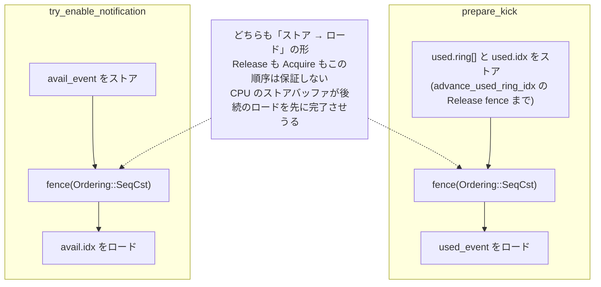
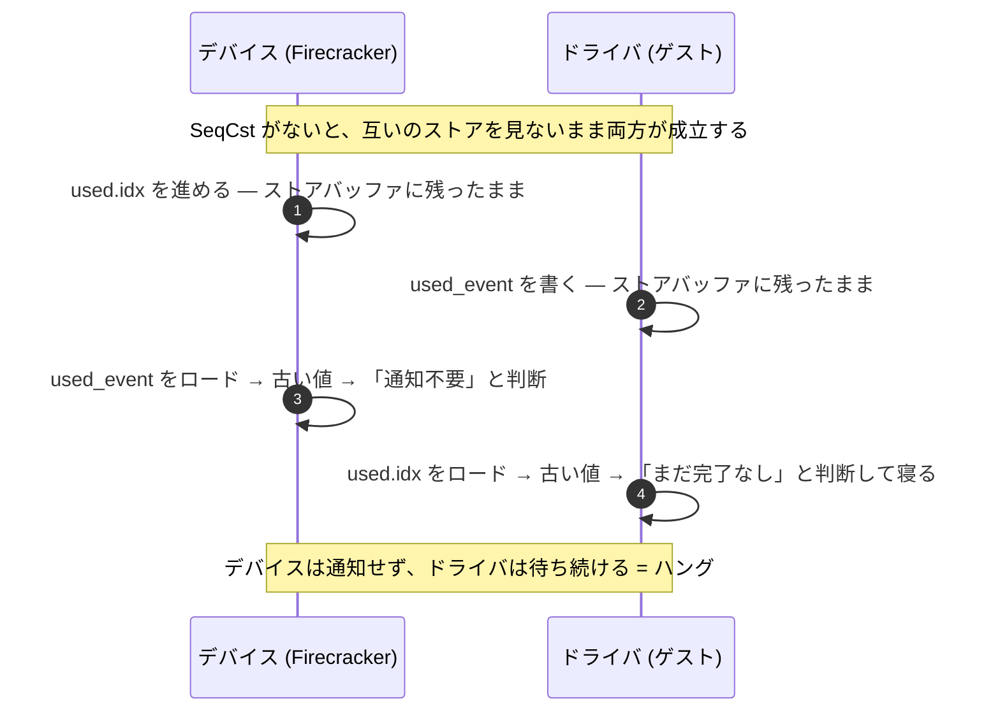

## 何を学んだか

[used リングのバッチング](../used-ring-batching/) で、Firecracker が N 件のリクエストを処理してから割り込みを 1 回だけ上げることを見た。その「上げるかどうか」を決めているのが `prepare_kick` で、判定の本体はたった 1 行だ。

```rust title="src/vmm/src/devices/virtio/queue.rs"
        new - used_event - Wrapping(1) < new - old
```

この 1 行が、Firecracker の中でも数少ない**形式検証の対象**になっている。理由は 3 つある。

1. **入力が全部ゲストの手中にある。** `used_event` は available ring の末尾にあり、ゲストが書く値だ。
2. **素朴に書くと必ず間違う。** `u16` のリング位置の比較なので、`used_event >= old && used_event < new` のような大小比較は折り返しで壊れる。
3. **間違えても落ちない。** 通知を上げそこねると、デバイスは「終わった」と思い、ゲストは「まだ来ない」と待つ。**ハングする**。クラッシュより見つけにくい。

### 通知抑制の仕組み

`VIRTIO_RING_F_EVENT_IDX` をネゴシエートすると、リングの末尾にある 2 つのフィールドが有効になる。

- `avail.used_event`: **ドライバが書く。** 「`used.idx` がこの値を通過するまで割り込みは要らない」
- `used.avail_event`: **デバイスが書く。** 「`avail.idx` がこの値を通過するまで kick は要らない」

デバイス側から見た仕事は 2 つだ。used を積んだあとに `used_event` を見て割り込みを上げるか決める (`prepare_kick`) のと、キューが空になったときに `avail_event` を書いて kick を再開してもらう (`try_enable_notification`) の 2 つ。

### なぜ大小比較では駄目か

`used.idx` は `u16` で単調増加し、65535 の次は 0 に戻る。**リング上の「位置」であって「大きさ」ではない。** ドライバが「`used_event = 65534` になったら起こしてくれ」と書き、デバイスが `old = 65533` から `new = 2` まで 5 件積んだとする。

```
   ... 65532  65533  65534  65535    0      1      2 ...
                ↑             ↑                    ↑
               old        used_event              new

   このバッチで積んだのは 65533, 65534, 65535, 0, 1 の 5 個。
   used_event = 65534 はこの区間に入っているので、通知が必要。

   素朴な比較: used_event >= old && used_event < new
             → 65534 >= 65533 は真、65534 < 2 は偽 → 「通知不要」= 誤り
```

正しい判定は、位置ではなく**距離**で行う。`new - used_event - 1` を `u16` の折り返し込みで計算すると「`used_event` から見て `new - 1` まで何歩か」になり、これを `new - old`（= 積んだ個数 `num_added`）と比べる。上の例なら `2 - 65534 - 1 = 3` (mod 2^16) で、`new - old = 5` より小さいので「通知必要」になる。

これが `prepare_kick` の 1 行だ。Linux カーネルの `vring_need_event()` と同じ式で、コードコメントもそう書いている。

## ソースコードのどこか

### prepare_kick

([`src/vmm/src/devices/virtio/queue.rs#L663-L686`](https://github.com/firecracker-microvm/firecracker/blob/cc535f035f3828b2c5bfc85276c5d394022ed220/src/vmm/src/devices/virtio/queue.rs#L663-L686))

```rust title="src/vmm/src/devices/virtio/queue.rs"
    /// Check if we need to kick the guest.
    ///
    /// Please note this method has side effects: once it returns `true`, it considers the
    /// driver will actually be notified, and won't return `true` again until the driver
    /// updates `used_event` and/or the notification conditions hold once more.
    ///
    /// This is similar to the `vring_need_event()` method implemented by the Linux kernel.
    pub fn prepare_kick(&mut self) -> bool {
        // If the device doesn't use notification suppression, always return true
        if !self.uses_notif_suppression {
            return true;
        }

        // We need to expose used array entries before checking the used_event.
        fence(Ordering::SeqCst);

        let new = self.next_used;
        let old = self.next_used - self.num_added;
        let used_event = Wrapping(self.avail_ring_used_event_get());

        self.num_added = Wrapping(0);

        new - used_event - Wrapping(1) < new - old
    }
```

`next_used` と `num_added` はどちらも `Wrapping<u16>` なので、引き算はすべて `mod 2^16` で行われる。オーバーフローで panic しない。比較 `<` は差分（= 距離）に対して行われるので、位置の大小比較にはなっていない。

`uses_notif_suppression` が偽なら常に `true` を返す。feature がネゴシエートされていなければ毎回通知する、という素直な動作だ。このフラグは activate で立つ ([`src/vmm/src/devices/virtio/net/device.rs#L1057-L1062`](https://github.com/firecracker-microvm/firecracker/blob/cc535f035f3828b2c5bfc85276c5d394022ed220/src/vmm/src/devices/virtio/net/device.rs#L1057-L1062))。

```rust title="src/vmm/src/devices/virtio/net/device.rs"
        let event_idx = self.has_feature(u64::from(VIRTIO_RING_F_EVENT_IDX));
        if event_idx {
            for queue in &mut self.queues {
                queue.enable_notif_suppression();
            }
        }
```

副作用があることがドキュメントコメントに明記されている点も見ておきたい。`num_added` をゼロに戻すので、**2 回呼ぶと 2 回目は必ず `false`** になる。`prepare_kick` という命名は「判定」ではなく「kick の準備」を表していて、呼んだら実際に kick する契約になっている。

### try_enable_notification — 逆方向

キューを飲み干した側は、次に available ring へ積まれたときに kick してもらう必要がある ([`src/vmm/src/devices/virtio/queue.rs#L609-L642`](https://github.com/firecracker-microvm/firecracker/blob/cc535f035f3828b2c5bfc85276c5d394022ed220/src/vmm/src/devices/virtio/queue.rs#L609-L642))。

```rust title="src/vmm/src/devices/virtio/queue.rs"
    fn try_enable_notification(&mut self) -> Result<bool, InvalidAvailIdx> {
        if !self.uses_notif_suppression {
            return Ok(true);
        }

        let len = self.len();
        if len != 0 {
            // ... len > self.size なら InvalidAvailIdx ...
            return Ok(false);
        }

        // Set the next expected avail_idx as avail_event.
        self.used_ring_avail_event_set(self.next_avail.0);

        // Make sure all subsequent reads are performed after we set avail_event.
        fence(Ordering::SeqCst);

        // If the actual avail_idx is different than next_avail one or more descriptors can still
        // be consumed from the available ring.
        Ok(self.next_avail.0 == self.avail_ring_idx_get())
    }
```

**`avail_event` を書いてから、もう一度 `avail.idx` を読み直している**のが要点だ。書いた直後にドライバが descriptor を積むと、ドライバは古い `avail_event` を見て「kick 不要」と判断してしまうかもしれない。だから書いたあとに読み直し、`next_avail` と一致していなければ「まだ取り残しがある」として `false` を返す。呼び出し側 (`pop_or_enable_notification`) はそのまま `pop_unchecked` に進む。

```rust title="src/vmm/src/devices/virtio/queue.rs"
    pub fn pop_or_enable_notification(&mut self) -> Result<Option<DescriptorChain>, InvalidAvailIdx> {
        if !self.uses_notif_suppression {
            return self.pop();
        }

        if self.try_enable_notification()? {
            return Ok(None);
        }

        Ok(self.pop_unchecked())
    }
```

`while let Some(head) = queue.pop_or_enable_notification()?` というループを書けば、**ループの終了と通知の再開が同じ 1 行にまとまる**。net も block も vsock も、この形で書かれている。

再チェックをしない版も別にある。vsock のイベントキューのように、drain ループではなく 1 個だけ pop する場所で使う ([`src/vmm/src/devices/virtio/queue.rs#L649-L661`](https://github.com/firecracker-microvm/firecracker/blob/cc535f035f3828b2c5bfc85276c5d394022ed220/src/vmm/src/devices/virtio/queue.rs#L649-L661))。ドキュメントコメントが適用条件を限定している。

```rust title="src/vmm/src/devices/virtio/queue.rs"
    /// Arm `avail_event` at the current `avail.idx` so the driver's next
    /// publish produces a notification. Unlike [`Self::try_enable_notification`],
    /// does not require the queue to be drained and does not recheck
    /// `avail.idx`; only correct when the driver does not add to the avail
    /// ring until it has observed our used-ring update.
```

### SeqCst でなければならない理由

両方の関数に `fence(Ordering::SeqCst)` があり、どちらも「ストアしてからロードする」形になっている。



**Release / Acquire フェンスでは足りない。** Release は「これより前のストアが、これより後のストアより先に見える」ことを保証する。Acquire は「これより後のロードが、これより前のロードより後に行われる」を保証する。どちらも**ストア → ロードの順序は保証しない**。x86 を含む多くの CPU はストアバッファを持っていて、自分のストアがまだキャッシュに出ていないうちに後続のロードを完了させる。

これが致命的なのは、ドライバ側が対称に同じことをやるからだ。デバイスが「`used_event` を読む → 通知不要と判断」、ドライバが「`used.idx` を読む → まだ完了なしと判断して寝る」の両方が、互いのストアを見ないまま成立してしまう。**両者が相手を待って永久に止まる。** 相互排除の Dekker アルゴリズムがフルバリアを要求するのと同じ構造で、片方だけが SeqCst でも足りない。



`try_enable_notification` 側も同じで、「デバイスが avail_event を書く前に avail.idx を読む」と「ドライバが descriptor を積んでから avail_event を読む」が交差すると、kick が飛ばず、デバイスは epoll で寝たままになる。

なお `used_ring_avail_event_set` / `avail_ring_idx_get` 自体は `write_volatile` / `read_volatile` で、これらはアトミック操作ではない。順序付けは明示的な `fence` に完全に委ねられている。

## なぜそうなっているか

### この関数がなぜ証明対象に選ばれたか

`docs/formal-verification.md` が選定の基準を書いている。

> We aim to have Kani harnesses for components that directly interact with data from the guest, such as the TCP/IP stack powering our microVM Metadata Service (MMDS) integration, or which are difficult to test traditionally, such as our I/O Rate Limiter.

`prepare_kick` は**両方に当てはまる**。`used_event` はゲストが書く値そのもので、しかもバグの現れ方が「ときどきハングする」なので、伝統的なテストで見つけるのが難しい。

そのうえで、この関数に固有の理由がもう 1 つある。**[前ページ](../used-ring-batching/) で見たとおり、Firecracker は仕様が想定する「`add_used` のたびに判定する」形をやめてバッチ判定にしている。** つまり Linux の `vring_need_event()` をそのままコピーしただけでは済まない部分がある。参照実装のない自前のロジックには、正しさの根拠を別途用意する必要がある。ハーネスの冒頭コメントがその逸脱の宣言になっている ([`src/vmm/src/devices/virtio/queue.rs#L965-L1003`](https://github.com/firecracker-microvm/firecracker/blob/cc535f035f3828b2c5bfc85276c5d394022ed220/src/vmm/src/devices/virtio/queue.rs#L965-L1003))。

```rust title="src/vmm/src/devices/virtio/queue.rs"
        // With firecracker's batching of used IRQs, we need to check if addition of the last
        // queue.num_added buffers is what caused us to cross the used_event index (e.g. if the
        // index used_event was written to since the last call to prepare_kick). We have to
        // take various ring-wrapping behavior into consideration here. This is the case if
        // used_event in [next_used - num_added, next_used - 1]. However, intervals
        // in modular arithmetic are a finicky thing, as we do not have a notion of order
        // (consider for example u16::MAX + 1 = 0. Clearly, x + 1 > x, but that would imply 0 >
        // u16::MAX) This gives us some interesting corner cases: What if our "interval" is
        // "[u16::MAX - 1, 1]"? For these "wrapped" intervals, we can instead consider
        // [next_used - num_added - 1, u16::MAX] ∪ [0, next_used - 1]. Since queue size is at most
        // 2^15, intervals can only wrap at most once. This gives us the following logic:
```

このコメントが、判定の**仕様**を日本語でいう「区間への所属」として言語化している。そして直後に、その仕様を素直にコードへ落としたものを書く。

```rust title="src/vmm/src/devices/virtio/queue.rs"
        let used_event = Wrapping(queue.avail_ring_used_event_get());
        let interval_start = queue.next_used - queue.num_added;
        let interval_end = queue.next_used - Wrapping(1);
        let needs_notification = if queue.num_added.0 == 0 {
            false
        } else if interval_start > interval_end {
            used_event <= interval_end || used_event >= interval_start
        } else {
            used_event >= interval_start && used_event <= interval_end
        };

        assert_eq!(queue.prepare_kick(), needs_notification);
```

**証明されるのは「1 行の実装が、この読みやすい仕様と全入力で一致する」ことだ。** `interval_start > interval_end` は `Wrapping<u16>` の生の値どうしの比較で、区間が折り返しているかを判定している。折り返していれば `[0, end] ∪ [start, 65535]` の和集合、していなければ普通の閉区間。`num_added == 0` の場合を最初に切り出しているのも必要で、そのとき `start = next_used`、`end = next_used - 1` となり、`next_used = 0` なら `start = 0 <= end = 65535` で「常に真」に化けてしまう。

### 網羅とサンプリング

ここで Kani が何をしているかが、ユニットテストとの違いになる。

|          | ユニットテスト       | Kani ハーネス                                 |
| -------- | -------------------- | --------------------------------------------- |
| 入力     | 具体値を人が書く     | `kani::any()` = 型の全値を表す記号値          |
| 実行     | その値で 1 回動かす  | 制約を SAT/SMT ソルバに投げ、反例の有無を判定 |
| 結論     | 「この値では通った」 | 「**どの値でも**通る、または反例はこれ」      |
| 見落とし | 書かなかったケース   | 仮定 (`kani::assume`) が現実と食い違うケース  |

`verify_prepare_kick` が扱う入力は `next_used`・`num_added`・`used_event` の 3 つで、いずれも `u16`。組み合わせは 2^48、約 280 兆通りある。しかも `ProofContext` はキューのアドレスやサイズも非決定的に取る。「代表的な値を数十個テストする」では、`used_event = 65534, old = 65533, new = 2` のような折り返しの境界を人が思いつけたかどうかに完全に依存する。Kani は思いつく必要をなくす。

`#[kani::unwind(0)]` が付いているのは、この関数にループがないからだ。ループがないコードは記号実行で完全に展開でき、検証が「有界」でなく本当に全域になる。**証明が現実的に回る関数を選んでいる**という側面もある。

### ハーネスが証明していないこと

正直に押さえておくべき限界がある。`verify_prepare_kick` が示すのは、**実装が「区間所属」という定式化と一致すること**だけだ。その定式化自体が virtio 仕様の意図とずれていたら、証明は成り立ったまま実装は間違っている。`docs/formal-verification.md` はこれを明言している。

> **Harnesses are only as strong as the assumptions they make, so all guarantees from the harness are only valid based on the set of assumptions we have in our Kani harnesses.**

この穴を埋めるために別のハーネス `verify_spec_2_6_7_2` があり、そちらは仕様の MUST の側を直接検査する ([`src/vmm/src/devices/virtio/queue.rs#L921-L963`](https://github.com/firecracker-microvm/firecracker/blob/cc535f035f3828b2c5bfc85276c5d394022ed220/src/vmm/src/devices/virtio/queue.rs#L921-L963))。「`used_event` がちょうど直前に書いた位置と一致し、かつ何か積んでいたなら、通知は MUST」を `assert!` する形だ。**「実装 = 定式化」と「定式化 ⊆ 仕様」を別々のハーネスに分けている**。1 つのハーネスに詰め込まず、証明の対象を分割しているのは読む側にとってもありがたい。

`try_enable_notification` にもハーネスがあるが、こちらは検査内容が控えめだ ([`src/vmm/src/devices/virtio/queue.rs#L1163-L1177`](https://github.com/firecracker-microvm/firecracker/blob/cc535f035f3828b2c5bfc85276c5d394022ed220/src/vmm/src/devices/virtio/queue.rs#L1163-L1177))。「`true` を返したならキューは空で、`avail.idx == next_avail` である」を確認するだけで、フェンスの効果は検証の対象外だ。Kani は逐次実行のモデルチェッカなので、**メモリ順序のバグは Kani では見つからない**。そこはコメントとレビューに委ねられている。

## どう活かすか

### 「1 行の式」と「読める定式化」を並べて等価性を確かめる

このハーネスの構造は、形式検証ツールがなくても真似できる。**最適化された実装と、素直で読みやすい参照実装の 2 つを書き、両者が一致することを確かめる。** Kani なら全入力について証明できるが、`u16` 3 つ程度なら総当たりでも回るし、そうでなくても property-based testing (Rust なら proptest、Firecracker も block の `Request::parse` で使っている) で数万〜数百万ケース振れる。

効く条件ははっきりしている。

- **参照実装が書けること。** 「区間に入るか」のように、遅くてもいいなら誰でも書ける形に落ちること。落ちないなら、そもそも実装の正しさを何と比べるのかが定まらない。
- **入力空間が閉じていること。** `u16` 3 つのように型で有界なら、総当たりか記号実行で全域を覆える。任意長の文字列やファイルが入るなら有界にならず、property-based testing で妥協することになる。
- **バグが静かに現れること。** クラッシュするバグなら fuzzing で出る。ハングや値の微妙なずれは出にくいので、検証の投資が報われる。

### モジュラ算術の比較は、位置ではなく距離でやる

より直接に持ち帰れるのはこちらだ。**折り返す整数（シーケンス番号、リングの添字、タイムスタンプのローテーション）を比較するときは、`a < b` を書いてはいけない。`b - a` の符号なし差分を取り、それを閾値と比べる。** TCP のシーケンス番号比較 (`SEQ_LT` マクロ)、Kafka のオフセット、論理クロックの比較、すべて同じ形をしている。

判断の目安として、**そのフィールドが「大きさ」なのか「位置」なのかを型で区別する**とよい。Rust なら `Wrapping<u16>` を使うだけで「オーバーフローは正常」という意図が読み取れるし、デバッグビルドで panic しない。裸の `u16` に混ぜると、どの引き算が折り返し前提なのかがコードから消える。

### 取り込むべきでない条件

**通知抑制そのものは、相手がポーリングしてくれる場合にしか効かない。** virtio でこれが成立するのは、ゲストのドライバが NAPI のようにポーリングモードへ切り替えて used リングを見にくるからだ。相手が完全に割り込み駆動なら、通知を抑制した時点で止まる。**「通知を減らす」設計は、相手が能動的に取りにくる前提とセットでなければ入れられない。**

**フルバリアのコストも忘れない。** `fence(Ordering::SeqCst)` は x86 で `mfence` に落ち、数十サイクルかかる。`prepare_kick` は 1 バッチにつき 1 回しか呼ばれないのでこれが償却されるが、リクエストごとに呼ぶ設計なら、通知を減らして得たものをバリアで失いかねない。**バッチングとフルバリアはセットで設計する**必要がある。
