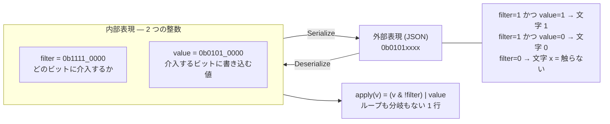
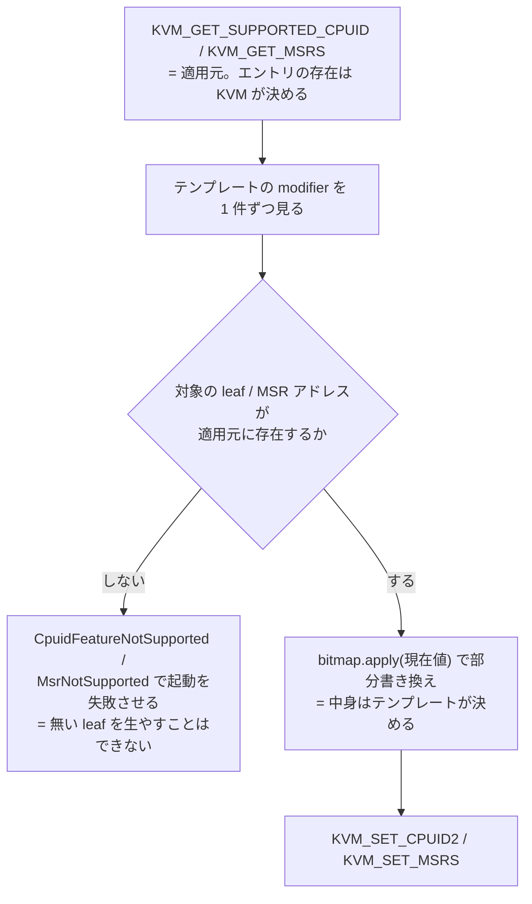

## 何を学んだか

### 解きたい問題

[CPU テンプレート](../cpu-templates/) がやりたいのは、レジスタの**一部のビットだけ**を書き換えることだ。CPUID leaf 0x7 subleaf 0x0 の EBX でいえば、「ビット 16 の AVX512F は 0 にしたい、ビット 9 の ERMS は 1 にしたい、残りはホストの値のまま」という指定になる。**0 にする / 1 にする / 触らない**の 3 通りの意図を、1 個のフィールドで表す方法が要る。

素朴には `Vec<(bit_index, bool)>` のような表現になるが、32 ビット全部を指定すると 32 要素のリストになり、JSON にすると読めたものではない。かといって単なる `u32` 1 個では「触らない」を表せない。

### Firecracker の答え

**2 つのビットマスクを持つ 1 個の型を作り、シリアライズ時だけ 3 値の文字列にする。**

```
filter : どのビットに介入するか (1 = 介入する, 0 = 触らない)
value  : 介入するビットに書き込む値

適用:  (元の値 & !filter) | value
```

そして JSON 上ではこの 2 つを 1 本の文字列に畳む。



`x` が「触らない」を表す。0 と 1 と x の 3 文字だけからなる、ビット幅と同じ長さの文字列。これだけの DSL だ。

### 1 つの型が全部の対象に使われる

この型は幅を型引数にしていて、書き換え対象ごとに別の幅で使い回される。

| 対象                           | 型                          | 幅  |
| ------------------------------ | --------------------------- | --- |
| CPUID の EAX / EBX / ECX / EDX | `RegisterValueFilter<u32>`  | 32  |
| MSR                            | `RegisterValueFilter<u64>`  | 64  |
| aarch64 の ARM レジスタ        | `RegisterValueFilter<u128>` | 128 |
| aarch64 の vCPU features       | `RegisterValueFilter<u32>`  | 32  |

CPUID・MSR・ARM レジスタ・vCPU features は、意味も幅も設定経路もまったく違う。共通しているのは「ビットの束であり、一部だけ差し替えたい」という一点だけだ。Firecracker はその一点だけを型に切り出している。

## ソースコードのどこか

### 型と適用

定義は 10 行に満たない。

```rust title="src/vmm/src/cpu_config/templates.rs"
/// Bit-mapped value to adjust targeted bits of a register.
#[derive(Debug, Default, Clone, Copy, Eq, PartialEq, Hash)]
pub struct RegisterValueFilter<V>
where
    V: Numeric,
{
    /// Filter to be used when writing the value bits.
    pub filter: V,
    /// Value to be applied.
    pub value: V,
}

impl<V> RegisterValueFilter<V>
where
    V: Numeric + Debug,
{
    /// Applies filter to the value
    #[inline]
    pub fn apply(&self, value: V) -> V {
        (value & !self.filter) | self.value
    }
}
```

([src/vmm/src/cpu_config/templates.rs#L157-L178](https://github.com/firecracker-microvm/firecracker/blob/cc535f035f3828b2c5bfc85276c5d394022ed220/src/vmm/src/cpu_config/templates.rs#L157-L178))

`apply()` の 1 行がすべてだ。`value & !self.filter` で介入対象のビットを 0 に落とし、`| self.value` で書き込む値を乗せる。

`V: Numeric` は自前のトレイトで、`BITS` 定数と `bit(pos)` と `zero()` / `one()` を要求する。実装は `u8` / `u16` / `u32` / `u64` / `u128` にマクロで一括して付けられている ([同 #L262-L307](https://github.com/firecracker-microvm/firecracker/blob/cc535f035f3828b2c5bfc85276c5d394022ed220/src/vmm/src/cpu_config/templates.rs#L262-L307))。標準ライブラリに整数の共通トレイトがないので、必要な演算だけを列挙した最小のトレイトを自分で定義している。

ここでひとつ注意すべき性質がある。`apply()` は `self.value` を**そのまま** OR している。`filter` に含まれないビットが `value` に立っていたら、それも書き込まれてしまう。この不変条件 (`value ⊆ filter`) は型では保証されておらず、シリアライズ・デシリアライズの経路と、ハードコードされたテンプレートの書き方によって守られている。

### 3 値文字列への変換

シリアライズは `filter` の各ビットを見て 3 文字に振り分ける。

```rust title="src/vmm/src/cpu_config/templates.rs"
        for i in (0..V::BITS).rev() {
            match self.filter.bit(i) {
                true => {
                    let val = self.value.bit(i);
                    bitmap_str.push(b'0' + u8::from(val));
                }
                false => bitmap_str.push(b'x'),
            }
        }
```

([src/vmm/src/cpu_config/templates.rs#L180-L209](https://github.com/firecracker-microvm/firecracker/blob/cc535f035f3828b2c5bfc85276c5d394022ed220/src/vmm/src/cpu_config/templates.rs#L180-L209))

`filter` が 0 のビットは `value` を見ずに `x` を出す。この時点で `value` の `filter` 外のビットは捨てられる。

デシリアライズはその逆で、文字列を後ろから (下位ビットから) 読む。

```rust title="src/vmm/src/cpu_config/templates.rs"
        let (mut filter, mut value) = (V::zero(), V::zero());
        let mut i = 0;
        for s in stripped_str.as_bytes().iter().rev() {
            if V::BITS == i {
                return Err(D::Error::custom(/* string is too long */));
            }

            match s {
                b'_' => continue,
                b'x' => {}
                b'0' => {
                    filter |= V::one() << i;
                }
                b'1' => {
                    filter |= V::one() << i;
                    value |= V::one() << i;
                }
```

([src/vmm/src/cpu_config/templates.rs#L229-L257](https://github.com/firecracker-microvm/firecracker/blob/cc535f035f3828b2c5bfc85276c5d394022ed220/src/vmm/src/cpu_config/templates.rs#L229-L257))

読み取れることがいくつかある。

- **`x` は何もしない。** `filter` にも `value` にもビットが立たない。パース結果は自動的に `value ⊆ filter` を満たす。
- **`_` は区切り文字として無視される。** `0b0000_xxxx` と書ける。しかも `i` が進まないので位置がずれない。
- **文字列は下位ビットから読まれる。** 短い文字列を渡すと上位ビットは 0 のまま、つまり `x` (触らない) として扱われる。ドキュメントはこれを「contracted bitmap の展開」と呼んでいて、`0b101` は `0bxxxxxxxxxxxxxxxxxxxxxxxxxxxxx101` と等価だと明記している ([docs/cpu_templates/cpu-templates.md#L246-L250](https://github.com/firecracker-microvm/firecracker/blob/cc535f035f3828b2c5bfc85276c5d394022ed220/docs/cpu_templates/cpu-templates.md#L246-L250))。
- **長すぎる文字列はエラー。** 幅を超えたところで弾く。短いのは許すが長いのは許さない、という非対称になっている。

テストがこの往復の性質をそのまま書いている。`{ value: 0b01010101, filter: 0b11110000 }` をシリアライズすると `"0b0101xxxx"` になり、それをデシリアライズすると `{ value: 0b01010000, filter: 0b11110000 }` が返る ([src/vmm/src/cpu_config/templates.rs#L336-L365](https://github.com/firecracker-microvm/firecracker/blob/cc535f035f3828b2c5bfc85276c5d394022ed220/src/vmm/src/cpu_config/templates.rs#L336-L365))。

入力の `value` の下位ニブルが消えている。**往復は値を保存しない**、しかし**意味は保存する** (`filter` 外のビットは適用時に無視されるべきなので)。テストはこの非可逆性を期待値として明示的に書いている。同じテストは `0b0_101_xx_xx` のような区切り文字入りの入力と、幅を超える長さの入力がエラーになることも確認している。

### 適用箇所

CPUID への適用は、テンプレートの modifier を舐めて対応する leaf を引き、レジスタごとに `apply()` を呼ぶだけだ。

```rust title="src/vmm/src/cpu_config/x86_64/mod.rs"
        if let Some(entry) = guest_cpuid.get_mut(&cpuid_key) {
            entry.flags = mod_leaf.flags;

            for mod_reg in &mod_leaf.modifiers {
                match mod_reg.register {
                    CpuidRegister::Eax => entry.result.eax = mod_reg.bitmap.apply(entry.result.eax),
                    CpuidRegister::Ebx => entry.result.ebx = mod_reg.bitmap.apply(entry.result.ebx),
                    CpuidRegister::Ecx => entry.result.ecx = mod_reg.bitmap.apply(entry.result.ecx),
                    CpuidRegister::Edx => entry.result.edx = mod_reg.bitmap.apply(entry.result.edx),
                }
            }
        } else {
            return Err(CpuConfigurationError::CpuidFeatureNotSupported(
                cpuid_key.leaf,
                cpuid_key.subleaf,
            ));
        }
```

([src/vmm/src/cpu_config/x86_64/mod.rs#L55-L72](https://github.com/firecracker-microvm/firecracker/blob/cc535f035f3828b2c5bfc85276c5d394022ed220/src/vmm/src/cpu_config/x86_64/mod.rs#L55-L72))

MSR 側は BTreeMap に対する同じ形の操作で、`msrs.get_mut(&modifier.addr)` が取れれば `apply()`、取れなければ `MsrNotSupported` を返す ([同 #L83-L89](https://github.com/firecracker-microvm/firecracker/blob/cc535f035f3828b2c5bfc85276c5d394022ed220/src/vmm/src/cpu_config/x86_64/mod.rs#L83-L89))。**対象を引く → 見つからなければエラー → 見つかれば `apply()`** という構造が両方でまったく同じで、適用側にはビット操作のロジックが 1 行も残っていない。

### 「無いものを在るように」は拒否する

上の 2 つの `else` 節が肝心だ。エラーの定義はこうなっている。

```rust title="src/vmm/src/cpu_config/x86_64/mod.rs"
pub enum CpuConfigurationError {
    /// Template changes a CPUID entry not supported by KVM: Leaf: {0:0x}, Subleaf: {1:0x}
    CpuidFeatureNotSupported(u32, u32),
    /// Template changes an MSR entry not supported by KVM: Register Address: {0:0x}
    MsrNotSupported(u32),
```

([src/vmm/src/cpu_config/x86_64/mod.rs#L20-L30](https://github.com/firecracker-microvm/firecracker/blob/cc535f035f3828b2c5bfc85276c5d394022ed220/src/vmm/src/cpu_config/x86_64/mod.rs#L20-L30))

適用元になる CPUID は `KVM_GET_SUPPORTED_CPUID` から作られるので、**KVM が知らない leaf をテンプレートが指定すると起動が失敗する**。テンプレートは既存のエントリを書き換えることしかできず、新しい leaf を生やすことはできない。テストもその境界を確認している。

```rust title="src/vmm/src/cpu_config/x86_64/mod.rs"
        // Verify that an unsupported CPUID leaf is rejected.
        assert_eq!(
            apply_template_to_cpuid(empty_cpuid(), &template).unwrap_err(),
            CpuConfigurationError::CpuidFeatureNotSupported(0x3, 0x0)
        );
```

([src/vmm/src/cpu_config/x86_64/mod.rs#L216-L221](https://github.com/firecracker-microvm/firecracker/blob/cc535f035f3828b2c5bfc85276c5d394022ed220/src/vmm/src/cpu_config/x86_64/mod.rs#L216-L221))

`RegisterValueFilter` は「立てる」もできるので、既存の leaf の中で存在しない機能のビットを 1 にすることはできる。だが leaf そのものを作り出すことはできない。**エントリの存在は KVM が決め、その中身をテンプレートが決める**、という分担になっている。



### JSON 側の見え方

スキーマ定義は各対象について同じ形の説明を並べている。CPUID なら "CPUID register value bitmap. Must be in format `0b[01x]{32}`. Corresponding bits will be cleared (`0`), set (`1`) or left intact (`x`). (`_`) can be used as a separator." ([docs/cpu_templates/schema.json#L65-L69](https://github.com/firecracker-microvm/firecracker/blob/cc535f035f3828b2c5bfc85276c5d394022ed220/docs/cpu_templates/schema.json#L65-L69))。MSR は `0b[01x]{64}`、ARM レジスタは `0b[01x]{1,128}`、vCPU features は `0b[01x]{1,32}` で、説明文は幅の数字だけが違う。利用者が覚える文法も 1 つで済んでいる。

## なぜそうなっているか

### なぜ 2 マスクなのか

3 値を素直に持つなら `Option<bool>` の配列や `Vec<(u32, bool)>` になるが、Firecracker は 2 つの整数を選んだ。理由はコードから読み取れる。

- **適用が 1 命令列で済む。** `(value & !filter) | self.value` はビット幅によらず定数時間で、ループも分岐もない。`apply()` には `#[inline]` が付いている。
- **`Copy` で `Hash` で `Eq` な単純な値型になる。** 静的テンプレートと JSON の同一性テストのような比較がそのまま効く。
- **中間表現が要らない。** 3 値表現から 2 マスクへの変換はデシリアライズの 1 回だけで、以後は整数演算しか出てこない。

### なぜ 1 つの型を全部で共有するのか

CPUID・MSR・ARM レジスタは別のモジュールに置かれている。それでも `RegisterValueFilter` だけは `cpu_config/templates.rs`、つまりアーキテクチャ非依存の共通モジュールにある。同じファイルは x86_64 向けと aarch64 向けの型を `cfg` で切り替えているが ([src/vmm/src/cpu_config/templates.rs#L4-L25](https://github.com/firecracker-microvm/firecracker/blob/cc535f035f3828b2c5bfc85276c5d394022ed220/src/vmm/src/cpu_config/templates.rs#L4-L25))、この型だけは分岐の外にある。

推測だが、狙いは利用者側の学習コストだと思われる。CPU テンプレートは JSON を人間が書く機能で、しかも「専門知識が要る」とドキュメントが警告するほど間違えやすい。書き換え対象ごとに文法が違えば、間違いは確実に増える。

実装側の利点もある。3 値文字列のパースとシリアライズは細かい仕様 (`_` の扱い、短い文字列の展開、長すぎる文字列の拒否) を持つが、それが 1 箇所にしかないのでテストも 1 箇所で済む。同じ挙動を 4 回書けば、4 通りに壊れる。

### `KvmCapability` は別の型になっている

同じファイルにある `KvmCapability` は、`"56"` / `"!56"` という別の文字列形式を持つ独立した型だ ([src/vmm/src/cpu_config/templates.rs#L107-L155](https://github.com/firecracker-microvm/firecracker/blob/cc535f035f3828b2c5bfc85276c5d394022ed220/src/vmm/src/cpu_config/templates.rs#L107-L155))。こちらは「ビットの束の部分書き換え」ではなく「チェックリストへの追加・削除」なので、無理にビットマップに寄せていない。

DSL を統一する対象は「同じ操作をする」ものに限られていて、「設定ファイルの中に一緒に書かれる」というだけでは統一していない。これは重要な線引きだ。

## どう活かすか

### 持ち帰れる設計

**部分更新を「マスク + 値」で表す。** 「未指定」と「明示的に false」を区別したいとき、`Option<bool>` を並べる代わりに、対象集合を表すマスクと値を表すマスクの組にすると、適用が単純なビット演算になる。

**外部表現と内部表現を分け、変換をシリアライザに閉じ込める。** 人間が読む形 (`0b0101xxxx`) と機械が使う形 (2 つの整数) が違ってよい。serde の `Serialize` / `Deserialize` を手で実装するだけで、内部のコードは一切 3 値表現を知らずに済む。この分離をやらずに 3 値文字列をそのまま持ち回ると、適用側にパースが漏れ出す。

**往復が非可逆なら、テストにそう書く。** `value: 0b01010101` が `0b01010000` に潰れるのは仕様であって不具合ではない。こういう性質は「たまたま動いている」のか「意図された挙動」なのかが後から分からなくなるので、期待値として固定しておく価値が高い。

**存在の生成は許さず、既存値の書き換えだけを許す。** KVM の知らない leaf を指定したら起動を失敗させるという判断は、DSL に「できないこと」を残す設計だ。表現力を上げて「無いものを在るように見せる」を許すと、失敗はゲストの中で起きる。手前で落としたほうが原因が分かる。

### 効く前提条件

- **書き換え対象が「意味の付いたビットの束」で、幅が固定で既知であること。** 仕様書でビット単位に意味が定義されているから読み書き可能になるし、`V::BITS` を使った展開・検証もコンパイル時に幅が決まるから成立する。構造化されたオブジェクトに同じ発想を持ち込むと、単に読めない設定ファイルができる。
- **書く人が仕様書を参照できること。** `0bxxxx000000000011xx00011011110010` は、Intel SDM を横に置かなければ書けないし読めない。実際、静的テンプレートの実装には各ビットの意味がコメントで全部書かれている ([t2s.rs#L85-L114](https://github.com/firecracker-microvm/firecracker/blob/cc535f035f3828b2c5bfc85276c5d394022ed220/src/vmm/src/cpu_config/x86_64/static_cpu_templates/t2s.rs#L85-L114))。コメントなしでこの形式を採用すると、書いた本人以外に保守できないものになる。

### 取り込むべきでないとき

**フィールド数が少ないとき。** 3 個や 4 個のフラグなら、名前の付いた `Option<bool>` を並べたほうが読みやすい。ビットマップが勝つのは、対象が数十個あり、それぞれに外部仕様上の固定された位置があるときだけだ。

**部分更新の合成が必要なとき。** Firecracker は静的テンプレートと custom テンプレートを重ねない (後勝ちにする) ことで、合成の意味論を定義せずに済ませている。複数のテンプレートを重ねる要件があるなら、`(filter, value)` の合成規則を明示的に定義してテストする必要がある。

テンプレートで書いた値が最終形ではない点にも注意がいる。この後に走る正規化が一部を上書きする ([CPUID 正規化のページ](../cpuid-normalization/))。
