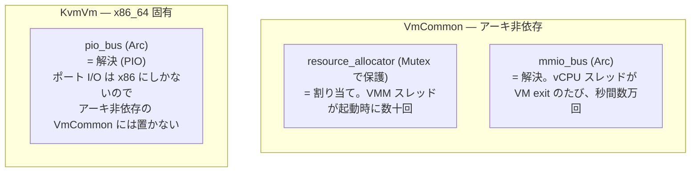
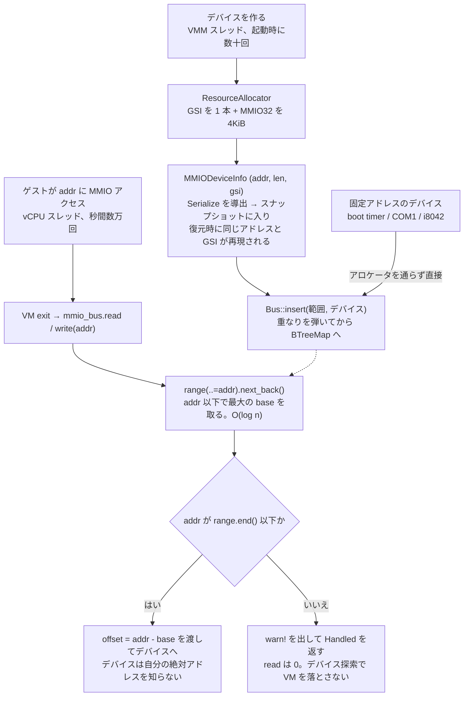

## 何を学んだか

### 割り当てと解決は、別の機構である

ゲストが `0xd000_0000` に書き込んだとき、VMM は「これはどのデバイスか」を決めなければならない。そのために 2 つの機構が要る。

1. **割り当て** — デバイスを作るときに、使うアドレス範囲と割り込み番号を決める → `ResourceAllocator`
2. **解決** — [VM exit](../kvm-run-loop/) で来たアドレスから、そのアドレスを持つデバイスを引く → `Bus`



**PIO バスは x86_64 の `KvmVm` 側にある。** ポート I/O は x86 にしかないので、アーキ非依存の `VmCommon` には置かれていない。

### 固定と動的の境目

アドレス空間には、**動かせない場所**と**空きから取ってよい場所**がある。

| 領域                                 | アドレス                                      | 決め方                            |
| ------------------------------------ | --------------------------------------------- | --------------------------------- |
| COM1 / i8042 / PCI コンフィグ        | PIO `0x3f8` / `0x060` / `0xcf8`               | **固定**。PC と PCI の慣習        |
| LAPIC / IOAPIC / RSDP                | `0xfee0_0000` / `0xfec0_0000` / `0x000e_0000` | **固定**。x86 と ACPI の既定値    |
| boot timer / PCIe MMCONFIG           | `0xc000_0000` / `0xeec0_0000`                 | **固定**。layout.rs の定数        |
| MPTable / ACPI テーブル              | `0x9fc00`〜`0xe0000` の中                     | **動的**。`system_memory` から    |
| virtio-mmio / PCI BAR                | `0xc000_1000` 以降 / `0x40_0000_0000` 以降    | **動的**。`mmio32/64_memory` から |
| GSI（レガシー 5〜23 / MSI 24〜4095） | —                                             | **動的**。`IdAllocator` から      |

境目の理屈ははっきりしている。**ゲストが「その場所にあること」を前提にしているものは固定、[ゲストに教えられるもの](../guest-hardware-discovery/)は動的**である。virtio-mmio のアドレスはカーネルコマンドラインや ACPI DSDT で伝わるから動かせる。COM1 は誰も教えなくてもゲストが `0x3f8` を見に来るから、固定にするしかない。

## ソースコードのどこか

### 固定側 — layout.rs

[`src/vmm/src/arch/x86_64/layout.rs`](https://github.com/firecracker-microvm/firecracker/blob/cc535f035f3828b2c5bfc85276c5d394022ed220/src/vmm/src/arch/x86_64/layout.rs) は 136 行の `pub const` 置き場で、冒頭に `//! Magic addresses externally used to lay out x86_64 VMs.` とある。32bit の MMIO ギャップは定数どうしの引き算で組み上がる（[`#L94-L120`](https://github.com/firecracker-microvm/firecracker/blob/cc535f035f3828b2c5bfc85276c5d394022ed220/src/vmm/src/arch/x86_64/layout.rs#L94-L120)）。

```
0xc000_0000 ┌────────────────────┐ MMIO32_MEM_START / BOOT_DEVICE_MEM_START
            │ boot timer (4KiB)  │  固定 (MMIO_LEN)
0xc000_1000 ├────────────────────┤ MEM_32BIT_DEVICES_START
            │  動的割り当て      │  virtio-mmio / PCI BAR (32bit)
            │  (約 749 MiB)      │  = MEM_32BIT_DEVICES_SIZE
0xeec0_0000 ├────────────────────┤ PCI_MMCONFIG_START
            │ PCIe MMCONFIG      │  固定 (256 MiB)
0xfec0_0000 ├────────────────────┤ IOAPIC_ADDR
            │ IOAPIC / LAPIC     │  固定
0x1_0000_0000└────────────────────┘ FIRST_ADDR_PAST_32BITS
```

`MMIO32_MEM_SIZE` は 1GiB で、`MMIO32_MEM_START` は `FIRST_ADDR_PAST_32BITS` から引いて求まる。ゲスト RAM はこのギャップを避けて配置される。64bit 側は `0x40_0000_0000` から 256GiB が MMIO、その先 512GiB が `past_mmio64_memory` という別枠になっている（[virtio-mem](../virtio-mem/) と virtio-pmem がここから取る）。

GSI の分割は [`#L24-L38`](https://github.com/firecracker-microvm/firecracker/blob/cc535f035f3828b2c5bfc85276c5d394022ed220/src/vmm/src/arch/x86_64/layout.rs#L24-L38)。コメントが `// Typically, on x86 systems 24 IRQs are used for legacy devices (0-23). However, the first 5 are reserved. We allocate the remaining GSIs to MSIs.` と理由を書いている。0〜4 は予約（PIT、キーボード、カスケード、シリアル）、5〜23 の 19 本がレガシー用、24 以降は IOAPIC のピンに対応しない番号なので MSI ルーティングに使う。上限の `GSI_MSI_END = 4095` は KVM 側の `KVM_MAX_IRQ_ROUTES` から来ていることも `///` に書かれている。

### 動的側 — ResourceAllocator

[`src/vmm/src/vstate/resources.rs#L35-L56`](https://github.com/firecracker-microvm/firecracker/blob/cc535f035f3828b2c5bfc85276c5d394022ed220/src/vmm/src/vstate/resources.rs#L35-L56) は 6 本のアロケータを束ねただけの構造体である。`gsi_legacy_allocator` / `gsi_msi_allocator` が `IdAllocator`、`mmio32_memory` / `mmio64_memory` / `past_mmio64_memory` / `system_memory` が `AddressAllocator`。`new()` がそれぞれの範囲を `arch::GSI_LEGACY_START` や `arch::MEM_32BIT_DEVICES_SIZE` といった `layout.rs` の定数から作る（[`#L64-L91`](https://github.com/firecracker-microvm/firecracker/blob/cc535f035f3828b2c5bfc85276c5d394022ed220/src/vmm/src/vstate/resources.rs#L64-L91)）。**ここが固定側と動的側の接続点である。** 生成はすべて `.unwrap()` だが、定数からしか作らないので実行時の入力に依存しない旨がコメントで正当化されている。

`AddressAllocator` は rust-vmm の `vm-allocator` クレートのもので、[Firecracker 自身は書いていない](../rust-vmm-dependency/)。一方 `IdAllocator` は Firecracker 内にあり（[`#L163-L226`](https://github.com/firecracker-microvm/firecracker/blob/cc535f035f3828b2c5bfc85276c5d394022ed220/src/vmm/src/vstate/resources.rs#L163-L226)）、中身は `range_base: u32` とビットマップ 1 本だけである。`allocate_id()` は `first_zero()` で最初の空きビットを探すにすぎない。GSI は最大 4091 個なのでビットマップは 512 バイトに収まる。**範囲が小さく固定されていると分かっているから、この実装で足りる。** 複数まとめて取る `allocate_many_ids()`（[`#L12-L33`](https://github.com/firecracker-microvm/firecracker/blob/cc535f035f3828b2c5bfc85276c5d394022ed220/src/vmm/src/vstate/resources.rs#L12-L33)）には**途中で失敗したら取得済みを全部返す**ロールバックが入っている。部分的に確保された GSI が漏れると、その番号は以降永久に使えなくなる。

### 割り当てから登録まで

MMIO デバイスを 1 つ足すときの流れが [`src/vmm/src/device_manager/mmio.rs#L163-L186`](https://github.com/firecracker-microvm/firecracker/blob/cc535f035f3828b2c5bfc85276c5d394022ed220/src/vmm/src/device_manager/mmio.rs#L163-L186) に見える。

```rust title="src/vmm/src/device_manager/mmio.rs"
        let gsi = match resource_allocator.allocate_gsi_legacy(irq_count)?[..] {
            [] => None,
            [gsi] => Some(gsi),
            _ => return Err(MmioError::InvalidIrqConfig),
        };

        let range = resource_allocator.mmio32_memory.allocate(
            MMIO_LEN,
            MMIO_LEN,
            AllocPolicy::FirstMatch,
        )?;
        let device_info = MMIODeviceInfo {
            addr: range.start(),
            len: MMIO_LEN,
            gsi,
        };
```

割り込み 1 本と 4KiB を取り、`MMIODeviceInfo` にまとめる。この型は **`Serialize` を導出している**（[`#L66-L75`](https://github.com/firecracker-microvm/firecracker/blob/cc535f035f3828b2c5bfc85276c5d394022ed220/src/vmm/src/device_manager/mmio.rs#L66-L75)）。割り当て結果が[スナップショット](../snapshot-format/)に入り、復元時に同じアドレスと GSI が再現される。ゲストのカーネルはこのアドレスを覚えているので、ずれると動かない。

取った範囲は続けて `vm.common.mmio_bus.insert(...)` で `Bus` に登録される（[`#L216-L220`](https://github.com/firecracker-microvm/firecracker/blob/cc535f035f3828b2c5bfc85276c5d394022ed220/src/vmm/src/device_manager/mmio.rs#L216-L220)）。固定アドレスのデバイスはアロケータを通らず、boot timer は `MMIODeviceInfo { addr: BOOT_DEVICE_MEM_START, len: MMIO_LEN, gsi: None }` を手で組み立てて `insert()` する（[`#L367-L393`](https://github.com/firecracker-microvm/firecracker/blob/cc535f035f3828b2c5bfc85276c5d394022ed220/src/vmm/src/device_manager/mmio.rs#L367-L393)）。PIO のレガシーデバイスも定数を直接 `pio_bus.insert()` に渡す（[`src/vmm/src/device_manager/legacy.rs#L54-L66`](https://github.com/firecracker-microvm/firecracker/blob/cc535f035f3828b2c5bfc85276c5d394022ed220/src/vmm/src/device_manager/legacy.rs#L54-L66)）。**`Bus` から見れば固定と動的の区別は無い。**



一方で `system_memory` からの払い出しは `Bus` に登録されない。MPTable（[`src/vmm/src/arch/x86_64/mptable.rs#L126-L129`](https://github.com/firecracker-microvm/firecracker/blob/cc535f035f3828b2c5bfc85276c5d394022ed220/src/vmm/src/arch/x86_64/mptable.rs#L126-L129)）と ACPI テーブル（[`src/vmm/src/acpi/mod.rs#L63-L66`](https://github.com/firecracker-microvm/firecracker/blob/cc535f035f3828b2c5bfc85276c5d394022ed220/src/vmm/src/acpi/mod.rs#L63-L66)）は**デバイスではなくゲストメモリに書くデータ構造**なので、場所の予約だけで足りる。

### 解決側 — Bus

[`src/vmm/src/vstate/bus.rs#L99-L129`](https://github.com/firecracker-microvm/firecracker/blob/cc535f035f3828b2c5bfc85276c5d394022ed220/src/vmm/src/vstate/bus.rs#L99-L129)。**ロックを 2 本に分けている**のが特徴で、理由と順序がコメントに書かれている。

```rust title="src/vmm/src/vstate/bus.rs"
/// Lock ordering: whenever both locks are taken, `devices` MUST be acquired
/// before `ranges`.
pub struct Bus {
    devices: RwLock<Slab<Weak<Mutex<dyn BusDevice>>>>,
    ranges: RwLock<BTreeMap<BusRange, usize>>,
}
```

`BusRange` の `Ord` は **base だけで比較する**（[`#L87-L91`](https://github.com/firecracker-microvm/firecracker/blob/cc535f035f3828b2c5bfc85276c5d394022ed220/src/vmm/src/vstate/bus.rs#L87-L91)）。これがアドレス解決の鍵になる。

```rust title="src/vmm/src/vstate/bus.rs"
            let ranges = self.ranges.read().unwrap();
            match ranges.range(..=BusRange::new(addr, 1).unwrap()).next_back() {
                Some((range, &slot)) if addr <= range.end() => (range.base(), slot),
                _ => return Err(BusError::MissingAddressRange),
            }
```

`addr` 以下で最大の base を持つエントリを取り、その `end` が `addr` 以上かを確認する。O(log n)。重なりが無いことは `insert()` が `overlaps()` の全件チェックで保証している（[`#L141-L163`](https://github.com/firecracker-microvm/firecracker/blob/cc535f035f3828b2c5bfc85276c5d394022ed220/src/vmm/src/vstate/bus.rs#L141-L163)）。

`BusDevice` トレイト（[`#L21-L28`](https://github.com/firecracker-microvm/firecracker/blob/cc535f035f3828b2c5bfc85276c5d394022ed220/src/vmm/src/vstate/bus.rs#L21-L28)）は `read` と `write` の 2 つだけで、両方に既定実装がある。デバイスに渡るのは範囲先頭からの `offset` なので、自分がアドレス空間のどこに居るかを知らずに実装できる。`devices` が `Weak` を持つのは所有権を `Bus` に持たせないためで、実体は device_manager 側の `Arc` にある。

### VM exit との接続

vCPU 側でこのバスに刺さる（[`src/vmm/src/vstate/vcpu.rs#L442-L462`](https://github.com/firecracker-microvm/firecracker/blob/cc535f035f3828b2c5bfc85276c5d394022ed220/src/vmm/src/vstate/vcpu.rs#L442-L462)）。

```rust title="src/vmm/src/vstate/vcpu.rs"
            VcpuExit::MmioRead(addr, data) => {
                data.fill(0);
                if let Some(mmio_bus) = &peripherals.mmio_bus {
                    let _metric = METRICS.vcpu.exit_mmio_read_agg.record_latency_metrics();
                    if let Err(err) = mmio_bus.read(addr, data) {
                        warn!("Invalid MMIO read @ {addr:#x}:{:#x}: {err}", data.len());
                    }
                    METRICS.vcpu.exit_mmio_read.inc();
                }
                Ok(VcpuEmulation::Handled)
            }
```

**未登録アドレスへのアクセスをエラーにしない**点が重要である。`warn!` を出して `Handled` を返し、read では 0 を返す。ゲストが未使用アドレスを触るのはデバイス探索の正常動作で、これで VM を落としてはいけない。レイテンシ計測（[メトリクス](../metrics-design/)）が入っているのは、MMIO exit が virtio の性能に直結するからである。PIO も対称で、`run_arch_emulation` が `IoIn` / `IoOut` から `pio_bus` を引く（[`src/vmm/src/arch/x86_64/vcpu.rs#L757-L779`](https://github.com/firecracker-microvm/firecracker/blob/cc535f035f3828b2c5bfc85276c5d394022ed220/src/vmm/src/arch/x86_64/vcpu.rs#L757-L779)）。

## なぜそうなっているか

### 割り当てと解決を分けている理由

同じ構造体に両方を持たせることもできた。分けている理由は **利用者が一致しないから** である。`ResourceAllocator` を使うのは VMM スレッドで、デバイス構築時に起動時の数十回だけ（`Mutex` で保護）。`Bus` を使うのは vCPU スレッドで、VM exit のたびに秒間数万回になりうる（`RwLock` の read）。**ホットパスに居るのは `Bus` だけ**なので、ロック設計を詰めるべき対象がはっきりする。加えて `system_memory` のように `Bus` に載らない払い出しもあり、分けておかないとこれが表現できない。

### `Bus` のロックを 2 本に割った理由

想定しているのは **PCI デバイスの BAR 再配置** である。ゲストが BAR に新アドレスを書くと、その write の処理中に自分自身のマッピングを移す必要が出る。1 本のロックだと自己デッドロックするので、`ranges` だけを別ロックにした。`move_range()`（[`#L212-L240`](https://github.com/firecracker-microvm/firecracker/blob/cc535f035f3828b2c5bfc85276c5d394022ed220/src/vmm/src/vstate/bus.rs#L212-L240)）は `ranges` の write だけを取り、[virtio-pci の BAR 移動](../mmio-vs-pci/)から呼ばれる。

代償として順序の制約が生まれた。コメントが `devices` MUST be acquired before `ranges` と大文字で書いている。**ロックを分けると性能と柔軟性が上がり、順序という不変条件が増える。**

## どう活かすか

### 有限の名前空間を配るときの型

ポート番号、テナント ID、シャード番号など「有限の名前空間を複数の利用者に配る」場面に一般化できる。取り込むべき点は 3 つある。

1. **固定領域と動的領域を、コードの場所で分ける。** 固定は `layout.rs` の `const`、動的は `ResourceAllocator`。「なぜこの値なのか」を書くべき場所が 1 箇所に決まる。混ぜると定数がコードのあちこちに散る。
2. **払い出しの単位を、後で参照できる値にする。** `MMIODeviceInfo { addr, len, gsi }` は `Serialize` を持ちスナップショットに入る。副作用で終わらせず値として返すと、保存も検証もできる。
3. **部分失敗のロールバックを書く。** `allocate_many_ids()` の巻き戻しは 20 行に満たないが、これが無いと ID がじわじわ枯れる。**枯れるまで気づかない種類のバグ**なので、書く価値が高い。

範囲検索そのものは `BTreeMap` + `range(..=key).next_back()` で足りる。専用の区間木は要らない。成立条件は **範囲が互いに重ならないこと** で、Firecracker は `insert()` で重なりを弾いて保証している。

### 効く前提条件

- **ID 空間が小さく、上限が事前に分かっている。** `IdAllocator` がビットマップ 1 本で済むのはこのためである。64bit 空間なら区間のリストになる（`AddressAllocator` がそれ）。
- **払い出しが起動時に集中し、その後ほとんど動かない。** `Mutex<ResourceAllocator>` で足りるのはこの前提による。
- **解決がホットパスにある。** そうでなければ `Bus` のロックを 2 本に割る複雑さは要らない。Firecracker は BAR 再配置という具体的な要求があったから割った。**要求が無いうちからロックを細かく割るのは、不変条件だけが増えて損になる。**
