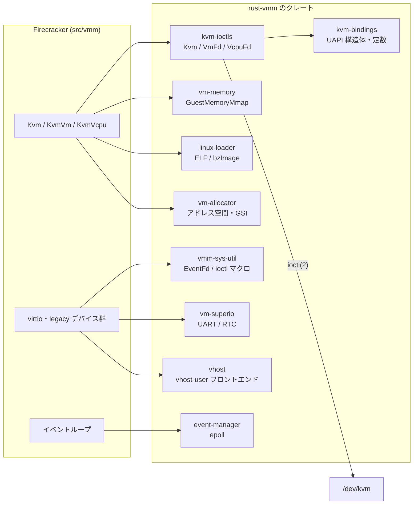
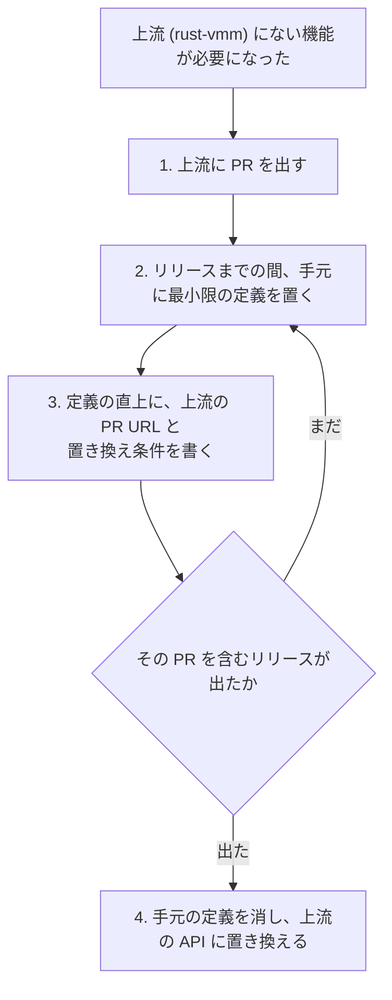

## 何を学んだか

### KVM に触るコードは、ほぼ全部が薄いラッパである

Firecracker は Rust で書かれた VMM だが、`/dev/kvm` に対する `ioctl` を自分で組み立てるコードをほとんど持っていない。KVM とのやり取りは rust-vmm プロジェクトのクレートを経由する。

| クレート        | 役割                                                   |
| --------------- | ------------------------------------------------------ |
| `kvm-bindings`  | KVM の UAPI 構造体・定数を bindgen で生成したもの      |
| `kvm-ioctls`    | `Kvm` / `VmFd` / `VcpuFd` という型安全なラッパ         |
| `vm-memory`     | ゲスト物理アドレス空間の抽象（`GuestMemoryMmap` など） |
| `vmm-sys-util`  | `EventFd`、`ioctl_*!` マクロ、terminal 操作など        |
| `linux-loader`  | ELF / bzImage のローダ、カーネルコマンドライン         |
| `event-manager` | epoll のラッパ。`MutEventSubscriber` トレイト          |
| `vm-allocator`  | アドレス空間・GSI の割り当て                           |
| `vm-superio`    | シリアル（UART）と RTC のデバイスモデル                |
| `vhost`         | vhost-user フロントエンド                              |

たとえば `Kvm::new()` は `kvm_ioctls::Kvm::new()` を呼び、API バージョンを確認し、必要な capability が揃っているかを見るだけである。`ioctl(KVM_GET_API_VERSION)` を自分で発行してはいない。`KvmVm` も `VmCommon.fd: VmFd` を保持していて、`create_irq_chip()` や `set_user_memory_region()` は `kvm-ioctls` のメソッド呼び出しである。



### 直接 ioctl を組み立てているのは 1 箇所だけ

`src/` 全体で `ioctl_iow_nr!` / `ioctl_with_ref` / `libc::ioctl` を grep すると、ヒットするのは 3 ファイルである。

```
src/vmm/src/arch/aarch64/vm.rs          KVM_ENABLE_CAP
src/vmm/src/devices/virtio/net/tap.rs   TUNSETIFF / TUNSETOFFLOAD / TUNSETVNETHDRSZ
src/vmm/src/devices/virtio/block/virtio/device.rs
                                        BLKSSZGET / BLKPBSZGET / BLKIOMIN / BLKIOOPT
```

このうち後ろ 2 つは KVM ではない。TAP デバイスの設定とブロックデバイスの属性取得で、どちらも KVM とは無関係の Linux の ioctl である（TAP 側は `vmm-sys-util` の `ioctl_iow_nr!` マクロを使っているので、番号の組み立て規則自体は上流に任せている）。

**KVM の ioctl を自前で組み立てているのは、`src/vmm/src/arch/aarch64/vm.rs` の `KVM_ENABLE_CAP` ただ 1 箇所である。** しかもその真上に、いつ消すかまで書かれたコメントが付いている。

この章は x86_64 を対象にしているので aarch64 の実装そのものは扱わないが、方針を示す例としてはこれ以上のものがない。「上流にない機能に当たったとき、Firecracker は何をするか」の実例だからである。

### 依存の顔ぶれ

`src/vmm/Cargo.toml` の `[dependencies]` は 34 個（うち 3 個はワークスペース内のローカルクレート）で、rust-vmm 由来が 9 個を占める。`Cargo.lock` 全体では 200 パッケージである。

さらに特徴的なのが、**`[patch]` セクションが 1 つもない**ことである。rust-vmm のクレートは全て crates.io から取っていて、フォークもバージョン固定の上書きもない。git 依存は `micro_http` の 1 つだけで、これは Firecracker 自身が管理しているリポジトリである。

### 依存を縛る仕組みが 3 つある

依存に対する態度は、Cargo.toml の書き方だけでなくテストとして固定されている。

1. **バージョン指定の書き方**（`src/firecracker/tests/verify_dependencies.rs`）。全クレートの `Cargo.toml` を走査し、caret 要求（`"0.25.0"`）または完全一致以外の指定、およびマイナー・パッチを省略した指定を検出して落とす
2. **ライセンスと ban**（`tests/integration_tests/style/test_licenses.py`）。`cargo deny check licenses bans` を実行し、`deny.toml` の許可リスト外のライセンスが混ざったら落とす
3. **未使用依存**（`tests/integration_tests/build/test_dependencies.py`）。`cargo udeps --all` を走らせ、使われていない依存が残っていたら落とす

3 つ目が地味に効く。依存を増やすのは簡単だが、使わなくなった依存を消し忘れると監査対象だけが残る。それを機械的に検出している。

## ソースコードのどこか

### 唯一の直接 ioctl

[`src/vmm/src/arch/aarch64/vm.rs#L20-L28`](https://github.com/firecracker-microvm/firecracker/blob/cc535f035f3828b2c5bfc85276c5d394022ed220/src/vmm/src/arch/aarch64/vm.rs#L20-L28) がその全部である。

```rust title="src/vmm/src/arch/aarch64/vm.rs"
// TODO(https://github.com/rust-vmm/kvm/pull/382): kvm-ioctls does not expose
// `VmFd::enable_cap` on aarch64 yet; this is the same definition it uses
// internally. Replace the direct ioctl with `enable_cap` once a release
// containing that PR is available.
#[allow(missing_docs)]
mod ioctls {
    use super::*;
    ioctl_iow_nr!(KVM_ENABLE_CAP, KVMIO, 0xa3, kvm_enable_cap);
}
```

コメントの構造に注目したい。

- **何が足りないか**：`kvm-ioctls` が aarch64 で `VmFd::enable_cap` を公開していない
- **何をしたか**：kvm-ioctls が内部で使っているのと同じ定義をここに書いた
- **いつ消すか**：そのパッチを含むリリースが出たら `enable_cap` に置き換える
- **どこを見ればいいか**：`rust-vmm/kvm` の PR #382

「上流に足りないから自前で書く」を、恒久的な分岐ではなく**期限付きの一時措置**として扱っている。TODO に issue の URL が入っているので、上流がリリースされたときに grep で見つかる。

使う側（[`src/vmm/src/arch/aarch64/vm.rs#L66-L87`](https://github.com/firecracker-microvm/firecracker/blob/cc535f035f3828b2c5bfc85276c5d394022ed220/src/vmm/src/arch/aarch64/vm.rs#L66-L87)）も慎重である。

```rust title="src/vmm/src/arch/aarch64/vm.rs"
            // SAFETY: The ioctl is safe because we allocated the struct and
            // the kernel will only read the size of the struct.
            let ret = unsafe { ioctl_with_ref(&common.fd, ioctls::KVM_ENABLE_CAP(), &cap) };
            if ret != 0 {
                // Not fatal: a VM whose CPU template does not touch the
                // implementation ID registers is unaffected, and one that
                // does will fail loudly when the template is applied.
                warn!(
```

`unsafe` ブロックには安全性の根拠コメントが付いている（`CONTRIBUTING.md` が要求している `clippy::undocumented_unsafe_blocks` 準拠）。失敗しても致命的ではないと判断し、その根拠まで書いている。

### KVM ラッパの薄さ

[`src/vmm/src/vstate/kvm.rs#L27-L44`](https://github.com/firecracker-microvm/firecracker/blob/cc535f035f3828b2c5bfc85276c5d394022ed220/src/vmm/src/vstate/kvm.rs#L27-L44) が `/dev/kvm` を開く処理の全部である。

```rust title="src/vmm/src/vstate/kvm.rs"
impl Kvm {
    /// Create `Kvm` struct.
    pub fn new(kvm_cap_modifiers: Vec<KvmCapability>) -> Result<Self, KvmError> {
        let kvm_fd = KvmFd::new().map_err(KvmError::Kvm)?;

        // Check that KVM has the correct version.
        // Safe to cast because this is a constant.
        #[allow(clippy::cast_possible_wrap)]
        if kvm_fd.get_api_version() != KVM_API_VERSION as i32 {
            return Err(KvmError::ApiVersion(kvm_fd.get_api_version()));
        }
```

Firecracker が足しているのは「API バージョンの確認」「必要な capability が揃っているかの検査」「CPU テンプレートによる capability の増減」だけで、システムコールを直接叩く部分は `kvm-ioctls` に任せている。同じファイルのエラー型の doc コメントが、この型の位置づけを名乗っている。

```rust title="src/vmm/src/vstate/kvm.rs"
/// Errors associated with the wrappers over KVM ioctls.
```

「KVM ioctl を包むラッパに伴うエラー」。ioctl そのものではなくラッパである、という自己認識がここにある。

### 依存の書き方を検査するテスト

[`src/firecracker/tests/verify_dependencies.rs#L13-L43`](https://github.com/firecracker-microvm/firecracker/blob/cc535f035f3828b2c5bfc85276c5d394022ed220/src/firecracker/tests/verify_dependencies.rs#L13-L43) がテスト本体である。

```rust title="src/firecracker/tests/verify_dependencies.rs"
#[test]
fn test_no_comparison_requirements() {
    // HashMap mapping crate -> [(violating dependency, specified version)]
    let mut violating_dependencies = HashMap::new();

    let src_firecracker_path = std::env::var("CARGO_MANIFEST_DIR").unwrap();
    let src_path = format!("{}/..", src_firecracker_path);

    for fc_crate in std::fs::read_dir(src_path).unwrap() {
```

`src/` の下のディレクトリを全部舐めて、それぞれの `Cargo.toml` を `cargo_toml` クレートでパースする。判定条件は [`#L80-L86`](https://github.com/firecracker-microvm/firecracker/blob/cc535f035f3828b2c5bfc85276c5d394022ed220/src/firecracker/tests/verify_dependencies.rs#L80-L86) にある。

```rust title="src/firecracker/tests/verify_dependencies.rs"
        .filter(|(_, version)| {
            version.comparators.iter().any(|comparator| {
                !matches!(comparator.op, Op::Exact | Op::Caret)
                    || comparator.minor.is_none()
                    || comparator.patch.is_none()
            })
        })
```

弾かれるのは、

- `>=`、`<`、`~`、`*` といった比較演算子（caret と完全一致だけが許される）
- `"0.25"` のようにパッチを省いた指定
- `"0"` のようにマイナーを省いた指定

つまり `kvm-ioctls = "0.25.0"` のような書き方しか許されない。エラーメッセージも `Dependencies should not be specified as comparison requirements. They should use caret requirements.` と、意図を書いている。

### ライセンスと ban

[`deny.toml`](https://github.com/firecracker-microvm/firecracker/blob/cc535f035f3828b2c5bfc85276c5d394022ed220/deny.toml) は 22 行しかない。

```toml title="deny.toml"
[advisories]
yanked = "deny"
unmaintained = "all"
unsound = "all"

[licenses]
version = 2
allow = [
    "MIT",
    "Apache-2.0",
    "BSD-3-Clause",
    "0BSD",
    "ISC",
    "Unicode-3.0"
]

[[bans.deny]]
name = "serde_derive"
version = ">1.0.171, < 1.0.184"
```

許可するライセンスは 6 種類だけ。`unmaintained = "all"` は、直接依存だけでなく推移的依存にもメンテナンス停止の警告を出す設定である。

`bans.deny` に `serde_derive` の特定バージョン範囲が入っているのは、その範囲の `serde_derive` が**事前コンパイル済みバイナリを同梱していた**期間に対応する。依存監査を「ライセンスチェック」で終わらせず、供給網の具体的な事故に対する対策を入れている。

これを回すのが [`tests/integration_tests/style/test_licenses.py#L129-L152`](https://github.com/firecracker-microvm/firecracker/blob/cc535f035f3828b2c5bfc85276c5d394022ed220/tests/integration_tests/style/test_licenses.py#L129-L152) である。

```python title="tests/integration_tests/style/test_licenses.py"
    _, stdout, stderr = cargo(
        "deny", f"--manifest-path {toml_file} check licenses bans"
    )
    assert "licenses ok" in stdout
```

このテストには続きがある。`cargo deny` が copyleft を既定で許してしまう挙動を知っていて、標準エラー出力に `license` を含む行が 1 行でもあれば落とすようにしている。ツールの既定値を信用せず、ツールの出力を追加で検査している。

### 未使用依存の検出

[`tests/integration_tests/build/test_dependencies.py`](https://github.com/firecracker-microvm/firecracker/blob/cc535f035f3828b2c5bfc85276c5d394022ed220/tests/integration_tests/build/test_dependencies.py) は 12 行である。

```python title="tests/integration_tests/build/test_dependencies.py"
def test_unused_dependencies():
    """
    Test that there are no unused dependencies.
    """
    cargo("udeps", "--all", nightly=True)
```

nightly が要る（`cargo-udeps` の制約）にもかかわらず、CI に入れている。

### 上流に寄せない選択もある

全部を rust-vmm に寄せているわけではない。`src/acpi-tables` は in-tree のクレートで、`Cargo.toml` の authors がこうなっている。

```toml title="src/acpi-tables/Cargo.toml"
authors = [
    "The Cloud Hypervisor Authors",
    "Amazon Firecracker team <firecracker-devel@amazon.com>",
]
```

Cloud Hypervisor から持ち込んだコードを、外部依存としてではなくワークスペース内のクレートとして抱えている。ACPI テーブルの生成は Firecracker が[起動時間のために MPTable から移行した](../guest-hardware-discovery/)機能で、変更頻度と要求が自分たち固有なら手元に置く、という判断だと読める。

## なぜそうなっているか

### 監査対象を減らす

Firecracker の[脅威モデル](../threat-model/)では、ゲストは悪意あるコードとして扱われる。`ioctl` の引数を組み立てる部分にバグがあれば、それは KVM に対する不正な要求になりうる。`ioctl` の番号を自分で計算するコード（`ioctl_iow_nr!` が展開するビット演算）が 100 箇所あれば、100 箇所を監査しなければならない。1 箇所なら 1 箇所で済む。

同じ理屈が `unsafe` にも当てはまる。`ioctl` は FFI なので必ず `unsafe` になる。`CONTRIBUTING.md` が「`unsafe` の使用は強く非推奨」とし、使う場合には正当化と安全性の証明を要求している以上、`unsafe` を上流のクレートに押し出せるなら押し出したい。

### 修正が上流にも流れる

`kvm-ioctls` に修正を入れれば、Cloud Hypervisor など rust-vmm を使う他のプロジェクトにも同じ修正が届く。逆に、他のプロジェクトが見つけたバグの修正が Firecracker にも届く。VMM のように「同じカーネル API に対して同じ間違いをしがち」な領域では、この双方向性の価値が大きい。

`KVM_ENABLE_CAP` の TODO が `rust-vmm/kvm` の PR を参照しているのは、まさにこの流れである。足りない機能に当たったら、まず上流に PR を出す。上流のリリースを待つ間だけ手元に定義を置く。

### 機能不足に当たったときの手順が決まっている

「上流に寄せる」の弱点は、上流にない機能が必要になったときに詰まることである。Firecracker の対処はこうなっている。

1. 上流に PR を出す
2. 上流のリリースまでの間、手元に最小限の定義を置く
3. その定義の直上に、上流の PR URL と置き換え条件を書く
4. 上流がリリースされたら消す

3 が重要である。TODO に URL がなければ、その定義は永久に残る。**「一時的な回避」を一時的なままにするための仕組み**が、コメントの書式として運用されている。



`[patch]` セクションを使っていないことも同じ方向を向いている。フォークして `[patch]` で差し替えると、その場は動くが、上流に戻す圧力がなくなる。定義を 1 つだけ手元に置く方が、痛みが残る分だけ戻しやすい。

### バージョン指定を caret に固定する理由

`>=` のような比較要求を禁止しているのは、**ビルドの再現性**と**依存解決の予測可能性**のためである。`>= 0.25` のような指定は、将来の破壊的変更を含むバージョンまで許してしまう。逆に `< 0.26` のような上限指定は、他のクレートの要求と衝突して解決不能になりやすい。caret 要求（`"0.25.0"` = `>=0.25.0, <0.26.0`）に統一すれば、Cargo の SemVer 互換の枠内で動く。

マイナーとパッチの省略を禁止しているのは、`"0.25"` と書くと `0.25.0` 未満のバグ修正を要求できないからである。「このバージョン以上が要る」という情報を Cargo.toml に正確に残させている。

### 依存監査を「テスト」にしている理由

`cargo deny` も `cargo udeps` も、CI のスクリプトではなく **pytest のテストケース**として書かれている。他の統合テストと同じ場所にあり、同じコマンドで走り、失敗したら同じように PR を止める。「セキュリティチェックは別のパイプラインで週次」ではなく、機能テストと同じ扱いになっている。

## どう活かすか

**FFI や生のシステムコールを 1 箇所に閉じ込める**というのは、Rust に限らず取り込める。`ioctl`、`syscall`、`dlopen`、生ポインタの操作といった「型検査が効かない部分」を薄いレイヤに集約すると、監査すべき面積が有限になる。Firecracker の場合、その集約先が自前のモジュールではなく外部クレートだった、という違いがあるだけである。

**「上流にないから手元に書く」を書式で管理する**のは、すぐ真似できて効果が大きい。

```
// TODO(<上流の issue/PR URL>): <何が足りないか>
// <何をしたか>
// <いつ消すか>
```

この 3 点セットがあると、依存を更新したときに「この回避はもう要らない」と判断できる。URL がない TODO は、書いた人がいなくなった瞬間に判断不能になる。

**依存に関するポリシーを、文書ではなくテストとして書く**。「caret 要求を使う」というルールを CONTRIBUTING に書くだけなら、レビュワーが見落とせば通る。`verify_dependencies.rs` のように 87 行のテストにしておけば、見落としようがない。同じことがライセンス（`cargo deny`）と未使用依存（`cargo udeps`）にも言える。

一方で、**そのまま真似すべきでない条件**もある。

「上流に寄せる」が成立しているのは、rust-vmm という**利害が一致する複数の VMM が育てているエコシステム**があるからである。上流のメンテナンスが活発で、PR がレビューされ、リリースが定期的に出る。この前提がない領域（メンテナが 1 人のクレート、最終更新が 3 年前のクレート）に同じ判断を持ち込むと、上流の PR が塩漬けになって手元の回避が恒久化する。`deny.toml` が `unmaintained = "all"` を設定しているのは、まさにこの前提が崩れたことを検出するためだと読める。

また、**`[patch]` を使わない**という選択は、上流のリリースサイクルが自分たちの開発速度に耐えられる場合にだけ取れる。急ぎで直したい脆弱性があるのに上流のリリースが遅い、という状況では、フォークして `[patch]` するのが現実的な答えになる。Firecracker が `[patch]` なしでやれているのは、rust-vmm の主要クレートに Firecracker のメンテナ自身が関わっているという事情も大きいはずである（これは推測だが、`kvm-ioctls` の TODO が具体的な PR 番号を指していることから、上流への提出が日常的に行われていることは読み取れる）。
