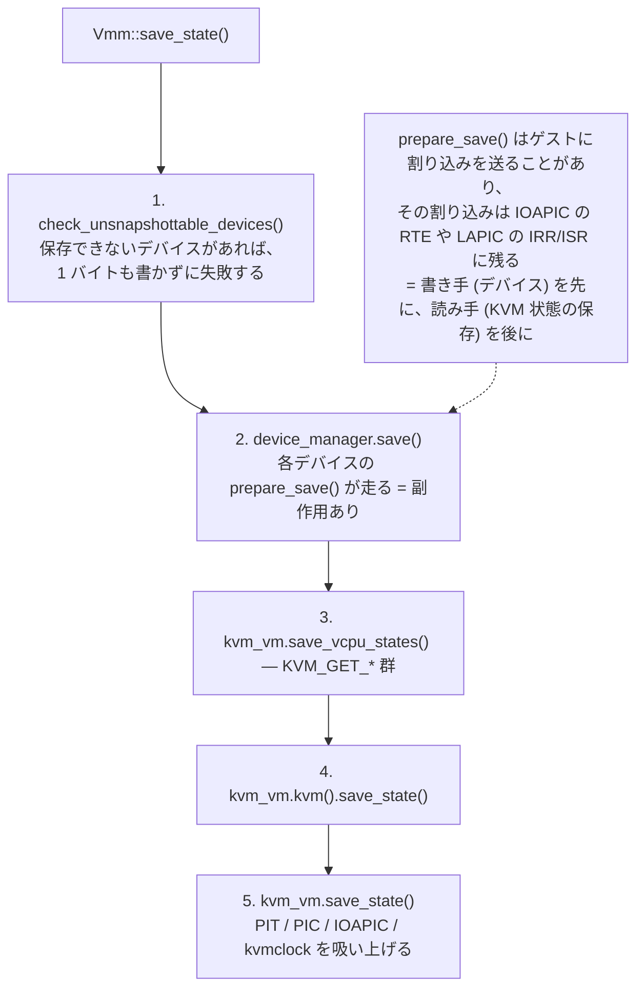
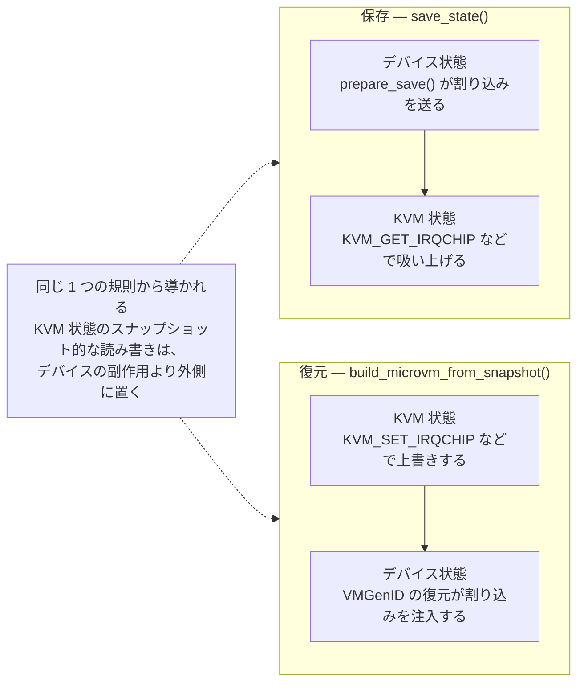

## 何を学んだか

### 保存は読み取り専用ではない

スナップショットを取る処理は、直感的には「各コンポーネントの状態を読み出して構造体に詰める」だけに見える。Firecracker の `Vmm::save_state()` はそうではない。**保存の途中でデバイスがゲストに割り込みを送ることがある。**

そのため、保存の順序に意味が生まれる。



割り込みは最終的に KVM 側（LAPIC・IOAPIC）に状態として乗る。だから **デバイスを先に動かし、その結果を含んだ状態を後から KVM から吸い上げる** 必要がある。逆順にすると、デバイスが送った割り込みは「保存された KVM 状態」より後に発生したことになり、復元先にはどこにも存在しない。ゲストから見れば、要求した I/O の完了通知が永久に来ない。

### `prepare_save()` は「保存前に副作用を出すための穴」

`VirtioDevice` トレイトは `prepare_save()` をデフォルト no-op で持っている。実装しているデバイスは 4 つで、やっていることはそれぞれ違う。

| デバイス                                | `prepare_save()` の中身                                                                   |
| --------------------------------------- | ----------------------------------------------------------------------------------------- |
| virtio-block                            | `drain_and_flush(false)` でホストファイルへ flush。非同期エンジンなら完了キューも処理する |
| virtio-net                              | 保留中の RX フレームをゲストに渡し切り、パース済みディスクリプタの読み取り位置を巻き戻す  |
| vsock                                   | アクティブなら `TRANSPORT_RESET` イベントを送る（[`../vsock-reset/`](../vsock-reset/)）   |
| vhost-user-block                        | `unimplemented!()`。そもそもここに到達しない                                              |
| その他（balloon / entropy / pmem など） | デフォルトの no-op                                                                        |

block の「完了キューを処理する」と vsock の「イベントを送る」は、どちらも **used ring への書き込みと割り込みの注入** を伴う。net の「保留フレームを渡し切る」も同様である。つまり 3 つとも、KVM の割り込みコントローラの状態を変える。

### 保存できないデバイスは、1 バイトも書く前に弾く

`check_unsnapshottable_devices()` は vhost-user-block の存在だけを見て、あればエラーを返す。この呼び出しが `save_state()` の**最初の行**にある。ファイルを開くより前、`prepare_save()` を走らせるより前である。

これは効く。`prepare_save()` に副作用がある以上、「途中まで保存してから失敗」は元の microVM の状態を壊すことを意味する。API のドキュメントが `CreateSnapshot` の失敗について "on failure: no side-effects" と約束できるのは、この事前チェックがあるからだ。

### virtqueue の領域は、明示的に dirty にしないと差分に載らない

`create_snapshot()` はメモリファイルを書いた後、最後にもう一度 virtqueue の領域を dirty としてマークする。理由はコメントに書いてある。**「実行中は queue オブジェクトのページを dirty としてマークしていない」から**である。

virtqueue のディスクリプタテーブル・avail ring・used ring はゲストメモリ上にあるが、Firecracker はそこへの書き込みを生ポインタ経由でやっており、通常の dirty 追跡機構を通らない。放置すると、[差分スナップショット](../diff-snapshot/)にキューの中身が入らず、復元したゲストが古い used ring を見ることになる。

## ソースコードのどこか

主役は [`src/vmm/src/lib.rs#L499-L539`](https://github.com/firecracker-microvm/firecracker/blob/cc535f035f3828b2c5bfc85276c5d394022ed220/src/vmm/src/lib.rs#L499-L539)。順序の理由が 4 行のコメントに書かれている。

```rust title="src/vmm/src/lib.rs"
    /// Saves the state of a paused Microvm.
    pub fn save_state(&mut self, vm_info: &VmInfo) -> Result<MicrovmState, MicrovmStateError> {
        self.check_unsnapshottable_devices()?;

        // We need to save device state before saving KVM state.
        // Some devices, (at the time of writing this comment block device with async engine)
        // might modify the VirtIO transport and send an interrupt to the guest. If we save KVM
        // state before we save device state, that interrupt will never be delivered to the guest
        // upon resuming from the snapshot.
        let device_states = self.device_manager.save();
```

「VirtIO トランスポートを変更し、ゲストへ割り込みを送る」と書いてある。トランスポートの状態（MMIO なら割り込みステータスレジスタ、PCI なら MSI-X の設定）は Firecracker 側にあるが、割り込みの注入先は KVM 側なので、両方が同じタイミングの状態でなければならない。

同じ論点がデバイス保存ループの中にもある。[`src/vmm/src/device_manager/persist.rs#L274-L287`](https://github.com/firecracker-microvm/firecracker/blob/cc535f035f3828b2c5bfc85276c5d394022ed220/src/vmm/src/device_manager/persist.rs#L274-L287)。

```rust title="src/vmm/src/device_manager/persist.rs"
        let _: Result<(), ()> = self.for_each_virtio_mmio_device(|_, devid, device| {
            let mmio_transport_locked = device.inner.lock().expect("Poisoned lock");
            let mut locked_device = mmio_transport_locked.locked_device();
            // We need to call `prepare_save()` on the device before saving the transport
            // so that, if we modify the transport state while preparing the device, e.g. sending
            // an interrupt to the guest, this is correctly captured in the saved transport state.
            locked_device.prepare_save();
            let transport_state = mmio_transport_locked.save();
```

`prepare_save()` → トランスポート保存 → デバイス本体保存、という順序である。PCI トランスポート側にも同じコメントと同じ順序がある（[`src/vmm/src/device_manager/pci_mngr.rs#L353-L366`](https://github.com/firecracker-microvm/firecracker/blob/cc535f035f3828b2c5bfc85276c5d394022ed220/src/vmm/src/device_manager/pci_mngr.rs#L353-L366)）。**トランスポートが 2 種類あっても、この順序制約は同じように書かれている。**

フック自体はトレイトの末尾に、実装なしで置かれている（[`src/vmm/src/devices/virtio/device.rs#L258-L259`](https://github.com/firecracker-microvm/firecracker/blob/cc535f035f3828b2c5bfc85276c5d394022ed220/src/vmm/src/devices/virtio/device.rs#L258-L259)）。

```rust title="src/vmm/src/devices/virtio/device.rs"
    /// Prepare the device for saving its state
    fn prepare_save(&mut self) {}
```

virtio-block の実装（[`src/vmm/src/devices/virtio/block/virtio/device.rs#L705-L721`](https://github.com/firecracker-microvm/firecracker/blob/cc535f035f3828b2c5bfc85276c5d394022ed220/src/vmm/src/devices/virtio/block/virtio/device.rs#L705-L721)）。非アクティブなら何もしない、というガードが先頭にある。

```rust title="src/vmm/src/devices/virtio/block/virtio/device.rs"
    /// Prepare device for being snapshotted.
    pub fn prepare_save(&mut self) {
        if !self.is_activated() {
            return;
        }

        self.drain_and_flush(false);
        if let FileEngine::Async(ref _engine) = self.disk.file_engine {
            self.process_async_completion_queue();
        }
    }
```

`drain_and_flush()` は同期エンジンなら単に `flush()`、非同期（io_uring）エンジンなら送信済みリクエストを drain してから flush する（[`src/vmm/src/devices/virtio/block/virtio/io/mod.rs#L166-L173`](https://github.com/firecracker-microvm/firecracker/blob/cc535f035f3828b2c5bfc85276c5d394022ed220/src/vmm/src/devices/virtio/block/virtio/io/mod.rs#L166-L173)）。**問題のコメントが名指ししている「非同期エンジン」の割り込みは `process_async_completion_queue()` から出る。** 完了したリクエストを used ring に積み、ゲストに通知するからだ。

virtio-net（[`src/vmm/src/devices/virtio/net/device.rs#L1093-L1111`](https://github.com/firecracker-microvm/firecracker/blob/cc535f035f3828b2c5bfc85276c5d394022ed220/src/vmm/src/devices/virtio/net/device.rs#L1093-L1111)）は、部分的に組み立てた RX の状態を「まだ何も起きていない」状態に戻す。

```rust title="src/vmm/src/devices/virtio/net/device.rs"
    /// Prepare saving state
    fn prepare_save(&mut self) {
        // We shouldn't be messing with the queue if the device is not activated.
        // Anyways, if it isn't there's nothing to prepare; we haven't parsed any
        // descriptors yet from it and we can't have a deferred frame.
        if !self.is_activated() {
            return;
        }

        // Give potential deferred RX frame to guest
        self.rx_buffer.finish_frame(&mut self.queues[RX_INDEX]);
        // Reset the parsed available descriptors, so we will re-parse them
        self.queues[RX_INDEX].next_avail -=
            Wrapping(u16::try_from(self.rx_buffer.parsed_descriptors.len()).unwrap());
        self.rx_buffer.parsed_descriptors.clear();
```

net はディスクリプタを事前にパースして手元に貯める（[`../net-rx-buffers/`](../net-rx-buffers/)、[`../iov-deque/`](../iov-deque/)）。この「貯めた分」は Firecracker のプロセスメモリにしかない。復元先には引き継げないので、**avail ring の読み取り位置を貯めた個数だけ巻き戻して、復元後に読み直させる。**

vsock は [`src/vmm/src/devices/virtio/vsock/device.rs#L467-L475`](https://github.com/firecracker-microvm/firecracker/blob/cc535f035f3828b2c5bfc85276c5d394022ed220/src/vmm/src/devices/virtio/vsock/device.rs#L467-L475)。

```rust title="src/vmm/src/devices/virtio/vsock/device.rs"
    fn prepare_save(&mut self) {
        // Send Transport event to reset connections if device
        // is activated.
        if self.is_activated() {
            self.send_transport_reset_event().unwrap_or_else(|err| {
                error!("Failed to send reset transport event: {:?}", err);
            });
        }
    }
```

vhost-user-block は到達しない前提で `unimplemented!()` を置いている（[`src/vmm/src/devices/virtio/block/vhost_user/device.rs#L245-L248`](https://github.com/firecracker-microvm/firecracker/blob/cc535f035f3828b2c5bfc85276c5d394022ed220/src/vmm/src/devices/virtio/block/vhost_user/device.rs#L245-L248)）。到達させないための門番が [`src/vmm/src/lib.rs#L436-L460`](https://github.com/firecracker-microvm/firecracker/blob/cc535f035f3828b2c5bfc85276c5d394022ed220/src/vmm/src/lib.rs#L436-L460) である。

```rust title="src/vmm/src/lib.rs"
    /// Check if the VM has any devices without snapshot support
    pub fn check_unsnapshottable_devices(&self) -> Result<(), MicrovmStateError> {
        let mut tuples = Vec::new();
        self.device_manager
            .for_each_virtio_device(|device_type, device| {
                if let VirtioDeviceType::Block = device_type
                    && let Some(b) = device.as_any().downcast_ref::<Block>()
                    && b.is_vhost_user()
                {
                    tuples.push(("vhost-user-block", b.id().to_owned()));
                }
            });
```

見つかったデバイスは全部集めてから、ID 付きの 1 つのメッセージにまとめる。最初の 1 個で止めない。ユーザは複数のデバイスを外す必要があるかもしれないので、1 回の API 呼び出しで全部教える。

virtqueue の再 dirty 化は [`src/vmm/src/persist.rs#L195-L200`](https://github.com/firecracker-microvm/firecracker/blob/cc535f035f3828b2c5bfc85276c5d394022ed220/src/vmm/src/persist.rs#L195-L200) にある。

```rust title="src/vmm/src/persist.rs"
    // We need to mark queues as dirty again for all activated devices. The reason we
    // do it here is that we don't mark pages as dirty during runtime
    // for queue objects.
    vmm.device_manager
        .mark_virtio_queue_memory_dirty(kvm_vm.guest_memory());
```

実体は `Queue::initialize()` の再実行である（[`src/vmm/src/devices/virtio/device.rs#L219-L224`](https://github.com/firecracker-microvm/firecracker/blob/cc535f035f3828b2c5bfc85276c5d394022ed220/src/vmm/src/devices/virtio/device.rs#L219-L224)）。`initialize()` はディスクリプタテーブル・avail ring・used ring のホスト側ポインタを取り直しつつ、そのスライスを dirty としてマークする（[`src/vmm/src/devices/virtio/queue.rs#L319-L339`](https://github.com/firecracker-microvm/firecracker/blob/cc535f035f3828b2c5bfc85276c5d394022ed220/src/vmm/src/devices/virtio/queue.rs#L319-L339)）。

```rust title="src/vmm/src/devices/virtio/queue.rs"
        let slice = mem.get_slice(addr, len).map_err(QueueError::MemoryError)?;
        slice.bitmap().mark_dirty(0, len);
        Ok(slice.ptr_guard_mut().as_ptr().cast())
```

## なぜそうなっているか

### 「割り込みが KVM の状態に含まれる」ことが順序を決めている

[in-kernel irqchip](../irqchip-ordering/) を使っていると、デバイスからの割り込みは irqfd に write するだけでゲストに届く。届いた割り込みは IOAPIC のリダイレクションテーブルや LAPIC の IRR/ISR に残る。これらは `KvmVm::save_state()` が `KVM_GET_IRQCHIP` で吸い上げる対象そのものである。

つまり「割り込みを送る」と「KVM 状態を保存する」の間には、**書き手と読み手の関係**がある。書き手を先に走らせなければ、読み手はそれを見ない。素朴な依存関係だが、`save_state()` を眺めただけでは見えない。デバイスの `prepare_save()` が割り込みを送りうる、という事実を知らないと、順序を入れ替えても壊れないように見えてしまう。

コメントが「at the time of writing this comment」と断っているのも正直な書き方である。**今この瞬間に副作用を持つデバイスがどれかは変わるが、順序制約自体は変わらない。**

### 復元側は逆順になっていて、そちらにも同じ種類のコメントがある

`build_microvm_from_snapshot()` では順序が反転する（[`src/vmm/src/builder.rs#L497-L511`](https://github.com/firecracker-microvm/firecracker/blob/cc535f035f3828b2c5bfc85276c5d394022ed220/src/vmm/src/builder.rs#L497-L511)）。

```rust title="src/vmm/src/builder.rs"
    // Restore devices states.
    // Restoring VMGenID injects an interrupt in the guest to notify it about the new generation
    // ID. As a result, we need to restore DeviceManager after restoring the KVM state, otherwise
    // the injected interrupt will be overwritten.
```

理屈は同じである。デバイスの復元が割り込みを注入するので、**KVM 状態の復元（＝上書き）を先に済ませておかないと、注入した割り込みが消える。** 保存では「デバイス → KVM」、復元では「KVM → デバイス」。どちらも「KVM 状態のスナップショット的な読み書きは、デバイスの副作用より外側に置く」という同じ規則から導かれる。VMGenID の話は [`../vmgenid/`](../vmgenid/) で扱う。



### 事前チェックを分離した理由

`check_unsnapshottable_devices()` は `save_state()` の中に inline してもよさそうだが、独立した `pub fn` になっている。理由は推測になるが、API レイヤから同じ判定を使える形にしておきたかった、というのが素直な読みだろう。実装上重要なのは配置のほうで、**副作用を持つ処理より前に、全ての「できない理由」を洗い出しておく**という構造になっている。

### queue のページだけ特別扱いする代償

virtqueue へのアクセスを dirty 追跡の対象にしなかったのは性能のためである。used ring への書き込みはパケット / I/O ごとに起きるので、そのたびに dirty bitmap を触るとホットパスが重くなる。代わりに「スナップショットのたびに、キュー領域全体を無条件に dirty とする」ことにした。

これは差分スナップショットのサイズを少し増やすが、キュー領域はメモリ全体から見れば小さい。**追跡のコストを毎回払うのをやめて、保存時に定額を払う**という交換になっている。コメントが理由を 1 行で書いているのは、この判断を後から読む人が「なぜここでマークするのか」と迷わないためだろう。

## どう活かすか

### 「保存」に副作用があるなら、それを型か名前で見せる

シリアライズ処理が読み取り専用でないシステムは珍しくない。バッファを flush する、進行中の処理を打ち切る、接続を切る。Firecracker はこれを `&self` の `save()` と `&mut self` の `prepare_save()` に分けた。**副作用を出す側は `&mut self` を取るので、Rust の型としても「保存の途中に変更が起きる」ことが見える。**

この分離が効く条件は、副作用を持つ実装が少数派であることだ。Firecracker では 10 種類近い virtio デバイスのうち 3 つしか実装していない。デフォルト no-op のフックにしておけば、残りは何も書かなくてよい。全部が副作用を持つなら、分ける意味は薄れる。

### 順序の理由をコメントで書き、コードの近くに置く

`save_state()` の順序は 3 行のコードだが、コメントは 4 行ある。この比率は妥当である。**順序を入れ替えても型検査は通り、テストも大抵は通る。** 壊れるのは「非同期エンジンのブロックデバイスを積んだ VM を、I/O が飛んでいる最中にスナップショットして、復元した後」という条件が揃ったときだけだ。

このクラスのバグはコメントでしか防げない。そして復元側にも対になるコメントがある。片方だけ書くと、もう片方をリファクタする人が理由を知らないまま順序を変える。

### 部分的な失敗を許さない処理は、判定を先頭に集める

「途中まで実行して失敗する」が許されない処理では、**判定 → 実行の 2 相に分ける**。Firecracker の事前チェックはその最小形で、API の "on failure: no side-effects" という契約を実装レベルで支えている（[`../specification-as-contract/`](../specification-as-contract/)）。

逆に、この形が使えないのは「実行してみないと可能かどうか分からない」場合だ。その場合はロールバックを用意するか、契約のほうを弱めるしかない。Firecracker は「スナップショット非対応デバイスの一覧」を静的に持てるので前者で済んだ。自分のシステムで同じ手が使えるかは、失敗条件を実行前に列挙できるかで決まる。
