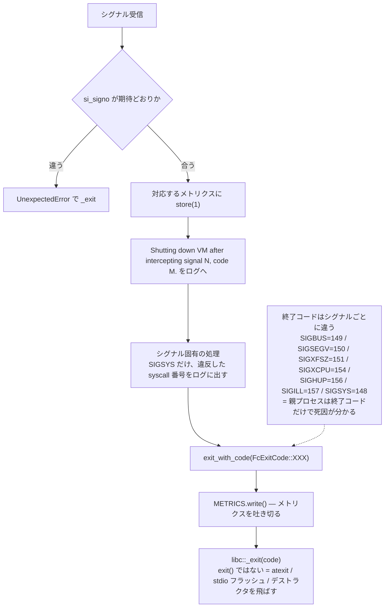
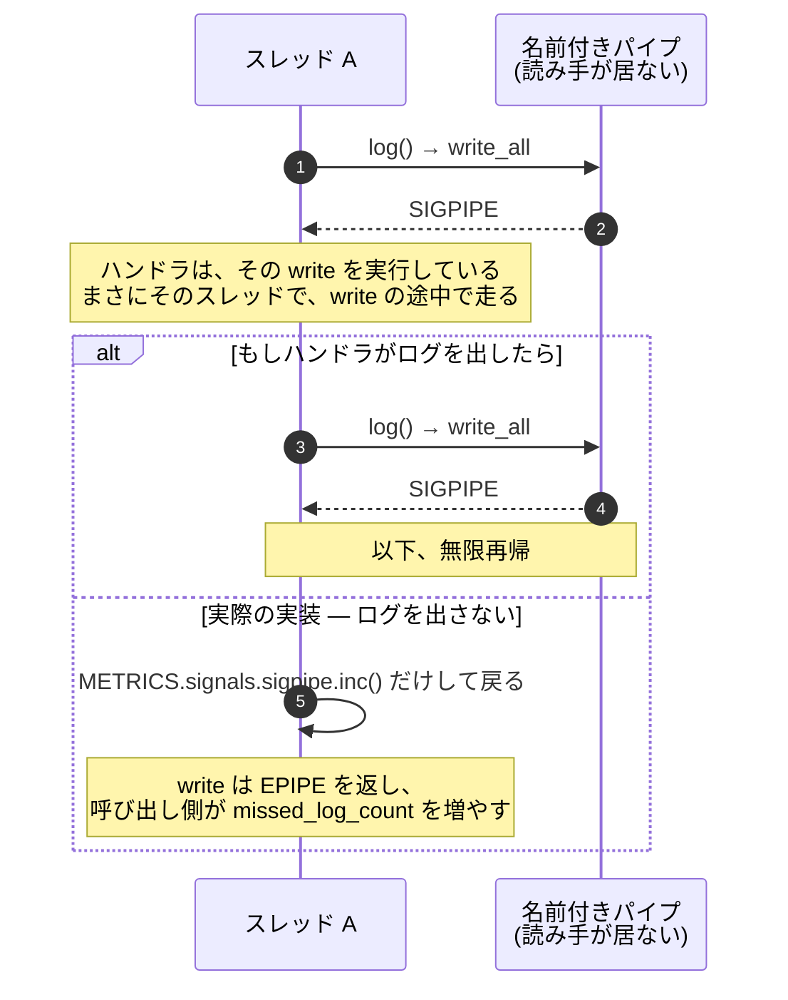

## 何を学んだか

### 8 つのシグナルのうち、7 つは死ぬ

Firecracker は起動時に 8 つのシグナルにハンドラを登録する。うち 7 つは共通の形をしている。



終了コードはシグナルごとに違う値になっている（SIGBUS=149、SIGSEGV=150、SIGXFSZ=151、SIGXCPU=154、SIGHUP=156、SIGILL=157、SIGSYS=148）。**親プロセスは終了コードだけで死因が分かる。** メトリクスファイルを読まなくてよい。

`exit()` ではなく `_exit()` を呼ぶのが要点だ。`exit()` は `atexit` ハンドラを走らせ、stdio をフラッシュし、デストラクタを呼ぶ。**シグナルハンドラの中でそれをやるのは危険**（malloc のロックを持った状態で SIGSEGV を受けているかもしれない）で、しかも壊れた状態のプロセスで後片付けをする意味がない。`_exit` はそのまま `exit_group(2)` に落ちる。

死ぬ前に `METRICS.write()` を呼ぶのは、**死因を残すため**だ。ここで何を残せるかを絞り込んだ結果が[メトリクスの型設計](../metrics-design/)——致命シグナル用は `SharedStoreMetric`——になっている。

SIGSYS（seccomp 違反）は同じ骨組みに乗っているが、`si_code` から違反した syscall 番号を取り出す処理が追加されている。詳細は[SIGSYS ハンドラ](../sigsys-handler/)のページで扱う。

### SIGPIPE だけが違う

8 つ目の SIGPIPE は、マクロで生成されず手書きされている。やることは 2 つだけだ。

1. シグナル番号が本当に SIGPIPE か確認する
2. `METRICS.signals.sigpipe.inc()`

**ログを出さない。終了しない。** そして「ログを出さない」ことにコメントが付いている。

```rust
    // Do not log here: the write that raised SIGPIPE is usually a log write, so
    // logging would re-enter the logger mid-write on this same thread.
    METRICS.signals.sigpipe.inc();
```

（SIGPIPE を起こした write は大抵ログの write なので、ここでログを出すと同じスレッドで書き込み中のロガーに再入することになる。）

Firecracker のログ出力先は名前付きパイプであることが多い（`docs/logger.md` がそう案内している）。読み手が居なくなったパイプに書けば SIGPIPE が上がる。**ログを書いている最中に SIGPIPE が上がる**わけだ。ハンドラは、その write を実行しているまさにそのスレッドで、その write の途中で走る。

そこでログを出したらどうなるか。



無限再帰になる。[ロガーが `RwLock` を使っている](../logger-reentrancy/)のは、シグナルハンドラからのログを可能にするためだが、それは「再入しても止まらない」ことしか保証しない。**再入が無限に続くことは防げない。** だからハンドラ側が出さない。

メトリクスの型も他と違う。`sigpipe` だけが `SharedIncMetric`（カウンタ）で、他の致命シグナルは `SharedStoreMetric`（0 か 1）だ。SIGPIPE はプロセスを殺さないので複数回起きうる。0/1 では表せない。

`FcExitCode::SIGPIPE = 155` という定数は残っているが、現在このコードは使われない。SIGPIPE で終了しなくなった名残だ。

### 非同期シグナルセーフとの折り合い

POSIX は、シグナルハンドラの中から呼んでよい関数を列挙している（async-signal-safe 関数）。`write(2)`、`_exit(2)` は入っている。`malloc`、`printf`、そしてあらゆるロック操作は入っていない。

Firecracker のハンドラは、この規則を **守っていない。**

- `error_unrestricted!` は `format!` を呼ぶ。文字列をヒープに確保する = `malloc` を呼ぶ
- ロガーは `RwLock::read()` を取る
- `METRICS.write()` は `metrics_buf` の `Mutex` を取り、`serde_json` でシリアライズする

厳密に言えば、これらはすべて未定義動作になりうる。メイン処理が `malloc` の内部ロックを持った状態で SIGSEGV を受ければ、ハンドラの `format!` がそのロックを待って永久に止まる。

Firecracker はこれを承知のうえで、**リスクを減らす方向に個別対処している。**

| 対処                                                  | 何を減らすか                             |
| ----------------------------------------------------- | ---------------------------------------- |
| 登録時の `sa_mask` で他のシグナルをブロック           | ハンドラ実行中のシグナル多重発生         |
| ロガーを `RwLock` にする                              | 同一スレッドでのロガーのデッドロック     |
| 致命シグナルのメトリクスを `SharedStoreMetric` にする | シリアライズのレースで死因が消えること   |
| SIGPIPE ではログを出さない                            | ロガーへの無限再入                       |
| `exit()` ではなく `_exit()`                           | atexit / stdio フラッシュ / デストラクタ |

つまり **「安全にする」のではなく「起きたら困る具体的な失敗を 1 つずつ潰す」**というやり方だ。残っているリスク（malloc ロック競合）は、確率が低く、起きても「壊れたプロセスがハングする」だけで、既に壊れているという判断だと読める（推測だが、`METRICS.write()` の doc コメントが `We make this compromise since the process will be killed anyway` と同種の判断を明示していることが傍証になる）。

`log_sigsys_err` の SAFETY コメントが、`sa_mask` に依存していることを明示している。

```rust
    // SAFETY: Other signals which might do async unsafe things incompatible with the rest of this
    // function are blocked due to the sa_mask used when registering the signal handler.
```

### パニックフックも同じ形

Rust のパニックは、Firecracker では `panic = "abort"` でビルドされているので巻き戻さずに中断する。中断の直前に走るパニックフックは、シグナルハンドラとほぼ同じことをする——パニック情報をログに出し、stdin をカノニカルモードに戻し、`METRICS.vmm.panic_count.store(1)` してから `METRICS.write()`。

`panic_count` が `store(1)` なのは、致命シグナルと同じ理由だ。パニックは 1 回しか起きない（abort するので）から 0/1 で足り、`SharedStoreMetric` ならシリアライズがアトミックになる。

**異常終了の経路（致命シグナル、パニック）が、どちらも `METRICS.write()` を通ってから死ぬ。** 記録を残す経路を揃えてある。

## ソースコードのどこか

### 共通の終了処理

[`src/vmm/src/signal_handler.rs#L21-L29`](https://github.com/firecracker-microvm/firecracker/blob/cc535f035f3828b2c5bfc85276c5d394022ed220/src/vmm/src/signal_handler.rs#L21-L29)。9 行しかない。

```rust title="src/vmm/src/signal_handler.rs"
#[inline]
fn exit_with_code(exit_code: FcExitCode) {
    // Write the metrics before exiting.
    if let Err(err) = METRICS.write() {
        error_unrestricted!("Failed to write metrics while stopping: {}", err);
    }
    // SAFETY: Safe because we're terminating the process anyway.
    unsafe { libc::_exit(exit_code as i32) };
}
```

SAFETY コメントの `Safe because we're terminating the process anyway`（どうせプロセスを終わらせるので安全）が、このファイル全体の判断基準を表している。

### ハンドラをマクロで生成する

[`L31-L59`](https://github.com/firecracker-microvm/firecracker/blob/cc535f035f3828b2c5bfc85276c5d394022ed220/src/vmm/src/signal_handler.rs#L31-L59) の `generate_handler!` が、(関数名, シグナル定数, 終了コード, メトリクス, 追加処理) の 5 つを受け取って `extern "C"` 関数を作る。

```rust title="src/vmm/src/signal_handler.rs"
            if num != si_signo || num != $signal_name {
                exit_with_code(FcExitCode::UnexpectedError);
            }
            $signal_metric.store(1);

            error_unrestricted!(
                "Shutting down VM after intercepting signal {}, code {}.",
                si_signo,
                si_code
            );

            $body(si_code, info);
```

`num != si_signo` のチェックは、シグナル番号（引数）と `siginfo_t` の中身が食い違ったら「起きてはならないこと」として `UnexpectedError` (=2) で死ぬ。**カーネルから渡されたデータの整合性すら疑っている。**

使用箇所は [`L78-L131`](https://github.com/firecracker-microvm/firecracker/blob/cc535f035f3828b2c5bfc85276c5d394022ed220/src/vmm/src/signal_handler.rs#L78-L131)。`generate_handler!(sigbus_handler, SIGBUS, SIGBUS, METRICS.signals.sigbus, empty_fn)` のような呼び出しが 7 つ並ぶだけだ。追加処理は SIGSYS だけが `log_sigsys_err` で、他は `empty_fn`（何もしない）。

### SIGPIPE だけ手書き

[`L133-L151`](https://github.com/firecracker-microvm/firecracker/blob/cc535f035f3828b2c5bfc85276c5d394022ed220/src/vmm/src/signal_handler.rs#L133-L151)。マクロに乗らないので全部書いてある。

```rust title="src/vmm/src/signal_handler.rs"
extern "C" fn sigpipe_handler(num: c_int, info: *mut siginfo_t, _unused: *mut c_void) {
    // Just record the metric and allow the process to continue, the EPIPE error needs
    // to be handled at caller level.

    // SAFETY: Safe because we're just reading some fields from a supposedly valid argument.
    let si_signo = unsafe { (*info).si_signo };
    let si_code = unsafe { (*info).si_code };

    if num != si_signo || num != SIGPIPE {
        error_unrestricted!("Received invalid signal {}, code {}.", si_signo, si_code);
        return;
    }

    // Do not log here: the write that raised SIGPIPE is usually a log write, so
    // logging would re-enter the logger mid-write on this same thread.
    METRICS.signals.sigpipe.inc();
}
```

コメントが 2 つある。冒頭の `the EPIPE error needs to be handled at caller level`(EPIPE エラーは呼び出し側で処理される必要がある) が「なぜ死なないか」の答えだ。**SIGPIPE を無視すると `write` は `EPIPE` を返す。** 呼び出し側はそれを普通のエラーとして処理できる。実際 [`Logger::log`](../logger-reentrancy/) は `write_all` の失敗で `missed_log_count` を増やす。

異常系（シグナル番号が食い違う）ではログを出して `return` する。ここでログを出しているのは、それが SIGPIPE ではない = ログ write が原因ではない、という状況だからだ。

### 登録

[`L153-L171`](https://github.com/firecracker-microvm/firecracker/blob/cc535f035f3828b2c5bfc85276c5d394022ed220/src/vmm/src/signal_handler.rs#L153-L171)。

```rust title="src/vmm/src/signal_handler.rs"
pub fn register_signal_handlers() -> vmm_sys_util::errno::Result<()> {
    // Call to unsafe register_signal_handler which is considered unsafe because it will
    // register a signal handler which will be called in the current thread and will interrupt
    // whatever work is done on the current thread, so we have to keep in mind that the registered
    // signal handler must only do async-signal-safe operations.
    register_signal_handler(SIGSYS, sigsys_handler)?;
    register_signal_handler(SIGBUS, sigbus_handler)?;
    ...
```

`must only do async-signal-safe operations`(登録するシグナルハンドラは非同期シグナルセーフな操作だけをしなければならない) と書いてある。そして実装はそれを守っていない。**制約を認識したうえで意図的に破っている**ことが、コメントと実装の食い違いから読める。

### パニックフック

[`src/firecracker/src/main.rs#L132-L153`](https://github.com/firecracker-microvm/firecracker/blob/cc535f035f3828b2c5bfc85276c5d394022ed220/src/firecracker/src/main.rs#L132-L153)。

```rust title="src/firecracker/src/main.rs"
    // Start firecracker by setting up a panic hook, which will be called before
    // terminating as we're building with panic = "abort".
    // It's worth noting that the abort is caused by sending a SIG_ABORT signal to the process.
    panic::set_hook(Box::new(move |info| {
        error_unrestricted!("Firecracker {}", info);
        ...
        METRICS.vmm.panic_count.store(1);

        // Write the metrics before aborting.
        if let Err(err) = METRICS.write() {
            error_unrestricted!("Failed to write metrics while panicking: {}", err);
        }
    }));
```

フックの登録は `main_exec()` の最初、ロガー初期化の直後だ。**何かが失敗しうる前に、失敗の記録経路を用意する。**

## なぜそうなっているか

Firecracker のシグナル処理は、[脅威モデル](../threat-model/)から降りてきている。ホスト上で数千の microVM が動き、そのうち 1 つがクラッシュしたとき、オペレータは「なぜ死んだか」を知りたい。プロセスが黙って消えるのは許容できない。

一方で、死にかけのプロセスで丁寧なことをするのは危険だ。だから **「必ず残す 1 つ」を決めて、それだけを守る。** 残すのはシグナル種別（メトリクス）と終了コードで、他は best effort になっている。

SIGPIPE の扱いが例外なのは、それがクラッシュではなく **「観測経路が壊れた」というシグナル** だからだ。ログの読み手が居なくなっただけで VM を殺すのは、明らかに過剰反応になる。VM は動き続け、EPIPE は呼び出し側で普通のエラーとして処理される。

## どう活かすか

### 使いどころ

**「異常時に何を捨てて何を残すか」を先に 1 つ決める**という進め方は、シグナルに限らず使える。クラッシュハンドラ、`Drop` 中のエラー、シャットダウンパス。手順はこうなる。

1. **残すものを 1 つだけ決める。** Firecracker なら「どのシグナルで死んだか」。それ以外（他のメトリクス、書きかけのログ）は捨ててよいと明言する。
2. **残すものだけを、最も単純な機構で書ける形にする。** 致命シグナルのメトリクスが `store(1)` で済むアトミック 1 つになっているのはそのためだ。
3. **その 1 つを守るために、他を犠牲にする。** `_exit` で後片付けを飛ばす、SIGPIPE でログを出さない。

もう 1 つ移植しやすいのは **終了コードで死因を表す**こと。148〜157 の範囲にシグナル別のコードを割り当てておくと、監視側はメトリクスファイルを読まずに分類できる。プロセスマネージャ（systemd、コンテナランタイム）が拾える形になっている。

### 取り込むべきでない条件

- **プロセスがクラッシュしても続く必要があるシステム。** Firecracker が `_exit` で済むのは、1 プロセス = 1 VM で、失うものがその VM 1 つだけだからだ。複数テナントを 1 プロセスに同居させているなら、この割り切りはできない。
- **厳密な async-signal-safety が要求される環境。** 認証・医療・車載など、未定義動作を「確率が低いので許容」と言えない領域では、ハンドラ内で `write(2)` に固定長バッファを渡す以上のことをしてはいけない。Firecracker は「壊れかけたプロセスがまれにハングする」を受け入れているが、それが受け入れられない前提はある。
- **SIGPIPE を無視するだけで済むなら、ハンドラは要らない。** `signal(SIGPIPE, SIG_IGN)` すれば `write` は `EPIPE` を返す。Firecracker がハンドラを置くのは、**回数を数えたい**からだけだ。数えないなら `SIG_IGN` のほうが安全で単純だ（Rust の標準ライブラリは起動時に既に SIGPIPE を無視する設定にしている点も、この判断を考えるうえで前提になる）。

### 小さく真似できること

- **`exit()` ではなく `_exit()`。** 壊れた状態で atexit ハンドラを走らせない。
- **ハンドラをマクロで生成し、差分だけをパラメータにする。** 7 つのハンドラで違うのはシグナル定数・終了コード・メトリクス・追加処理の 4 点だけ。コピペで 7 つ書けば、いずれ 1 つだけ直し忘れる。
- **「ここでログを出さない」にコメントを付ける。** ログを出さない判断は、コードを見ただけでは「書き忘れ」と区別が付かない。理由を書かないと、次に読んだ人が親切心で追加してしまう。
