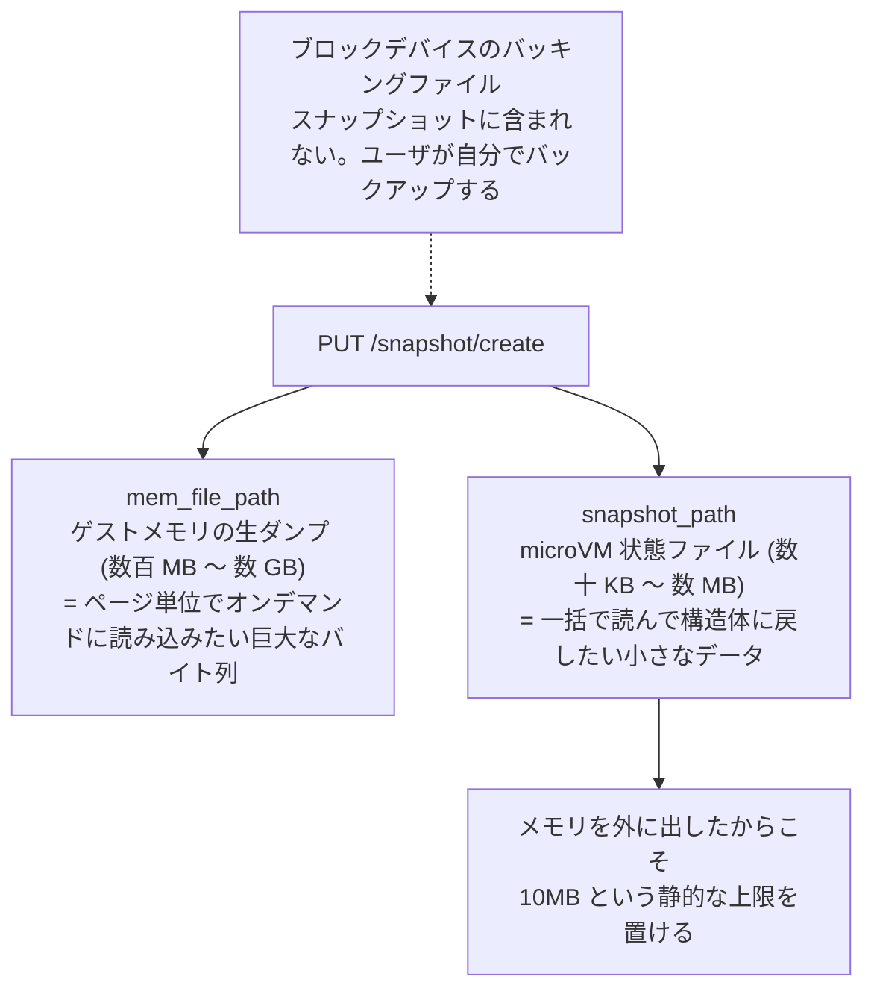
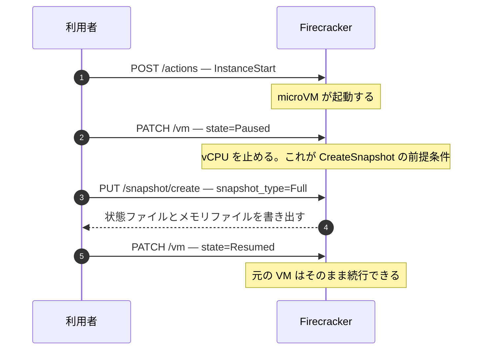
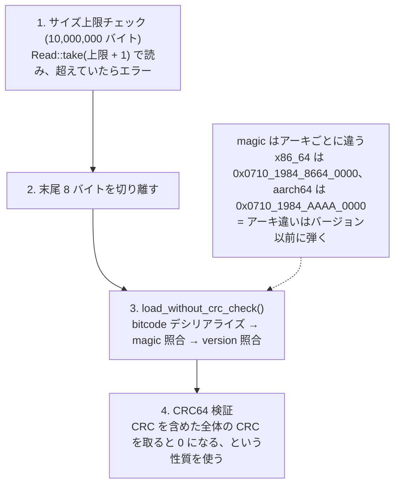

## 何を学んだか

### スナップショットは 2 つのファイルである

Firecracker の「スナップショットを取る」は、動いている microVM を 2 つのファイルに落とすことを指す。



この分割は偶然ではない。**メモリファイルは「ページ単位でオンデマンドに読み込みたい巨大なバイト列」であり、状態ファイルは「一括で読んで構造体に戻したい小さなデータ」である。** 要求が違うので、フォーマットもストレージ戦略も別にしてある。メモリファイル側をどう復元するかは [`../restore-from-file/`](../restore-from-file/) と [`../uffd-handler/`](../uffd-handler/) で扱う。このページは状態ファイル側の話をする。

`docs/snapshotting/versioning.md` は、状態ファイルに入らないものを 2 つ明示している。**シリアルデバイスのエミュレーション状態と vsock のバックエンド**である。前者は端末という外部リソースに繋がっており、後者は Unix ドメインソケットである。どちらもプロセス境界の外にあるので、状態として持ち運べない。

### 状態ファイルのレイアウトは 4 つの欄しかない

```
|-----------------------------|
|       64 bit magic_id       |  アーキ識別子入り
|-----------------------------|
|       version string        |  MAJOR.MINOR.PATCH (semver)
|-----------------------------|
|            State            |  MicrovmState の bitcode blob
|-----------------------------|
|        optional CRC64       |  末尾 8 バイト、生のリトルエンディアン
|-----------------------------|
```

magic は `0x0710_1984_8664_0000`（x86_64）と `0x0710_1984_AAAA_0000`（aarch64）で、下位に `8664` / `AAAA` というアーキの目印が埋まっている。**アーキが違えば復元は絶対に成立しないので、バージョン以前に弾く**という設計である。

### CRC64 は改ざん検知ではない

末尾の CRC64 は「壊れたファイルを黙って読んでしまう」ことを防ぐためのもので、悪意ある書き換えは検知できない。`docs/snapshotting/snapshot-support.md` は次のように書いている。

> It only verifies integrity using a 64-bit CRC value embedded in the vm state file, but this is only a partial measure to protect against accidental corruption, as the disk files and memory file need to be secured as well.

そもそも Firecracker の[脅威モデル](../threat-model/)では、ホストと API 通信とスナップショットファイルは **信頼される側** に置かれている。改ざんを心配するなら、スナップショットを別ホストへ運ぶ経路で認証と暗号化をユーザが自前で付ける、というのが公式の立場である。

### 復元前の DoS 対策はサイズ上限だけ

デシリアライズは `SNAPSHOT_DESERIALIZATION_BYTES_LIMIT`（10,000,000 バイト）を上限にしている。ファイルを丸ごとメモリに読む実装なので、上限がないと巨大なファイルを食わせるだけでメモリを使い切らせられる。`Read::take()` で「上限 + 1 バイト」まで読み、超えていたらエラーにする。

### API から見た形



`CreateSnapshot` の前提条件は「microVM が `Paused` であること」だ。止めずに取ることはできない。`snapshot_type` は `Full` と `Diff` の 2 つで、`Diff` は前回のスナップショット以降に触られたページだけを疎ファイルに書く（[`../diff-snapshot/`](../diff-snapshot/)）。

## ソースコードのどこか

レイアウトはモジュールの doc コメントにそのまま書いてある。[`src/vmm/src/snapshot/mod.rs#L11-L25`](https://github.com/firecracker-microvm/firecracker/blob/cc535f035f3828b2c5bfc85276c5d394022ed220/src/vmm/src/snapshot/mod.rs#L11-L25)。

magic と上限値は定数として並んでいる（[`src/vmm/src/snapshot/mod.rs#L40-L49`](https://github.com/firecracker-microvm/firecracker/blob/cc535f035f3828b2c5bfc85276c5d394022ed220/src/vmm/src/snapshot/mod.rs#L40-L49)）。上限のコメントには「10MB あればどんな正当なスナップショットにも足りる」という見積もりが書かれている。

```rust title="src/vmm/src/snapshot/mod.rs"
#[cfg(target_arch = "x86_64")]
const SNAPSHOT_MAGIC_ID: u64 = 0x0710_1984_8664_0000u64;

#[cfg(target_arch = "aarch64")]
const SNAPSHOT_MAGIC_ID: u64 = 0x0710_1984_AAAA_0000u64;

/// Maximum size in bytes for snapshot deserialization to prevent DOS attacks.
/// Snapshots contain VM state which can be large, but we set a reasonable upper bound.
/// This limit is 10MB which should be sufficient for any legitimate snapshot.
const SNAPSHOT_DESERIALIZATION_BYTES_LIMIT: usize = 10_000_000;
```

中身にあたる `MicrovmState` は [`src/vmm/src/persist.rs#L89-L102`](https://github.com/firecracker-microvm/firecracker/blob/cc535f035f3828b2c5bfc85276c5d394022ed220/src/vmm/src/persist.rs#L89-L102) にある。フィールドは 5 つしかない。

```rust title="src/vmm/src/persist.rs"
pub struct MicrovmState {
    /// Miscellaneous VM info.
    pub vm_info: VmInfo,
    /// KVM KVM state.
    pub kvm_state: KvmState,
    /// VM KVM state.
    pub vm_state: VmState,
    /// Vcpu states.
    pub vcpu_states: Vec<VcpuState>,
    /// Device states.
    pub device_states: DevicesState,
}
```

それぞれ何が入っているかは、型を辿ればすぐ分かる。

- `VmInfo`（[`persist.rs#L49-L62`](https://github.com/firecracker-microvm/firecracker/blob/cc535f035f3828b2c5bfc85276c5d394022ed220/src/vmm/src/persist.rs#L49-L62)）— メモリサイズ、SMT の有無、[CPU テンプレート](../cpu-templates/)、ブートソース設定、[huge page 設定](../hugepages/)。KVM の状態ではなく「どう構成された microVM か」の記録である。
- `KvmState`（[`src/vmm/src/vstate/kvm.rs#L93-L96`](https://github.com/firecracker-microvm/firecracker/blob/cc535f035f3828b2c5bfc85276c5d394022ed220/src/vmm/src/vstate/kvm.rs#L93-L96)）— CPU テンプレートで要求された追加ケーパビリティのリストだけ。
- `VmState`（x86_64 は [`src/vmm/src/arch/x86_64/vm.rs#L240-L252`](https://github.com/firecracker-microvm/firecracker/blob/cc535f035f3828b2c5bfc85276c5d394022ed220/src/vmm/src/arch/x86_64/vm.rs#L240-L252)）— ゲストメモリ領域の記述（`GuestMemoryState`）、リソースアロケータの状態、PIT・PIC マスタ・PIC スレーブ・IOAPIC・kvmclock。**[irqchip](../irqchip-ordering/) の中身がまるごとここに入る。**
- `VcpuState`（[`src/vmm/src/arch/x86_64/vcpu.rs#L794-L817`](https://github.com/firecracker-microvm/firecracker/blob/cc535f035f3828b2c5bfc85276c5d394022ed220/src/vmm/src/arch/x86_64/vcpu.rs#L794-L817)）— CPUID、MSR 群、汎用レジスタ、sregs、LAPIC、xsave、TSC 周波数など。vCPU の数だけ並ぶ。
- `DevicesState`（[`src/vmm/src/device_manager/mod.rs#L605-L614`](https://github.com/firecracker-microvm/firecracker/blob/cc535f035f3828b2c5bfc85276c5d394022ed220/src/vmm/src/device_manager/mod.rs#L605-L614)）— virtio デバイス群、MMIO プラットフォームデバイス、ACPI、シリアル。virtio 側は MMIO トランスポートと PCI トランスポートで別の enum バリアントになっている（[`../mmio-vs-pci/`](../mmio-vs-pci/)）。

ゲストメモリそのものはここに入らない。入るのは `VmState::memory` の「領域の記述」だけである。

保存側の入口は [`src/vmm/src/persist.rs#L168-L202`](https://github.com/firecracker-microvm/firecracker/blob/cc535f035f3828b2c5bfc85276c5d394022ed220/src/vmm/src/persist.rs#L168-L202)。状態ファイル、メモリファイルの順に書く。

```rust title="src/vmm/src/persist.rs"
pub fn create_snapshot(
    vmm: &mut Vmm,
    vm_info: &VmInfo,
    params: &CreateSnapshotParams,
) -> Result<(), CreateSnapshotError> {
    let microvm_state = vmm
        .save_state(vm_info)
        .map_err(CreateSnapshotError::MicrovmState)?;

    snapshot_state_to_file(
        &microvm_state,
        &params.snapshot_path,
        params.sync_snapshot_files,
    )?;
```

`save_state()` の中の順序には固有の理由がある。[`../save-ordering/`](../save-ordering/) で扱う。

CRC の書き方と読み方は対になっている。保存側は `CRC64Writer` でラップしたライタに bitcode をそのまま流し、最後にチェックサムを **生のバイト列として** 書き足す（[`src/vmm/src/snapshot/mod.rs#L217-L229`](https://github.com/firecracker-microvm/firecracker/blob/cc535f035f3828b2c5bfc85276c5d394022ed220/src/vmm/src/snapshot/mod.rs#L217-L229)）。

```rust title="src/vmm/src/snapshot/mod.rs"
    pub fn save<W: Write>(&self, writer: &mut W) -> Result<(), SnapshotError> {
        let mut crc_writer = CRC64Writer::new(writer);
        serialize(self, &mut crc_writer)?;
        // Write the CRC as raw bytes, not bitcode-serialized
        crc_writer
            .writer
            .write_all(&crc_writer.checksum().to_le_bytes())
            .map_err(SnapshotError::Io)
    }
```

読み側は面白い書き方をしている（[`src/vmm/src/snapshot/mod.rs#L203-L213`](https://github.com/firecracker-microvm/firecracker/blob/cc535f035f3828b2c5bfc85276c5d394022ed220/src/vmm/src/snapshot/mod.rs#L203-L213)）。CRC を切り出して比較するのではなく、**CRC を含めた全体の CRC を取ると 0 になる**という CRC の性質を使う。

```rust title="src/vmm/src/snapshot/mod.rs"
        let computed_checksum = crc64(0, buf.as_slice());
        // When we read the entire file, we also read the checksum into the buffer. The CRC has the
        // property that crc(0, buf.as_slice()) == 0 iff the last 8 bytes of buf are the checksum
        // of all the preceding bytes, and this is the property we are using here.
        if computed_checksum != 0 {
            return Err(SnapshotError::Crc64);
        }
```

fsync の非対称性は API 設定の定義そのものにコメントされている（[`src/vmm/src/vmm_config/snapshot.rs#L38-L59`](https://github.com/firecracker-microvm/firecracker/blob/cc535f035f3828b2c5bfc85276c5d394022ed220/src/vmm/src/vmm_config/snapshot.rs#L38-L59)）。

```rust title="src/vmm/src/vmm_config/snapshot.rs"
    /// Whether to fsync the snapshot state and guest memory files.
    /// Activated virtio-block devices are always fsync'd, independently of this.
    #[serde(default = "default_sync_snapshot_files")]
    pub sync_snapshot_files: bool,
```

実装側では、状態ファイル（[`persist.rs#L219-L226`](https://github.com/firecracker-microvm/firecracker/blob/cc535f035f3828b2c5bfc85276c5d394022ed220/src/vmm/src/persist.rs#L219-L226)）もメモリファイル（[`src/vmm/src/vstate/vm.rs#L631-L636`](https://github.com/firecracker-microvm/firecracker/blob/cc535f035f3828b2c5bfc85276c5d394022ed220/src/vmm/src/vstate/vm.rs#L631-L636)）も同じ形で、`flush()` は常に、`sync_all()` はフラグ付きで呼ぶ。

```rust title="src/vmm/src/vstate/vm.rs"
        file.flush()
            .map_err(|err| MemoryBackingFile("flush", err))?;
        if sync_snapshot_files {
            file.sync_all()
                .map_err(|err| MemoryBackingFile("sync_all", err))?;
        }
```

## なぜそうなっているか

### メモリを別ファイルにしたから、10MB という上限が引ける

状態ファイルに `MicrovmState` しか入らないのは、単に構造を綺麗にしたかったからではない。**ゲストメモリを外に出したから、状態ファイルのサイズに「常識的な上限」を置ける**。10MB という定数はその結果として書けるものである。

もしメモリを同じファイルに入れていたら、サイズ上限は「設定されたメモリサイズ + α」になり、動的に決まる値になる。デシリアライズ前にはメモリサイズも読めていないので、鶏と卵になる。分けたことで、フォーマットのパーサは「どんなスナップショットでも 10MB を超えたら不正」と静的に言い切れる。

この上限は後付けである（コミット `369bcdb5c` "fix: Limit amount of memory used during snapshot deserialization"）。

### CRC を semver やマジックと同じ層に置いていない

読み込みの検証は 3 段階に分かれているが、順序が素直ではない（[`src/vmm/src/snapshot/mod.rs#L182-L214`](https://github.com/firecracker-microvm/firecracker/blob/cc535f035f3828b2c5bfc85276c5d394022ed220/src/vmm/src/snapshot/mod.rs#L182-L214)）。



CRC が最後に来る。壊れているかどうかを見る前にデシリアライズしている。順序としては逆に見えるが、`docs/snapshotting/snapshot-support.md` は「CRC の計算はスナップショットをロードしようとする前に検証される」と書いており、ここでの `load()` の戻り値を使う前には CRC が通っていることが保証される。デシリアライズの失敗はそれ自体がエラーになるので、実害は出ない構造になっている。

### fsync のデフォルトが true で、ブロックデバイスだけ例外

`sync_snapshot_files` のデフォルトは `true` である。デフォルトを安全側に置き、速度が欲しい人だけ落とす、という選択になっている。ドキュメントは false にした場合の意味を「ホストクラッシュへの耐性だけを失う。同一ホストからの読み出しはページキャッシュ経由で完全な内容が見える」と説明している。パイプラインでこの後さらにスナップショットを加工する、といった用途を想定している。

一方、**ブロックデバイスのバッキングファイルは常に fsync される**。これは非対称だが理由がある。ブロックデバイスのバッキングファイルは Firecracker が生成したファイルではなく、**ゲストが書き込んだデータが乗っている外部リソース**であり、スナップショットの一部として扱われていない（ユーザ管理）。しかもゲストの視点では、スナップショットを取った瞬間より前に完了したはずの書き込みが飛ぶと、ファイルシステムの一貫性が壊れる。ここは速度と引き換えにできない。実装上は、ブロックデバイスの `prepare_save()` が保存処理の一部として drain と flush をやっている（[`../save-ordering/`](../save-ordering/)）。

## どう活かすか

### 「大きくて mmap したいもの」と「小さくて構造化したいもの」を分ける

永続化する状態が「巨大なバイト列」と「型のある小さなメタデータ」の両方を含むなら、同じファイルに詰めない。分けることで得られるものが 3 つある。

- メタデータ側にサイズ上限を置ける（不正入力への防御が静的に書ける）。
- バイト列側を mmap や sendfile で扱える。フォーマットを解釈せずにコピー・共有できる。
- バイト列側だけ差分化・リベースといった別の道具で操作できる（[`../snapshot-rebase/`](../snapshot-rebase/)）。

逆に、単一ファイルにまとめる価値があるのは「配布物として 1 個のほうが運用しやすい」場合だ。Firecracker は「同じベースメモリファイルを複数の microVM で共有する」ことを最初から狙っているので、この選択にはならない。

### チェックサムの役割を仕様として書く

CRC を付けると、読む人は「これで改ざんも防げる」と思いがちである。Firecracker はドキュメントで "this is only a partial measure to protect against accidental corruption" と明記し、脅威モデルの側でも「スナップショットファイルは信頼される」と宣言している。**チェックサムを入れるなら、何を守っていて何を守っていないかを同じ場所に書く。** 書いていないと、上の層が誤った前提で設計される。

暗号学的な完全性が要るなら CRC ではなく MAC が要り、鍵管理が要る。Firecracker はそれをユーザ側の責務として押し出した。自前のシステムでも、この線引きをどちらに引くかを明示的に決めたほうがよい。

### デシリアライズの前にバイト数で殴る

serde 系のデシリアライザは、入力が信頼できない場合、長さフィールドを信じて巨大なアロケーションをすることがある。`Read::take(LIMIT + 1)` で読み、超過を検出してから渡す、というのは実装コストがほぼゼロで効く。**上限値が「静的に決められる」構造になっているかどうかが、この手が使えるかの分かれ目である。**

なお、この防御が意味を持つのは「入力が完全には信頼できない」場合に限る。Firecracker の脅威モデルではスナップショットは信頼される側なので、この上限は多層防御の一枚目という位置づけになる。信頼境界の内側にしか入力がないなら、上限を入れる価値は薄い。
