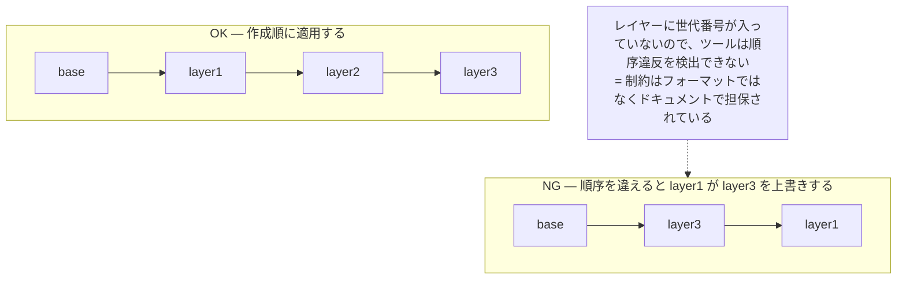
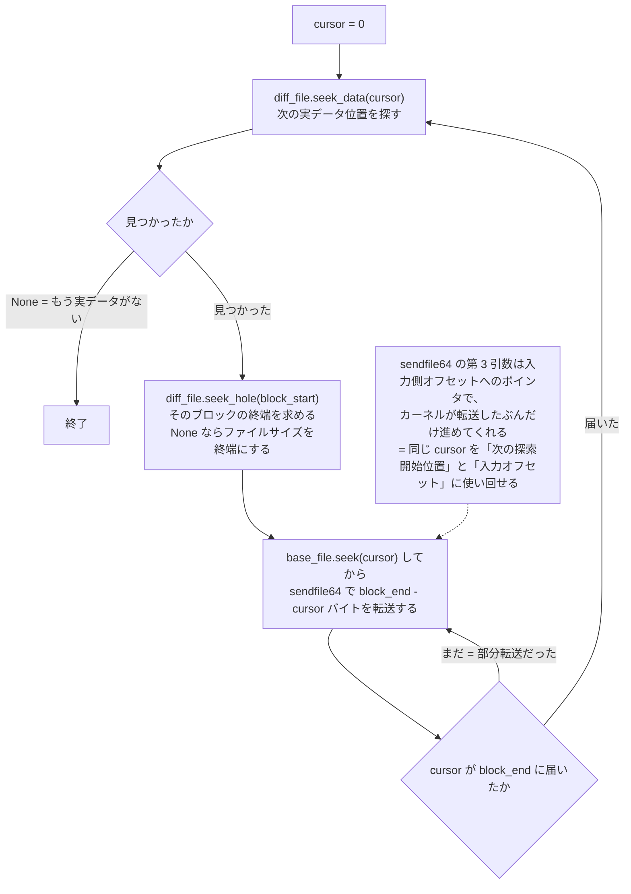

## 何を学んだか

### 差分スナップショットには「フォーマット」がない

[差分スナップショット](../diff-snapshot/) が出力するメモリファイルは、ベースと同じ全体サイズを持つ **スパースファイル** である。dirty なページの位置にはデータが書かれ、それ以外はホール（ファイルシステム上でブロックが割り当てられていない領域）になっている。

つまり「どのオフセットが有効か」を記述するメタデータが存在しない。ヘッダもインデックスもチャンクリストもない。その情報はファイルシステムが持っている。

```
 ベース (full):    [==================================================]
 レイヤー1 (diff): ....[====]........[==]...........................
 レイヤー2 (diff): ..........[==]........[========]..................
                       ↑ ここだけ実データ、他はホール
```

合成 (rebase) は「レイヤーの実データ領域だけをベースの同じオフセットへ上書きコピーする」操作になる。実データ領域の列挙には `lseek(2)` の `SEEK_DATA` / `SEEK_HOLE` を使い、コピーには `sendfile64` を使う。カーネルのページキャッシュ内で完結するので、ユーザ空間へのバッファコピーが入らない。

### レイヤーは作成順に適用しなければならない

同じページが複数のレイヤーで dirty になっていれば、後のレイヤーの内容が正しい。rebase は単純な上書きなので、順序を間違えれば古い内容が新しい内容を潰す。ドキュメントもこれを明記している。



そして「最後に載せたレイヤーと同じ `/snapshot/create` 呼び出しで作られた VM 状態ファイル」を使う必要がある。メモリファイルと状態ファイルは別々に生成されるので、両者の対応は利用者が守る前提になっている。

### 同じ実装が 2 箇所に残っている

`snapshot-editor edit-memory rebase` と、非推奨の `rebase-snap` バイナリの 2 つが同じ処理を持つ。ループの構造・`sendfile64` の呼び方・カーソルの進め方まで一致しており、違いは (1) 引数パーサ（`clap` か自前の `arg_parser` か）、(2) エラー型の名前、(3) `u64` → `usize` 変換のヘルパ、そして (4) `rebase-snap` が起動時に非推奨メッセージを標準出力へ出すこと、だけである。

## ソースコードのどこか

`snapshot-editor` 側の rebase。外側のループがレイヤーの実データブロックを列挙し、内側のループがそのブロックを転送し切るまで `sendfile64` を繰り返す。

```rust title="src/snapshot-editor/src/edit_memory.rs"
    let mut cursor: u64 = 0;
    while let Some(block_start) = diff_file
        .seek_data(cursor)
        .map_err(EditMemoryError::SeekDataDiff)?
    {
        cursor = block_start;
        let block_end = match diff_file
            .seek_hole(block_start)
            .map_err(EditMemoryError::SeekHoleDiff)?
        {
            Some(hole_start) => hole_start,
            None => diff_file
                .metadata()
                .map_err(EditMemoryError::MetadataDiff)?
                .len(),
        };

        while cursor < block_end {
            base_file
                .seek(SeekFrom::Start(cursor))
                .map_err(EditMemoryError::SeekMemory)?;

            // SAFETY: Safe because the parameters are valid.
            let num_transferred_bytes = unsafe {
                libc::sendfile64(
                    base_file.as_raw_fd(),
                    diff_file.as_raw_fd(),
                    (&mut cursor as *mut u64).cast::<i64>(),
                    u64_to_usize(block_end.saturating_sub(cursor)),
                )
            };
```

[`src/snapshot-editor/src/edit_memory.rs#L54-L103`](https://github.com/firecracker-microvm/firecracker/blob/cc535f035f3828b2c5bfc85276c5d394022ed220/src/snapshot-editor/src/edit_memory.rs#L54-L103)

注目すべきは `cursor` の扱いだ。`sendfile64` の第 3 引数は入力側オフセットへのポインタで、カーネルが転送したぶんだけ進めてくれる。だから同じ変数を「次に `seek_data` を始める位置」と「入力オフセット」の両方に使い回せる。ホールに当たったら `seek_data` が次のデータ位置まで飛ばすので、ホールは自動的にスキップされる。`seek_hole` が `None` を返す（＝末尾までデータが続く）場合はファイルサイズを終端に使う。



非推奨の `rebase-snap` にある同名関数。

```rust title="src/rebase-snap/src/main.rs"
fn rebase(base_file: &mut File, diff_file: &mut File) -> Result<(), FileError> {
    let mut cursor: u64 = 0;
    while let Some(block_start) = diff_file.seek_data(cursor).map_err(FileError::SeekData)? {
```

[`src/rebase-snap/src/main.rs#L81-L114`](https://github.com/firecracker-microvm/firecracker/blob/cc535f035f3828b2c5bfc85276c5d394022ed220/src/rebase-snap/src/main.rs#L81-L114)

非推奨は起動時のメッセージとして表現されている。バイナリ自体はワークスペースに残り、ビルドもされる。

```rust title="src/rebase-snap/src/main.rs"
const DEPRECATION_MSG: &str = "This tool is deprecated and will be removed in the future. Please \
                               use 'snapshot-editor' instead.\n";
```

[`src/rebase-snap/src/main.rs#L15-L16`](https://github.com/firecracker-microvm/firecracker/blob/cc535f035f3828b2c5bfc85276c5d394022ed220/src/rebase-snap/src/main.rs#L15-L16)

`snapshot-editor` は rebase 以外に、VM 状態ファイルを読むためのサブコマンドを持つ。`info-vmstate version` はスナップショットのフォーマットバージョンを、`vcpu-states` は vCPU 状態を、`vm-state` は `MicrovmState` 全体を Rust の `{:#?}` でダンプする。

```rust title="src/snapshot-editor/src/info.rs"
fn info_vmstate(snapshot: &Snapshot<MicrovmState>) -> Result<(), InfoVmStateError> {
    println!("{:#?}", snapshot.data);
    Ok(())
}
```

[`src/snapshot-editor/src/info.rs#L18-L76`](https://github.com/firecracker-microvm/firecracker/blob/cc535f035f3828b2c5bfc85276c5d394022ed220/src/snapshot-editor/src/info.rs#L18-L76)

ドキュメントはこれを「2 つのスナップショットの vmstate を比較しやすくするため」と説明している。`edit-vmstate remove-regs` は aarch64 専用で、x86_64 ビルドでは `#[cfg]` ごと消える（[`src/snapshot-editor/src/main.rs#L36-L44`](https://github.com/firecracker-microvm/firecracker/blob/cc535f035f3828b2c5bfc85276c5d394022ed220/src/snapshot-editor/src/main.rs#L36-L44)）。

ホールとゼロ埋めの区別は、テストが明示的に押さえている。

```rust title="src/snapshot-editor/src/edit_memory.rs"
            // 3. Populated block in base file, zeroes block in diff file
            // block:     [ ] [ ] [ ]
            // diff:      [ ] ___ [0]
            // expected:  [d] [b] [d]
```

[`src/snapshot-editor/src/edit_memory.rs#L180-L257`](https://github.com/firecracker-microvm/firecracker/blob/cc535f035f3828b2c5bfc85276c5d394022ed220/src/snapshot-editor/src/edit_memory.rs#L180-L257)

「ホール（差分なし）」ならベースの内容を残し、「ゼロで埋められたブロック（ゲストが実際にゼロを書いた）」ならゼロを適用する。この 2 つは意味が違い、実装はファイルシステムのホール情報だけでそれを区別している。同じテストの冒頭には `The filesystem punches holes only for blocks >= 4096.` というコメントがあり、ホールの粒度がファイルシステム依存であることも記録されている。

## なぜそうなっているか

**独自の差分フォーマットを作らない選択が先にある。** [差分スナップショット](../diff-snapshot/) の書き出し側は、dirty ページを書いて clean ページを `seek` で飛ばすだけだった。この時点で「有効領域の記述」はファイルシステムのホール情報に委譲されている。合成側もその表現をそのまま読めばよいので、ツールは 50 行のループで済む。ヘッダのパースもバージョン管理も要らない。

**結果として rebase はスナップショットの内容を一切理解しない。** ページサイズもメモリ領域の配置もゲスト構成も見ない。単なる「スパースファイル A の実データを B の同じオフセットへ書く」汎用処理になっている。だからこそ `rebase-snap` と `snapshot-editor` で実装が完全に重複していても実害が出ず、非推奨のまま放置できている、とも言える（推測だが、ロジックが単純で変更頻度がゼロに近いことが、削除を急がない理由になっているように見える）。

**順序制約はフォーマットではなくドキュメントで担保されている。** レイヤーに世代番号が入っていないので、ツールは順序違反を検出できない。

> The order in which the snapshots were created matters and they should be merged in the same order in which they were created.
>
> — [docs/snapshotting/snapshot-support.md](https://github.com/firecracker-microvm/firecracker/blob/cc535f035f3828b2c5bfc85276c5d394022ed220/docs/snapshotting/snapshot-support.md#L221-L223)

同じ節は「diff スナップショットは一般に単体では resume できず、ベースと合成する必要がある」「ただし起動直後の VM の diff は例外的にそのまま resume できる」とも書いている。後者は、起動直後ならベースが全ゼロのメモリと等価だからだ。

**`sendfile` を使う理由はコードには書かれていない。** ページキャッシュ間でのコピーになりユーザ空間バッファを経由しないという性質から選ばれたと考えるのが自然だが、これは推測である。事実として言えるのは、両実装が `read`/`write` ループではなく `sendfile64` を選んでいること、そして戻り値が負のときだけエラーにして、部分転送は外側ループで再試行していることだ。

## どう活かすか

**「OS の機能をフォーマットの代わりに使う」判断は、対象が単一ホスト内で完結するときに効く。** スパースファイルは、ファイルの意味を知らないツールでもホール情報を保てる限り正しく扱える。ヘッダを持たないので、破損検出も互換性チェックも不要になる。差分を「同サイズのスパースファイル」として表現できるユースケース（メモリイメージ、ディスクイメージ、固定長レコードの列）なら、独自フォーマットを設計する前に検討する価値がある。

**限界は明確で、主に 3 つある。**

1. **ファイルシステム依存。** ホールの粒度はブロックサイズに縛られる。テストが 4096 未満のブロックサイズを試さないのはそのためだ。また `SEEK_DATA` は POSIX 上「データを保守的に報告してよい」ので、ホールをデータとして返すファイルシステムでも正しさは保たれるが、転送量は増える。
2. **転送でホールが失われる。** `cp` や `tar` をスパース対応なしで通すと、ホールがゼロブロックとして実体化する。すると rebase は「ベースの内容を残すべき領域」をゼロで上書きしてしまい、**サイレントにゲストメモリを壊す**。差分ファイルを別ホストへ運ぶなら、スパース性を保つ転送手段（`rsync -S`、`cp --sparse=always`、あるいは自前のフォーマットへの再パック）が必須になる。
3. **ゼロ書き込みとホールを区別できるのはファイルシステムだけ。** ゲストが実際にゼロを書いたページはデータブロックとして残す必要がある。逆に、ファイルシステムやツールが「全ゼロのブロックをホールへ潰す」最適化をすると、その区別が消える。

**取り込むべきでないのは、差分レイヤーがネットワークやオブジェクトストレージを越える場合。** S3 のようなオブジェクトストアにはホールの概念がなく、スパース性は転送の時点で失われる。この場合は結局「有効領域の範囲リスト」を明示的に持つフォーマットが必要になり、スパースファイルに載せた利点は消える。Firecracker の rebase は、差分がローカルディスク上で完結し、合成もローカルで行われる運用を前提にした設計だと理解しておくとよい。
