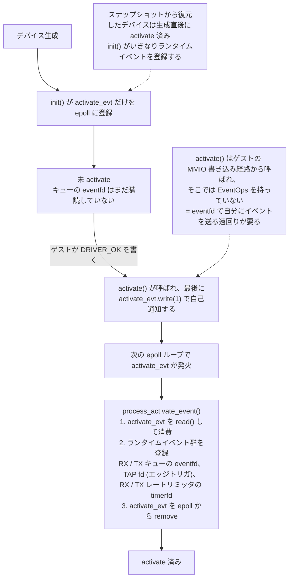
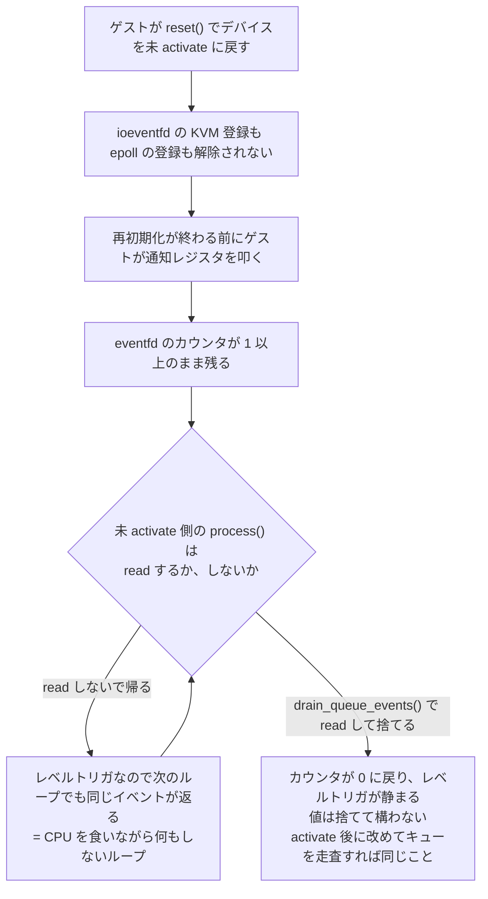

## 何を学んだか

### VMM スレッドは 1 本の epoll ループ

Firecracker の VMM スレッドは、`event-manager` クレート(rust-vmm 製、`event-manager = "0.4.2"`)の `EventManager` を回し続けるだけの構造をしている。

```rust title="src/firecracker/src/main.rs"
    // Run the EventManager that drives everything in the microVM.
    loop {
        event_manager
            .run()
            .expect("Failed to start the event manager");
```

[`src/firecracker/src/main.rs#L670-L681`](https://github.com/firecracker-microvm/firecracker/blob/cc535f035f3828b2c5bfc85276c5d394022ed220/src/firecracker/src/main.rs#L670-L681)

`EventManager` は内部に epoll fd を 1 つ持ち、登録された「購読者(subscriber)」に発火した fd を配る。購読者は `MutEventSubscriber` トレイトを実装した型で、`init()` で自分が監視したい fd を登録し、`process()` で発火を処理する。Firecracker では購読者の型が固定されていないので、`Arc<Mutex<dyn MutEventSubscriber>>` として扱う。

```rust title="src/vmm/src/lib.rs"
/// Shorthand type for the EventManager flavour used by Firecracker.
pub type EventManager = BaseEventManager<Arc<Mutex<dyn MutEventSubscriber>>>;
```

[`src/vmm/src/lib.rs#L170-L171`](https://github.com/firecracker-microvm/firecracker/blob/cc535f035f3828b2c5bfc85276c5d394022ed220/src/vmm/src/lib.rs#L170-L171)

virtio デバイスだけでなく、シリアルコンソール、メトリクス書き出し、API サーバのアダプタ、そして `Vmm` 自身も購読者である。`Vmm` は vCPU スレッドからの終了通知 eventfd を監視し、それが発火したら microVM を停止する。

```rust title="src/vmm/src/lib.rs"
impl MutEventSubscriber for Vmm {
    /// Handle a read event (EPOLLIN).
    fn process(&mut self, event: Events, _: &mut EventOps) {
```

[`src/vmm/src/lib.rs#L789-L838`](https://github.com/firecracker-microvm/firecracker/blob/cc535f035f3828b2c5bfc85276c5d394022ed220/src/vmm/src/lib.rs#L789-L838)。VMM スレッドで起きることはすべてこの 1 本の epoll に集約されており、ワーカスレッドプールもタスクランタイムも存在しない。

### activate の前後で購読対象を入れ替える

virtio デバイスには「まだゲストのドライバに設定されていない」状態がある([デバイス状態の型付け](../device-state-typing/))。デバイスは microVM 起動前に生成されるが、ゲストメモリのアドレスも virtqueue の位置も、ゲストのドライバが device status に DRIVER_OK を書くまで確定しない。それまでキューの eventfd を監視しても、処理できるものは何もない。

そこで Firecracker は、購読するイベントを 2 段階に分ける。



virtio-net の場合の登録内容がこれである。

```rust title="src/vmm/src/devices/virtio/net/event_handler.rs"
    fn register_runtime_events(&self, ops: &mut EventOps) {
        if let Err(err) = ops.add(Events::with_data(
            &self.queue_evts[RX_INDEX],
            Self::PROCESS_VIRTQ_RX,
            EventSet::IN,
        )) {
```

[`src/vmm/src/devices/virtio/net/event_handler.rs#L20-L56`](https://github.com/firecracker-microvm/firecracker/blob/cc535f035f3828b2c5bfc85276c5d394022ed220/src/vmm/src/devices/virtio/net/event_handler.rs#L20-L56)

`Events::with_data` の第 2 引数は epoll の `u64` データ欄に載る識別子で、`Net` は 0〜5 の定数を割り当てている。`process()` はこの数値で分岐するので、fd を比較する必要がない。

自己通知は `activate()` の末尾で行われる。

```rust title="src/vmm/src/devices/virtio/net/device.rs"
        if self.activate_evt.write(1).is_err() {
            self.metrics.activate_fails.inc();
            return Err(ActivateError::EventFd);
        }
        self.device_state = DeviceState::Activated(ActiveState { mem, interrupt });
```

[`src/vmm/src/devices/virtio/net/device.rs#L1071-L1076`](https://github.com/firecracker-microvm/firecracker/blob/cc535f035f3828b2c5bfc85276c5d394022ed220/src/vmm/src/devices/virtio/net/device.rs#L1071-L1076)

`activate()` はゲストの MMIO 書き込みを処理する経路から呼ばれる。そのとき呼び出し側はデバイスの `Mutex` を握っており、`EventOps` を持っていない。epoll への登録は `EventManager` がイベントを配るときにしか渡されない `&mut EventOps` 経由でしかできないので、「eventfd を叩いて自分にイベントを送り、次のループで `EventOps` を受け取ってから登録する」という遠回りをしている。

## ソースコードのどこか

`process()` の全体像を見ると、activate 済みかどうかで完全に分岐しているのが分かる。

```rust title="src/vmm/src/devices/virtio/net/event_handler.rs"
        if self.is_activated() {
            match source {
                Self::PROCESS_ACTIVATE => self.process_activate_event(ops),
                Self::PROCESS_VIRTQ_RX => self.process_rx_queue_event(),
                ...
            }
        } else {
            warn!(
                "Net: The device is not yet activated. Spurious event received: {:?}",
                source
            );
            match source {
                Self::PROCESS_VIRTQ_RX | Self::PROCESS_VIRTQ_TX => self.drain_queue_events(),
                Self::PROCESS_RX_RATE_LIMITER => {
                    let _ = self.rx_rate_limiter.event_handler();
                }
                Self::PROCESS_TX_RATE_LIMITER => {
                    let _ = self.tx_rate_limiter.event_handler();
                }
                _ => (),
            }
        }
```

[`src/vmm/src/devices/virtio/net/event_handler.rs#L99-L127`](https://github.com/firecracker-microvm/firecracker/blob/cc535f035f3828b2c5bfc85276c5d394022ed220/src/vmm/src/devices/virtio/net/event_handler.rs#L99-L127)

未 activate 側の `else` 節が本題だ。ここでやっているのは処理ではなく**読み捨て**である。`drain_queue_events` は全キューの eventfd を read するだけの共通ヘルパで、`VirtioDevice` トレイトのデフォルト実装として置かれている。

```rust title="src/vmm/src/devices/virtio/device.rs"
    /// Drain all queue notification eventfds, discarding any pending
    /// notifications. This is used if a notification arrives while a device
    /// is being reset and before it's activated again.
    fn drain_queue_events(&self) {
        for event in self.queue_events() {
            let _ = event.read();
        }
    }
```

[`src/vmm/src/devices/virtio/device.rs#L242-L249`](https://github.com/firecracker-microvm/firecracker/blob/cc535f035f3828b2c5bfc85276c5d394022ed220/src/vmm/src/devices/virtio/device.rs#L242-L249)

`init()` が 3 通りの入口を想定している点も重要だ。

```rust title="src/vmm/src/devices/virtio/net/event_handler.rs"
    fn init(&mut self, ops: &mut EventOps) {
        // This function can be called during different points in the device lifetime:
        //  - shortly after device creation,
        //  - on device activation (is-activated already true at this point),
        //  - on device restore from snapshot.
        if self.is_activated() {
            self.register_runtime_events(ops);
        } else {
            self.register_activate_event(ops);
        }
    }
```

[`src/vmm/src/devices/virtio/net/event_handler.rs#L130-L140`](https://github.com/firecracker-microvm/firecracker/blob/cc535f035f3828b2c5bfc85276c5d394022ed220/src/vmm/src/devices/virtio/net/event_handler.rs#L130-L140)

スナップショットから復元したデバイスは、生成直後にもう activate 済みである。その場合は `activate_evt` を経由せず、`init()` の時点で直接ランタイムイベントを登録する。同じ `init()` が「起動時」と「復元時」の両方を捌く。

### TAP だけがエッジトリガ

登録の中で 1 つだけフラグが違う。

```rust title="src/vmm/src/devices/virtio/net/event_handler.rs"
        if let Err(err) = ops.add(Events::with_data(
            &self.tap,
            Self::PROCESS_TAP_RX,
            EventSet::IN | EventSet::EDGE_TRIGGERED,
        )) {
```

[`src/vmm/src/devices/virtio/net/event_handler.rs#L49-L55`](https://github.com/firecracker-microvm/firecracker/blob/cc535f035f3828b2c5bfc85276c5d394022ed220/src/vmm/src/devices/virtio/net/event_handler.rs#L49-L55)

キューの eventfd とレートリミッタの timerfd は `EventSet::IN` だけ、つまり epoll のデフォルトであるレベルトリガである。TAP fd だけが `EDGE_TRIGGERED` を足している。

TAP からのフレーム読み出しはゲストが RX バッファを供給できているかどうかに左右される。バッファが足りなければ Firecracker は TAP を読まずに処理を打ち切り、ゲストが RX キューに新しいチェーンを積んだ時点(= RX キューの eventfd 発火)で再開する([`process_rx_queue_event` / `process_tap_rx_event`](https://github.com/firecracker-microvm/firecracker/blob/cc535f035f3828b2c5bfc85276c5d394022ed220/src/vmm/src/devices/virtio/net/device.rs#L890-L924))。レベルトリガのままだと、TAP にデータが残っている間ずっと epoll が発火し続け、そのたびに「バッファがないので何もしない」という処理が回る。エッジトリガなら「新しくデータが届いた瞬間」にしか発火しないので、この空回りが起きない。レートリミッタでブロックされている間も同じ理屈が効く。

## なぜそうなっているか

読み捨ての理由は、この処理を追加したコミットのメッセージに直接書かれている(`9f6c3b802 virtio: Consume eventfds while the device is deactivated`)。

> The notification eventfds stay registered with the event manager and with KVM across a device reset. As a result a notification that arrives while the device is deactivated - for example a guest ringing a doorbell during the reset/re-init window - would be reported by the event manager over and over, spinning the event loop until the device is activated again.
>
> Drain the queue (and other) events in the not-activated branch of each device's event handler so the pending state is cleared and the spurious notification is discarded.

要点は 2 つある。

**1 つ目。eventfd は KVM 側にも登録されている。** virtio-mmio の通知レジスタへの書き込みは、ioeventfd として KVM に登録されており、ゲストが書き込むと VM exit すら起こさずに eventfd がカウントアップされる。

```rust title="src/vmm/src/device_manager/mmio.rs"
            for (i, queue_evt) in locked_device.queue_events().iter().enumerate() {
                let io_addr = IoEventAddress::Mmio(
                    device.resources.addr + u64::from(crate::devices::virtio::NOTIFY_REG_OFFSET),
                );
                vm.fd()
                    .register_ioevent(queue_evt, &io_addr, u32::try_from(i).unwrap())
```

[`src/vmm/src/device_manager/mmio.rs#L204-L211`](https://github.com/firecracker-microvm/firecracker/blob/cc535f035f3828b2c5bfc85276c5d394022ed220/src/vmm/src/device_manager/mmio.rs#L204-L211)

この登録はデバイスのリセットでは解除されない。MMIO トランスポートの `reset()` にもその旨のコメントがある。

```rust title="src/vmm/src/devices/virtio/transport/mmio.rs"
        // . Keep interrupt_evt and queue_evts as is. There may be pending notifications in those
        //   eventfds, but nothing will happen other than supurious wakeups.
```

[`src/vmm/src/devices/virtio/transport/mmio.rs#L144-L156`](https://github.com/firecracker-microvm/firecracker/blob/cc535f035f3828b2c5bfc85276c5d394022ed220/src/vmm/src/devices/virtio/transport/mmio.rs#L144-L156)

つまり、ゲストが `reset()` でデバイスを未 activate に戻したあと(`VirtioDevice::reset` は `deactivate()` を呼んで `DeviceState::Inactive` にする。[`device.rs#L200-L212`](https://github.com/firecracker-microvm/firecracker/blob/cc535f035f3828b2c5bfc85276c5d394022ed220/src/vmm/src/devices/virtio/device.rs#L200-L212))、再初期化が終わる前に通知レジスタを叩くと、eventfd にカウントが残る。

**2 つ目。eventfd はレベルトリガである。** epoll のデフォルトはレベルトリガなので、eventfd のカウンタが 0 でない限り `epoll_wait` は毎回それを返す。`process()` が read せずに帰れば、次のループでまた同じイベントが返る。CPU を 100% 食いながら何もしないループになる。実際にはデバイスが再び activate されるまでこれが続く。

`let _ = event.read();` の 1 行はこれを断ち切っている。読めばカウンタが 0 に戻り、レベルトリガは静まる。値そのものは捨てて構わない。未 activate なのだから処理できるものは何もなく、activate されたときに改めてキューを走査すれば同じことだからだ。レートリミッタの timerfd に対して `event_handler()` を呼んでいるのも同じ意図で、timerfd を read してタイマの発火状態を解消している([レートリミッタ](../rate-limiter/)は `AsRawFd` を実装しているので、デバイスから見れば他の fd と区別がない)。



この修正は net だけでなく block / balloon / vsock / pmem / rng / mem の各 event_handler に一斉に入っている。全デバイス共通の穴だったということである。

`activate_evt` を activate 後に epoll から外す理由も同じ系統だ。用が済んだ fd を登録したままにしても発火することはないが、`process()` の分岐に「activate 済みなのに PROCESS_ACTIVATE が来た」というあり得ない経路が残り続ける。実際、vhost-user block の event_handler ではその経路が `warn!` になっている([`block/vhost_user/event_handler.rs#L52-L57`](https://github.com/firecracker-microvm/firecracker/blob/cc535f035f3828b2c5bfc85276c5d394022ed220/src/vmm/src/devices/virtio/block/vhost_user/event_handler.rs#L52-L57))。状態が変わったら購読対象も変える、という規律を守ることで、ハンドラの各分岐が「その状態でだけ起こりうること」に対応する。

テストも「activate 前はイベントが配られない」ことを直接検証している。

```rust title="src/vmm/src/devices/virtio/net/event_handler.rs"
        // Manually force a queue event and check it's ignored pre-activation.
        th.net().queue_evts[TX_INDEX].write(1).unwrap();
        let ev_count = th.event_manager.run_with_timeout(50).unwrap();
        assert_eq!(ev_count, 0);
        // Validate there was no queue operation.
        assert_eq!(th.txq.used.idx.get(), 0);
```

[`src/vmm/src/devices/virtio/net/event_handler.rs#L150-L178`](https://github.com/firecracker-microvm/firecracker/blob/cc535f035f3828b2c5bfc85276c5d394022ed220/src/vmm/src/devices/virtio/net/event_handler.rs#L150-L178)。`activate_evt` しか登録していないので、キューの eventfd を叩いても `run()` は 0 件を返す。activate 後に同じイベントが処理され、used ring が進むところまで確認している。

## どう活かすか

**まず、レベルトリガの fd を「処理しないで帰る」経路を作ってはいけない。** これは epoll を使う全てのコードに効く教訓である。イベントループが 100% CPU を食う不具合の相当数がこの形をしている。「この状態では処理できないので何もせず return する」というコードを書いたら、その fd がレベルトリガかどうかを必ず確認する。レベルトリガなら、処理しない場合でも読み捨てが要る。

読み捨てが安全かどうかは、その通知の意味に依存する。virtio の doorbell は「キューに何かある」というヒントに過ぎず、いつキューを見に行くかは実装の自由なので捨ててよい。逆に、通知そのものにデータが乗っている(1 回の通知が 1 件のイベントに対応する)設計なら捨ててはいけない。捨てられるのは「通知が冪等なヒントであるとき」だけだ、と切り分けて考える。

**次に、状態遷移に合わせて購読対象を入れ替えるパターン。** 「全部登録しておいて、ハンドラの先頭で状態を見て弾く」ほうが実装は簡単だ。しかし Firecracker は登録自体を切り替えている。得られるのは、(a) 未 activate の間は epoll がそもそも起きない、(b) ハンドラの各分岐がその状態で起こりうる事象だけに対応する、の 2 点である。状態が 2〜3 個で、状態ごとに監視対象がはっきり分かれる場合には割に合う。状態が多い、あるいは状態ごとの監視対象の差が小さい場合は、登録の付け外しがそれ自体バグの温床になるので素直に弾いたほうがよい。

**自己通知用の eventfd を 1 本持つ、という手も覚えておく価値がある。** 「登録操作はイベントループの中でしかできないが、登録したいのはループの外」という制約は、epoll を使う設計で頻出する。Firecracker の `activate_evt` は、ループ外からループ内へ制御を渡すための最小の仕掛けだ。同じことはチャネル + 起床用 eventfd でもできるが、渡す情報が「起きろ」だけなら eventfd 1 本で足りる。

一方、この構成を取り込むべきでない場面もある。Firecracker が単一 epoll ループで完結できるのは、**デバイス数が十数個で固定**であり、**1 つのハンドラが長時間ブロックしない**(ブロック I/O は io_uring または別スレッドに逃がしている)からだ。ハンドラの中で同期的にディスクを待つような設計では、1 デバイスの遅延が microVM 全体を止める。単一スレッドのイベントループは、そこに載せるものすべてが「短時間で返る」ことを前提にして初めて成立する。
