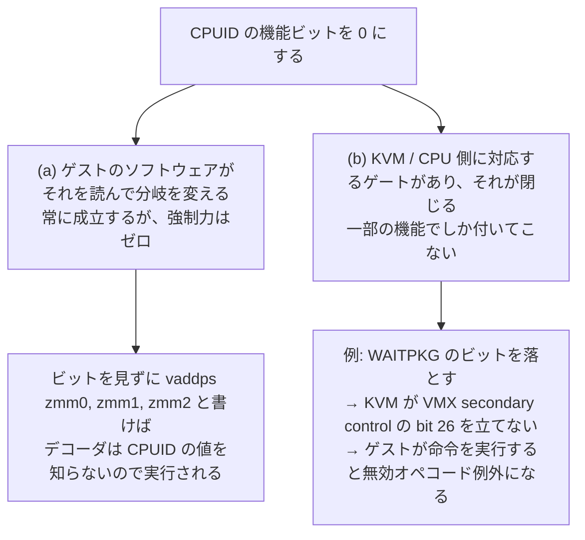
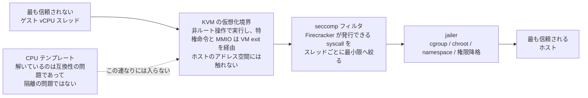

## 何を学んだか

[CPU テンプレート](../cpu-templates/) はゲストに見せる CPUID を書き換えられる。AVX-512 のビットを落とせば、ゲストの `/proc/cpuinfo` から `avx512f` が消える。これを見て「悪意あるゲストに AVX-512 を使わせない仕組み」だと理解すると、間違える。

Firecracker のドキュメントは、機能の説明の 3 段落目でそれを打ち消している。

> CPU templates shall not be used as a security protection against malicious guests. Disabling a feature in a CPU template does not generally make it completely unavailable to the guest. For example, disabling a feature related to an instruction set will indicate to the guest that the feature is not supported, but the guest may still be able to execute corresponding instructions if it does not obey the feature bit.
> ([docs/cpu_templates/cpu-templates.md#L23-L30](https://github.com/firecracker-microvm/firecracker/blob/cc535f035f3828b2c5bfc85276c5d394022ed220/docs/cpu_templates/cpu-templates.md#L23-L30))

"if it does not obey the feature bit" — **機能ビットに従わないゲストには効かない**。

### CPUID は宣言であって、ゲートではない

CPUID は命令だ。ゲストが `cpuid` を実行すると VM exit が起き、KVM が Firecracker の設定した値を返す。それだけのことで、CPU の命令デコーダはこの値を参照しない。

```
[ゲストのコード]

  eax = cpuid(0x7).ebx
  if (eax & (1 << 16)) {      ← AVX512F ビットの確認。Firecracker が 0 にした
      use_avx512_path();       ← ここには来ない
  } else {
      use_sse_path();
  }

                    ↑ ここまでは、ビットを消すと確かに挙動が変わる

  vaddps zmm0, zmm1, zmm2     ← CPUID を見ずに直接書いたら?
                                 → デコーダは CPUID の値を知らない。実行される。
```

CPUID を消すことで止まるのは、**CPUID を読んで分岐するコード**だけだ。テンプレートが変えているのはゲストへの自己申告であって、CPU の能力そのものではない。

スナップショットのドキュメントも同じことを別の角度から書いている。"guest workloads can still execute instructions that are being masked by CPUID and restoring and saving of such workloads will lead to undefined result." ([docs/snapshotting/versioning.md#L134-L136](https://github.com/firecracker-microvm/firecracker/blob/cc535f035f3828b2c5bfc85276c5d394022ed220/docs/snapshotting/versioning.md#L134-L136))。テンプレートが提供するのは互換性の**約束**であって、約束を守らないゲストを罰する仕組みではない。

### 例外: ビットの裏に実際のゲートがある場合

とはいえ、常に無力というわけでもない。Firecracker のコードにその例が 1 つ書かれている。WAITPKG (UMONITOR / UMWAIT / TPAUSE) だ。

```rust title="src/vmm/src/cpu_config/x86_64/cpuid/intel/normalize.rs"
        // By clearing the
        // WAITPKG bit in KVM_SET_CPUID2 API, KVM does not set the "enable user wait and pause" bit
        // (bit 26) of the secondary processor-based VM-execution control, which makes guests get
        // #UD when attempting to executing those instructions.
        set_bit(&mut leaf_7_0.result.ecx, 5, false);
```

([src/vmm/src/cpu_config/x86_64/cpuid/intel/normalize.rs#L229-L237](https://github.com/firecracker-microvm/firecracker/blob/cc535f035f3828b2c5bfc85276c5d394022ed220/src/vmm/src/cpu_config/x86_64/cpuid/intel/normalize.rs#L229-L237))

ここで効いているのは CPUID ビットそのものではない。**KVM が CPUID の値を見て VMX の実行制御ビットを立てるかどうかを決める**、というもう一段の連鎖がある。VMX の "enable user wait and pause" が 0 なら、CPU はゲストのこれらの命令に `#UD` を発生させる。ゲートは VMX 側にあり、CPUID はそのゲートを操作するための入力にすぎない。

この区別が本質だ。



テンプレートで任意のビットを 0 にしたとき、(b) が付いてくるかどうかは**その機能ごとに違う**。ドキュメントの "does not _generally_ make it completely unavailable" という慎重な言い回しは、この非一様性を指している。テンプレートの利用者が (b) の有無を機能ごとに確認するのは現実的ではないので、「セキュリティ境界として使うな」という一律の警告になる。

さらに、KVM がビットの書き込みを黙って無視することもある。"When setting guest configuration, KVM may reject setting some bits quietly. This is user's responsibility to make sure that their custom CPU template is applied as expected even if Firecracker does not report an error." ([docs/cpu_templates/cpu-templates.md#L139-L143](https://github.com/firecracker-microvm/firecracker/blob/cc535f035f3828b2c5bfc85276c5d394022ed220/docs/cpu_templates/cpu-templates.md#L139-L143))。境界を名乗る仕組みが静かに失敗しうると自分で認めている。境界の定義としては失格だ。

### 逆向きの危険

テンプレートで嘘をつくリスクは、隠す方向より**立てる方向**のほうが大きい。ドキュメントの警告はそちらに紙幅を割いている。"if a CPU template signals a hardware vulnerability mitigation to the guest while the mitigation is in fact not supported by the hardware, the guest may decide to disable corresponding software mitigations which will make the guest vulnerable." ([同 #L123-L131](https://github.com/firecracker-microvm/firecracker/blob/cc535f035f3828b2c5bfc85276c5d394022ed220/docs/cpu_templates/cpu-templates.md#L123-L131))

`IA32_ARCH_CAPABILITIES` の `MDS_NO` を立てれば、ゲストカーネルは「自分は MDS に脆弱ではない」と判断してソフトウェア緩和を切る。ハードウェアが実際には脆弱なら、テンプレートは防御を**外した**ことになる。[T2S が性能ペナルティを受け入れてまで緩和ビットを落としている](../cpu-templates/) のは、この非対称性のためだ。安全側は常に「機能が少ないほう」にある。

## Firecracker が実際に境界としているもの

では何が守っているのか。design.md は "Containment is achieved by nesting several trust zones which increment from least trusted or least safe (guest vCPU threads) to most trusted or safest (host)." というトラストゾーンの入れ子として説明している ([docs/design.md#L85-L91](https://github.com/firecracker-microvm/firecracker/blob/cc535f035f3828b2c5bfc85276c5d394022ed220/docs/design.md#L85-L91))。具体的には次の 3 つで、いずれも CPUID とは無関係に機能する。

1. **KVM の仮想化境界。** ゲストのコードは非ルート操作で動き、特権命令や MMIO は VM exit を経由する。ゲストが何を実行しようと、ホストのアドレス空間には触れない。
2. **seccomp フィルタ。** Firecracker プロセス自体が発行できるシステムコールを、スレッドごとに最小限へ絞る。vCPU スレッドはゲストコードを実行する直前にフィルタを載せる ([docs/seccomp.md#L7-L12](https://github.com/firecracker-microvm/firecracker/blob/cc535f035f3828b2c5bfc85276c5d394022ed220/docs/seccomp.md#L7-L12)、[スレッド単位の seccomp](../per-thread-seccomp/))。
3. **jailer。** cgroup、chroot、namespace、権限降格でプロセスを閉じ込める ([jailer のページ](../jailer/))。

CPU テンプレートはこのリストに入らない。テンプレートが解いているのは**互換性の問題**であって、隔離の問題ではない。全体像は [脅威モデルのページ](../threat-model/) で扱う。



## どう活かすか

### 機能の限界を、機能の説明と同じ場所に書く

このページで一番持ち帰る価値があるのは、実装のテクニックではなくドキュメントの姿勢のほうだ。

`docs/cpu_templates/cpu-templates.md` では、機能の説明が始まって 20 行と経たないうちに「これはセキュリティ保護ではない」という警告が入る。使い方の例や API の説明より**前**にある。しかも「保護にならない」と言い切るのではなく "does not generally" と限定し、なぜそうなるのか (機能ビットに従わないコードがありうる) まで書いている。同じ形の警告が他にも並ぶ。KVM がビットの設定を黙って拒否しうる。MSR や ARM レジスタをテンプレートに書いてもゲストのアクセス権限は変わらない (それを決めるのは KVM だ)。緩和策の申告を間違えるとゲストを脆弱にする。いずれも「この機能でできないこと」「誤用したときに起きること」であって、機能の宣伝ではない。

**自分の書くものに取り込むなら、こうなる。** ある機能に「〜のように見せる」「〜を隠す」「〜を制限する」という説明を書いたとき、その隣に「ただし、これは〜を保証しない」を書けるか確認する。書けないなら、保証の範囲を自分でも把握できていない可能性が高い。特に次の 3 つは無意識に混同しやすい。

| 混同されやすい対                | 違い                                                     |
| ------------------------------- | -------------------------------------------------------- |
| 表示を消す / アクセスを拒否する | 一覧から外すことと、直接アクセスされたときに弾くことは別 |
| 申告を変える / 能力を変える     | 相手が申告を読む保証はない                               |
| エラーを返さない / 成功した     | 黙って無視される経路がないか                             |

### 効く前提条件

限界の明示が効くのは、**利用者がその機能を境界と誤解しうる**ときだ。CPU テンプレートは「機能を無効化する」という語彙を使う以上、誤解される。同じ理由で、フィーチャーフラグ、UI の権限による非表示、API レスポンスのフィールドマスキングなどは、限界を明記する価値が高い。逆に、誤解の余地がない機能に「これは〜ではありません」を並べても、ドキュメントが読みにくくなるだけだ。

### 取り込むべきでないとき

**「危険だと書いてあるから安全」ではない。** ドキュメントに警告を書いても、利用者が読まなければ何も変わらない。Firecracker は警告と併せて、テンプレートに書けることを構造的に制限してもいる。KVM が知らない CPUID leaf を指定すれば起動が失敗するし ([3 値ビットマップのページ](../register-value-filter/))、ベンダー ID とトポロジはテンプレートの後に走る正規化で強制的に戻される ([CPUID 正規化のページ](../cpuid-normalization/))。

**書ける警告と、コードで防ぐべきことを取り違えない。** 「ユーザーの責任です」で済ませられるのは、誤用の結果が呼び出し側に閉じるときだけだ。誤用がホストや他テナントに波及するなら、ドキュメントではなくコードで塞ぐ。Firecracker がテンプレートで許していない操作 (leaf の新規作成、ベンダーの詐称) を見ると、その線がどこに引かれているかが分かる。
