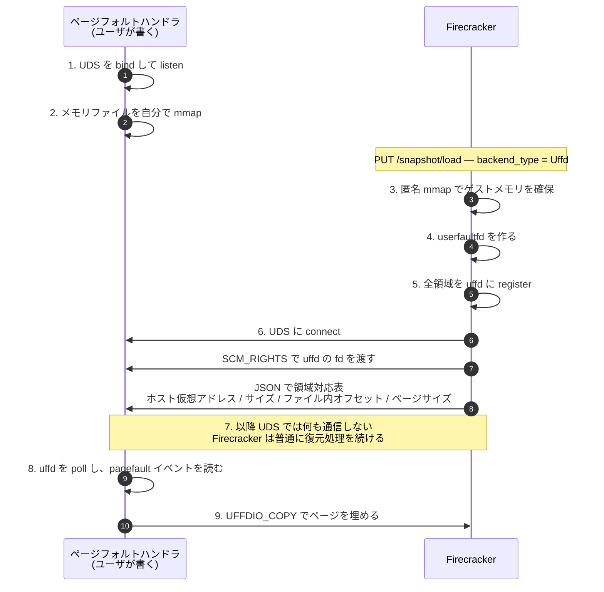
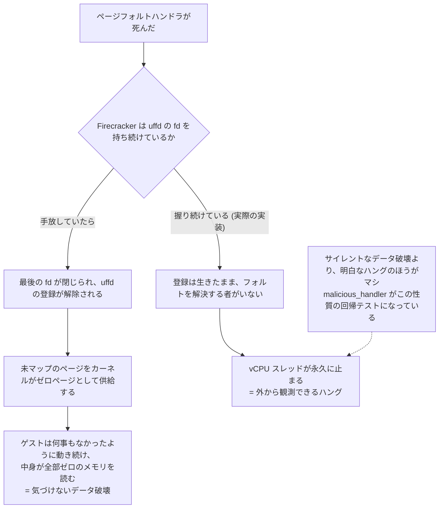

## 何を学んだか

### Firecracker 側の仕事は 4 ステップで終わる

`PUT /snapshot/load` で `backend_type: "Uffd"` を選ぶと、`backend_path` は**メモリファイルではなく Unix ドメインソケットのパス**になる。ソケットの listen 側は Firecracker ではなく、ユーザが用意する外部プロセスである。



**Firecracker はページを 1 枚も埋めない。** ハンドシェイクで fd と地図を渡したら、あとは何もしない。ドキュメントも明記している。

> After Firecracker sends the payload (i.e. mem mappings and file descriptor), no other communication happens on the UDS socket (or otherwise) between Firecracker and the page fault handler process.

渡すものは 2 つだけだ。

- **userfaultfd の fd**（`SCM_RIGHTS` でプロセス間に渡す）
- **`GuestRegionUffdMapping` の配列**（JSON）。ホスト仮想アドレス、サイズ、メモリファイル内のオフセット、ページサイズ。

これだけで、ハンドラは「フォルトしたアドレスがどの領域のどこか」を計算できる。**ゲスト物理アドレスもデバイスも KVM も出てこない。純粋にアドレス空間の対応表である。**

### Firecracker も fd を持ち続ける

`send_uffd_handshake()` は fd を送った後も自分の `Uffd` を捨てず、`KvmVm::set_uffd()` で保持する。理由がコメントに書いてある。**ハンドラが落ちたときに、ゲストメモリが「ただの匿名メモリ」として振る舞い始めるのを防ぐため**である。

uffd の登録は fd がすべて閉じられると解除される。もし Firecracker が fd を手放していて、ハンドラも死んだら、登録が消えて未マップのページはカーネルがゼロページとして供給してしまう。ゲストは何事もなかったように動き続け、**中身が全部ゼロのメモリを読む**。これは「気づけない壊れ方」になる。

Firecracker が fd を握り続けると、ハンドラが死んでも登録は生きたままになる。フォルトを解決する者がいないので、vCPU スレッドは永久に止まる。**壊れ方をハングに固定する、という選択である。**

### 参考実装が 3 つ入っている

`src/firecracker/examples/uffd/` に 3 つのハンドラがある。共通部分は `uffd_utils.rs` にまとまっている。

| 実装                | 戦略                                                         |
| ------------------- | ------------------------------------------------------------ |
| `on_demand_handler` | フォルトしたページだけを埋める。balloon との相互作用を扱う   |
| `fault_all_handler` | 最初のフォルトで**全領域**を一括して埋め、所要時間を出力する |
| `malicious_handler` | フォルトを受け取ったら panic する                            |

`fault_all_handler` は性能測定と hugetlbfs のテストに使われている。`malicious_handler` はハンドラが死んだときの挙動を確認するためのもので、統合テストの docstring が設計意図をそのまま書いている。

> The page fault handler panics when receiving a page fault, so no events are handled and snapshot memory regions cannot be loaded into memory. In this case, Firecracker is designed to freeze, instead of silently switching to having the kernel handle page faults, so that it becomes obvious that something went wrong.

**「静かに壊れるより、明らかに止まるほうがよい」が仕様として書かれ、テストされている。**

### balloon が絡むと、素朴なループでは足りない

`on_demand_handler` のコードは 40 行足らずだが、コメントが 35 行ある。すべて balloon との相互作用の話である。

[balloon](../balloon-zeroing/) がゲストからメモリを回収すると、Firecracker は `madvise(MADV_DONTNEED)` を呼ぶ。これは uffd に `UFFD_EVENT_REMOVE` として届く。ここから 3 つの問題が生まれる。

1. **`remove` イベントがキューに残っている間、すべての ioctl が `EAGAIN` を返す。** イベントを 1 つずつ処理する素朴なループだと、`remove` の手前で `UFFDIO_COPY` が失敗し続けて進まなくなる。先に `remove` まで読み進めてキューを空ける必要がある。
2. **イベントが因果順に届かない。** balloon の処理は VMM スレッド、ページフォルトは vCPU スレッドで起きる。ゲストが「解放 → 即座に再フォルト」した場合、ハンドラは `pagefault` を `remove` より先に受け取りうる。本来ゼロページを入れるべきところに、スナップショットファイルの古い内容を入れてしまう。
3. **全部読み切った後に `remove` が来る競合。** 読み終えた直後に `remove` が入ると、また `EAGAIN` が返る。

`on_demand_handler` は 1 と 3 を「`EAGAIN` になったイベントを `deferred_events` に退避して、次のラウンドでやり直す」形で処理し、**2 は意図的に無視している**。理由も書いてある。「複雑さを避けるため（ゲストカーネルが新しくフォルトインしたページをどうせゼロクリアするだろう、という仮定のもとで）。本番向けのハンドラは、特定の範囲の `remove` を `pagefault` より先に処理するようにしたいはずだ」。

**参考実装が「ここは手を抜いている、本番ではこうすべき」と書いている。**

## ソースコードのどこか

Firecracker 側の全体は [`src/vmm/src/persist.rs#L555-L587`](https://github.com/firecracker-microvm/firecracker/blob/cc535f035f3828b2c5bfc85276c5d394022ed220/src/vmm/src/persist.rs#L555-L587)。30 行しかない。

```rust title="src/vmm/src/persist.rs"
    let (guest_memory, backend_mappings) =
        create_guest_memory(mem_state, track_dirty_pages, huge_pages)?;

    let mut uffd_builder = UffdBuilder::new();

    // We only make use of this if balloon devices are present, but we can enable it unconditionally
    // because the only place the kernel checks this is in a hook from madvise, e.g. it doesn't
    // actively change the behavior of UFFD, only passively. Without balloon devices
    // we never call madvise anyway, so no need to put this into a conditional.
    uffd_builder.require_features(FeatureFlags::EVENT_REMOVE);

    let uffd = uffd_builder
        .close_on_exec(true)
        .non_blocking(true)
        .user_mode_only(false)
        .create()
        .map_err(GuestMemoryFromUffdError::Create)?;

    for mem_region in guest_memory.iter() {
        uffd.register(mem_region.as_ptr().cast(), mem_region.size() as _)
            .map_err(GuestMemoryFromUffdError::Register)?;
    }

    send_uffd_handshake(mem_uds_path, &backend_mappings, &uffd)?;
```

`EVENT_REMOVE` を条件分岐なしで常に有効にしている点にコメントが 4 行付いている。**「カーネルがこのフラグを見るのは madvise のフックの中だけで、UFFD の挙動を能動的には変えない」** ため、balloon がなくても害がない。バルーンの有無で分岐させると、ハンドラ側が受け取りうるイベント種別が構成によって変わってしまう。常に同じにしたほうが、ハンドラを書く側の契約が単純になる。

地図の作り方は [`src/vmm/src/persist.rs#L589-L610`](https://github.com/firecracker-microvm/firecracker/blob/cc535f035f3828b2c5bfc85276c5d394022ed220/src/vmm/src/persist.rs#L589-L610)。**メモリを確保するのは `memory::anonymous()` である。** ファイルは開かない。

```rust title="src/vmm/src/persist.rs"
    let guest_memory = memory::anonymous(mem_state.regions(), track_dirty_pages, huge_pages)?;
    let mut backend_mappings = Vec::with_capacity(guest_memory.len());
    let mut offset = 0;
    for mem_region in guest_memory.iter() {
        #[allow(deprecated)]
        backend_mappings.push(GuestRegionUffdMapping {
            base_host_virt_addr: mem_region.as_ptr() as u64,
            size: mem_region.size(),
            offset,
            page_size: huge_pages.page_size(),
            page_size_kib: huge_pages.page_size(),
        });
        offset += mem_region.size() as u64;
    }
```

`page_size_kib` は名前が間違っている（値はバイト単位）が、**JSON の形は外部プロセスとの API なので変えられない**。型定義側にその事情が書いてある（[`src/vmm/src/persist.rs#L112-L128`](https://github.com/firecracker-microvm/firecracker/blob/cc535f035f3828b2c5bfc85276c5d394022ed220/src/vmm/src/persist.rs#L112-L128)）。

```rust title="src/vmm/src/persist.rs"
    /// The configured page size **in bytes** for this memory region. The name is
    /// wrong but cannot be changed due to being API, so this field is deprecated,
    /// to be removed in 2.0.
    #[deprecated]
    pub page_size_kib: usize,
```

**プロセス境界を越えるものは API であり、内部の命名ミスも簡単には直せない。** 正しい名前の `page_size` を追加し、古いほうを `#[deprecated]` にして残す、という普通の API 進化をしている。

ハンドシェイクは [`src/vmm/src/persist.rs#L612-L663`](https://github.com/firecracker-microvm/firecracker/blob/cc535f035f3828b2c5bfc85276c5d394022ed220/src/vmm/src/persist.rs#L612-L663)。コード自体は短いが、コメントが 40 行近くある。要点は 2 つ。

1 つ目。**Firecracker が fd を握り続ける理由**。

```rust title="src/vmm/src/persist.rs"
        // The problem is that if other process crashes/exits, firecracker guest memory
        // will simply revert to anon-mem behavior which would lead to silent errors and
        // undefined behavior.
        // ...
        // Moreover, Firecracker holds a copy of the UFFD fd as well, so that even if the
        // page fault handler process does not tear down Firecracker when necessary, the
        // uffd will still be alive but with no one to serve faults, leading to guest freeze.
```

同じコメントの中で `SO_PEERCRED` の使い方まで具体的なコード片で示している。ハンドラ側が Firecracker の PID を知るための手段で、**Firecracker から PID を送らない**という設計判断の説明になっている。送らずに済むならプロトコルに項目を増やさない。

保持先は [`src/vmm/src/vstate/vm.rs#L233-L236`](https://github.com/firecracker-microvm/firecracker/blob/cc535f035f3828b2c5bfc85276c5d394022ed220/src/vmm/src/vstate/vm.rs#L233-L236) で、`KvmVm` のフィールドに置いてあるだけである。使われることはない。

2 つ目。**ソケットを閉じない**。

```rust title="src/vmm/src/persist.rs"
    // We prevent Rust from closing the socket file descriptor to avoid a potential race condition
    // between the mappings message and the connection shutdown. If the latter arrives at the UFFD
    // handler first, the handler never sees the mappings.
    forget(socket);
```

`std::mem::forget` で `UnixStream` の Drop を止めている。**メッセージと接続断が競合し、断のほうが先に観測されるとハンドラが地図を受け取れない**、という理由である。ソケットの fd はプロセス終了まで開きっぱなしになる。

ハンドラ側の共通部分は `uffd_utils.rs`。ページを埋める本体 `populate_from_file()`（[`src/firecracker/examples/uffd/uffd_utils.rs#L164-L192`](https://github.com/firecracker-microvm/firecracker/blob/cc535f035f3828b2c5bfc85276c5d394022ed220/src/firecracker/examples/uffd/uffd_utils.rs#L164-L192)）は、`UFFDIO_COPY` の戻り値を 3 通りに分類する。

```rust title="src/firecracker/examples/uffd/uffd_utils.rs"
                // Catch EAGAIN errors, which occur when a `remove` event lands in the UFFD
                // queue while we're processing `pagefault` events.
                Err(Error::PartiallyCopied(bytes_copied))
                    if bytes_copied == 0 || bytes_copied == (-libc::EAGAIN) as usize =>
                {
                    return false;
                }
                Err(Error::CopyFailed(errno))
                    if std::io::Error::from(errno).raw_os_error().unwrap() == libc::EEXIST => {}
```

`EAGAIN` は `false` を返して呼び出し側に再試行させ、`EEXIST`（既に埋まっていた）は成功扱いにする。**エラーの分類がそのまま制御フローになっている。** なお `EAGAIN` の判定に負値のキャストが混じっているのは、uffd-rs が `uffdio_copy->copy`（失敗時に `-errno` が入る符号付き 64bit）を `usize` にキャストしてしまうためで、その旨がコメントに書かれている。

`on_demand_handler` のループは [`src/firecracker/examples/uffd/on_demand_handler.rs#L69-L103`](https://github.com/firecracker-microvm/firecracker/blob/cc535f035f3828b2c5bfc85276c5d394022ed220/src/firecracker/examples/uffd/on_demand_handler.rs#L69-L103)。

```rust title="src/firecracker/examples/uffd/on_demand_handler.rs"
        let mut deferred_events = Vec::new();

        loop {
            // First, try events that we couldn't handle last round
            let mut events_to_handle = Vec::from_iter(deferred_events.drain(..));

            // Read all events from the userfaultfd.
            while let Some(event) = uffd_handler.read_event().expect("Failed to read uffd_msg") {
                events_to_handle.push(event);
            }

            for event in events_to_handle.drain(..) {
                match event {
                    userfaultfd::Event::Pagefault { addr, .. } => {
                        if !uffd_handler.serve_pf(addr.cast(), uffd_handler.page_size) {
                            deferred_events.push(event);
                        }
                    }
                    userfaultfd::Event::Remove { start, end } => {
                        uffd_handler.unregister_range(start, end)
                    }
                    _ => panic!("Unexpected event on userfaultfd"),
                }
            }
```

「まず全部読む → 処理する → 失敗したものを次のラウンドへ」という 2 段構えになっている。**`remove` の処理が `unregister_range`（登録解除）である点も注目に値する。** ページをゼロで埋め直すのではなく、その範囲を uffd の管理から外す。以降そこにフォルトが起きたら、カーネルが匿名メモリのゼロページを供給する。

ハンドラの死をどう扱うかは [`src/firecracker/examples/uffd/uffd_utils.rs#L257-L270`](https://github.com/firecracker-microvm/firecracker/blob/cc535f035f3828b2c5bfc85276c5d394022ed220/src/firecracker/examples/uffd/uffd_utils.rs#L257-L270) の `install_panic_hook()` にある。`SO_PEERCRED` で得た Firecracker の PID に `SIGKILL` を送る。

```rust title="src/firecracker/examples/uffd/uffd_utils.rs"
    pub fn install_panic_hook(&self) {
        let peer_creds = self.peer_process_credentials();

        let default_panic_hook = std::panic::take_hook();
        std::panic::set_hook(Box::new(move |panic_info| {
            let r = unsafe { libc::kill(peer_creds.pid, libc::SIGKILL) };
```

`on_demand_handler` と `fault_all_handler` はこれを呼ぶが、**`malicious_handler` は呼ばない**（[`src/firecracker/examples/uffd/malicious_handler.rs#L25-L26`](https://github.com/firecracker-microvm/firecracker/blob/cc535f035f3828b2c5bfc85276c5d394022ed220/src/firecracker/examples/uffd/malicious_handler.rs#L25-L26)）。だから Firecracker が生き残ってハングし、テストがタイムアウトを観測できる。

## なぜそうなっているか

### プロセス境界にした理由

ページフォルトの処理を Firecracker 本体に組み込む道もあった。プラグイン、設定ファイル、あるいはビルド時フィーチャで。プロセスに切り出したことで得られたものが 4 つある。

- **Firecracker のコード量が増えない。** 増えたのは 30 行の `guest_memory_from_uffd()` と 50 行のハンドシェイクだけ。プリフェッチ戦略もリモートストレージ対応も本体には入らない。[minimalism charter](../minimalism-charter/) の方針と一致している。
- **[seccomp フィルタ](../seccompiler/)を汚さない。** ハンドラがネットワーク I/O をしたいなら、それはハンドラのプロセスの権限の話であって、Firecracker のフィルタには何も足さなくてよい。
- **失敗が隔離される。** ハンドラのバグで Firecracker のアドレス空間が壊れることはない。最悪でもゲストが止まる。
- **言語も実装も自由。** 参考実装は Rust だが、UDS で fd と JSON を受け取れるなら何でもよい。

代償は 2 つある。ユーザが自分でハンドラを書かねばならないこと、そして「ハンドラが死んだら Firecracker がハングする」という運用上の負担である。`docs/snapshotting/handling-page-faults-on-snapshot-resume.md` の Caveats は後者を隠さず書いている。

> If the handler process crashes while Firecracker is resuming the snapshot, Firecracker will hang when a page fault occurs. (...) Users are expected to monitor the page fault handler's status or gather metrics of hanged Firecracker process and implement a recycle mechanism if necessary.

**「監視して再起動する仕組みはユーザが用意しろ」と明言している。** 拡張点をプロセス境界で切ると、プロセスのライフサイクル管理という責務が新たに発生する。それを本体で引き受けなかった、ということである。同じ文書は「Firecracker が接続してこない場合に備えて、ハンドラ側にタイムアウトを入れること」も推奨している。

### 一度きりのハンドシェイクにした理由

fd と地図を渡した後、UDS では何も通信しない。fd を渡した時点で、以降のやり取りはすべて uffd 経由になるからだ。**制御チャネルとデータチャネルを分け、制御チャネルは fd の受け渡しにだけ使って捨てる。**

これは実装を単純にする。Firecracker 側にプロトコルの状態機械が要らない。ハンドラ側も、fd を得たらそれを poll するだけになる。`Runtime::run()` は UDS と複数の uffd を同じ `poll()` で待つ構造になっており（[`src/firecracker/examples/uffd/uffd_utils.rs#L277-L327`](https://github.com/firecracker-microvm/firecracker/blob/cc535f035f3828b2c5bfc85276c5d394022ed220/src/firecracker/examples/uffd/uffd_utils.rs#L277-L327)）、**1 つのハンドラプロセスが複数の Firecracker を相手にできる**。UDS に新しい接続が来たら uffd を 1 つ増やすだけで済むのは、ハンドシェイクが状態を持たないからだ。

ただし単純さの代償もある。`uffd_utils.rs` は「ストリームから読めたのに fd が付いてこない」ケースを 5 回まで再試行しており、コメントは「なぜこれが起きるのか、よく分かっていない」と正直に書いている（[`src/firecracker/examples/uffd/uffd_utils.rs#L77-L98`](https://github.com/firecracker-microvm/firecracker/blob/cc535f035f3828b2c5bfc85276c5d394022ed220/src/firecracker/examples/uffd/uffd_utils.rs#L77-L98)）。fd 渡しは薄い層ではない。

### 「静かに壊れる」を潰すために fd を握る

前述のとおり、Firecracker が uffd の fd を保持し続けるのは、ハンドラが死んだときにメモリが匿名メモリとして振る舞い始めるのを防ぐためである。これは**壊れ方の選択**である。



**サイレントなデータ破壊より、明白なハングのほうがマシ**という判断である。統合テストの docstring がこれをそのまま述べており、`malicious_handler` はこの性質を壊さないための回帰テストとして存在している。

## どう活かすか

### 拡張点をプロセス境界で切る条件

「ユーザに処理を差し込ませたい」とき、プロセスに切り出す価値があるのは次の条件が揃うときである。

- **差し込む処理が、本体とは違う権限・依存を必要とする。** ネットワーク、別のストレージ、独自のライブラリ。本体の依存関係や seccomp フィルタを膨らませたくない。
- **本体が信頼境界を持っている。** Firecracker は seccomp と [jailer](../jailer/) で自分を絞っている。そこにユーザコードを入れると、絞る意味が薄れる。
- **本体と拡張の間のインタフェースが小さい。** ここでは「fd 1 個と JSON 1 個」。これが大きいと、プロセス間の往復がボトルネックになる。
- **失敗を隔離したい。** 拡張のバグで本体を落としたくない。

逆に、インタフェースが太い（毎秒何万回の往復が要る）場合や、本体と状態を密に共有する必要がある場合は、プロセス分割は合わない。**UFFD が成立するのは、カーネルがフォルト通知と `UFFDIO_COPY` という「越境しても安いプリミティブ」を用意しているからである。** 同等のものが無い領域で真似しても、往復のコストで潰れる。

### 拡張点の契約は、参考実装と敵対的実装の両方で示す

Firecracker は 3 つのハンドラを出荷している。これは単なるサンプルではない。

- `on_demand_handler` — **正しい書き方の見本**。しかも「ここは手を抜いた、本番ではこうすべき」まで書いてある。
- `fault_all_handler` — **別の戦略もあり得ることの証明**。全ページを一括で埋めるという真逆の方針でも、同じインタフェースで動く。
- `malicious_handler` — **拡張が壊れたときの本体の挙動を固定するテスト**。

3 つ目が特に効いている。拡張点を公開すると、「拡張側が約束を破ったらどうなるか」が仕様の一部になる。それを文章ではなくテストとして持っている。**自分のシステムに拡張点を作るなら、意地悪な実装を 1 つ書いてテストに入れる。**

### プロセス境界を越えるものは、内部の都合で変えられない

`page_size_kib` の件がその実例である。フィールド名が間違っていても、外部プロセスが読む JSON である以上、消せない。`#[deprecated]` を付けて残し、正しい名前のフィールドを増やした。**「内部の構造体」と「境界を越える構造体」を同じ気軽さで扱わない。** 境界を越えるものは、たとえ小さな JSON でも API である。

なお、ハンドラ側の `uffd_utils.rs` には同名の構造体が「同じもののコピー」として定義されている（コメントは "This is the same with the one used in src/vmm." とだけ書いており、共有クレートにしなかった理由までは書かれていない）。結果として、参考実装を読む人には「これは境界の契約であって、内部型への依存ではない」ことが伝わる形になっている。
