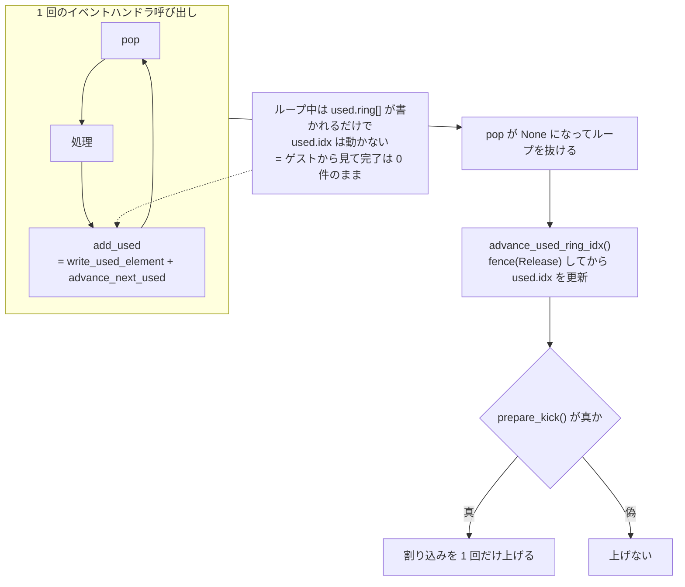
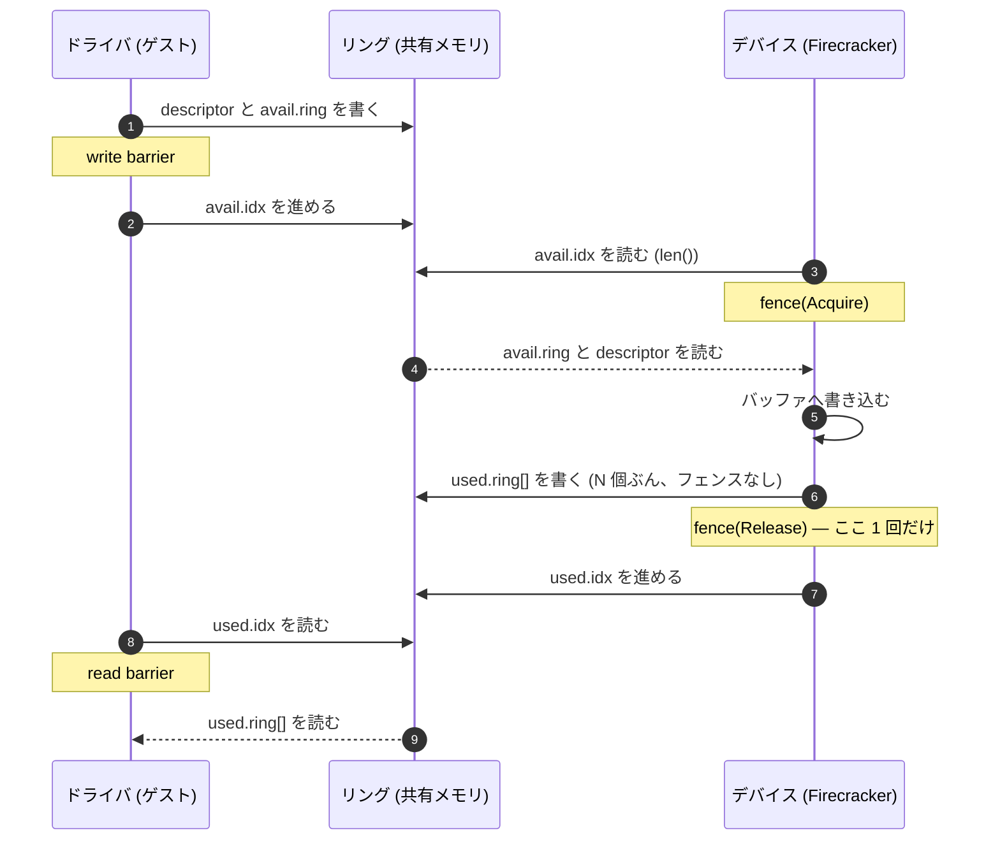

## 何を学んだか

virtio のデバイス側がリクエストを 1 つ完了するとき、やることは 3 つある。

1. used リングの `ring[]` に `{ desc_index, 書いたバイト数 }` を書く
2. 「どこまで書いたか」を自分の中で進める
3. `used.idx` を更新して、**ゲストから見える完了位置**を進める

素直に書けば 3 つは 1 つの関数になる。Firecracker はこれを**別々の関数に割った**。

```rust title="src/vmm/src/devices/virtio/queue.rs"
    /// Write used element into used_ring ring.
    /// - [`ring_index_offset`] is an offset added to the current [`self.next_used`] to obtain
    ///   actual index into used_ring.
    pub fn write_used_element(&mut self, ring_index_offset: u16, desc_index: u16, len: u32)
        -> Result<(), QueueError> { /* ... */ }

    /// Advance queue and used ring by `n` elements.
    pub fn advance_next_used(&mut self, n: u16) {
        self.num_added += Wrapping(n);
        self.next_used += Wrapping(n);
    }

    /// Set the used ring index to the current `next_used` value.
    /// Should be called once after number of `add_used` calls.
    pub fn advance_used_ring_idx(&mut self) {
        // This fence ensures all descriptor writes are visible before the index update is.
        fence(Ordering::Release);
        self.used_ring_idx_set(self.next_used.0);
    }
```

3 段に分けたことで得られるものは 2 つある。

**1 つ目は、割り込みが 1 回で済むこと。** デバイスは available ring が空になるまでループし、その間 `write_used_element` + `advance_next_used` を繰り返す。ループを抜けてから `advance_used_ring_idx` を 1 回呼び、`prepare_kick` が真なら割り込みを 1 回上げる。N 個のリクエストに対して、ゲストへの通知は 1 回だ。



`used.idx` を動かすまで、ゲストから見て完了したリクエストは 0 件のままだ。だから途中の `ring[]` への書き込みは、ゲストに一切観測されない。**「書く」と「見せる」を分けたことが、そのままバッチングになっている。**

**2 つ目は、1 つの論理単位が複数の used エントリにまたがれること。** `write_used_element` の第 1 引数 `ring_index_offset` がそのための仕掛けで、`next_used + offset` の位置に書く。`next_used` 自体は動かない。net の RX でこれが要る。mergeable RX buffer が有効なとき、1 つのイーサネットフレームが複数の descriptor chain にまたがる。フレームを受け切るまでは、途中の chain だけをゲストに見せてはいけない。

`add_used` は、この 3 段のうち 2 つを固定した便利版でしかない。

```rust title="src/vmm/src/devices/virtio/queue.rs"
    pub fn add_used(&mut self, desc_index: u16, len: u32) -> Result<(), QueueError> {
        self.write_used_element(0, desc_index, len)?;
        self.advance_next_used(1);
        Ok(())
    }
```

## ソースコードのどこか

### 3 つの関数

`write_used_element` から `add_used` まで ([`src/vmm/src/devices/virtio/queue.rs#L558-L607`](https://github.com/firecracker-microvm/firecracker/blob/cc535f035f3828b2c5bfc85276c5d394022ed220/src/vmm/src/devices/virtio/queue.rs#L558-L607))。

```rust title="src/vmm/src/devices/virtio/queue.rs"
    pub fn write_used_element(
        &mut self,
        ring_index_offset: u16,
        desc_index: u16,
        len: u32,
    ) -> Result<(), QueueError> {
        if self.size <= desc_index {
            error!(
                "attempted to add out of bounds descriptor to used ring: {}",
                desc_index
            );
            return Err(QueueError::DescIndexOutOfBounds(desc_index));
        }

        let next_used = (self.next_used + Wrapping(ring_index_offset)).0 % self.size;
```

`desc_index` の範囲検査がここにもある。`DescriptorChain` から来た値なら検証済みだが、この関数は `u16` を受け取るだけなので自分で確認する。位置の計算は `Wrapping` 上の加算のあと `% self.size` だ ([キューサイズが 2 のべき乗である](../descriptor-chain-validation/)ことは `initialize` が保証している)。

`advance_next_used(n)` が `num_added` と `next_used` の両方を進める点は覚えておきたい。`num_added` は「前回 kick してから何個 used に積んだか」で、[通知の抑制](../notification-suppression/) の判定に使われる。

### 消費側 — block の process_queue

もっとも素直な使い方が block にある ([`src/vmm/src/devices/virtio/block/virtio/device.rs#L529-L595`](https://github.com/firecracker-microvm/firecracker/blob/cc535f035f3828b2c5bfc85276c5d394022ed220/src/vmm/src/devices/virtio/block/virtio/device.rs#L529-L595))。

```rust title="src/vmm/src/devices/virtio/block/virtio/device.rs"
        while let Some(head) = queue.pop_or_enable_notification()? {
            // ... Request::parse → rate limit → 実行 ...
                ProcessingResult::Executed(finished) => {
                    used_any = true;
                    queue
                        .add_used(head.index, finished.num_bytes_to_mem)
                        .unwrap_or_else(|err| { /* ログ */ });
                }
        }
        queue.advance_used_ring_idx();

        if used_any && queue.prepare_kick() {
            active_state
                .interrupt
                .trigger(VirtioInterruptType::Queue(0))
```

ループ中は `add_used` だけ、ループを抜けて `advance_used_ring_idx` が 1 回、`prepare_kick` が 1 回。`used_any` を見ているので、1 件も完了しなかった場合は割り込みを上げない。

非同期 IO エンジンを使う場合、`Request::process` が `ProcessingResult::Submitted` を返してこのループでは `add_used` されない。完了は別のイベント (io_uring の完了キュー) で拾われ、そこでも同じ「まとめて `add_used` → `advance_used_ring_idx` → `prepare_kick`」の形が繰り返される ([`src/vmm/src/devices/virtio/block/virtio/device.rs#L637-L658`](https://github.com/firecracker-microvm/firecracker/blob/cc535f035f3828b2c5bfc85276c5d394022ed220/src/vmm/src/devices/virtio/block/virtio/device.rs#L637-L658))。バッチの単位が「1 回のイベント処理」に揃えられている。

### offset が要る側 — net の RX

net は `write_used_element` を直接呼ぶ ([`src/vmm/src/devices/virtio/net/device.rs#L179-L231`](https://github.com/firecracker-microvm/firecracker/blob/cc535f035f3828b2c5bfc85276c5d394022ed220/src/vmm/src/devices/virtio/net/device.rs#L179-L231))。

```rust title="src/vmm/src/devices/virtio/net/device.rs"
    unsafe fn mark_used(&mut self, mut bytes_written: u32, rx_queue: &mut Queue) {
        self.used_bytes = bytes_written;

        let mut used_heads: u16 = 0;
        for parsed_dc in self.parsed_descriptors.iter() {
            let used_bytes = bytes_written.min(parsed_dc.length);
            // Safe because we know head_index isn't out of bounds
            rx_queue
                .write_used_element(self.used_descriptors, parsed_dc.head_index, used_bytes)
                .unwrap();
            bytes_written -= used_bytes;
            self.used_descriptors += 1;
            // ...
        }
```

```rust title="src/vmm/src/devices/virtio/net/device.rs"
    /// This will let the guest know that about all the `DescriptorChain` object that has been
    /// used to receive a frame from the TAP.
    fn finish_frame(&mut self, rx_queue: &mut Queue) {
        rx_queue.advance_next_used(self.used_descriptors);
        self.used_descriptors = 0;
        self.used_bytes = 0;
    }
```

`RxBuffers::used_descriptors` が「書いたがまだ数えていないエントリ数」を持ち、それをそのまま `ring_index_offset` として使う。フレームを受け切って初めて `advance_next_used` でまとめて進む。**リング上の位置の予約と、位置のコミットが分離されている**形だ。

同じ仕掛けは壊れた chain の処理にも使われる。`parse_rx_descriptors` は解釈できなかった chain を `write_used_element(used_descriptors, index, 0)` で長さ 0 として置き、次の `finish_frame` でまとめてゲストに返す。

`advance_used_ring_idx` と `prepare_kick` は `try_signal_queue` にまとまっていて、コメントが仕様の該当節を指している ([`src/vmm/src/devices/virtio/net/device.rs#L418-L439`](https://github.com/firecracker-microvm/firecracker/blob/cc535f035f3828b2c5bfc85276c5d394022ed220/src/vmm/src/devices/virtio/net/device.rs#L418-L439))。

```rust title="src/vmm/src/devices/virtio/net/device.rs"
    /// Trigger queue notification for the guest if we used enough descriptors
    /// for the notification to be enabled.
    /// https://docs.oasis-open.org/virtio/virtio/v1.1/csprd01/virtio-v1.1-csprd01.html#x1-320005
    /// 2.6.7.1 Driver Requirements: Used Buffer Notification Suppression
    fn try_signal_queue(&mut self, queue_type: NetQueue) -> Result<(), DeviceError> {
        let qidx = /* ... */;
        self.queues[qidx].advance_used_ring_idx();

        if self.queues[qidx].prepare_kick() {
            self.interrupt_trigger()
                .trigger(VirtioInterruptType::Queue(qidx.try_into().unwrap()))
```

### バリアは 2 箇所だけ

ゲストのドライバとデバイスは別 CPU で並行に動く。同期はリングの `idx` を介した 2 本のフェンスだけで取られている。

available ring を読む側 ([`src/vmm/src/devices/virtio/queue.rs#L526-L550`](https://github.com/firecracker-microvm/firecracker/blob/cc535f035f3828b2c5bfc85276c5d394022ed220/src/vmm/src/devices/virtio/queue.rs#L526-L550))。

```rust title="src/vmm/src/devices/virtio/queue.rs"
    fn pop_unchecked(&mut self) -> Option<DescriptorChain> {
        // This fence ensures all subsequent reads see the updated driver writes.
        fence(Ordering::Acquire);
```

used ring に見せる側 (再掲)。

```rust title="src/vmm/src/devices/virtio/queue.rs"
    pub fn advance_used_ring_idx(&mut self) {
        // This fence ensures all descriptor writes are visible before the index update is.
        fence(Ordering::Release);
        self.used_ring_idx_set(self.next_used.0);
    }
```

対応関係はこうなる。



`fence(Acquire)` を `avail.idx` を読んだ**後**、`ring[]` を読む**前**に置くことで、「`idx` が N になっていると観測できたなら、ドライバが `idx` を書く前に書いた `ring[..N]` と descriptor もすべて見える」が保証される。`fence(Release)` はその鏡像で、`ring[]` への書き込みがすべて `used.idx` の更新より前に可視化される。この 2 本が対になっていないと、ゲストは「`idx` は進んでいるのに `ring[]` の中身が古い」を観測しうる。

**バッチングとバリアの関係も見ておきたい。** `advance_next_used` にはフェンスがない。フェンスは `advance_used_ring_idx` だけにある。N 個まとめて処理すれば、フェンス命令の実行も N 回から 1 回に減る。バッチングは割り込みだけでなく、メモリバリアのコストも畳んでいる。

## なぜそうなっているか

### 割り込み 1 回のコストが大きいから

`prepare_kick` が真になると、`VirtioInterrupt::trigger` が eventfd に書き、KVM が irqfd 経由でゲストに割り込みを注入する ([割り込みの届け方](../interrupt-delivery/))。ゲスト側では割り込みハンドラが動き、ドライバが used リングを走査する。1 リクエストごとにこれをやると、リクエスト 1 件あたりのオーバヘッドが処理そのものより大きくなりうる。

逆方向の kick (ゲスト → デバイス) はすでに ioeventfd で 1 回に畳まれている。used リング側のバッチングは、その対称形だ。

### 仕様からは意図的に外れている

ここが重要な点で、Kani ハーネスのコメントが明示している ([`src/vmm/src/devices/virtio/queue.rs#L965-L973`](https://github.com/firecracker-microvm/firecracker/blob/cc535f035f3828b2c5bfc85276c5d394022ed220/src/vmm/src/devices/virtio/queue.rs#L965-L973))。

```rust title="src/vmm/src/devices/virtio/queue.rs"
    fn verify_prepare_kick() {
        // Firecracker's virtio queue implementation is not completely spec conform:
        // According to the spec, we have to check whether to notify the driver after every call
        // to add_used. We don't do that. Instead, we call add_used a bunch of times (with the
        // number of added descriptors being counted in Queue.num_added), and then use
        // "prepare_kick" to check if any of those descriptors should have triggered a
        // notification.
```

何が仕様と違うのかを正確に書く。仕様が想定しているのは「**`add_used` のたびに**、その 1 個で通知条件を満たしたかを判定する」形だ。Firecracker は判定を後回しにし、`add_used` を何度も呼んでから `prepare_kick` を 1 回だけ呼ぶ。

そのため `prepare_kick` の判定は「直前の 1 個が条件を満たしたか」ではなく、「**まとめて積んだ `num_added` 個のどれかが条件を満たしたか**」になる。区間 `[next_used - num_added, next_used - 1]` に `used_event` が入るかを見る、という形だ。判定式そのものと 16 ビットのラップアラウンドの扱いは [通知抑制の証明](../notification-suppression/) で扱う。

逸脱が許される範囲についても、別のハーネス `verify_spec_2_6_7_2` が根拠を書いている ([`src/vmm/src/devices/virtio/queue.rs#L921-L963`](https://github.com/firecracker-microvm/firecracker/blob/cc535f035f3828b2c5bfc85276c5d394022ed220/src/vmm/src/devices/virtio/queue.rs#L921-L963))。仕様の記述は「通知すべき場合は MUST send」「通知しなくてよい場合は SHOULD NOT send」という非対称な形をしている。つまり**余分に通知するのは仕様違反にならない**。ハーネスもそこだけを検査していて、「送るべきときに送る」は `assert!` で確認し、「送らなくてよいときに送らない」は検査していない。コメントがそう明記している。

> The other case is handled by a "SHOULD NOT send a notification" in the spec. So we do not care

**「守るべき MUST は何か」を先に切り分けてから最適化している**という順序が、ここに出ている。バッチングによって通知のタイミングは変わるが、MUST の側は壊れない。

### なぜ 3 段なのか

2 段 (`add_used` + `advance_used_ring_idx`) では net の RX が書けない。1 フレームが複数の chain にまたがるとき、フレームの受信中に `next_used` を進めてしまうと、次の chain を書く位置がずれる。かといって `next_used` を進めずに `add_used` を複数回呼べば、すべて同じ位置に上書きされる。**位置の予約 (`ring_index_offset`) とコミット (`advance_next_used`) を分ける**必要が、この 1 点から出ている。

## どう活かすか

### 「ローカルに確定する」と「外に見せる」を別の操作にする

この設計の一般形は、**共有される公開位置 (`used.idx`) と、自分だけが知る作業位置 (`next_used`) を別の変数にする**ことだ。作業位置は自由に進めてよく、公開位置を動かしたときだけ相手に見える。

同じ形は至るところにある。

| 場面                   | 作業位置                   | 公開位置                       |
| ---------------------- | -------------------------- | ------------------------------ |
| virtio の used リング  | `next_used`                | `used.idx`                     |
| WAL のグループコミット | バッファに積んだレコード   | fsync 済み LSN                 |
| SPSC リングバッファ    | ローカルの書き込みカーソル | atomic な `head`               |
| DB のトランザクション  | 未コミットの変更           | コミット済みのスナップショット |

実装するときの型は同じだ。**公開位置の更新の直前に Release バリアを 1 本置き、読む側は公開位置を読んだ直後に Acquire バリアを 1 本置く。** それ以外の場所にバリアは要らない。バリアの数がバッチサイズに比例しないのが、この形の効きどころになる。

### 効く条件と、効かない条件

**効く条件は「1 回の起床でまとめて処理できる仕事が実際に溜まる」こと。** Firecracker のイベントハンドラは、eventfd が発火してから available ring が空になるまで回る。負荷が高いほどループの回転数が上がり、割り込み 1 回あたりの償却コストが下がる。負荷が低いときはループが 1 回で終わるので、バッチングは何もしないのと同じになる。**自己調整的**で、閾値やタイマを持たない点が良い。

**効かない、あるいは害になる条件は 2 つある。**

1 つ目は**バッチの区切りが時間で決まる場合**だ。「100 件溜まるまで待つ」「10ms 待つ」という形にすると、負荷が低いときにレイテンシが悪化する。Firecracker のバッチ上限は「今キューにあるもの」で、待たない。バッチングを入れるとき、**待つ実装にしていないかを最初に確認する**とよい。

2 つ目は**処理が失敗しうるとき**だ。block は失敗しても `add_used` でエラーステータスを返してループを続け、rate limiter に引っかかった場合は `undo_pop` で available ring に戻して `break` し、そこまでの分だけを公開する。**「途中で止まってもそこまでは正しく見える」が、位置の分離によって自然に成立している**。全部成功しないと何も公開できない設計にすると、この性質が失われる。

### 取り込むべきでない場面

**公開位置の更新自体が高価なら、分離の意味は薄い。** virtio では `used.idx` の更新はメモリへの `u16` 書き込み 1 回で極端に安い。ネットワーク越しの ack や DB へのコミットのように公開が重い場合は、話が「何回公開するか」だけになり、位置の分離は本質でなくなる。

**単一スレッドで読み書きするなら、バリアも分離も不要だ。** 3 段に分ける価値があるのは、読む側 (ゲスト) が別 CPU で並行に走っていて、ポーリングで `used.idx` を見にくる可能性があるからだ。相手が同じスレッドなら、途中状態を見られること自体が起こらない。
