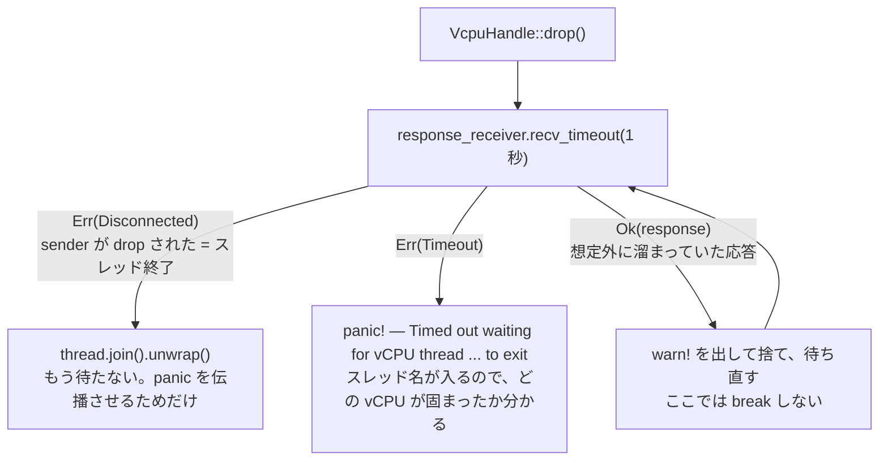

## 何を学んだか

### `join()` は「待つ」であって「確認する」ではない

vCPU スレッドを終わらせる素直なコードはこうなる。

```rust
handle.send_event(VcpuEvent::Finish)?;
handle.vcpu_thread.join().unwrap();
```

`Finish` を送り、スレッドの終了を待つ。正常系ではこれで十分に見える。問題は異常系だ。**`Finish` が届かなかったら、`join()` は永久にブロックする。**

届かない経路はいくつも考えられる。[`send_event` の 3 段階](../vcpu-kick/)のどこかで取りこぼす、vCPU が `KVM_RUN` から抜けてこない、状態機械が `exit()` のループに入っていて `Finish` 以外を受け取り続けている。どれが起きても、症状は同じ「Firecracker プロセスが終了しない」である。**ログには何も出ない。** スタックトレースも出ない。プロセスは生きていて、CPU も食っていない。

Firecracker の `VcpuHandle::Drop` は `join()` の前に **応答チャネルの切断をタイムアウト付きで待ち、時間切れなら panic する。**



### なぜ「チャネルの切断」を待つのか

`vcpu_thread` は `JoinHandle` なので `join()` できる。しかし `join()` にタイムアウトは無い（`JoinHandle::join` はブロックするだけで、`join_timeout` は標準ライブラリに存在しない）。

そこで**別の観測点**を使う。`response_sender` は vCPU スレッドが所有しているので、**スレッドが終了すれば sender が drop され、チャネルが `Disconnected` になる**。`recv_timeout()` にはタイムアウトがあるので、これで「スレッドが終わったか」をタイムアウト付きで観測できる。

チャネルの切断を検知したあとの `join()` は、もう待たない（スレッドは既に終わっている）。ここでの `join()` は**スレッドが panic していたら伝播させる**ためのものである。

## ソースコードのどこか

[`src/vmm/src/vstate/vcpu.rs#L645-L671`](https://github.com/firecracker-microvm/firecracker/blob/cc535f035f3828b2c5bfc85276c5d394022ed220/src/vmm/src/vstate/vcpu.rs#L645-L671)。コメントが設計判断をそのまま書いている。

```rust title="src/vmm/src/vstate/vcpu.rs"
// Wait for the Vcpu thread to finish execution
impl Drop for VcpuHandle {
    fn drop(&mut self) {
        // The vCPU thread owns the response sender, so the channel disconnects
        // once it exits. Wait for that disconnect (draining any stale responses)
        // with a timeout rather than joining unconditionally, so a thread that
        // never finished (e.g. a missed Finish event) fails fast instead of
        // hanging teardown forever.
        let thread = self.vcpu_thread.take().unwrap();
        loop {
            match self.response_receiver.recv_timeout(VCPU_JOIN_TIMEOUT) {
                // Sender dropped: the thread has exited.
                Err(RecvTimeoutError::Disconnected) => break,
                Err(RecvTimeoutError::Timeout) => {
                    let name = thread.thread().name().unwrap_or("<unnamed>");
                    panic!("Timed out waiting for vCPU thread '{name}' to exit")
                }
                // Unexpected: a response was still queued at teardown. Discard
                // it and keep waiting for the thread to exit.
                Ok(response) => {
                    warn!("Discarding unexpected vCPU response during teardown: {response:?}");
                }
            }
        }
        thread.join().unwrap();
    }
}
```

読み取れることが 4 つある。

1. **`rather than joining unconditionally`** — `join()` との比較が明示されている。無条件 join を却下した理由は "hanging teardown forever"。
2. **panic メッセージにスレッド名が入る。** `thread.thread().name()` を取っている。vCPU スレッドには起動時に `fc_vcpu {index}` という名前が付いている（[`src/vmm/src/vstate/vcpu.rs#L193-L194`](https://github.com/firecracker-microvm/firecracker/blob/cc535f035f3828b2c5bfc85276c5d394022ed220/src/vmm/src/vstate/vcpu.rs#L193-L194)）ので、**どの vCPU が固まったかが panic メッセージだけで分かる。**
3. **溜まっていた応答は捨てるが、黙って捨てない。** `Ok(response)` は本来ここに来ないはずのもので、`warn!` を出してから捨て、ループを続ける。1 個捨てるごとにタイムアウトはリセットされる。
4. **`Ok` で break しない。** 応答が来ても「スレッドが終わった」ことにはならない。break の条件は `Disconnected` だけである。

タイムアウト値は [`src/vmm/src/vstate/vcpu.rs#L35-L36`](https://github.com/firecracker-microvm/firecracker/blob/cc535f035f3828b2c5bfc85276c5d394022ed220/src/vmm/src/vstate/vcpu.rs#L35-L36)。

```rust title="src/vmm/src/vstate/vcpu.rs"
/// Maximum time to wait for a vCPU thread to exit when dropping its handle.
const VCPU_JOIN_TIMEOUT: Duration = Duration::from_secs(1);
```

### Drop を呼ぶのは誰か

`shutdown_vcpus()` は `Finish` を全 vCPU に送ったあと、**`Vec` を `clear()` することで Drop を発火させている**（[`src/vmm/src/vstate/vm.rs#L395-L405`](https://github.com/firecracker-microvm/firecracker/blob/cc535f035f3828b2c5bfc85276c5d394022ed220/src/vmm/src/vstate/vm.rs#L395-L405)）。

```rust title="src/vmm/src/vstate/vm.rs"
    pub fn shutdown_vcpus(&self) {
        let mut handles = self.vcpus_handles();
        for (idx, handle) in handles.iter_mut().enumerate() {
            if let Err(err) = handle.send_event(crate::VcpuEvent::Finish) {
                crate::logger::error!("Failed to send VcpuEvent::Finish to vCPU {}: {}", idx, err);
            }
        }
        // Join the vCPU threads by running VcpuHandle::drop().
        handles.clear();
    }
```

`// Join the vCPU threads by running VcpuHandle::drop().` というコメントが要る理由は、`clear()` を見ただけでは「1 秒待って panic しうる処理」だと分からないからである。**Drop に副作用を置くと、呼び出し側のコードから重さが見えなくなる。** その埋め合わせがこのコメントになっている。

送信のエラーは `error!` でログに出すだけで、`Finish` を送れなかった相手も同じ `clear()` に含まれる。**送れなかった vCPU は 1 秒後に panic する**という流れになる。送信エラーを握りつぶしているように見えるが、後段の Drop が検知するので抜けが無い。

### 同じ考え方が Pause / Resume / SaveState にもある

vCPU への同期的な問い合わせは全部 `recv_timeout` を使う。`pause_vcpus()` は [`src/vmm/src/vstate/vm.rs#L278-L298`](https://github.com/firecracker-microvm/firecracker/blob/cc535f035f3828b2c5bfc85276c5d394022ed220/src/vmm/src/vstate/vm.rs#L278-L298)。

```rust title="src/vmm/src/vstate/vm.rs"
        if handles
            .iter()
            .map(|handle| {
                handle
                    .response_receiver()
                    .recv_timeout(crate::RECV_TIMEOUT_SEC)
            })
            .any(|response| !matches!(response, Ok(crate::VcpuResponse::Paused)))
        {
            return Err(crate::VmmError::VcpuMessage);
        }
```

`resume_vcpus()`、`save_vcpu_states()`、`dump_cpu_config_states()` も同じ形をしている。**`recv()` は 1 箇所も使っていない。**

タイムアウト値は Drop の 1 秒とは別で、[`src/vmm/src/lib.rs#L207-L210`](https://github.com/firecracker-microvm/firecracker/blob/cc535f035f3828b2c5bfc85276c5d394022ed220/src/vmm/src/lib.rs#L207-L210) にある。

```rust title="src/vmm/src/lib.rs"
/// Timeout used in recv_timeout, when waiting for a vcpu response on
/// Pause/Resume/Save/Restore. A high enough limit that should not be reached during normal usage,
/// used to detect a potential vcpu deadlock.
pub const RECV_TIMEOUT_SEC: Duration = Duration::from_secs(30);
```

**「正常時には絶対に到達しない十分に高い値」「vCPU のデッドロックを検知するためのもの」** と用途が明記されている。これは「30 秒までなら待ってよい」ではない。**30 秒経ったら壊れていると断定してよい**という宣言である。

そして反応が違う。Drop は **panic**、Pause/Resume/SaveState は **`Err(VmmError::VcpuMessage)` を返す**。API 経由の操作は失敗を返せば呼び出し元（[API スレッド](../api-state-machine/)）が HTTP エラーに変換できるが、Drop はエラーを返す先が無いので panic しか選べない。

## なぜそうなっているか

### ハングを静かに許すか、うるさく落ちるか

vCPU が応答しない状況では、Firecracker はもう正しく動けない。選択肢は 2 つしかない。

|                          | 静かに待つ（`join()`、`recv()`） | うるさく落ちる（`recv_timeout` + panic） |
| ------------------------ | -------------------------------- | ---------------------------------------- |
| 症状                     | プロセスが終了しない             | プロセスが panic して落ちる              |
| ログ                     | 何も出ない                       | どの vCPU で何秒待ったかが出る           |
| オーケストレータから見て | 「終了処理中」と区別できない     | 明確な異常終了                           |
| リソース                 | ゲストメモリ・fd を掴んだまま    | OS が回収する                            |
| 原因調査                 | コアダンプを取るしかない         | メッセージから当たりが付く               |

Firecracker は後者を選んでいる。理由は運用形態から説明できる。

- **[1 プロセス 1 microVM](../architecture/)** なので、プロセスが落ちても影響範囲は microVM 1 台である。他のテナントに波及しない。
- **プロセスの起動と破棄がオーケストレータによって大量に、機械的に行われる。** 終了しないプロセスが 1 台のホストに溜まると、ゲストメモリを掴んだまま何十プロセスも残る。これは静かに、しかし確実にホストを壊す。
- **`Finish` が届かないのは論理的なバグである。** 一時的な遅延ではないので、待ち時間を延ばしても解決しない。

同じ判断は [`KVM_CREATE_VM` の有限リトライ](../create-vm-eintr/)にも見える。「上位に判断主体が居るなら、下位は速やかに諦める」という方針で一貫している。

### 1 秒と 30 秒の差

Drop が 1 秒なのは、そこに至るまでに **`Finish` の送信が終わっている**からである。vCPU は `Finish` を受け取ったら状態機械を抜けるだけで、何も待たない。1 秒あれば余裕がある。

`RECV_TIMEOUT_SEC` が 30 秒なのは、`SaveState` が **KVM から vCPU の全状態を吸い上げる処理**を含むからだろう（[`src/vmm/src/arch/x86_64/vcpu.rs#L590-L608`](https://github.com/firecracker-microvm/firecracker/blob/cc535f035f3828b2c5bfc85276c5d394022ed220/src/vmm/src/arch/x86_64/vcpu.rs#L590-L608) の `save_state` は複数の ioctl を順序制約付きで呼ぶ）。MSR の読み出しはチャンク単位のループになる。ここに 1 秒を設定すると、負荷の高いホストで偽陽性が出る。**「異常検知の閾値」は、正常系の最悪ケースより十分上に置かなければならない。**

なお、なぜ 1 秒・30 秒という具体的な値なのかは、コードにもコメントにも書かれていない。読み取れるのは「用途が違えば値も違う」という設計方針だけである。

### `expect()` が並んでいることとの整合

vCPU 側のコードには `.expect("vcpu channel unexpectedly closed")` が大量に出てくる。VMM 側が先に死んでチャネルが切れたら、vCPU も panic する。Drop 側の panic とあわせて、**「相手が居ないなら生きている意味が無い」という一貫した態度**になっている。

これが成立するのは、両者が**同じプロセスの中に居る**からである。プロセス境界を跨ぐ通信で同じことをすると、相手の再起動に耐えられなくなる。

## どう活かすか

### 「無期限に待つ」を書かない

自分のコードで真似できるのは、まずこの一点である。

- `join()` → 「終了しないケースがあるか」を考える。あるなら、終了を別の観測点（チャネルの切断、`AtomicBool`、`Condvar` + `wait_timeout`）でタイムアウト付きに置き換える
- `recv()` → `recv_timeout()`
- `lock()` → デッドロックしうるなら `try_lock()` + リトライ
- ブロッキング I/O → タイムアウトを設定する

コストはほぼゼロで、得られるのは**ハングがログに出る**ことである。ハングは、原因調査が最も難しい種類の不具合になりやすい。

### タイムアウト後に何をするかを分けて決める

タイムアウトを入れること自体より、**その後どうするか**のほうが設計として重い。Firecracker は 2 種類に分けている。

- **エラーを返せる場所ならエラーを返す。** 呼び出し元が判断できる。API 経由の Pause/Resume はこちら。
- **エラーを返せない場所（Drop、デストラクタ、シグナルハンドラ）は panic する。** 返す先が無い以上、握りつぶすか落ちるかの二択で、握りつぶすと症状が消える。

3 番目の選択肢として「タイムアウトしたら強制的に殺す」もありうる（スレッドを `pthread_cancel` する、など）。Firecracker はこれを採っていない。**壊れた状態のまま処理を続けるより、落ちたほうがよい**という判断で、[脅威モデル](../threat-model/)上も「不整合な状態で動き続ける」ほうが危険である。

### この設計が効く前提条件

- **プロセスが落ちてよいこと。** 障害の影響範囲が 1 プロセスに閉じ、上位に再起動の仕組みがある場合に限る。1 プロセスで多数のテナントを相手にしているなら、panic は全員を巻き込む。この場合は「該当の作業単位だけ切り離してエラーにする」ほうがよい。
- **正常系の所要時間が見積もれること。** 閾値を置けないなら、タイムアウトは偽陽性の製造機になる。Firecracker は正常系（vCPU が `Finish` を処理する時間、`SaveState` の ioctl 列）が分かっているので値を置ける。
- **panic メッセージに一次情報が載ること。** `panic!("timeout")` だけでは `join()` のハングとたいして変わらない。Firecracker がスレッド名を入れているのはそのためである。

### 逆に取り込むべきでないケース

**待ち時間が本質的に予測できない処理**にこの型を持ち込むと、閾値を上げ続ける保守作業が始まる。外部 API の応答待ち、ユーザ入力待ち、可変長データの転送などがそれにあたる。この場合はタイムアウトではなく、**キャンセル可能にする**（呼び出し側が明示的に打ち切れる）ほうが筋がよい。Firecracker の 30 秒が成立するのは、待つ相手が**自分が起動した同一プロセス内のスレッド**で、その仕事量を自分で決めているからである。
