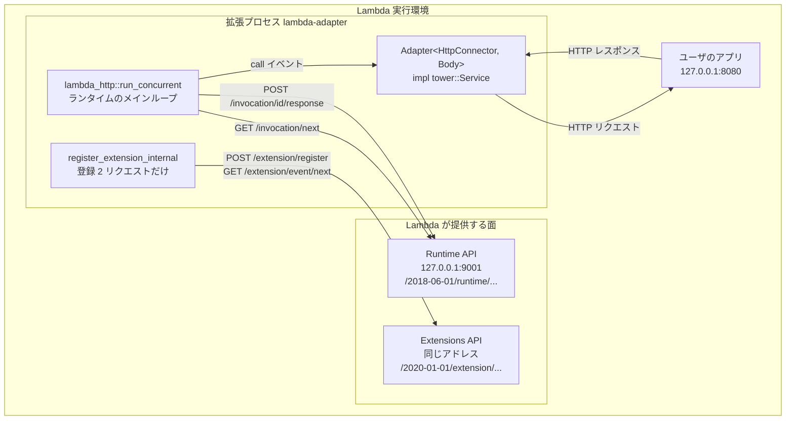

## 何を学んだか

Lambda Web Adapter を「Lambda とアプリの間に立つ何か」と表現すると、間に**サーバ**が立っているように聞こえる。実際は逆で、**アダプタはサーバを 1 つも立てていない**。Runtime API に対してもアプリに対しても、リクエストを投げる側 = クライアントである。

1 つの Lambda 実行環境の中を数え上げると、こうなる。

**HTTP エンドポイントは 3 つ:**

| エンドポイント | アドレス                                         | 誰が立てているか       | 誰が叩くか                           |
| -------------- | ------------------------------------------------ | ---------------------- | ------------------------------------ |
| Runtime API    | `AWS_LAMBDA_RUNTIME_API` (通常 `127.0.0.1:9001`) | Lambda 実行環境        | アダプタ (`lambda_http` 経由)        |
| Extensions API | 同上 (パスが `/2020-01-01/extension/...`)        | Lambda 実行環境        | アダプタ (自前の hyper クライアント) |
| ユーザのアプリ | `127.0.0.1:8080` (既定)                          | ユーザのアプリプロセス | アダプタ                             |

**自分で用意するプロセスは 2 つ:**

- `lambda-adapter` — `/opt/extensions/lambda-adapter` に置かれ、Lambda が**外部拡張**として起動する
- ユーザのアプリ — イメージの `CMD` / `ENTRYPOINT` (Zip なら `AWS_LAMBDA_EXEC_WRAPPER`) 経由で起動され、`127.0.0.1:8080` を listen する

**この 2 つは親子ではなく兄弟だ。** どちらも Lambda 側の監督プロセスから別々に起動されるので、実行環境の中で動いているプロセスは少なくとも 3 つある。アダプタはアプリを起動しないし、アプリの生死も管理しない。この構図は [実行環境の中のプロセス構成](../process-model/) で扱う。

アダプタは Runtime API からイベントを受け取り (`GET /invocation/next`)、それをアプリへの HTTP リクエストに変換して投げ、返ってきたレスポンスを Runtime API に返す (`POST /invocation/{id}/response`)。矢印はすべてアダプタから外へ出ていく。



## ソースコードのどこか

コードの地図はこれだけである。テストを除けば実質 1,100 行ほどしかない。

| ファイル                                                                                                                           | 行数                     | 中身                                                      |
| ---------------------------------------------------------------------------------------------------------------------------------- | ------------------------ | --------------------------------------------------------- |
| [`src/main.rs`](https://github.com/aws/aws-lambda-web-adapter/blob/986113fc66f368f0187a25c683f1ab39a68cc6c6/src/main.rs)           | 38                       | 起動シーケンスだけ。ロジックは 1 行もない                 |
| [`src/lib.rs`](https://github.com/aws/aws-lambda-web-adapter/blob/986113fc66f368f0187a25c683f1ab39a68cc6c6/src/lib.rs)             | 1,560 (うちテスト約 400) | `AdapterOptions` (環境変数の読み取り) と `Adapter` (本体) |
| [`src/readiness.rs`](https://github.com/aws/aws-lambda-web-adapter/blob/986113fc66f368f0187a25c683f1ab39a68cc6c6/src/readiness.rs) | 63                       | ログ間引き用の `Checkpoint` だけ                          |

`src/lib.rs` の中も、上から順に「型定義 → 環境変数 → `Adapter` の構築 → 拡張登録 → レディネス → イベント転送 → `Service` 実装」と一直線に並んでいる。分岐して読む必要のあるファイルは 1 つもない。

### `Adapter` 構造体のフィールド

[`src/lib.rs#L537-L552`](https://github.com/aws/aws-lambda-web-adapter/blob/986113fc66f368f0187a25c683f1ab39a68cc6c6/src/lib.rs#L537-L552)。この 13 フィールドがアダプタの状態のすべてである。

```rust title="src/lib.rs"
#[derive(Clone)]
pub struct Adapter<C, B> {
    client: Arc<Client<C, B>>,
    healthcheck_url: Url,
    healthcheck_protocol: Protocol,
    healthcheck_healthy_status: Vec<u16>,
    async_init: bool,
    ready_at_init: Arc<AtomicBool>,
    domain: Url,
    base_path: Option<String>,
    pass_through_path: String,
    compression: bool,
    invoke_mode: LambdaInvokeMode,
    authorization_source: Option<String>,
    error_status_codes: Option<Vec<u16>>,
}
```

| フィールド                   | 由来する環境変数                                                                 | 扱うページ                                                                 |
| ---------------------------- | -------------------------------------------------------------------------------- | -------------------------------------------------------------------------- |
| `client`                     | (`AWS_LAMBDA_INITIALIZATION_TYPE` で挙動が変わる)                                | [hyper クライアントの寿命管理と SnapStart](../hyper-client-and-snapstart/) |
| `healthcheck_url`            | `AWS_LWA_HOST` + `AWS_LWA_READINESS_CHECK_PORT` + `AWS_LWA_READINESS_CHECK_PATH` | [レディネスチェック](../readiness-check/)                                  |
| `healthcheck_protocol`       | `AWS_LWA_READINESS_CHECK_PROTOCOL`                                               | 同上                                                                       |
| `healthcheck_healthy_status` | `AWS_LWA_READINESS_CHECK_HEALTHY_STATUS`                                         | 同上                                                                       |
| `async_init`                 | `AWS_LWA_ASYNC_INIT`                                                             | [非同期初期化](../async-init/)                                             |
| `ready_at_init`              | (実行時状態)                                                                     | 同上                                                                       |
| `domain`                     | `AWS_LWA_HOST` + `AWS_LWA_PORT`                                                  | [fetch_response](../fetch-response/)                                       |
| `base_path`                  | `AWS_LWA_REMOVE_BASE_PATH`                                                       | [ベースパス除去とステージ名の相互作用](../base-path-and-stage/)            |
| `pass_through_path`          | `AWS_LWA_PASS_THROUGH_PATH`                                                      | [非 HTTP イベントを POST /events に流す](../pass-through/)                 |
| `compression`                | `AWS_LWA_ENABLE_COMPRESSION`                                                     | [レスポンス圧縮](../compression/)                                          |
| `invoke_mode`                | `AWS_LWA_INVOKE_MODE`                                                            | [buffered と response_stream](../buffered-vs-streaming/)                   |
| `authorization_source`       | `AWS_LWA_AUTHORIZATION_SOURCE`                                                   | [Authorization ヘッダを付け替える](../authorization-source/)               |
| `error_status_codes`         | `AWS_LWA_ERROR_STATUS_CODES`                                                     | [ステータスコードを Lambda のエラーに変える](../error-status-codes/)       |

## なぜそうなっているか

### なぜ `Arc` が 2 つだけあるのか

`Adapter` は `#[derive(Clone)]` である。そして `Service::call` の実装 ([`src/lib.rs#L1056`](https://github.com/aws/aws-lambda-web-adapter/blob/986113fc66f368f0187a25c683f1ab39a68cc6c6/src/lib.rs#L1056)) は、**イベント 1 件ごとに `self.clone()` する**。

```rust title="src/lib.rs"
fn call(&mut self, event: Request) -> Self::Future {
    let adapter = self.clone();
    Box::pin(async move { adapter.fetch_response(event).await })
}
```

`call` の返す `Future` は `'static` でなければならない (`Pin<Box<dyn Future + Send>>`)。`&self` を借りたまま `async move` に持ち込めないので、丸ごとコピーする。

だから、13 フィールドのうち `Arc` に包まれているのは 2 つだけ、という選択に意味が出てくる。

- `client: Arc<Client<C, B>>` — コネクションプールは**共有されなければ意味がない**。イベントごとにプールが作り直されたら、keep-alive がまったく効かない
- `ready_at_init: Arc<AtomicBool>` — 「アプリはもう起動した」という事実は**クローンをまたいで伝わらなければならない**。1 番目のリクエストが待ち終えたことを 2 番目のリクエストが知る必要がある

残りは `Url`・`String`・`Vec<u16>`・`bool` で、いずれも設定値である。クローンのたびにコピーされるが、**起動後に書き換わらない**ので共有する必要がない。`Vec<u16>` (最大 400 要素) のコピーがイベントごとに走るのはやや無駄だが、それを `Arc` にする最適化より、`Arc` が 2 つしかないことで「共有される状態はこの 2 つだけ」と読めるほうが価値が高い、という判断に見える。

### なぜサーバを立てないのか

サーバを立てないことは、実装の都合ではなく**このツールの性質そのもの**である。アダプタが `0.0.0.0:8080` で listen して、アプリを別ポートに追いやる設計もありえた。しかしそうすると、アプリは「LWA 用のポート設定」を持たされることになり、Lambda 以外の場所で動かすときに設定が食い違う。

クライアントに徹しているから、**アプリ側は何も知らなくていい**。`app.listen(8080)` のままで、Lambda では LWA が叩き、Fargate では ALB が叩く。同じイメージが両方で動く理由がここにある。詳しくは [Lambda の外では何も動かない](../outside-lambda/)。

## どう活かすか

- **「誰がサーバで誰がクライアントか」を最初に数える。** サイドカー型のツールを読むときに一番効く問いがこれである。矢印の向きが分かれば、設定項目のほとんどが「クライアント側の宛先指定」として理解できる
- **`Clone` する構造体では、`Arc` に包んだフィールドが「共有したい状態」の一覧になる。** 逆に言えば、`Arc` を安易に増やすと「何が共有されているか」の情報が消える。LWA は 13 個中 2 個に絞ることでそれを保っている
- この章の残りは、上の表の各行を 1 ページずつ潰していく構成になっている。先に読むべき前提は [実行環境のライフサイクル](../execution-environment/) と [Runtime API](../runtime-api/)、次に [main の 4 行](../bootstrap-and-startup/) から順に進む
