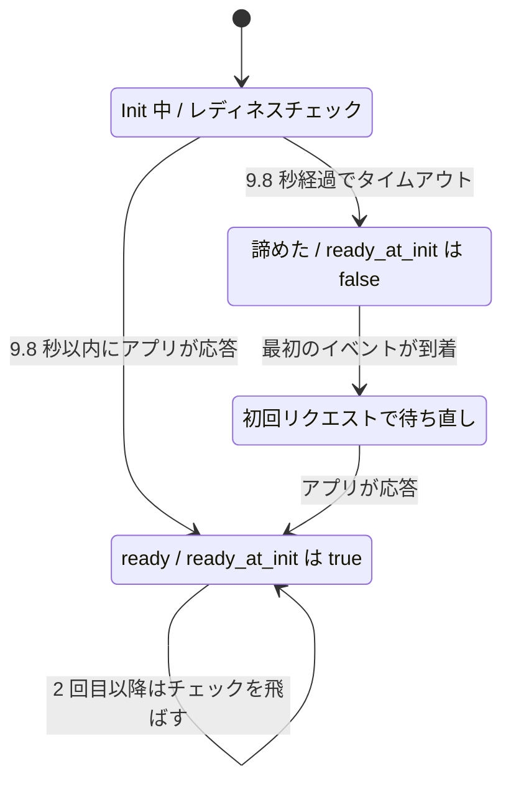

## 何を学んだか

大きな ML モデルを読み込むアプリを Lambda に載せると、起動が 10 秒を超えることがある。すると Lambda は Init を失敗とみなし、実行環境を作り直す。作り直した先では初期化のやり直しになる。

`AWS_LWA_ASYNC_INIT=true` はこの壁を回避する。やっていることは単純で、**9.8 秒でレディネスチェックを打ち切って `run()` に進む**。アプリはバックグラウンドで起動を続け、最初のリクエストが来たときに改めて待つ。

実装は 2 か所、合わせて 10 行ほどである。状態は `AtomicBool` 1 つしかない。

## ソースコードのどこか

### 諦める側 — `check_init_health`

[`src/lib.rs#L758`](https://github.com/aws/aws-lambda-web-adapter/blob/986113fc66f368f0187a25c683f1ab39a68cc6c6/src/lib.rs#L758)。

```rust title="src/lib.rs"
pub async fn check_init_health(&mut self) {
    let ready_at_init = if self.async_init {
        timeout(Duration::from_secs_f32(9.8), self.check_readiness())
            .await
            .unwrap_or_default()
    } else {
        self.check_readiness().await
    };
    self.ready_at_init.store(ready_at_init, Ordering::SeqCst);
}
```

`tokio::time::timeout` は `Result<bool, Elapsed>` を返す。`unwrap_or_default()` で `Elapsed` は `false` に潰れる。`bool` の `Default` が `false` であることを使った短縮で、「タイムアウトした = 準備できていない」がそのまま表現されている。

`async_init` が無効なら `timeout` は掛からず、[レディネスチェック](../readiness-check/) の無限リトライが成功するまで戻らない。この場合 `ready_at_init` には必ず `true` が入る。

### 待ち直す側 — `fetch_response` の冒頭

[`src/lib.rs#L933`](https://github.com/aws/aws-lambda-web-adapter/blob/986113fc66f368f0187a25c683f1ab39a68cc6c6/src/lib.rs#L933)。イベント転送処理の 1 行目がこれである。

```rust title="src/lib.rs"
async fn fetch_response(&self, event: Request) -> Result<Response<Incoming>, Error> {
    if self.async_init && !self.ready_at_init.load(Ordering::SeqCst) {
        self.is_web_ready(&self.healthcheck_url, &self.healthcheck_protocol)
            .await;
        self.ready_at_init.store(true, Ordering::SeqCst);
    }
    // ... イベントを HTTP リクエストに変換して転送
```

`is_web_ready` はここでも 10ms 間隔の無限リトライである。今度は `timeout` で囲まれていないので、アプリが起きるまで待つ。待つ時間は**関数のタイムアウト時間**の中に収まらなければならない。



`async_init` が無効なら `InitChecking` から `Ready` へ直行する経路しかない。

## なぜそうなっているか

### なぜ 9.8 秒なのか

Lambda のマネージドランタイムは、関数の初期化に**最大 10 秒**の枠を与える。この枠の中では CPU がバーストして割り当てられる。リポジトリのガイドはこう説明している ([`docs/guide/src/configuration/async-init.md`](https://github.com/aws/aws-lambda-web-adapter/blob/986113fc66f368f0187a25c683f1ab39a68cc6c6/docs/guide/src/configuration/async-init.md))。

> Lambda managed runtimes offer up to 10 seconds for function initialization with burst CPU. If your function can't complete initialization within that window, Lambda restarts it and bills for the init time.

10 秒に収まらないと、Lambda は関数を再起動し、その init 時間は課金対象になる。**枠に収まっていれば init の CPU バーストは無料**で、超えたときだけ罰則がある、という非対称がある。

9.8 という数字はこの 10 秒に対する余白である。`timeout` が発火してから `store` して `run()` に入り、`lambda_http` が Runtime API のクライアントを組み立てて `/next` を叩くまでにも時間がかかる。0.2 秒はそのためのマージンで、コードにマジックナンバーとして直接書かれている (設定項目はない)。

### 何が得られるのか

得られるのは 2 つである。

1. **実行環境の作り直しを避けられる。** 再起動が入ると初期化が丸ごと 1 回無駄になり、コールドスタートは実質 2 倍になる
2. **無料の CPU バーストを使い切れる。** 9.8 秒ぶんの初期化は Init 枠の中で進む。残りをリクエスト処理中に持ち越す形になる

失うものもはっきりしている。**最初のリクエストが遅くなる**。アプリの起動に 30 秒かかるなら、最初のリクエストは残り 20 秒待たされる。関数のタイムアウトがそれより短ければ、そのリクエストは失敗する。

つまり `async_init` は「コールドスタートを速くする機能」ではなく、**「Init 失敗による作り直しを、1 回ぶんの遅いリクエストと交換する機能」**である。起動が 10 秒を明らかに超えるアプリでだけ意味がある。

### なぜ `Arc<AtomicBool>` なのか

`Adapter` は `#[derive(Clone)]` で、`Service::call` はイベントごとに `self.clone()` する ([アーキテクチャを一枚で読む](../architecture/))。

```rust title="src/lib.rs"
fn call(&mut self, event: Request) -> Self::Future {
    let adapter = self.clone();
    Box::pin(async move { adapter.fetch_response(event).await })
}
```

`ready_at_init` が素の `bool` だと、クローンごとに独立したコピーになる。1 番目のリクエストが待ち終えても 2 番目には伝わらず、**毎回レディネスチェックが走る**。`Arc<AtomicBool>` にすることで、`store(true)` がすべてのクローンから見える。

`fetch_response` は `&self` しか取らないので `&mut` は使えず、内部可変性が必要になる。`Mutex<bool>` でも書けるが、読み書きが `bool` 1 つで、しかも読みは毎リクエスト走る。`AtomicBool` なら `.load()` は命令 1 つで済む。

### `store(true)` を無条件に立てている

待ち終えた直後の `self.ready_at_init.store(true, Ordering::SeqCst)` には条件がない。`is_web_ready` の戻り値 (`bool`) すら見ていない。

`timeout` で囲まれていない `is_web_ready` は、成功するまで戻らない。戻ってきた時点で必ず `true` である。だから戻り値を見る意味がなく、無条件に立てて構わない。

そしてこの 1 行のおかげで、**2 回目以降のリクエストでは `load` が `true` を返して分岐ごと飛ぶ**。`async_init` を有効にしたときの継続的なオーバーヘッドは、`AtomicBool` の `load` 1 回だけになる。

### 並行モードでの重複

`run()` は `lambda_http::run_concurrent` を使うので、Managed Instances のような並行実行環境では**複数のイベントが同時に `call` される** ([並行ポーリング](../concurrent-polling/))。

このとき `ready_at_init` がまだ `false` なら、複数のワーカーが同時に `if` を通過して、それぞれが `is_web_ready` を呼ぶ。`SeqCst` の `store` は競合しない (どれが先に書いても `true` になる) が、**待ち自体は重複する**。同じヘルスチェック URL に対して 10ms 間隔のリトライが N 本走る。

localhost への GET が数本重なるだけで、正しさには影響しない。`Once` や `Mutex` で 1 本に絞ることもできるが、そのために非同期の排他を持ち込むほうが複雑になる。「重複しても害がない」ことを見切って、チェックを入れていない。

なお、この重複は **`ready_at_init` が `true` になるまでの一瞬だけ**である。1 本目が待ち終えて `store(true)` した後に来るリクエストは、`load` が `true` を返すので待たない。まだ待っている途中の他のワーカーも、アプリはもう起きているので次のリトライで即座に成功する。

## どう活かすか

- **`AWS_LWA_ASYNC_INIT` は「起動が 10 秒を明らかに超える」ときだけ有効にする。** 8 秒で起動するアプリに設定しても効果はなく、9.8 秒付近で揺れるアプリでは「最初のリクエストだけ極端に遅い」という不安定さを招く。まずメモリを増やして起動時間そのものを縮めるほうが効く場合が多い
- **有効にするなら、関数のタイムアウトを起動時間より十分長くする。** 最初のリクエストが残りの起動時間を丸ごと待つ。ここを見落とすと、Init は成功するが最初のリクエストが必ずタイムアウトする、という分かりにくい状態になる
- **`unwrap_or_default()` は「失敗 = 型の既定値」が意味として正しいときだけ使う。** ここでは「タイムアウト = 準備できていない = `false`」が成立している。成立しない場面で使うと、失敗が黙って既定値に化ける
- **`Clone` される構造体で「1 回だけやりたい処理」を書くときは、フラグの置き場所を先に決める。** 素の `bool` は毎回リセットされ、`Arc<AtomicBool>` は共有される。LWA はフィールド定義を見るだけでどちらかが分かる
- **「重複しても害がないか」を先に判定すると、排他制御を 1 つ減らせる。** 並行時に `is_web_ready` が重複するのは既知の挙動で、それを許容したうえで `Once` を入れていない。害の有無を確かめずに反射的に排他を足すと、非同期コードの複雑さだけが増える
- 前提となる Init / Invoke / Shutdown の区切りと、Init が失敗したときに何が起きるかは [実行環境のライフサイクル](../execution-environment/) にある
