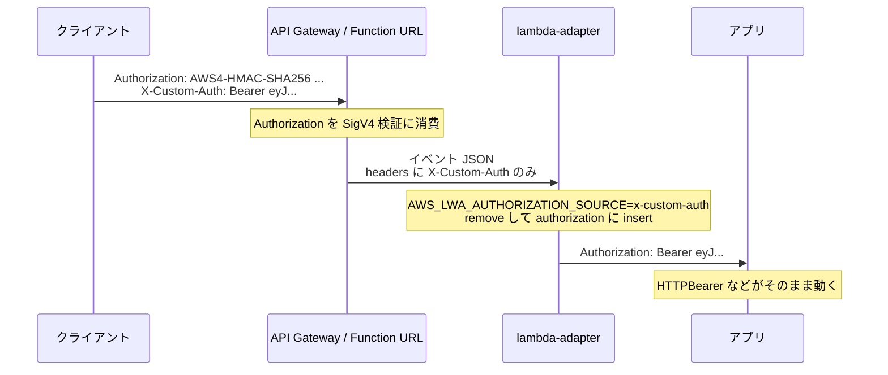

## 何を学んだか

`AWS_LWA_AUTHORIZATION_SOURCE` の実装は 8 行しかない。指定された名前のヘッダを取り除き、その値を `authorization` として入れ直すだけだ。

```rust title="src/lib.rs"
if let Some(authorization_source) = self.authorization_source.as_deref() {
    if let Some(original) = req_headers.remove(authorization_source) {
        req_headers.insert("authorization", original);
    } else {
        tracing::warn!("\"{}\" header not found in request headers", authorization_source);
    }
}
```

([src/lib.rs#L983-L989](https://github.com/aws/aws-lambda-web-adapter/blob/986113fc66f368f0187a25c683f1ab39a68cc6c6/src/lib.rs#L983-L989))

コードが短いわりに、これが必要になる理由は AWS の認証機構の仕様に踏み込んでいる。

## ソースコードのどこか

`authorization_source` は `AWS_LWA_AUTHORIZATION_SOURCE` から読む `Option<String>` で、未設定なら分岐ごとスキップされる ([src/lib.rs#L434](https://github.com/aws/aws-lambda-web-adapter/blob/986113fc66f368f0187a25c683f1ab39a68cc6c6/src/lib.rs#L434))。

処理の位置は、コンテキストヘッダの追加より**後**、URL を組むより**前**だ ([fetch_response — イベントが HTTP リクエストになるまで](../fetch-response/) のステップ 7)。つまりアプリに送るリクエストヘッダが確定する直前に、最後の書き換えとして実行される。

挙動として押さえておくべき点が 3 つある。

**1. 元のヘッダは消える。** `remove` が使われているので、`AWS_LWA_AUTHORIZATION_SOURCE=x-custom-auth` にした場合、アプリに届くリクエストに `x-custom-auth` は存在しない。値は `authorization` に移動する。「コピー」ではなく「リネーム」だ。ヘッダ名を条件にしたミドルウェアを別に持っている場合は壊れる。

**2. 既存の `Authorization` は上書きされる。** `insert` なので、API Gateway が何らかの理由で `Authorization` をバックエンドまで通していたとしても、その値は捨てられる。付け替え元のヘッダが優先される。

**3. 見つからないときはリクエストを通す。** 指定したヘッダが無ければ警告ログを 1 行出して、それだけ。リクエストはそのままアプリに届く。ここで 401 を返したりはしない。

3 番目は設計の意思がはっきり出ているところだ。LWA は認証の可否を判断しない。ヘッダが無いリクエストをどう扱うか (401 にするか、匿名として通すか) は完全にアプリ側の責務になる。LWA は「ヘッダの名前を変える」以上のことをしない。

`HeaderMap::remove` は同名ヘッダが複数あった場合に最初の 1 つだけを返し、残りも消える。`Authorization` が複数あるリクエストはまず無いので実害は考えにくいが、そういう挙動であることは把握しておく。

## なぜそうなっているか

**`Authorization` ヘッダは API Gateway に食われることがある。**

- **IAM 認証 (`AWS_IAM`)**: クライアントは SigV4 署名を `Authorization: AWS4-HMAC-SHA256 Credential=...` の形で送る。API Gateway / Function URL はこれを検証に使い、バックエンドにはそのまま渡さない
- **Lambda オーソライザ (TOKEN タイプ)**: `Authorization` ヘッダの値をトークンとしてオーソライザ関数に渡す。オーソライザが返すのはポリシーとコンテキストで、元のヘッダがバックエンドに届くかどうかはマッピング設定に依存する
- **Cognito オーソライザ / JWT オーソライザ**: 同様に `Authorization` を検証に使う

一方でアプリ側は、フレームワークの認証機構が `Authorization` ヘッダを見に行くように作られている。

- Spring Security の `BearerTokenAuthenticationFilter`
- Passport の `ExtractJwt.fromAuthHeaderAsBearerToken()`
- FastAPI の `HTTPBearer` / `OAuth2PasswordBearer`
- Rails の `authenticate_with_http_token`

どれもヘッダ名がフレームワーク側に埋まっていて、変えるにはアプリのコードを書き換えるしかない。ところが LWA の存在意義は**アプリのコードを変えないこと**だ。

そこで前提の構成はこうなる。API Gateway の認証には `Authorization` を使い、アプリ用のトークンは `X-Custom-Auth` のような別ヘッダで送る。そして LWA が最後にヘッダ名を戻す。



つまりこの 8 行がやっているのは、**認証の 2 層構造 (インフラ層と業務層) が同じヘッダ名を取り合う問題の回避**だ。層を分けるためにクライアント側でヘッダ名をずらし、アプリの直前で元に戻す。

## どう活かすか

**使いどころ。**

- **Function URL の IAM 認証 (`AuthType: AWS_IAM`) + アプリ側 JWT。** Function URL を非公開にしつつ、アプリのユーザー認証は JWT で行う構成。クライアントは SigV4 で署名し、JWT は `X-Custom-Auth` に載せる
- **API Gateway の Lambda オーソライザ + アプリのセッション。** オーソライザで粗い認可 (API キー、テナント境界) を行い、アプリで細かい認可を行う
- **CloudFront / Lambda@Edge を挟む構成。** エッジでヘッダを退避しておき、オリジン到達後に LWA が復元する

設定は環境変数 1 つで済む。

```yaml
Environment:
  Variables:
    AWS_LWA_AUTHORIZATION_SOURCE: x-custom-auth
```

**セキュリティ上の注意。**

このヘッダはクライアントが自由に設定できる。**LWA は値を検証しないし、署名も付けない。** `X-Custom-Auth` に何を入れるかはクライアントの自由なので、これ自体は認証機構ではまったくない。付け替えは名前の変更でしかなく、信頼のレベルを 1 ミリも上げない。

したがって次の 2 点は必ず守る。

- **アプリ側で必ず値を検証する。** JWT なら署名検証と有効期限、API キーなら照合。「LWA が `Authorization` に入れてくれたから正しい値だ」という推論は成り立たない
- **本当の境界はインフラ側に置く。** IAM 認証やオーソライザによるアクセス制御が、実際に外部からの到達を止めている層だ。この機能はその外側にあるアプリの認証を「動かす」ためのものであって、置き換えるものではない

ログの読み方も 1 つ。指定したヘッダが見つからないと `"x-custom-auth" header not found in request headers` という警告が毎リクエスト出る。ヘッダ名の綴りミス (LWA 側は大文字小文字を区別しない `HeaderMap` を使うので大小は問題にならない) や、API Gateway 側でヘッダが落ちている場合にここで気づける。逆に言うと、認証済みリクエストしか来ない前提の関数でこの警告が大量に出ていたら、経路のどこかでヘッダが消えている。
