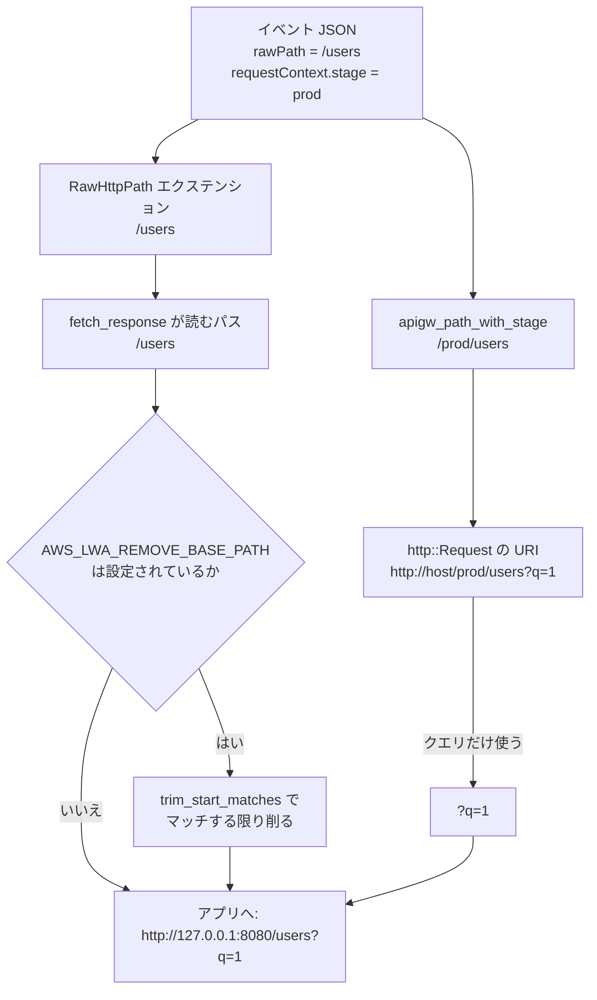

## 何を学んだか

アプリに届くパスは、2 つの独立した仕組みに触られる。片方は `lambda_http` が「ステージ名を前に足す」もの、もう片方は LWA が「設定された接頭辞を削る」ものだ。両者は同じパス文字列を扱うのに、**見ている文字列が違う**。ここを取り違えると、`AWS_LWA_REMOVE_BASE_PATH` に何を設定すべきかの判断を間違える。

## ソースコードのどこか

### その 1: lambda_http 側のステージ名前置

`apigw_path_with_stage` ([lambda-http/src/request.rs#L359-L376](https://github.com/aws/aws-lambda-rust-runtime/blob/6f305bb00f3cc613fd82f88d2f2200e8089e4385/lambda-http/src/request.rs#L359-L376))。

```rust title="lambda-http/src/request.rs"
fn apigw_path_with_stage(stage: &Option<String>, path: &str) -> String {
    if env::var("AWS_LAMBDA_HTTP_IGNORE_STAGE_IN_PATH").is_ok() {
        return path.into();
    }

    let stage = match stage {
        None => return path.into(),
        Some(stage) if stage == "$default" => return path.into(),
        Some(stage) => stage,
    };

    let prefix = format!("/{stage}/");
    if path.starts_with(&prefix) {
        path.into()
    } else {
        format!("/{stage}{path}")
    }
}
```

規則は 4 つ。

1. `AWS_LAMBDA_HTTP_IGNORE_STAGE_IN_PATH` が設定されていれば (値は何でもよい) 何もしない
2. ステージが `None` なら何もしない
3. ステージが `$default` なら何もしない
4. パスが既に `/{stage}/` で始まっていればそのまま、そうでなければ `/{stage}` を前置する

4 番目の分岐が必要なのは、REST API と HTTP API でイベント中のパスの持ち方が違うからだ。REST API (v1) の `path` は既にステージ名込みで届くことがあり、その場合に二重付与しないようにしている。

この結果は `http::Request` の**URI に反映される**。`into_api_gateway_v2_request` ([L119](https://github.com/aws/aws-lambda-rust-runtime/blob/6f305bb00f3cc613fd82f88d2f2200e8089e4385/lambda-http/src/request.rs#L119)) と `into_proxy_request` ([L181](https://github.com/aws/aws-lambda-rust-runtime/blob/6f305bb00f3cc613fd82f88d2f2200e8089e4385/lambda-http/src/request.rs#L181)) の両方が、`build_request_uri` に渡すのはステージを足した後の `path` だ。

### ところが LWA が見るのは生パス

同じ関数の中で、エクステンションに入るのは別の値になっている。

```rust title="lambda-http/src/request.rs"
let raw_path = ag.raw_path.unwrap_or_default();
let path = apigw_path_with_stage(&ag.request_context.stage, &raw_path);
// ...
let builder = http::Request::builder()
    .uri(uri)                       // ← ステージ付き
    .extension(RawHttpPath(raw_path))  // ← ステージ無しの生パス
```

`RawHttpPath` に入るのは `apigw_path_with_stage` を通す**前**の `raw_path` だ ([L142](https://github.com/aws/aws-lambda-rust-runtime/blob/6f305bb00f3cc613fd82f88d2f2200e8089e4385/lambda-http/src/request.rs#L142)、v1 は [L190](https://github.com/aws/aws-lambda-rust-runtime/blob/6f305bb00f3cc613fd82f88d2f2200e8089e4385/lambda-http/src/request.rs#L190))。ALB ([L242](https://github.com/aws/aws-lambda-rust-runtime/blob/6f305bb00f3cc613fd82f88d2f2200e8089e4385/lambda-http/src/request.rs#L242)) はそもそもステージの概念がないので `raw_path` がそのまま両方に入る。

そして `fetch_response` が使うのは `raw_http_path()` のほうだ。

```rust title="src/lib.rs"
let path = event.raw_http_path().to_string();
let mut path = path.as_str();
let (parts, body) = event.into_parts();
```

([src/lib.rs#L942-L944](https://github.com/aws/aws-lambda-web-adapter/blob/986113fc66f368f0187a25c683f1ab39a68cc6c6/src/lib.rs#L942-L944))

`parts.uri` からはクエリ文字列しか取らない ([L993](https://github.com/aws/aws-lambda-web-adapter/blob/986113fc66f368f0187a25c683f1ab39a68cc6c6/src/lib.rs#L993))。パスは `RawHttpPath` を使う。

**この非対称は重要だ。** 同じ 1 個の `http::Request` に、ステージ付きのパス (URI) とステージ無しのパス (エクステンション) が同居している。`lambda_http` を素の Rust ハンドラで使う人は `req.uri().path()` を見るのでステージが付くが、LWA 経由でアプリに届くパスにはステージが付かない。「HTTP API の `$default` 以外のステージを使っているのに、アプリには `/prod` が付かないパスが届く」のはこの実装の帰結だ。

### その 2: LWA 側のベースパス除去

```rust title="src/lib.rs"
// strip away Base Path if environment variable REMOVE_BASE_PATH is set.
if let Some(base_path) = self.base_path.as_deref() {
    let stripped = path.trim_start_matches(base_path);
    if stripped.len() != path.len() {
        tracing::debug!(base_path = %base_path, original = %path, stripped = %stripped, "stripped base path");
    }
    path = stripped;
}
```

([src/lib.rs#L946-L953](https://github.com/aws/aws-lambda-web-adapter/blob/986113fc66f368f0187a25c683f1ab39a68cc6c6/src/lib.rs#L946-L953))

`base_path` は `AWS_LWA_REMOVE_BASE_PATH` (旧名 `REMOVE_BASE_PATH` も互換で読む) から来る ([src/lib.rs#L421](https://github.com/aws/aws-lambda-web-adapter/blob/986113fc66f368f0187a25c683f1ab39a68cc6c6/src/lib.rs#L421))。設定されていなければ `None` で、この分岐ごとスキップされる。

**`trim_start_matches` は `strip_prefix` ではない。** これが落とし穴になる。`str::trim_start_matches(pat)` は、パターンが先頭にマッチする限り**何度でも**削り続ける。

```
AWS_LWA_REMOVE_BASE_PATH=/api のとき

/api/users        → /users        (期待どおり)
/api/api/users    → /users        (2 回削られる)
/apiapi/users     → api/users     (1 回削られ、先頭スラッシュが消える)
/v1/api/users     → /v1/api/users (先頭が一致しないので無変化)
```

`/api/api/users` というパスを持つアプリを書いていると、アプリ側に `/api/users` が届いてほしいのに `/users` が届く。これが意図的かどうかはコードからは読み取れない (コメントは「base path を削る」としか書いていない) が、**挙動としては繰り返し削る**という事実は押さえておく必要がある。

`stripped.len() != path.len()` の比較は、実際に削れたときだけデバッグログを出すためのものだ。バイト長で比べているだけなので、削れた回数までは分からない。



## なぜそうなっているか

LWA が `RawHttpPath` を選んだ理由は、目的から逆算すると筋が通る。LWA が届けたいのは「アプリが本来受けるはずのパス」だ。ステージ名は API Gateway のデプロイ単位に付く運用上の接頭辞であって、アプリのルーティングとは無関係のことが多い。`lambda_http` の素のハンドラは「イベントを忠実に `http::Request` にする」立場なのでステージを URI に載せるが、LWA は「アプリを騙す」立場なので載せないほうが都合がいい。

一方、それでもステージ名がパスに混ざってしまう経路がある。REST API では `requestContext.path` や `path` フィールド自体に `/prod/users` の形で入ってくるケースがあり、その場合は `RawHttpPath` にもステージが入る。`AWS_LWA_REMOVE_BASE_PATH` はそこを救うための逃げ道になっている。

つまり **ステージ名の除去は自動ではなく、設定に委ねられている**。自動で削ろうとすると「本当に `/prod` というリソースを持つアプリ」を壊すので、設定でしか正解が決められない。

## どう活かすか

`AWS_LWA_REMOVE_BASE_PATH` が要るかどうかの判断表。

| 構成                                                                  | アプリに届くパス                        | 設定       |
| --------------------------------------------------------------------- | --------------------------------------- | ---------- |
| HTTP API + `$default` ステージ                                        | `/users`                                | 不要       |
| HTTP API + 名前付きステージ (`prod`)                                  | `/users` (`RawHttpPath` はステージ無し) | 通常は不要 |
| REST API + ステージ (`/prod/users` として届く)                        | `/prod/users`                           | `=/prod`   |
| カスタムドメイン + ベースパスマッピング (`api.example.com/v1` → 関数) | マッピング次第で `/v1/users`            | `=/v1`     |
| Function URL                                                          | `/users`                                | 不要       |
| ALB                                                                   | `/users`                                | 不要       |

判断に迷ったら、アプリ側に「受け取ったパスをそのまま返す」エンドポイントを一時的に置いて実測するのが早い。`x-amzn-request-context` ヘッダにも元のパスが入っているので ([コンテキストを HTTP ヘッダに詰める](../context-headers/))、両方をログに出せばどの段階でどう変形したかが判別できる。

注意点として、`trim_start_matches` の性質から次の 2 つを覚えておく。

- **設定値にスラッシュを付け忘れない。** `AWS_LWA_REMOVE_BASE_PATH=api` (先頭スラッシュ無し) だと `/api/users` の先頭は `/` なのでマッチせず、何も削られない。
- **ベースパスと同名のセグメントが続くパスに注意。** `/api/api/...` のような構造を持つアプリでは、意図より多く削られる。避けたいなら API Gateway 側のマッピングでベースパスを消してしまい、LWA では設定しないほうが安全だ。
