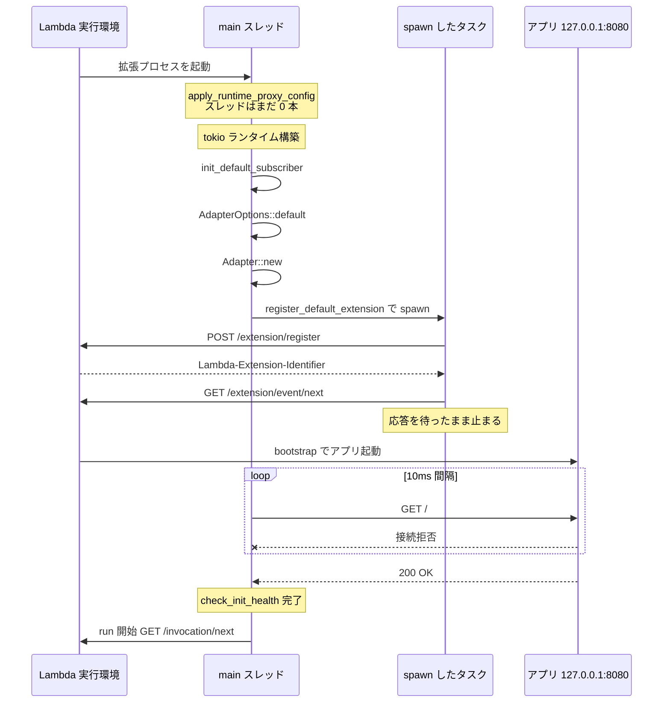

## 何を学んだか

[`src/main.rs`](https://github.com/aws/aws-lambda-web-adapter/blob/986113fc66f368f0187a25c683f1ab39a68cc6c6/src/main.rs) は 38 行で、そのうち半分はコメントである。ロジックは 1 行もない。にもかかわらず、この 4 つの呼び出しの**順序にはすべて理由がある**。

```rust title="src/main.rs"
fn main() -> Result<(), Error> {
    // Apply runtime proxy configuration BEFORE starting tokio runtime
    // This must happen before any threads are spawned to avoid unsafe env::set_var
    Adapter::apply_runtime_proxy_config();

    // Start tokio runtime
    tokio::runtime::Builder::new_multi_thread()
        .enable_all()
        .build()
        .unwrap()
        .block_on(async_main())
}

async fn async_main() -> Result<(), Error> {
    tracing::init_default_subscriber();

    // get configuration options from environment variables
    let options = AdapterOptions::default();

    // create an adapter
    let mut adapter = Adapter::new(&options)?;
    // register the adapter as an extension
    adapter.register_default_extension();
    // check if the web application is ready
    adapter.check_init_health().await;
    // start lambda runtime after the web application is ready
    adapter.run().await?;

    Ok(())
}
```

`#[tokio::main]` を使えば 2 行減る。それでも手でランタイムを組み立てているのは、**1 行目を tokio より前に置きたいから**である。

## ソースコードのどこか

### 1. `apply_runtime_proxy_config` が最初にある理由

[`src/lib.rs#L908`](https://github.com/aws/aws-lambda-web-adapter/blob/986113fc66f368f0187a25c683f1ab39a68cc6c6/src/lib.rs#L908)。

```rust title="src/lib.rs"
pub fn apply_runtime_proxy_config() {
    if let Ok(runtime_proxy) = env::var(ENV_LAMBDA_RUNTIME_API_PROXY) {
        let original = env::var(ENV_LAMBDA_RUNTIME_API).ok();
        let _ = ORIGINAL_LAMBDA_RUNTIME_API.set(original);

        // We need to overwrite the env variable because lambda_http::run()
        // calls lambda_runtime::run() which doesn't allow changing the client URI.
        //
        // This is safe here because it's called before the tokio runtime starts,
        // ensuring no other threads exist yet.
        env::set_var(ENV_LAMBDA_RUNTIME_API, runtime_proxy);
    }
}
```

`std::env::set_var` はプロセス全体のグローバル状態を書き換える。POSIX の `setenv` は他スレッドが `getenv` している最中に呼ぶとデータ競合になり、Rust では将来 `unsafe fn` になることが決まっている。

`#[tokio::main]` を使うと、`main` の本体に入った時点でマルチスレッドランタイムのワーカースレッドが既に立っている。その状態で `set_var` を呼ぶのは未定義動作になりうる。**だから tokio を後ろに追いやり、スレッドが 1 本もない `main` の最初の文で呼ぶ**。関数のドキュメントコメントにも「must be called before starting the tokio runtime」と明記されている。

書き換えが必要な理由そのもの (なぜ環境変数を経由するのか) は [Runtime API プロキシ — 通信に割り込む](../runtime-api-proxy/) にある。

### 2. `tracing::init_default_subscriber()`

`lambda_http` が再エクスポートしている [`lambda-runtime-api-client/src/tracing.rs`](https://github.com/aws/aws-lambda-rust-runtime/blob/6f305bb00f3cc613fd82f88d2f2200e8089e4385/lambda-runtime-api-client/src/tracing.rs) の関数である。LWA は独自のロガーを持たず、これを呼ぶだけで済ませている。

この関数が読む環境変数は 3 つ。

| 環境変数                | 効果                                                       |
| ----------------------- | ---------------------------------------------------------- |
| `AWS_LAMBDA_LOG_LEVEL`  | ログレベル。最優先                                         |
| `RUST_LOG`              | `AWS_LAMBDA_LOG_LEVEL` がないときのフォールバック          |
| `AWS_LAMBDA_LOG_FORMAT` | `JSON` なら `collector.json()`、それ以外は既定フォーマット |

どちらも設定がなければ `INFO`。`AWS_LAMBDA_LOG_LEVEL` / `AWS_LAMBDA_LOG_FORMAT` は Lambda の Advanced Logging Controls が設定する変数なので、**マネジメントコンソールでログレベルを JSON / DEBUG に切り替えると、アダプタのログもそれに追従する**。アダプタ側に専用の設定項目がないのはこのためである。

なお `.without_time()` が付いているので、アダプタのログ行にタイムスタンプは入らない。CloudWatch Logs 側が時刻を持つため二重に出す意味がない。

### 3. `register_default_extension()` は待たない

[`src/lib.rs#L675`](https://github.com/aws/aws-lambda-web-adapter/blob/986113fc66f368f0187a25c683f1ab39a68cc6c6/src/lib.rs#L675)。

```rust title="src/lib.rs"
pub fn register_default_extension(&self) {
    tokio::task::spawn(async move {
        if let Err(e) = Self::register_extension_internal().await {
            tracing::error!(error = %e, "Extension registration failed - terminating process");
            std::process::exit(1);
        }
    });
}
```

`async fn` ですらない。`tokio::task::spawn` に投げて、`JoinHandle` は捨てている。呼び出し側の `async_main` も `.await` しない。

投げっぱなしにできるのは、**成功したときに返り値として欲しいものが何もない**からである。登録が終わるとタスクは `GET /extension/event/next` の応答待ちに入り、そのまま実行環境の寿命いっぱい止まる。待っても何も返ってこない。詳細は [拡張として登録する](../extension-registration/)。

失敗経路だけが特別扱いされている。`Err` を上へ返す先がない (呼び出し元はもう次へ進んでいる) ので、その場で `std::process::exit(1)` する。

### 4. `check_init_health()` が `run()` より前にある

これが起動順序で一番効いている 1 行である。`check_init_health` はアプリが `127.0.0.1:8080` に応答するまで戻らない ([レディネスチェック](../readiness-check/))。それが終わるまで `run()` に進まないので、**アダプタは `GET /invocation/next` を 1 回も叩かない**。

Runtime API は `/next` を叩いて初めてイベントを渡す。叩かなければイベントは来ない。つまり「アプリが起動する前にイベントが届いて 502 になる」という事故が、`await` の位置ひとつで構造的に防がれている。ポーリング型プロトコルの利点がそのまま設計に効いている例である。



## なぜそうなっているか

`register_default_extension` を投げっぱなしにし、`check_init_health` を待つ — この非対称が「Init フェーズが完了する条件」から来ている。

Lambda の Init フェーズは、**登録済みの全拡張が `event/next` を呼ぶまで完了しない**。だから拡張登録タスクは「進めばよい」だけで、完了を待つ意味がない。一方レディネスチェックは、待たなければ意味そのものが失われる。

順序をまとめると次になる。

1. スレッドが立つ前でなければ安全でないもの (`set_var`)
2. 以降のすべてのログが必要とするもの (subscriber)
3. 設定の読み取りと検証 (`AdapterOptions::default` → `Adapter::new` の `?`)
4. 進めておけばよいもの (拡張登録)
5. 待たなければ意味がないもの (レディネス)
6. 戻ってこないもの (`run`)

「制約が強いものから順に前へ」という並びになっている。3 の `Adapter::new` が `Result` を返して `?` で落ちるのも同じ発想で、**ホスト・ポート・パスから URL が組み立てられないという設定ミスは、イベントを 1 件も受ける前に落として気づかせる**。

## どう活かすか

- **`#[tokio::main]` を外すべき場面がある。** `env::set_var`・`signal` ハンドラの設定・`fork` の前処理など、「スレッドが立つ前でなければ困る処理」があるなら、属性マクロをやめて `Builder` を手で書く。LWA はその実例で、コメントで理由も残している
- **`spawn` して待たないタスクは、失敗をどう扱うかを必ず決める。** LWA は `JoinHandle` を捨てる代わりに、タスク内でログを出して `exit(1)` している。捨てた `JoinHandle` の中でパニックが握り潰される事故を避ける最小のやり方である
- **`await` の位置が仕様になることがある。** 「レディネスチェックが終わるまで `/next` を叩かない」は、ドキュメントに書かれた仕様ではなく `async_main` の行順そのものである。ポーリング型のクライアントを書くときは、最初のポールをどこに置くかを意識的に決める
- 環境変数の一覧は [`AdapterOptions::default`](https://github.com/aws/aws-lambda-web-adapter/blob/986113fc66f368f0187a25c683f1ab39a68cc6c6/src/lib.rs#L386) にある。次の節で表にする

## 付録: `AdapterOptions::default` が読む環境変数

[`src/lib.rs#L386`](https://github.com/aws/aws-lambda-web-adapter/blob/986113fc66f368f0187a25c683f1ab39a68cc6c6/src/lib.rs#L386)。

| 正しい名前                               | 非推奨の旧名                | 既定値                |
| ---------------------------------------- | --------------------------- | --------------------- |
| `AWS_LWA_PORT`                           | `PORT` (**非推奨ではない**) | `8080`                |
| `AWS_LWA_HOST`                           | `HOST`                      | `127.0.0.1`           |
| `AWS_LWA_READINESS_CHECK_PORT`           | `READINESS_CHECK_PORT`      | `AWS_LWA_PORT` と同じ |
| `AWS_LWA_READINESS_CHECK_PATH`           | `READINESS_CHECK_PATH`      | `/`                   |
| `AWS_LWA_READINESS_CHECK_PROTOCOL`       | `READINESS_CHECK_PROTOCOL`  | `HTTP`                |
| `AWS_LWA_READINESS_CHECK_HEALTHY_STATUS` | なし                        | `100-499`             |
| `AWS_LWA_REMOVE_BASE_PATH`               | `REMOVE_BASE_PATH`          | なし                  |
| `AWS_LWA_ASYNC_INIT`                     | `ASYNC_INIT`                | `false`               |
| `AWS_LWA_PASS_THROUGH_PATH`              | なし                        | `/events`             |
| `AWS_LWA_ENABLE_COMPRESSION`             | なし                        | `false`               |
| `AWS_LWA_INVOKE_MODE`                    | なし                        | `buffered`            |
| `AWS_LWA_AUTHORIZATION_SOURCE`           | なし                        | なし                  |
| `AWS_LWA_ERROR_STATUS_CODES`             | なし                        | なし                  |

フォールバックは 2 つのヘルパにまとまっている ([`src/lib.rs#L355`](https://github.com/aws/aws-lambda-web-adapter/blob/986113fc66f368f0187a25c683f1ab39a68cc6c6/src/lib.rs#L355))。

```rust title="src/lib.rs"
fn get_env_with_deprecation(new_name: &str, old_name: &str, default: &str) -> String {
    if let Ok(val) = env::var(new_name) {
        return val;
    }
    if let Ok(val) = env::var(old_name) {
        tracing::warn!(
            "Environment variable '{}' is deprecated and will be removed in version 2.0. Please use '{}' instead.",
            old_name, new_name
        );
        return val;
    }
    default.to_string()
}
```

旧名を使うと警告ログが出て、v2.0 で削除されることも告げられる。

例外が `PORT` である。`port` だけはこのヘルパを通らず、`env::var(ENV_PORT).or_else(|_| env::var(ENV_PORT_DEPRECATED))` という素の `or_else` で書かれていて、警告が出ない。

```rust title="src/lib.rs"
let port = env::var(ENV_PORT)
    .or_else(|_| env::var(ENV_PORT_DEPRECATED))
    .unwrap_or_else(|_| "8080".to_string());
```

ドキュメントコメントにも「Note: `PORT` is not deprecated and remains a supported fallback for `AWS_LWA_PORT`」と明記されている。`PORT` は LWA が決めた名前ではなく、Heroku 以来 PaaS が共通で使ってきた慣習的な変数で、アプリ側が既に読んでいる可能性が高い。**アダプタとアプリが同じ変数を見ることで設定が 1 か所で済む**ので、これだけは残されている。

`readiness_check_port` の既定値が `port` になっている点にも注意がいる。`PORT` を設定すると、ヘルスチェックの宛先も同時に動く。
