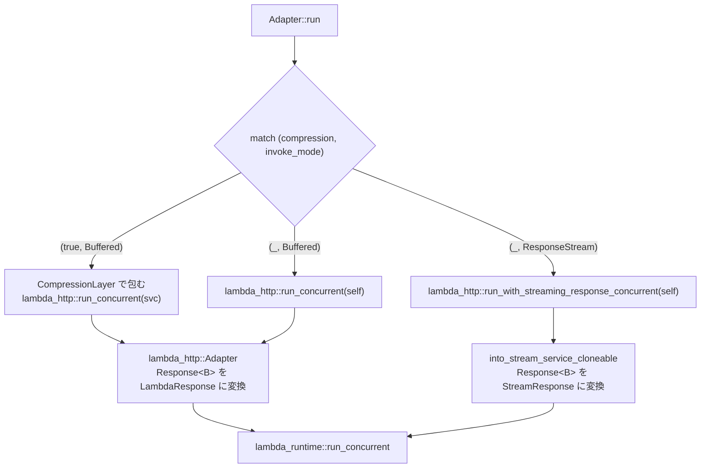

## 何を学んだか

`Adapter::run` は 10 行しかない。そしてこれが**アダプタが持つ制御フローの終点**である。

```rust title="src/lib.rs"
pub async fn run(self) -> Result<(), Error> {
    match (self.compression, self.invoke_mode) {
        (true, LambdaInvokeMode::Buffered) => {
            let svc = ServiceBuilder::new().layer(CompressionLayer::new()).service(self);
            lambda_http::run_concurrent(svc).await
        }
        (_, LambdaInvokeMode::Buffered) => lambda_http::run_concurrent(self).await,
        (_, LambdaInvokeMode::ResponseStream) => lambda_http::run_with_streaming_response_concurrent(self).await,
    }
}
```

([`src/lib.rs#L862`](https://github.com/aws/aws-lambda-web-adapter/blob/986113fc66f368f0187a25c683f1ab39a68cc6c6/src/lib.rs#L862))

この `await` に入ったら、アダプタのコードには**二度と戻ってこない**。イベントの受信も、レスポンスの送信も、エラー時の `/error` への POST も、以降は全部 `lambda_runtime` のループの中で起きる ([ランタイムのメインループ](../runtime-loop/))。アダプタが再び登場するのは、`tower::Service` として `call` が呼ばれる瞬間だけだ。

```rust title="src/lib.rs"
fn call(&mut self, event: Request) -> Self::Future {
    let adapter = self.clone();
    Box::pin(async move { adapter.fetch_response(event).await })
}
```

([`src/lib.rs#L1056`](https://github.com/aws/aws-lambda-web-adapter/blob/986113fc66f368f0187a25c683f1ab39a68cc6c6/src/lib.rs#L1056))

**制御の反転**である。アダプタは「イベントを取ってきてアプリに投げてレスポンスを返す」というループを自分で書いていない。書いたのは「1 件のイベントを 1 件のレスポンスに変える関数」だけで、それをランタイムに渡している。ループの所有権を手放したことが、この OSS を 600 行に収めている一番大きな理由だ。

## ソースコードのどこか

分岐の入力は `Adapter` の 2 つのフィールド、`compression` と `invoke_mode` である。どちらも環境変数から決まる。



3 分岐といっても `invoke_mode` で見れば 2 つで、`compression` が真になれるのは buffered のときだけである。ストリーミングとの組み合わせは `Adapter::new` の時点で潰されている ([`src/lib.rs#L635`](https://github.com/aws/aws-lambda-web-adapter/blob/986113fc66f368f0187a25c683f1ab39a68cc6c6/src/lib.rs#L635))。

```rust title="src/lib.rs"
let compression = if options.compression && options.invoke_mode == LambdaInvokeMode::ResponseStream {
    tracing::warn!("Compression is not supported with response streaming. Disabling compression.");
    false
} else {
    options.compression
};
```

だから `run()` の match には `(true, ResponseStream)` の腕が要らない。理由は [レスポンス圧縮と、ストリーミングと併用できない理由](../compression/) で扱う。

### 2 つのモードの違い

|                       | buffered                                                                                                                                                                           | response_stream                                                                                                                                                                                         |
| --------------------- | ---------------------------------------------------------------------------------------------------------------------------------------------------------------------------------- | ------------------------------------------------------------------------------------------------------------------------------------------------------------------------------------------------------- |
| 呼ばれる関数          | `lambda_http::run_concurrent`                                                                                                                                                      | `run_with_streaming_response_concurrent`                                                                                                                                                                |
| Service の変換        | `lambda_http::Adapter` ([`lambda-http/src/lib.rs#L182`](https://github.com/aws/aws-lambda-rust-runtime/blob/6f305bb00f3cc613fd82f88d2f2200e8089e4385/lambda-http/src/lib.rs#L182)) | `into_stream_service_cloneable` ([`lambda-http/src/streaming.rs#L122`](https://github.com/aws/aws-lambda-rust-runtime/blob/6f305bb00f3cc613fd82f88d2f2200e8089e4385/lambda-http/src/streaming.rs#L122)) |
| ハンドラの戻り値の型  | `LambdaResponse`                                                                                                                                                                   | `StreamResponse<BodyStream<B>>`                                                                                                                                                                         |
| ボディの扱い          | 全部読み切って JSON に入れる                                                                                                                                                       | 読まずにチャンクで流す                                                                                                                                                                                  |
| base64 変換           | あり (`ConvertBody`)                                                                                                                                                               | なし                                                                                                                                                                                                    |
| Runtime API への POST | JSON 1 発                                                                                                                                                                          | chunked + メタデータプレリュード                                                                                                                                                                        |
| 圧縮                  | 可能                                                                                                                                                                               | 不可                                                                                                                                                                                                    |
| 対応トリガー          | 全部                                                                                                                                                                               | Function URL と API Gateway のプロキシ統合。ALB は非対応                                                                                                                                                |

buffered 側の `LambdaResponse` はイベント形式ごとに 4 種類あり、レスポンスがどの JSON になるかはリクエストの出自 (`RequestOrigin`) で決まる ([レスポンスが base64 になるかを決めているところ](../lambda-http-response/))。ストリーミング側にはこの分岐がない。`StreamResponse` は「メタデータのヘッダ群 + ボディのバイト列」でしかなく、API Gateway 形式も ALB 形式も存在しない。これが「ストリーミングはトリガーを選ぶ」ことの、コード上の現れである。

### AWS_LWA_INVOKE_MODE のパース

`invoke_mode` は `From<&str>` で決まる ([`src/lib.rs#L215`](https://github.com/aws/aws-lambda-web-adapter/blob/986113fc66f368f0187a25c683f1ab39a68cc6c6/src/lib.rs#L215))。

```rust title="src/lib.rs"
impl From<&str> for LambdaInvokeMode {
    fn from(value: &str) -> Self {
        match value.to_lowercase().as_str() {
            "buffered" => LambdaInvokeMode::Buffered,
            "response_stream" => LambdaInvokeMode::ResponseStream,
            _ => LambdaInvokeMode::Buffered,
        }
    }
}
```

3 点ある。

1. `to_lowercase()` してから比較するので、`RESPONSE_STREAM` でも `response_stream` でも通る。公式のサンプルテンプレートは大文字で書いている。
2. **不明な値は黙って `Buffered` にフォールバックする。** ログも出ない。`AWS_LWA_INVOKE_MODE=streaming` と書き間違えると、警告なしに buffered で動く。
3. デフォルト値は `AdapterOptions::default` が `"buffered"` という文字列で与えている ([`src/lib.rs#L430`](https://github.com/aws/aws-lambda-web-adapter/blob/986113fc66f368f0187a25c683f1ab39a68cc6c6/src/lib.rs#L430))。環境変数が未設定でも `From<&str>` を通る。

## なぜそうなっているか

`run()` がこれだけ短いのは、**2 つのモードの違いを表現する場所がアダプタの外にある**からだ。

buffered とストリーミングでは、Runtime API に投げるリクエストの形が根本的に違う。前者は `POST /invocation/{id}/response` に JSON を 1 発、後者は `Transfer-Encoding: chunked` でメタデータとボディを流し続ける ([ストリーミングレスポンスのワイヤ形式](../response-streaming-protocol/))。しかしその差は `lambda_runtime::requests::EventCompletionRequest::into_req` の中の `match` 1 個に閉じ込められている。アダプタ側は「どちらのランナーを呼ぶか」を決めるだけでよい。

そして 2 つのランナーに渡す `self` は**同じもの**である。`Adapter` は `Service<Request, Response = Response<Incoming>>` を 1 つ実装しているだけで、buffered 用とストリーミング用の実装を持ち分けていない。`fetch_response` が返す `Response<Incoming>` は「ボディがまだ読まれていない hyper のレスポンス」で、これを読み切って JSON にするか、チャンクのまま流すかは受け取り側の自由だ。**同じ型が両方のモードに使える**という性質が、分岐を 1 か所に閉じ込めている。

`ServiceBuilder::new().layer(CompressionLayer::new()).service(self)` が 1 行で書けるのも同じ理由である。`Adapter` が `tower::Service` である限り、ミドルウェアはいくらでも外側に巻ける。圧縮のためにアダプタ本体のコードを変える必要はない。

## どう活かすか

**「ループを自分で持たない」設計を真似する価値がある。** 「イベント 1 件 → レスポンス 1 件」の関数だけを書いて、ポーリング・リトライ・並行度・エラー報告はフレームワークに任せる。この分割ができていると、並行ポーリングの導入 ([並行ポーリング — /next を N 本同時に張る](../concurrent-polling/)) のような大きな変更が、アダプタ側の差分ゼロで入ってくる。実際 LWA は `run` を `run_concurrent` に置き換えただけで Lambda Managed Instances に対応している。

**設定を 2 か所で一致させる必要があることは覚えておく。** アダプタ側の `AWS_LWA_INVOKE_MODE=RESPONSE_STREAM` と、Function URL 側の `InvokeMode: RESPONSE_STREAM` は別の設定であり、どちらか片方だけでは動かない。公式サンプルはこう書いている。

```yaml title="examples/fastapi-response-streaming/template.yaml"
Environment:
  Variables:
    AWS_LWA_INVOKE_MODE: RESPONSE_STREAM
FunctionUrlConfig:
  AuthType: NONE
  InvokeMode: RESPONSE_STREAM
```

食い違うと症状が分かりにくい。アダプタだけストリーミングにして Function URL が `BUFFERED` のままだと、Lambda は `Invoke` API で呼ばれるためストリームは結局バッファされ、遅延は縮まらない。逆に Function URL だけ `RESPONSE_STREAM` にしてアダプタが buffered だと、`InvokeWithResponseStream` で呼ばれるがランタイムがストリーム形式のレスポンスを返さないので、ストリーミングにならない。

**不明な値が黙って buffered になる**ことも実務では効いてくる。ストリーミングが効かないときは、まず環境変数の綴りを疑うとよい。`buffered` / `response_stream` の 2 つ以外はすべて buffered である。
