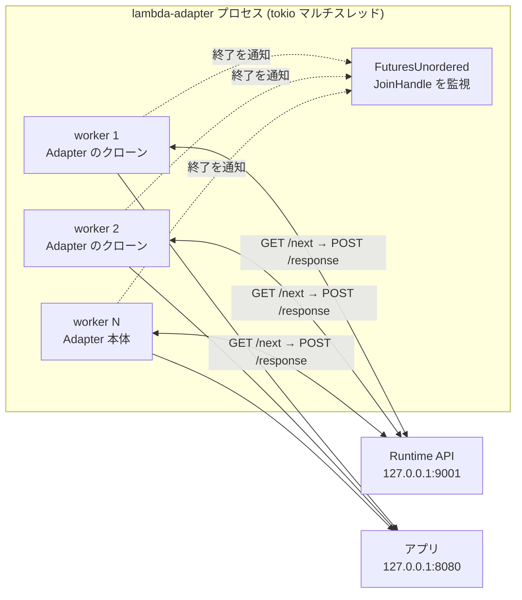

## 何を学んだか

Lambda は長らく「1 実行環境 = 同時に 1 invocation」だった。だからランタイムのループも 1 本でよく、`_X_AMZN_TRACE_ID` のようなプロセス全体の状態を invocation ごとに書き換えることが許された。

Lambda Managed Instances ではこれが崩れる。1 つの実行環境が複数の invocation を同時に処理するので、ランタイムは `/next` を複数本張らなければならない。

`lambda_runtime` はこれを `run_concurrent` という**別の入口**として実装した。そして LWA は `run` ではなく `run_concurrent` しか呼ばない。

```rust title="src/lib.rs"
pub async fn run(self) -> Result<(), Error> {
    match (self.compression, self.invoke_mode) {
        (true, LambdaInvokeMode::Buffered) => {
            let svc = ServiceBuilder::new().layer(CompressionLayer::new()).service(self);
            lambda_http::run_concurrent(svc).await
        }
        (_, LambdaInvokeMode::Buffered) => lambda_http::run_concurrent(self).await,
        (_, LambdaInvokeMode::ResponseStream) => lambda_http::run_with_streaming_response_concurrent(self).await,
    }
}
```

[`src/lib.rs#L862`](https://github.com/aws/aws-lambda-web-adapter/blob/986113fc66f368f0187a25c683f1ab39a68cc6c6/src/lib.rs#L862)。3 分岐すべてが `_concurrent` 系だ。**LWA は常に Managed Instances 対応モードで動いている。**

## ソースコードのどこか

### まず逐次モードへのフォールバックを見る

[`lambda-runtime/src/runtime.rs#L183`](https://github.com/aws/aws-lambda-rust-runtime/blob/6f305bb00f3cc613fd82f88d2f2200e8089e4385/lambda-runtime/src/runtime.rs#L183):

```rust title="lambda-runtime/src/runtime.rs"
pub async fn run_concurrent(self) -> Result<(), BoxError> {
    if tokio::runtime::Handle::try_current().is_err() {
        panic!("`run_concurrent` must be called from within a Tokio runtime");
    }

    if self.concurrency_limit > 1 {
        trace!("Concurrent mode: _X_AMZN_TRACE_ID is not set; use context.xray_trace_id");
        Self::run_concurrent_inner(self.service, self.config, self.client, self.concurrency_limit).await
    } else {
        debug!(
            "Concurrent polling disabled (AWS_LAMBDA_MAX_CONCURRENCY unset or <= 1); falling back to sequential polling"
        );
        let incoming = incoming(&self.client);
        Self::run_with_incoming(self.service, self.config, incoming).await
    }
}
```

`concurrency_limit` は `Runtime::new` で決まっている。

```rust title="lambda-runtime/src/runtime.rs"
fn max_concurrency_from_env() -> Option<u32> {
    env::var("AWS_LAMBDA_MAX_CONCURRENCY")
        .ok()
        .and_then(|v| v.parse::<u32>().ok())
        .filter(|&c| c > 0)
}
```

未設定でも、パースできなくても、0 でも `None` → `unwrap_or(1).max(1)` で 1 になり、逐次モードに落ちる。**同じバイナリが従来の Lambda でも Managed Instances でも動くのはこの分岐のおかげだ。** LWA が `run` を一切呼ばないのはこのため — `run_concurrent` が `run` を包含している。

### N 本のワーカーを立てる

[`run_concurrent_inner`](https://github.com/aws/aws-lambda-rust-runtime/blob/6f305bb00f3cc613fd82f88d2f2200e8089e4385/lambda-runtime/src/runtime.rs#L201):

```rust title="lambda-runtime/src/runtime.rs"
// Use FuturesUnordered so we can observe worker exits as they happen,
// rather than waiting for all workers to finish (join_all).
let mut workers: FuturesUnordered<tokio::task::JoinHandle<(tokio::task::Id, Result<(), BoxError>)>> =
    FuturesUnordered::new();
let spawn_worker = |service: S, config: Arc<Config>, client: Arc<ApiClient>| {
    tokio::spawn(async move {
        let task_id = tokio::task::id();
        let result = concurrent_worker_loop(service, config, client).await;
        (task_id, result)
    })
};
// Spawn one worker per concurrency slot; the last uses the owned service to avoid an extra clone.
for _ in 1..limit {
    workers.push(spawn_worker(service.clone(), config.clone(), client.clone()));
}
workers.push(spawn_worker(service, config, client));
```

`service.clone()` が N-1 回。だから `run_concurrent` は `S: Clone + Send + 'static` を要求する。LWA の `Adapter` が `Clone` なのはこの制約に合わせているからだ (`call` の中でも `self.clone()` している)。

### ワーカーは独立に /next を張る

[`concurrent_worker_loop`](https://github.com/aws/aws-lambda-rust-runtime/blob/6f305bb00f3cc613fd82f88d2f2200e8089e4385/lambda-runtime/src/runtime.rs#L459):

```rust title="lambda-runtime/src/runtime.rs"
let task_id = tokio::task::id();
let span = info_span!("worker", task_id = %task_id);
loop {
    let event = match next_event_future(client.as_ref()).instrument(span.clone()).await {
        Ok(event) => event,
        Err(e) => {
            warn!(task_id = %task_id, error = %e, "Error polling /next, retrying");
            continue;
        }
    };

    process_invocation(&mut service, &config, event, false)
        .instrument(span.clone())
        .await?;
}
```

**共有キューは無い。** ワーカーは各自 `/next` に GET を投げ、Runtime API 側がイベントを 1 本のコネクションに割り当てる。振り分けは Lambda 側の仕事で、ランタイム側は「N 本の口を開けておく」だけだ。

逐次ループとの差がもう 1 つある。`/next` のエラーは `continue` で握り潰して再試行する (逐次モードは `?` で終了)。イベント処理側のエラーは `?` で、そのワーカーだけが終わる。

`process_invocation` の第 4 引数が `false` — つまり `_X_AMZN_TRACE_ID` を設定しない。



### 1 本落ちても止めない

```rust title="lambda-runtime/src/runtime.rs"
// Track worker exits across tasks. A single worker failing should not
// terminate the whole runtime (LMI keeps running with the remaining
// healthy workers). We only return an error once there are no workers
// left (i.e., we cannot keep at least 1 worker alive).
//
// Note: Handler errors (Err returned from user code) do NOT trigger this.
// They are reported to Lambda via /invocation/{id}/error and the worker
// continues. This only captures unrecoverable runtime failures like
// API client failures, runtime panics, etc.
let mut errors: Vec<WorkerError> = Vec::new();
let mut remaining_workers = limit;
while let Some(result) = futures::StreamExt::next(&mut workers).await {
    remaining_workers = remaining_workers.saturating_sub(1);
    // ... errors.push(...)
}

match errors.len() {
    0 => Ok(()),
    _ => Err(Box::new(ConcurrentWorkerErrors { errors })),
}
```

`while let Some(...) = workers.next().await` は `FuturesUnordered` が空になるまで回る。全ワーカーが終わって初めてループを抜け、そのとき初めて `Err` を返す。

終了の理由は 3 通りに分類される ([L240](https://github.com/aws/aws-lambda-rust-runtime/blob/6f305bb00f3cc613fd82f88d2f2200e8089e4385/lambda-runtime/src/runtime.rs#L240) 付近)。

- `Ok((id, Ok(())))` — ループは無限のはずなので、正常終了自体が異常。`WorkerError::CleanExit`
- `Ok((id, Err(e)))` — `process_invocation` が `Err` を返した
- `Err(join_err)` — タスクがパニックした

いずれも `remaining_workers` を減らしてログに出す。最終的なエラーは `ConcurrentWorkerErrors` で、`Display` が JSON を吐く ([L311](https://github.com/aws/aws-lambda-rust-runtime/blob/6f305bb00f3cc613fd82f88d2f2200e8089e4385/lambda-runtime/src/runtime.rs#L311))。

### トレース ID の受け渡し

並行モードでは環境変数を使わない代わりに、`lambda_http` が `Context` からリクエストヘッダに移す。[`lambda-http/src/lib.rs#L269`](https://github.com/aws/aws-lambda-rust-runtime/blob/6f305bb00f3cc613fd82f88d2f2200e8089e4385/lambda-http/src/lib.rs#L269):

```rust title="lambda-http/src/lib.rs"
// In concurrent mode we must use the per-request context.
fn update_xray_trace_id_header(headers: &mut http::HeaderMap, context: &Context) {
    if let Some(trace_id) = context.xray_trace_id.as_deref() {
        if let Ok(header_value) = http::HeaderValue::from_str(trace_id) {
            headers.insert(http::header::HeaderName::from_static("x-amzn-trace-id"), header_value);
        }
    }
}
```

`Adapter::call` ([L200](https://github.com/aws/aws-lambda-rust-runtime/blob/6f305bb00f3cc613fd82f88d2f2200e8089e4385/lambda-http/src/lib.rs#L200)) と `event_to_request` ([`streaming.rs#L166`](https://github.com/aws/aws-lambda-rust-runtime/blob/6f305bb00f3cc613fd82f88d2f2200e8089e4385/lambda-http/src/streaming.rs#L166)) の両方から呼ばれるので、バッファモードでもストリーミングモードでも同じように付く。`Context::xray_trace_id` の出どころは `/next` の `lambda-runtime-trace-id` ヘッダだ ([/next のレスポンスヘッダが Context になる](../invocation-headers/))。

## なぜそうなっているか

**`FuturesUnordered` を選んだのは、ワーカーの死をその場で観測するため。** `join_all` は全部終わるまで何も返さないので、10 本中 1 本が最初の 1 分で死んでも、残り 9 本が動いている限り誰も気づかない。`FuturesUnordered` なら完了した順に `next()` が返るので、死んだ瞬間に `remaining_workers` を減らしてログを出せる。しかも残りは走り続ける。

**それでも全部落ちるまでエラーを返さないのは、Managed Instances の可用性のため。** ワーカー 1 本の死は「同時実行スロットが 1 つ減った」であって「この実行環境が使えなくなった」ではない。9 本で処理を続けられるなら続けるほうがいい。全部落ちて初めて、この実行環境はもう何もできないと判断する。

**プールサイズを `concurrency_limit` に合わせるのは、この設計の直接の帰結だ。** ワーカーを最初に全部立てるので、Runtime API 向けのコネクションも同時に N 本必要になる。`Runtime::new` のコメント `Strategy: allocate all worker tasks up-front, so size the client pool to match.` がそれを明言している。プールが足りなければ、`/next` を張るたびに TCP ハンドシェイクからやり直すことになる。

**`_X_AMZN_TRACE_ID` を設定しないのは、環境変数がプロセスに 1 個しかないから。** 10 本のワーカーが同時に別々のトレース ID を持っているのに、格納先が 1 個しかない。`set_var` した瞬間に他の 9 本のトレース ID を踏む。加えて `std::env::set_var` はマルチスレッド環境では健全でない (将来の Rust で `unsafe` になる) という問題もある。だからコード上のコメントは「`context.xray_trace_id` を使え」と指示している。

**`x-amzn-trace-id` ヘッダに移し替えるのが、LWA にとっては都合がいい。** LWA はイベントを HTTP リクエストとしてアプリに転送するので、リクエストヘッダに載っていればそのままアプリに届く。アプリ側の X-Ray SDK は「上流から `X-Amzn-Trace-Id` ヘッダを受け取る」という、Web サーバとして極めて普通の経路でトレースを繋げる。環境変数だったら LWA が読んで詰め直す必要があった。

**`run_concurrent` が Tokio ランタイムの外で呼ばれるとパニックするのは、`tokio::spawn` を使うから。** LWA は `main.rs` で明示的にマルチスレッドランタイムを組み立ててから `block_on` している ([main の 4 行 — 起動順序には理由がある](../bootstrap-and-startup/))。

## どう活かすか

- **`AWS_LAMBDA_MAX_CONCURRENCY` は Lambda 側が設定する環境変数**で、アプリが勝手に決めるものではない。ただし値がそのままワーカー数・プールサイズ・アプリへの同時接続数になるので、アプリ側のワーカー数がそれ以下だとそこがボトルネックになる。Express なら 1 プロセスで捌けるが、同期型の Python (gunicorn の sync worker など) では詰まる。
- **LWA は `run_concurrent` しか呼ばないので、従来の Lambda でも並行モードのコードパスを通る。** ただし環境変数が無ければ内部で逐次にフォールバックするので、挙動は従来と変わらない。
- **アプリ側で X-Ray を使うなら、環境変数ではなく `X-Amzn-Trace-Id` リクエストヘッダを読む。** 多くの言語の X-Ray SDK は Web フレームワーク統合を入れれば自動でヘッダを見るので、それに任せるのが正しい。環境変数を直接読む自前実装が入っていると、Managed Instances でトレースが繋がらなくなる。
- **`Concurrent worker exited` というログが出たら、同時実行スロットが減っている。** `remaining_workers` フィールドが残数なので、これが減り続けているならスループットが落ちる前触れになる。
