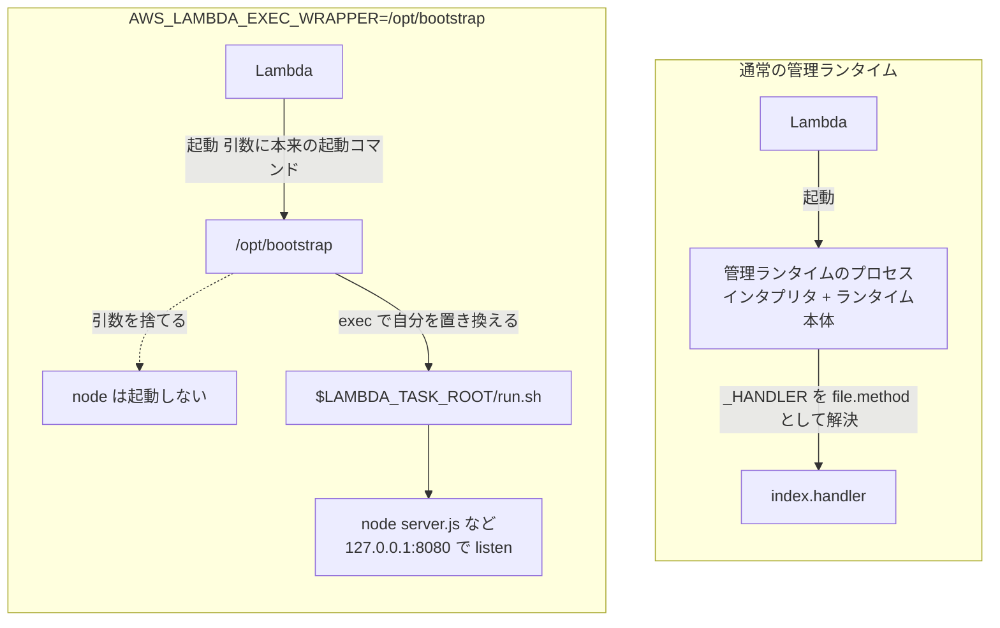

## 何を学んだか

Web Adapter を Zip パッケージで使うときの設定は、次の 3 つだけだ。

1. Layer をアタッチする (`arn:aws:lambda:${AWS::Region}:753240598075:layer:LambdaAdapterLayerX86:28` など)
2. 環境変数 `AWS_LAMBDA_EXEC_WRAPPER` に `/opt/bootstrap` を設定する
3. Handler を Web アプリの起動スクリプト名 (例: `run.sh`) にする

注目すべきは、**`Runtime` が `nodejs20.x` や `python3.12` のまま**であることだ。`provided.al2023` に切り替える必要はない。

```yaml title="docs/guide/src/getting-started/zip-packages.md"
Resources:
  MyFunction:
    Type: AWS::Serverless::Function
    Properties:
      Runtime: nodejs20.x
      Handler: run.sh
      Layers:
        - !Sub arn:aws:lambda:${AWS::Region}:753240598075:layer:LambdaAdapterLayerX86:28
      Environment:
        Variables:
          AWS_LAMBDA_EXEC_WRAPPER: /opt/bootstrap
          AWS_LWA_PORT: 7000
```

[`docs/guide/src/getting-started/zip-packages.md#L37-L50`](https://github.com/aws/aws-lambda-web-adapter/blob/986113fc66f368f0187a25c683f1ab39a68cc6c6/docs/guide/src/getting-started/zip-packages.md#L37-L50)

`Runtime: nodejs20.x` なのに `Handler: run.sh` という組み合わせは、普通なら成立しない。Node.js ランタイムは `Handler` を `file.method` の形式として解釈するからだ。それが動いてしまうのは、**Node.js ランタイムのプロセスが一度も起動しないから**だ。

### 前提: カスタムランタイムの `bootstrap` 規約

まず土台になる話から。`provided.al2023` のような OS-only ランタイム (`provided` ファミリ) では、Lambda はデプロイパッケージ直下の **`bootstrap` という実行ファイルを起動するだけ**だ。それが何であっても構わない。バイナリでもシェルスクリプトでもいい。パッケージ直下に無ければ Layer の中を探し、それも無ければ `Runtime.InvalidEntrypoint` エラーになる ([Building a custom runtime for AWS Lambda](https://docs.aws.amazon.com/lambda/latest/dg/runtimes-custom.html))。

起動された `bootstrap` は、次の環境変数を読んで自分で状況を把握する。

- **`_HANDLER`** — 関数設定の Handler 欄の値。標準的なフォーマットは `file.method` だが、**Lambda 側はこの文字列を解釈しない。**意味づけはランタイムの仕事
- **`LAMBDA_TASK_ROOT`** — 関数コードが置かれたディレクトリ
- **`AWS_LAMBDA_RUNTIME_API`** — Runtime API の host:port

つまり `_HANDLER` は「ランタイムに渡される自由な文字列」でしかない。ここが後で効いてくる。

### 本題: `AWS_LAMBDA_EXEC_WRAPPER` によるランタイム乗っ取り

`AWS_LAMBDA_EXEC_WRAPPER` は、Lambda が**管理ランタイム向け**に用意しているフックだ。元々は OpenTelemetry の計装エージェントを差し込むといった用途を想定している。AWS のドキュメントはこう説明している。

> When you use a wrapper script for your function, Lambda starts the runtime using your script. Lambda sends to your script the path to the interpreter and all of the original arguments for the standard runtime startup.
>
> — [Modifying the runtime environment](https://docs.aws.amazon.com/lambda/latest/dg/runtimes-modify.html)

つまり Lambda は「本来のランタイム起動コマンド」を**引数としてラッパスクリプトに渡し**、ラッパがそれを実行することを期待している。行儀のよいラッパはこう書く。

```bash
#!/bin/bash
export SOMETHING=value
exec "$@"      # 受け取った引数 = 本来のランタイム起動コマンドを実行する
```

Web Adapter の `layer/bootstrap` はこうなっている。

```bash title="layer/bootstrap"
#!/bin/bash

exec -- "${LAMBDA_TASK_ROOT}/${_HANDLER}"
```

[`layer/bootstrap`](https://github.com/aws/aws-lambda-web-adapter/blob/986113fc66f368f0187a25c683f1ab39a68cc6c6/layer/bootstrap)

**`"$@"` がどこにもない。** Lambda が渡してきた「本来のランタイム起動コマンド」を完全に無視して、代わりに `${LAMBDA_TASK_ROOT}/${_HANDLER}` を実行している。結果として:

- **Node.js / Python / Java の管理ランタイムプロセスは一度も起動しない**
- 代わりに `Handler: run.sh` と書いておいた `${LAMBDA_TASK_ROOT}/run.sh` が起動する
- Lambda が「ランタイムプロセス」として面倒を見るのは、そのスクリプト (と、それが起動する Web アプリ) になる

`_HANDLER` が「起動コマンド名」として流用されている点も見ておきたい。管理ランタイムなら `run.sh` は `run` というファイルの `sh` というメソッド、と解釈されるはずの文字列だ。しかし Node.js ランタイムは起動していないので、誰もそう解釈しない。この 3 行のスクリプトにとっては、`_HANDLER` はただの相対パスだ。



一方、`/opt/extensions/lambda-adapter` は**この経路とは無関係に**、Extension init のタイミングで Lambda に別プロセスとして起動されている。ラッパ側で起動したアプリと、拡張として起動したアダプタが、`127.0.0.1:8080` を介して出会う、というのが Zip での全体像になる。

### `exec` であることの意味

`exec` はシェルの組み込みコマンドで、新しいプロセスを作らずに**現在のプロセスのイメージを置き換える**。だから:

- `bash` のプロセスは残らない。Lambda がランタイムプロセスとして起動した PID が、そのままアプリのものになる
- **Lambda が Shutdown で送る SIGTERM は、`bash` に吸われずアプリへ直接届く**

これがグレースフルシャットダウンの前提だ。`exec` ではなく普通に `"${LAMBDA_TASK_ROOT}/${_HANDLER}"` と書いていたら、bash が親として残り、SIGTERM は bash が受け取ってしまう。bash は既定ではシグナルを子に転送しないので、アプリは終了処理を走らせる機会を失う。詳細は [グレースフルシャットダウン](../graceful-shutdown/) で扱う。

`--` は「これ以降はオプションではない」を意味する区切りで、`_HANDLER` が `-` で始まる文字列でも `exec` のオプションとして解釈されないようにしている。

## ソースコードのどこか

Layer の中身は Makefile が作っている。

```makefile title="Makefile"
build-LambdaAdapterLayerX86:
	cp layer/* $(ARTIFACTS_DIR)/
	LAMBDA_RUNTIME_USER_AGENT=aws-lambda-rust/aws-lambda-adapter/$(CARGO_PKG_VERSION) \
		cargo lambda build --release --extension --target x86_64-unknown-linux-musl --lambda-dir $(ARTIFACTS_DIR)
```

[`Makefile#L23-L26`](https://github.com/aws/aws-lambda-web-adapter/blob/986113fc66f368f0187a25c683f1ab39a68cc6c6/Makefile#L23-L26)

`layer/` ディレクトリには `bootstrap` しか入っていない。この 2 行で Layer の中身が決まる。

- `cp layer/*` → `$(ARTIFACTS_DIR)/bootstrap` → Layer は `/opt` に展開されるので **`/opt/bootstrap`**
- `cargo lambda build --extension --lambda-dir $(ARTIFACTS_DIR)` → `$(ARTIFACTS_DIR)/extensions/lambda-adapter` → **`/opt/extensions/lambda-adapter`**

後者のディレクトリ構成は、同じ Makefile のコンテナイメージ用ターゲットからも裏が取れる。

```makefile title="Makefile"
	printf 'FROM scratch\nADD target/lambda/extensions/. /\n' | docker build --platform=linux/amd64 -t aws-lambda-adapter:$(CARGO_PKG_VERSION)-x86_64 -f- .
```

[`Makefile#L15-L17`](https://github.com/aws/aws-lambda-web-adapter/blob/986113fc66f368f0187a25c683f1ab39a68cc6c6/Makefile#L15-L17)

`--lambda-dir` を指定しない既定の出力先が `target/lambda/` で、その `extensions/` の中身をイメージのルートに置いている。だから公開イメージから `COPY --from=... /lambda-adapter` でバイナリが取れる。

**拡張のファイル名が `lambda-adapter` であること**は偶然ではない。Extensions API は登録時の `Lambda-Extension-Name` ヘッダがファイル名と一致することを要求する ([Extensions API](../extensions-api/))。`src/lib.rs` の登録コードもハードコードで `"lambda-adapter"` を送っている。

2 つの配布形態 (コンテナイメージと Layer) の違いは [2 つの配布形態](../packaging/) でまとめて扱う。

## なぜそうなっているか

**`AWS_LAMBDA_EXEC_WRAPPER` を選んだのは、Zip で管理ランタイムを使い続けたいからだ。** もし「カスタムランタイムの `bootstrap` を差し替える」方式にすると、関数の `Runtime` を `provided.al2023` にしなければならず、Node.js や Python の処理系をユーザが自分でパッケージに同梱する必要が出てくる。それでは「既存の Web アプリをそのまま持ってくる」という Web Adapter の売りが消える。`AWS_LAMBDA_EXEC_WRAPPER` なら、管理ランタイムが提供する処理系 (`/var/lang/bin/node` など) がそのまま `PATH` にいる状態でアプリを起動できる。

**そして `AWS_LAMBDA_EXEC_WRAPPER` は `provided` ファミリでは使えない。** ドキュメントが「Wrapper scripts are not supported on OS-only runtimes」と明記している。つまりこの手口は管理ランタイム専用で、`provided.al2023` を選んだ時点で別の道 (自分で `bootstrap` を用意する) になる。Zip の手順で `Runtime: nodejs20.x` が指定されているのは、好みではなく必要条件だ。

**引数を捨てるのは行儀が悪いが、意図された行儀の悪さだ。** ラッパの本来の用途は「起動を修飾する」ことで、「起動を置き換える」ことではない。Web Adapter は用意されたフックの意味を意図的に読み替えている。ただし副作用は限定的で、Lambda 側から見れば「ランタイムプロセスが起動して Runtime API を叩き始めた」という契約は守られている。叩いているのが Node.js ランタイムではなく `/opt/extensions/lambda-adapter` である、という違いがあるだけだ。

## どう活かすか

**`Handler` 欄を「起動コマンド名」として読み替える。** Zip で Web Adapter を使うなら、`Handler: run.sh` はデプロイパッケージ直下の `run.sh` を指す。パスは `${LAMBDA_TASK_ROOT}/${_HANDLER}` なのでサブディレクトリも書けるが、ファイルは実行可能でなければならない。

**Zip 特有の落とし穴が 2 つある。** ドキュメントが Windows ユーザ向けに明記している ([`zip-packages.md#L54-L59`](https://github.com/aws/aws-lambda-web-adapter/blob/986113fc66f368f0187a25c683f1ab39a68cc6c6/docs/guide/src/getting-started/zip-packages.md#L54-L59))。

1. **改行コードは LF でなければならない。** Windows の既定である CRLF (`\r\n`) だと、shebang 行の末尾に `\r` が残り、`/bin/sh` が次のエラーで落ちる。

   ```text
   cannot execute: required file not found
   ```

   「ファイルが無い」と言われるが、無いのは `run.sh` ではなく `/bin/sh\r` というインタプリタだ。エラーメッセージが原因を指していないので、知らないと辿り着けない

2. **Zip は Unix の実行権限を保存しない。** Windows の多くの Zip ツールはパーミッションビットを書き込まないため、展開された `run.sh` が 755 にならない。回避策は WSL を使う、明示的に権限を設定するビルドスクリプトを書く、`7-Zip` の `-mcu` フラグを使う、など。詳しくは [issue #611](https://github.com/aws/aws-lambda-web-adapter/issues/611)

どちらも「ローカルでは動くのに Lambda では起動しない」という形で現れる。起動スクリプトの中身を疑う前に、改行コードとパーミッションを確認するのが早い。

**Layer をアタッチしたのに何も起きないときは、環境変数を確認する。** Layer を付けただけでは `/opt/bootstrap` は誰にも呼ばれない。`AWS_LAMBDA_EXEC_WRAPPER=/opt/bootstrap` が設定されて初めてラッパとして起動される。逆に、環境変数を消せば普通の Node.js 関数として動く状態に戻せる。
