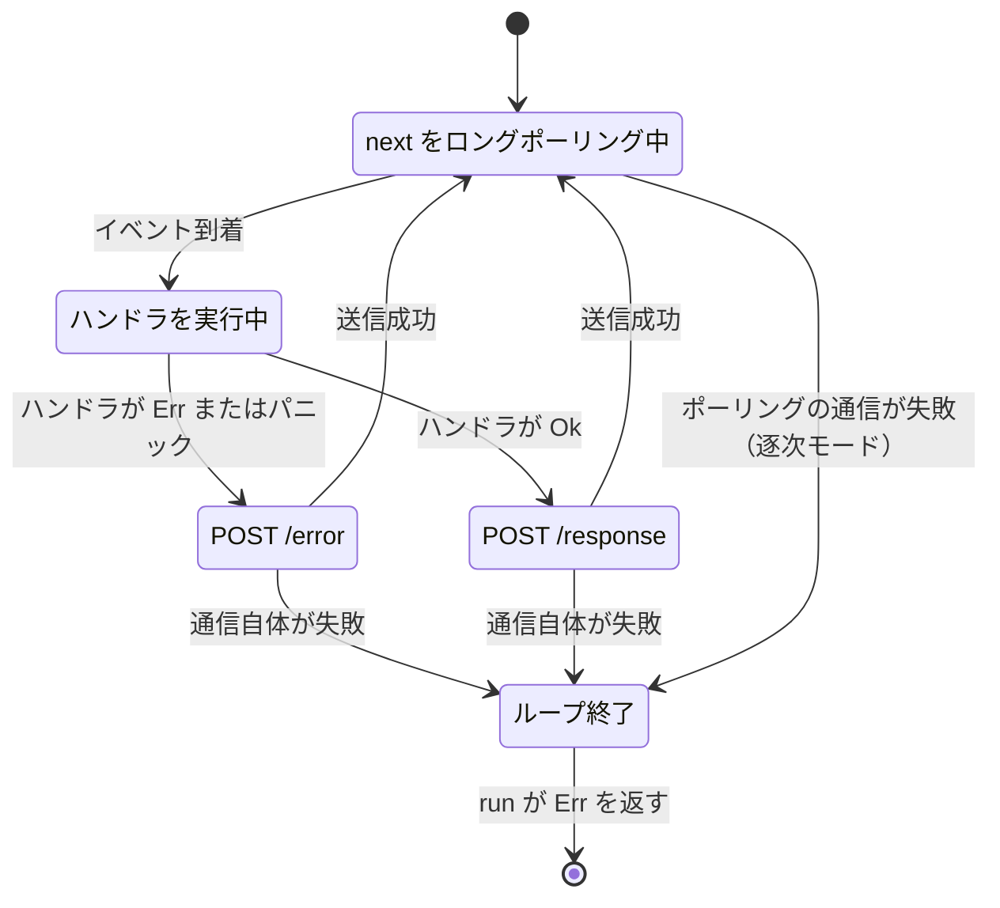

## 何を学んだか

Rust のパニックは、放っておけばスレッドを巻き戻して落とす。Lambda のランタイムでそれが起きると実行環境ごと死に、次の invocation はコールドスタートからやり直しになる。

`lambda_runtime` は `CatchPanicService` という 1 枚のミドルウェアでこれを止めている。ハンドラがパニックしても、その invocation が `/error` としてエラー扱いになるだけで、**ループは次のイベントへ進む**。

一方で、**ループが本当に終わる条件**は別にある。この 2 つの境界を混同すると「なぜかコールドスタートが増える」の原因を見誤る。

## ソースコードのどこか

### 2 箇所でパニックを捕まえる

[`lambda-runtime/src/layers/panic.rs#L44`](https://github.com/aws/aws-lambda-rust-runtime/blob/6f305bb00f3cc613fd82f88d2f2200e8089e4385/lambda-runtime/src/layers/panic.rs#L44):

```rust title="lambda-runtime/src/layers/panic.rs"
fn call(&mut self, req: LambdaEvent<Payload>) -> Self::Future {
    // Catch panics that result from calling `call` on the service
    let task = std::panic::catch_unwind(AssertUnwindSafe(|| self.inner.call(req)));

    // Catch panics that result from polling the future returned from `call`
    match task {
        Ok(task) => {
            let fut = AssertUnwindSafe(task).catch_unwind();
            CatchPanicFuture::Future(fut, PhantomData)
        }
        Err(error) => {
            error!(?error, "user handler panicked");
            CatchPanicFuture::Error(error)
        }
    }
}
```

async fn は `call` の時点では**何も実行しない**。Future を作って返すだけだ。したがってパニックが起きうるタイミングは 2 つある。

1. `call` そのものの中 (Future を組み立てる同期コード)
2. その Future を `poll` している間 (`.await` の間に走る本体)

前者を `std::panic::catch_unwind`、後者を `futures` の `FutureExt::catch_unwind` で捕まえる。片方だけだと漏れる。

Future 側の `poll` は [L76](https://github.com/aws/aws-lambda-rust-runtime/blob/6f305bb00f3cc613fd82f88d2f2200e8089e4385/lambda-runtime/src/layers/panic.rs#L76):

```rust title="lambda-runtime/src/layers/panic.rs"
CatchPanicFutureProj::Future(fut, _) => match fut.poll(cx) {
    Poll::Ready(ready) => match ready {
        Ok(Ok(success)) => Poll::Ready(Ok(success)),
        Ok(Err(error)) => {
            error!("{error:?}");
            Poll::Ready(Err(error.into()))
        }
        Err(error) => {
            error!(?error, "user handler panicked");
            Poll::Ready(Err(Self::build_panic_diagnostic(&error)))
        }
    },
    Poll::Pending => Poll::Pending,
},
CatchPanicFutureProj::Error(error) => Poll::Ready(Err(Self::build_panic_diagnostic(error))),
```

`Ok(Ok(_))` が成功、`Ok(Err(_))` がハンドラの通常エラー (`.into()` で `Diagnostic` へ)、`Err(_)` がパニック。3 通りが全部 `Result<T, Diagnostic>` に潰される。

### Box\<dyn Any\> からメッセージを掘り出す

[L99](https://github.com/aws/aws-lambda-rust-runtime/blob/6f305bb00f3cc613fd82f88d2f2200e8089e4385/lambda-runtime/src/layers/panic.rs#L99):

```rust title="lambda-runtime/src/layers/panic.rs"
fn build_panic_diagnostic(err: &Box<dyn Any + Send>) -> Diagnostic {
    let error_message = if let Some(msg) = err.downcast_ref::<&str>() {
        format!("Lambda panicked: {msg}")
    } else if let Some(msg) = err.downcast_ref::<String>() {
        format!("Lambda panicked: {msg}")
    } else {
        "Lambda panicked".to_string()
    };
    Diagnostic {
        error_type: type_name_of_val(err),
        error_message,
    }
}
```

`catch_unwind` が返すのは `Box<dyn Any + Send>` で、中身はパニックのペイロード。`panic!("boom")` なら `&str`、`panic!("{}", x)` のようにフォーマットが挟まると `String` になる。どちらでもなければメッセージは取れないので `"Lambda panicked"` だけになる。

### Diagnostic が /error の JSON になる

`Diagnostic` は 2 フィールドの構造体で、`camelCase` でシリアライズされる ([`diagnostic.rs#L41`](https://github.com/aws/aws-lambda-rust-runtime/blob/6f305bb00f3cc613fd82f88d2f2200e8089e4385/lambda-runtime/src/diagnostic.rs#L41))。

```rust title="lambda-runtime/src/diagnostic.rs"
#[derive(Debug, Eq, PartialEq, Clone, Serialize, Deserialize)]
#[serde(rename_all = "camelCase")]
pub struct Diagnostic {
    pub error_type: String,
    pub error_message: String,
}
```

これがそのまま `/error` のボディになる ([`requests.rs#L170`](https://github.com/aws/aws-lambda-rust-runtime/blob/6f305bb00f3cc613fd82f88d2f2200e8089e4385/lambda-runtime/src/requests.rs#L170))。

```rust title="lambda-runtime/src/requests.rs"
impl IntoRequest for EventErrorRequest<'_> {
    fn into_req(self) -> Result<Request<Body>, Error> {
        let uri = format!("/2018-06-01/runtime/invocation/{}/error", self.request_id);
        let uri = Uri::from_str(&uri)?;
        let body = serde_json::to_vec(&self.diagnostic)?;
        let body = Body::from(body);

        let req = build_request()
            .method(Method::POST)
            .uri(uri)
            .header("lambda-runtime-function-error-type", "unhandled")
            .body(body)?;
        Ok(req)
    }
}
```

`lambda-runtime-function-error-type: unhandled` が固定で付く。呼び出し側 (API Gateway や SDK) が受け取る JSON は `{"errorType": "...", "errorMessage": "Lambda panicked: ..."}` になる。

`error_type` は `type_name_of_val` — つまり Rust の型名で、`Box<dyn Any + Send>` のような読みづらい文字列になる。`Diagnostic` のドキュメントコメント自身が「意味のある `errorType` が欲しければ自分で `From` を実装しろ」と勧めている。LWA はこれを実装していないので、エラーの区別は `errorMessage` 側でやることになる。

### どこで止まり、どこで続くのか



**ループが終わるのは `RuntimeApiClientFuture` が `Err` を返したときだけ。** [`layers/api_client.rs#L121`](https://github.com/aws/aws-lambda-rust-runtime/blob/6f305bb00f3cc613fd82f88d2f2200e8089e4385/lambda-runtime/src/layers/api_client.rs#L121):

```rust title="lambda-runtime/src/layers/api_client.rs"
Err(err) => {
    log_or_print!(
        tracing: tracing::error!(error = ?err, "Lambda Runtime API request failed"),
        fallback: eprintln!("Lambda Runtime API request failed: {err:?}")
    );
    break Err(err);
}
```

Runtime API が非 200 を返した場合は `break Ok(())` でループを続ける (前ページ参照)。`Err` になるのは接続失敗など、HTTP レスポンスが得られなかった場合だ。この `Err` が `process_invocation` の `?` を通って `run_with_incoming` の `?` に届き、`run()` 全体が `Err` で終わる。

## なぜそうなっているか

**1 件の不正な入力で実行環境を殺さないため。** ハンドラのパニックは「アプリのバグ」であって「ランタイムの故障」ではない。1 件をエラーにして次に進むのが正しい。逆に Runtime API に繋がらないなら、それはランタイムの故障で、以降のイベントも処理できない。生き延びても意味がないので終了して Lambda に再作成させる。

**`catch_unwind` が 2 回必要なのは、async fn の性質そのものから来る。** 「Future を作る」と「Future を走らせる」は別の時点で、前者でもパニックしうる (引数の検証を `call` の同期部分に書いていれば起きる)。2 つ目の `AssertUnwindSafe(task).catch_unwind()` だけでは、1 つ目のパニックは `call` の呼び出し元 — `RuntimeApiResponseService` — に抜けてしまう。

**`AssertUnwindSafe` が必要なのは、`&mut self` を跨ぐから。** `catch_unwind` は `UnwindSafe` を要求する。パニックで中断された状態のデータを触ると壊れたデータを読むかもしれない、というのが `UnwindSafe` の趣旨だが、ここではパニックしたらその invocation を捨てるだけなので、`AssertUnwindSafe` で押し通している。

**LWA の release profile は `panic = "abort"` になっている。**

```toml title="Cargo.toml"
[profile.release]
strip = true
lto = true
codegen-units = 1
panic = "abort"
opt-level = "s"
```

[`Cargo.toml`](https://github.com/aws/aws-lambda-web-adapter/blob/986113fc66f368f0187a25c683f1ab39a68cc6c6/Cargo.toml)。`panic = "abort"` は巻き戻し自体を無効化するので、**リリースビルドの `lambda-adapter` バイナリでは `catch_unwind` は仕事をしない**。パニックすればプロセスが即 abort する。

これは「効かない安全網を持っている」という話ではなく、LWA にとって妥当な選択だ。LWA の `Service` の中身は HTTP リクエストの転送 (`fetch_response`) で、パニックしうる箇所があるとすればそれはアダプタ自身のバグである。バイナリを小さくする (`opt-level = "s"`, `strip`, `lto`) ことのほうが Lambda Layer として配るうえで効く ([2 つの配布形態 — コンテナイメージと Lambda Layer](../packaging/))。`CatchPanicService` が効くのは、`lambda_runtime` を `panic = "unwind"` のまま使っているアプリケーションのほうだ。

## どう活かすか

- **LWA でアプリが 500 を返しても、Lambda のエラーにはならない。** それは `Ok(Response)` として `/response` に送られる正常系だ。パニックでもエラーでもない。Lambda のエラーメトリクスや Step Functions のリトライを動かしたいなら `AWS_LWA_ERROR_STATUS_CODES` を設定して `Err` に変換する必要がある ([ステータスコードを Lambda のエラーに変える](../error-status-codes/))。
- **CloudWatch に `Lambda panicked:` が出たら、それは Rust 側のパニック**であって、アプリ (Node/Python/Go) のクラッシュではない。アプリが落ちた場合は LWA の HTTP 転送が接続エラーになり、`fetch_response` が `Err` を返すという別の経路になる。
- **`errorType` が Rust の型名で出てきても驚かない。** `lambda_runtime` の既定の `Diagnostic` 変換は `std::any::type_name` に頼っているので、`errorType` で分岐する設計は避ける。`errorMessage` を見る。
- **`Lambda Runtime API request failed` が出ていたら、それはループ終了のサイン。** 直後にコールドスタートが来ているはずなので、他のログと突き合わせると「なぜ実行環境が入れ替わったか」の説明になる。
