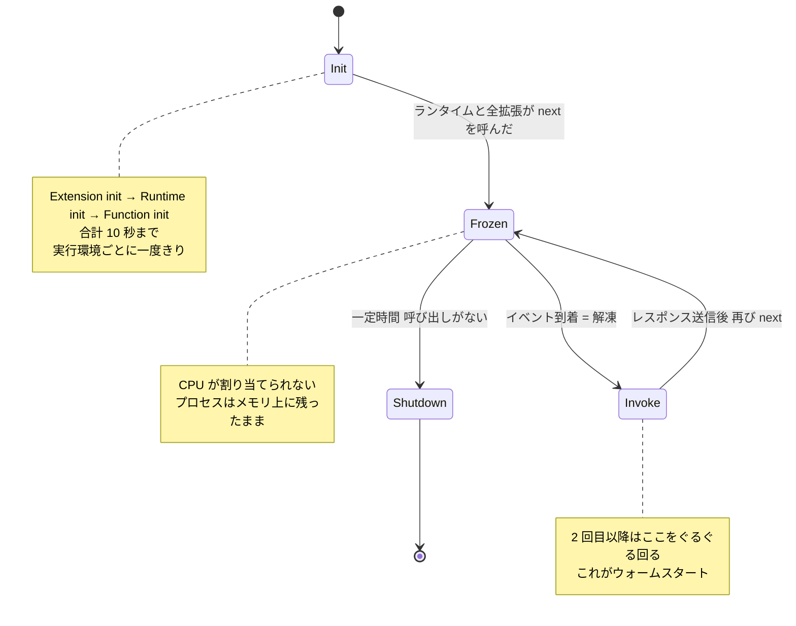

## 何を学んだか

Lambda Web Adapter のコードを読む前に、1 つだけ受け入れておくべき事実がある。

**Lambda は、あなたのプロセスを呼び出さない。** Lambda がするのは、実行環境というサンドボックスを作り、その中で実行ファイルを起動し、あとは放っておくことだけだ。イベントは Lambda からプロセスに push されない。プロセスが `127.0.0.1:9001` に建てられた HTTP サーバ (Runtime API) に対して `GET /2018-06-01/runtime/invocation/next` を投げ、返ってくるのを待つ。

この向きが逆だったら、Web Adapter は存在できない。もし Lambda が「関数のエントリポイントを呼ぶ」モデルだったら、任意のプロセスをランタイムとして差し込むことはできず、言語ごとに Lambda 側が対応する必要がある。実際には Lambda が知っているのは「起動する実行ファイルのパス」と「その実行ファイルが HTTP で話しかけてくること」だけなので、`/next` を叩く気があるプロセスなら何でもランタイムになれる。Web Adapter はその「何でも」の 1 つで、取ってきたイベントを HTTP リクエストに変換して隣で動いている Express や FastAPI に流し込む。

その実行環境には 3 つのフェーズがある。

- **Init**: 実行環境を作り、コードと Layer をダウンロードし、拡張を起動し、ランタイムを起動し、関数の初期化コードを走らせる。**10 秒の制限がある。**
- **Invoke**: イベントが来るたびにハンドラが動く。実行環境は再利用されるので、Init は原則として一度きりで、2 回目以降の invocation は Invoke だけを繰り返す。
- **Shutdown**: 一定時間呼び出しがないと、Lambda はランタイムを落とし、拡張に `SHUTDOWN` イベントを送り、環境を破棄する。



Init はさらに `Extension init` → `Runtime init` → `Function init` の 3 つのサブフェーズに分かれる ([Understanding the Lambda execution environment lifecycle](https://docs.aws.amazon.com/lambda/latest/dg/lambda-runtime-environment.html))。**拡張がランタイムより先に起動される**という順序は、Web Adapter が拡張として自分を登録する設計に直結している。

Init フェーズは、ランタイムと登録済みの全拡張が「準備できた」を意味する `Next` API リクエストを送った時点で終わる。10 秒以内に終わらなかった場合、Lambda は最初の invocation のタイミングで Init をやり直す (このときは関数のタイムアウト設定が適用される)。

## ソースコードのどこか

Web Adapter の `main` は、このライフサイクルをそのまま順番になぞっている。

```rust title="src/main.rs"
async fn async_main() -> Result<(), Error> {
    tracing::init_default_subscriber();

    let options = AdapterOptions::default();

    let mut adapter = Adapter::new(&options)?;
    // register the adapter as an extension
    adapter.register_default_extension();
    // check if the web application is ready
    adapter.check_init_health().await;
    // start lambda runtime after the web application is ready
    adapter.run().await?;

    Ok(())
}
```

[`src/main.rs#L19-L38`](https://github.com/aws/aws-lambda-web-adapter/blob/986113fc66f368f0187a25c683f1ab39a68cc6c6/src/main.rs#L19-L38)

この 3 行はそれぞれフェーズに対応している。

1. `register_default_extension()` — Extension init。Extensions API に登録する。
2. `check_init_health()` — Function init に相当する時間帯。隣で起動中のアプリが `127.0.0.1:8080` で応答するようになるまで待つ。ここが 10 秒の壁と正面衝突する場所で、だから `AWS_LWA_ASYNC_INIT` という逃げ道が用意されている。
3. `run()` — Invoke ループ。`/next` を叩き続ける。

`check_init_health()` のドキュメントコメントに 10 秒の制約がそのまま書かれている。

```rust title="src/lib.rs"
/// If `async_init` is enabled in the adapter options, this method will:
/// - Attempt readiness checks for up to 9.8 seconds
/// - Return early if the timeout is reached (to avoid Lambda's 10s init timeout)
/// - Allow the application to continue booting in the background
```

[`src/lib.rs#L738-L741`](https://github.com/aws/aws-lambda-web-adapter/blob/986113fc66f368f0187a25c683f1ab39a68cc6c6/src/lib.rs#L738-L741)

## なぜそうなっているか

Init が一度きりで、Invoke が繰り返されるという構造は、「初期化は高い、実行は安い」という前提を Lambda が制度として固定したものだ。DB コネクションや SDK クライアントは Init で 1 回作って使い回す。これは普通の Web サーバのプロセスモデルと同じで、だからこそ Web Adapter は「アプリを普通に起動して放置する」だけで済む。アプリ側は自分が Lambda の中にいることを知らなくていい。

一方で、pull 型であることの代償もある。**プロセスは `/next` を呼んだ瞬間に凍結される。** イベントが来るまで CPU が割り当てられないので、「レスポンスを返した後に非同期でやる」処理は動かない。この帰結は [フリーズと解凍](../freeze-thaw/) で詳しく扱う。

Init を 10 秒に区切っているのは、Lambda が実行環境をプールしたりリトライしたりする都合上、初期化にかかる時間の上限をサービス側が握っておく必要があるからだ。ただし Provisioned Concurrency、SnapStart、Lambda Managed Instances ではこの 10 秒制限は適用されず、初期化に最大 15 分まで使える。Web Adapter が `AWS_LWA_ASYNC_INIT` を「既定では無効」にしているのは、この 10 秒制限の下でしか意味を持たない機能だからだ。

## どう活かすか

**「Lambda は起動するだけ」を出発点にすると、Web Adapter は驚きではなくなる。** `/opt/extensions/lambda-adapter` に置かれた実行ファイルは、Lambda から見ればただの外部拡張で、Lambda はそれを起動して `/2020-01-01/extension/register` を待つ。アダプタは登録を済ませたあと、Runtime API のクライアントとして `/next` を叩き始める。Lambda 側に特別扱いは 1 つもない。

**移植性の判断基準もここから出る。** アダプタが依存しているのは「`AWS_LAMBDA_RUNTIME_API` 環境変数が指す HTTP サーバがいること」だけで、それが無い環境 (ECS Fargate、EC2、ローカル) ではアダプタは何もしない。同じコンテナイメージが両方で動くのはこのためだ。詳細は [Lambda の外では何も動かない](../outside-lambda/) にある。

**Init のコストを見積もるときは、3 サブフェーズを分けて考える。** 拡張の起動 (Web Adapter 自身のバイナリのロード) は数 ms のオーダーだが、Function init に相当する「アプリの起動待ち」は Next.js や Spring Boot なら数秒かかる。10 秒に収まらないなら `AWS_LWA_ASYNC_INIT=true` を検討する、というのが [非同期初期化](../async-init/) の話になる。

**プロセスが何個あるのかは、次のページで数える。** 「Lambda が起動する」と書いたとき、起動する主体は誰で、起動されたプロセスどうしはどういう関係にあるのか。[実行環境の中のプロセス構成](../process-model/) で見る。
