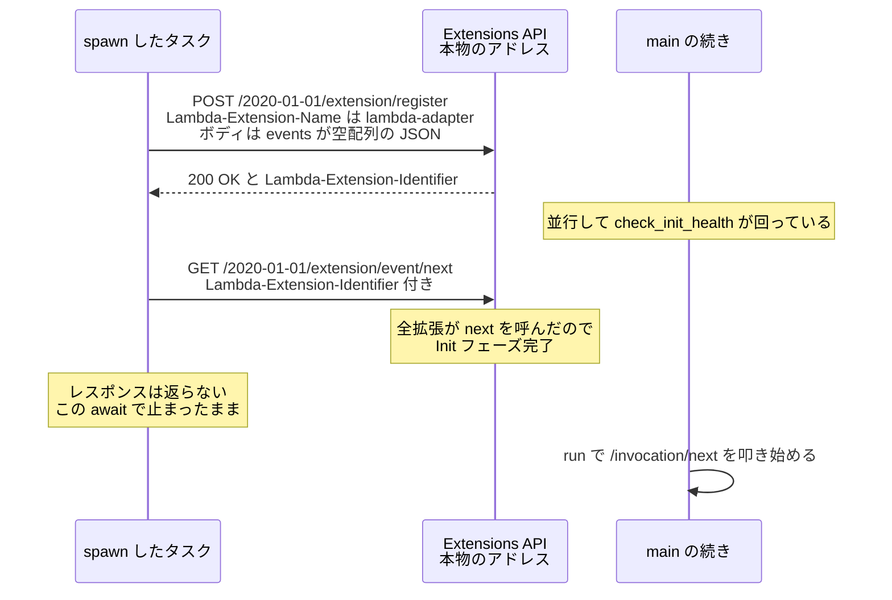

## 何を学んだか

LWA は Lambda の**外部拡張**として動く。だが Extensions API を本格的に使ってはいない。登録処理の全体は HTTP リクエスト 2 本だけで、しかも購読するイベントは空である。

1. `POST /2020-01-01/extension/register` に `{ "events": [] }` を送り、`Lambda-Extension-Identifier` を受け取る
2. `GET /2020-01-01/extension/event/next` を `Lambda-Extension-Identifier` 付きで **1 回だけ**投げる

そしてそれっきり。ループしない。返ってきたレスポンスも見ない。

INVOKE も SHUTDOWN も購読していないのに拡張として登録するのは、**「登録して `event/next` を呼ぶ」という行為そのものが目的**だからである。Extensions API の契約上、Init フェーズは登録済みの全拡張が `event/next` を呼ぶまで完了しない。LWA が欲しいのはこの 1 点で、イベントは 1 つも要らない。

## ソースコードのどこか

[`src/lib.rs#L689-L730`](https://github.com/aws/aws-lambda-web-adapter/blob/986113fc66f368f0187a25c683f1ab39a68cc6c6/src/lib.rs#L689-L730)。

```rust title="src/lib.rs"
async fn register_extension_internal() -> Result<(), Error> {
    // Prefer the original (pre-proxy) value if apply_runtime_proxy_config() captured one.
    // Otherwise fall back to the current env var.
    let aws_lambda_runtime_api: String = match ORIGINAL_LAMBDA_RUNTIME_API.get() {
        Some(captured) => captured.clone().unwrap_or_else(|| "127.0.0.1:9001".to_string()),
        None => env::var(ENV_LAMBDA_RUNTIME_API).unwrap_or_else(|_| "127.0.0.1:9001".to_string()),
    };
    let client = Client::builder(hyper_util::rt::TokioExecutor::new()).build(HttpConnector::new());

    let register_req = hyper::Request::builder()
        .method(Method::POST)
        .uri(format!("http://{aws_lambda_runtime_api}/2020-01-01/extension/register"))
        .header("Lambda-Extension-Name", "lambda-adapter")
        .body(Body::from("{ \"events\": [] }"))?;

    let register_res = client.request(register_req).await?;

    if register_res.status() != StatusCode::OK {
        return Err(Error::from(format!(
            "Extension registration failed with status: {}",
            register_res.status()
        )));
    }

    let extension_id = register_res
        .headers()
        .get("Lambda-Extension-Identifier")
        .ok_or_else(|| Error::from("Missing Lambda-Extension-Identifier header"))?;

    let next_req = hyper::Request::builder()
        .method(Method::GET)
        .uri(format!("http://{aws_lambda_runtime_api}/2020-01-01/extension/event/next"))
        .header("Lambda-Extension-Identifier", extension_id)
        .body(Body::Empty)?;

    client.request(next_req).await?;

    Ok(())
}
```

呼び出し側は [`src/lib.rs#L675`](https://github.com/aws/aws-lambda-web-adapter/blob/986113fc66f368f0187a25c683f1ab39a68cc6c6/src/lib.rs#L675) で、`tokio::task::spawn` に投げっぱなしにする。

```rust title="src/lib.rs"
pub fn register_default_extension(&self) {
    tokio::task::spawn(async move {
        if let Err(e) = Self::register_extension_internal().await {
            tracing::error!(error = %e, "Extension registration failed - terminating process");
            std::process::exit(1);
        }
    });
}
```

`Lambda-Extension-Name` に渡している `"lambda-adapter"` は、`/opt/extensions/` に置かれるファイル名と一致していなければならない。README が示す `COPY --from=... /lambda-adapter /opt/extensions/lambda-adapter` の末尾がこの文字列である。



## なぜそうなっているか

### なぜ `{"events": []}` なのか

Extensions API では `INVOKE` と `SHUTDOWN` を購読できる。LWA はどちらも取らない。

`INVOKE` が要らないのは、**LWA が Runtime API 側でイベントを受け取っているから**である。`lambda_http::run_concurrent` が `GET /2018-06-01/runtime/invocation/next` を叩いており、リクエストの本体もコンテキストもそちらから来る。Extensions API の `INVOKE` イベントはメタデータしか含まず、LWA には重複でしかない。

`SHUTDOWN` を取らないのは、取ると**シャットダウン処理を実装する責任が生まれる**からである。購読すると Lambda は SHUTDOWN イベントを送って猶予時間 (通常 500ms、外部拡張がある場合は 2 秒) 待つ。LWA には保存すべき状態がなく、待たせるだけ無駄になる。グレースフルシャットダウンをアプリ側で扱う話は [グレースフルシャットダウン](../graceful-shutdown/) にある。

### なぜループしないのか

Extensions API の一般的な使い方は `loop { let event = get_next().await; handle(event); }` である。LWA が 1 回で終えているのは、`{"events": []}` の帰結として**2 回目が永遠に来ないから**である。

`event/next` はロングポーリングで、購読しているイベントが発生するまで応答しない。何も購読していなければ、SHUTDOWN 相当の実行環境終了まで応答は返らない。つまり `client.request(next_req).await` はそこで止まったままになり、`Ok(())` に到達しないまま実行環境ごと消える。

これが「呼び出し側が `spawn` で投げっぱなしにしてよい」理由でもある。返らない `Future` を `await` するタスクは、そのまま置いておけばいい。`register_extension_internal` が `Result<(), Error>` を返す形をしているのは、**エラー経路のためだけ**である。

### `ORIGINAL_LAMBDA_RUNTIME_API` — 登録だけがプロキシを迂回する

宛先の決め方が奇妙に見える。素直に書けば `env::var("AWS_LAMBDA_RUNTIME_API")` の 1 行で済むはずである。そうしていないのは、`main` の 1 行目で呼ばれる `apply_runtime_proxy_config` が**その環境変数を書き換えてしまう**からだ ([main の 4 行](../bootstrap-and-startup/))。

`AWS_LWA_LAMBDA_RUNTIME_API_PROXY` が設定されていると、`AWS_LAMBDA_RUNTIME_API` はプロキシのアドレスに差し替わる。狙いは Runtime API の**イベント取得と応答**をプロキシ経由にすることで、拡張登録まで巻き込む意図はない。プロキシが Runtime API の全パスを実装している保証はなく、`/2020-01-01/extension/*` を通せないプロキシで登録が失敗すると、Init が丸ごと落ちる。

そこで、書き換える直前の値を捕捉しておく ([`src/lib.rs#L100`](https://github.com/aws/aws-lambda-web-adapter/blob/986113fc66f368f0187a25c683f1ab39a68cc6c6/src/lib.rs#L100))。

```rust title="src/lib.rs"
// Captures the original AWS_LAMBDA_RUNTIME_API value before apply_runtime_proxy_config()
// overwrites it with the proxy address. Extension registration uses the original so it
// reaches the real Lambda Runtime API directly, bypassing the proxy.
// Outer Option distinguishes "not yet captured" (None) from "captured but env was unset"
// (Some(None)).
static ORIGINAL_LAMBDA_RUNTIME_API: OnceLock<Option<String>> = OnceLock::new();
```

`OnceLock<Option<String>>` の `Option` が二重になっているのがこの型の要点で、コメントにも理由が書かれている。`OnceLock::get()` は `Option<&T>` を返すので、全体で 3 つの状態を表せる。

| `ORIGINAL_LAMBDA_RUNTIME_API.get()` | 意味                                   | 使う値                          |
| ----------------------------------- | -------------------------------------- | ------------------------------- |
| `None`                              | プロキシ設定がなく、まだ捕捉していない | 現在の `AWS_LAMBDA_RUNTIME_API` |
| `Some(Some(addr))`                  | 捕捉済み。書き換え前は `addr` だった   | `addr` (本物)                   |
| `Some(None)`                        | 捕捉済み。ただし当時から未設定だった   | `127.0.0.1:9001`                |

`OnceLock<String>` にして「未設定なら `set` しない」で済ませると、`None` の意味が「プロキシなし」と「プロキシありだが元が未設定」の 2 通りに割れる。後者では現在の環境変数がプロキシのアドレスになっているので、フォールバックで `env::var` を読むと**プロキシに登録リクエストを送ってしまう**。`Some(None)` を明示的に持つことで、この場合はハードコードされた `127.0.0.1:9001` に落ちる。

分岐は 1 つ増えるが、`Option` を 1 枚重ねるだけで「捕捉していない」と「捕捉した結果が空だった」を型で分けられる。`OnceLock` を「初期化済みかどうか」ではなく「観測したかどうか」の記録として使う型付けの例である。

### 失敗したら `exit(1)` する

登録に失敗すると、ログを出してプロセスごと落とす。

`register_extension_internal` は `spawn` されたタスクの中で動いていて、`Err` を返す先がない。`main` は既に `check_init_health` へ進んでいる。ここでエラーを握り潰すと、**拡張が登録されていないのにアダプタは動き続ける**。この状態は目に見えて壊れるとは限らず、Init 完了の同期が効かないまま中途半端に動くほうが厄介である。

`exit(1)` すれば拡張プロセスの異常終了として Lambda に伝わり、Lambda は Init 失敗と判断して**実行環境を作り直す**。同じ設定なら次も失敗するので、CloudWatch Logs にエラーが残り続けて気づける。「直せない状態で動き続けるより、失敗を上位に伝えて作り直させる」という判断で、Lambda の実行環境が使い捨てであることを前提にした割り切りである。

## どう活かすか

- **プロトコルの副作用だけを利用する使い方がありうる。** LWA は Extensions API を「イベントを受け取る仕組み」ではなく「Init 完了の同期点」として使っている。API のドキュメントを読むときは、返ってくるデータだけでなく**呼ぶこと自体が持つ意味**にも目を向ける
- **グローバル状態を書き換える前に、書き換え前の値を誰かが必要としないか確認する。** LWA は `env::set_var` の直前に元の値を退避することで、拡張登録だけを迂回させている。書き換えの影響範囲が「意図した利用者」より広くなるのは環境変数の典型的な事故
- **`Option<Option<T>>` は逃げではなく設計になりうる。** 「未観測」と「観測した結果が空」を潰すと、フォールバックが誤った値を拾う。潰していい場合と潰してはいけない場合を区別する
- 前提となる Extensions API のプロトコル (登録・`event/next`・Init 完了条件) は [Extensions API — 拡張はどう登録され、どう生かされるか](../extensions-api/) にまとめてある
