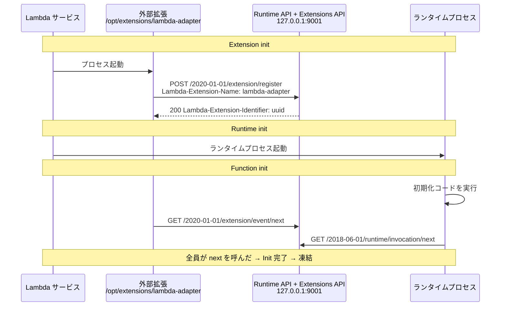

## 何を学んだか

Lambda の外部拡張は、こういう仕組みで動く。

- Lambda は **`/opt/extensions/` 配下の実行ファイルそれぞれに対してプロセスを起動する**。これは `Extension init` フェーズで、**ランタイムより先**に起きる
- 各拡張は `POST /2020-01-01/extension/register` で自分を登録する。`Lambda-Extension-Name` ヘッダに**自分のファイル名と完全に一致する文字列**を入れなければならない。ボディで購読するイベント (`INVOKE` / `SHUTDOWN`) を指定する
- 登録に成功すると、レスポンスヘッダ `Lambda-Extension-Identifier` に UUID が返る。以降のリクエストにはこれを付ける
- `GET /2020-01-01/extension/event/next` をロングポーリングして、INVOKE / SHUTDOWN イベントを受け取る
- **ランタイムと全ての登録済み拡張が `event/next` を呼ぶまで、Init フェーズは完了しない**

バージョンプレフィックスは `2020-01-01` で、ホストは Runtime API と同じ `AWS_LAMBDA_RUNTIME_API` だ。同じ HTTP サーバが 2 つの API を提供している。



拡張の登録上限は 1 関数あたり 10 個。Shutdown フェーズの最大時間は、外部拡張が 1 つ以上いる場合 2,000 ms で、それを超えると `SIGKILL` される。拡張は関数と同じ実行環境にいるので、CPU・メモリ・`/tmp`・IAM ロール・ネットワーク名前空間を共有する ([Using the Lambda Extensions API to create extensions](https://docs.aws.amazon.com/lambda/latest/dg/runtimes-extensions-api.html))。

## ソースコードのどこか

### 本格的な実装: `lambda-extension` クレート

aws-lambda-rust-runtime には、Extensions API のクライアントが 1 つ丸ごと入っている。リクエストの組み立ては `requests.rs` にある。

```rust title="lambda-extension/src/requests.rs"
pub(crate) fn register_request(extension_name: &str, events: &[&str]) -> Result<Request<Body>, Error> {
    let events = serde_json::json!({ "events": events });

    let req = build_request()
        .method(Method::POST)
        .uri("/2020-01-01/extension/register")
        .header(EXTENSION_NAME_HEADER, extension_name)
        .header(EXTENSION_ACCEPT_FEATURE, EXTENSION_ACCEPT_FEATURE_VALUE)
        .header(CONTENT_TYPE_HEADER_NAME, CONTENT_TYPE_HEADER_VALUE)
        .body(Body::from(serde_json::to_string(&events)?))?;

    Ok(req)
}
```

[`lambda-extension/src/requests.rs#L26-L38`](https://github.com/aws/aws-lambda-rust-runtime/blob/6f305bb00f3cc613fd82f88d2f2200e8089e4385/lambda-extension/src/requests.rs#L26-L38)

`next_event_request` ([L17-L24](https://github.com/aws/aws-lambda-rust-runtime/blob/6f305bb00f3cc613fd82f88d2f2200e8089e4385/lambda-extension/src/requests.rs#L17-L24)) は `Lambda-Extension-Identifier` を付けて `event/next` を叩く。ほかに Logs API (`/2020-08-15/logs`)、Telemetry API (`/2022-07-01/telemetry`)、init/exit のエラー報告 (`/2020-01-01/extension/{init,exit}/error`) まで揃っている。

受け取る側のイベント型も定義されている。

```rust title="lambda-extension/src/events.rs"
#[derive(Debug, Deserialize)]
#[serde(rename_all = "UPPERCASE", tag = "eventType")]
pub enum NextEvent {
    /// Payload when the event happens in the INVOKE phase
    Invoke(InvokeEvent),
    /// Payload when the event happens in the SHUTDOWN phase
    Shutdown(ShutdownEvent),
}
```

[`lambda-extension/src/events.rs#L40-L47`](https://github.com/aws/aws-lambda-rust-runtime/blob/6f305bb00f3cc613fd82f88d2f2200e8089e4385/lambda-extension/src/events.rs#L40-L47)

`InvokeEvent` は `deadline_ms` / `request_id` / `invoked_function_arn` / `tracing` を持ち、`ShutdownEvent` は `shutdown_reason` (`SPINDOWN` / `TIMEOUT` / `FAILURE`) と `deadline_ms` を持つ。`Extension::register()` ([`extension.rs#L246-L?`](https://github.com/aws/aws-lambda-rust-runtime/blob/6f305bb00f3cc613fd82f88d2f2200e8089e4385/lambda-extension/src/extension.rs#L246)) は登録に加えて Logs / Telemetry のサブスクライブまで面倒を見る。

### Web Adapter の実装: 2 リクエストの手書き

**Web Adapter はこのクレートを使っていない。** `hyper` の `Request` を直接組み立てて、2 リクエストだけ投げる。

```rust title="src/lib.rs"
async fn register_extension_internal() -> Result<(), Error> {
    // Prefer the original (pre-proxy) value if apply_runtime_proxy_config() captured one.
    // Otherwise fall back to the current env var.
    let aws_lambda_runtime_api: String = match ORIGINAL_LAMBDA_RUNTIME_API.get() {
        Some(captured) => captured.clone().unwrap_or_else(|| "127.0.0.1:9001".to_string()),
        None => env::var(ENV_LAMBDA_RUNTIME_API).unwrap_or_else(|_| "127.0.0.1:9001".to_string()),
    };
    let client = Client::builder(hyper_util::rt::TokioExecutor::new()).build(HttpConnector::new());

    let register_req = hyper::Request::builder()
        .method(Method::POST)
        .uri(format!("http://{aws_lambda_runtime_api}/2020-01-01/extension/register"))
        .header("Lambda-Extension-Name", "lambda-adapter")
        .body(Body::from("{ \"events\": [] }"))?;

    let register_res = client.request(register_req).await?;
    ...
    let next_req = hyper::Request::builder()
        .method(Method::GET)
        .uri(format!(
            "http://{aws_lambda_runtime_api}/2020-01-01/extension/event/next"
        ))
        .header("Lambda-Extension-Identifier", extension_id)
        .body(Body::Empty)?;

    client.request(next_req).await?;

    Ok(())
}
```

[`src/lib.rs#L689-L729`](https://github.com/aws/aws-lambda-web-adapter/blob/986113fc66f368f0187a25c683f1ab39a68cc6c6/src/lib.rs#L689-L729)

3 点だけ先に指摘しておく。

- **`{ "events": [] }`** — 購読するイベントが空。INVOKE も SHUTDOWN も受け取らない
- **`event/next` を 1 回呼んで、レスポンスを見ずに `Ok(())` で帰る。** その後この関数は二度と呼ばれない
- **`Lambda-Extension-Name: lambda-adapter`** — Layer / イメージに置かれるファイル名 `lambda-adapter` と一致している必要がある ([bootstrap と AWS_LAMBDA_EXEC_WRAPPER](../custom-runtime-bootstrap/))

なぜこれで足りるのか、なぜ `event/next` を 1 回だけ呼んで放置するのかは [拡張として登録する — events は空でいい](../extension-registration/) で読む。

この処理は `tokio::task::spawn` で背景に投げられ、失敗したら `std::process::exit(1)` する。

```rust title="src/lib.rs"
pub fn register_default_extension(&self) {
    // register as an external extension
    tokio::task::spawn(async move {
        if let Err(e) = Self::register_extension_internal().await {
            tracing::error!(error = %e, "Extension registration failed - terminating process");
            std::process::exit(1);
        }
    });
}
```

[`src/lib.rs#L675-L684`](https://github.com/aws/aws-lambda-web-adapter/blob/986113fc66f368f0187a25c683f1ab39a68cc6c6/src/lib.rs#L675-L684)

## なぜそうなっているか

**ファイル名と `Lambda-Extension-Name` の一致を要求するのは、Lambda 側が「起動した全プロセスが名乗り終えたか」を照合するためだ。** Lambda は `/opt/extensions/` を列挙してプロセスを起動しているので、起動したファイル名の集合を持っている。登録リクエストがその集合のどれと対応するかを、この名前で突き合わせる。ドキュメントが Troubleshooting の筆頭に「`Lambda-Extension-Name` がフルファイル名になっているか確認しろ」と書いているのは、ここを間違えると登録が 400 で落ちるからだ。

**「全員が `event/next` を呼ぶまで Init が終わらない」のは、拡張に初期化の猶予を与えるためだ。** 拡張が接続を張ったり設定を読んだりしている途中で関数が動き出すと、最初の invocation の観測データを取りこぼす。逆にこの契約があるおかげで、拡張は「`event/next` を呼んだ = 準備完了」という 1 つのシグナルで自分の準備状態を Lambda に伝えられる。

**拡張がランタイムより先に起動されるのも同じ理由だ。** ログやトレースを収集する拡張は、ランタイムが動き出す前にリスナを立ち上げておく必要がある。Web Adapter にとってこの順序は別の意味を持つ。アダプタは拡張として起動されるので、`AWS_LAMBDA_EXEC_WRAPPER` 経由で起動される Web アプリより先に走り出せる。だから `check_init_health()` でアプリの起動を「待つ」側に回れる。

**Web Adapter が `lambda-extension` クレートを使わないのは、必要なものがあまりに少ないからだ。** あのクレートは Logs API と Telemetry API のサーバまで立てるフルセットで、`Extension` 型のジェネリクスは 4 パラメータある。Web Adapter が必要としているのは「登録して、1 回 `event/next` を呼ぶ」だけ。2 リクエストのために `tower::MakeService` の型パズルを引き受ける理由がない。手書きの 40 行の方が読みやすく、依存も増えない。

## どう活かすか

**「拡張」と「ランタイム」を混同しない。** Web Adapter は同じ 1 つのプロセスの中で 2 つの役を演じている。Extensions API に対しては「拡張」として登録し、Runtime API に対しては「ランタイム」として `/next` を叩く。前者は起動されるための手続きで、後者が本業だ。この二重性が [アーキテクチャを一枚で読む](../architecture/) の出発点になる。

**自分で拡張を書くなら、最低限の契約は 2 つだけだ。** `register` でファイル名を名乗ることと、`event/next` を呼んで Init を終わらせること。この 2 つを満たさない拡張がいると、Init が完了せず関数全体がタイムアウトする。逆に言えば、Web Adapter の 40 行はこの最低限そのものだ。

**INVOKE / SHUTDOWN を購読すると、その分だけ invocation が長くなる。** ドキュメントが警告しているとおり、Invoke フェーズは「ランタイムと全拡張が `Next` を呼ぶまで」続く。拡張が invocation の後に重い処理をすると、関数の duration がそのぶん伸びて課金される。`PostRuntimeExtensionsDuration` メトリクスがその時間を測ってくれる。既製の拡張 (Parameters and Secrets、APM エージェントなど) を足すときは、このメトリクスを見ておくとよい。
