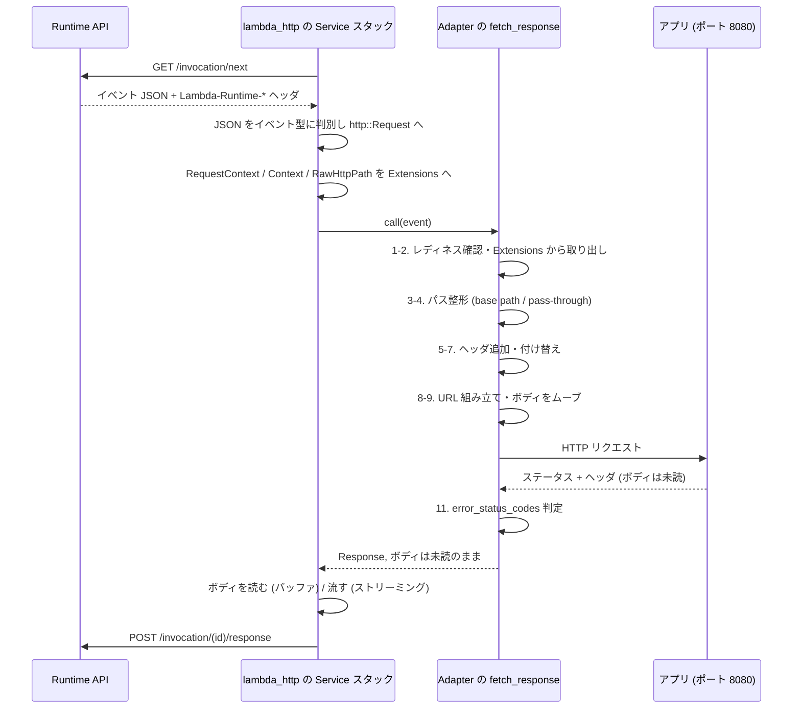

## 何を学んだか

LWA が `tower::Service` として実装しているメソッドは 1 個しかない。そしてその中身は、**イベントを HTTP リクエストに整形して、ローカルに投げて、返ってきたものをほぼそのまま返す**だけだ。100 行ちょっとしかない。

```rust title="src/lib.rs"
impl Service<Request> for Adapter<HttpConnector, Body> {
    type Response = Response<Incoming>;
    type Error = Error;
    type Future = Pin<Box<dyn Future<Output = Result<Self::Response, Self::Error>> + Send>>;

    fn poll_ready(&mut self, _cx: &mut core::task::Context<'_>) -> core::task::Poll<Result<(), Self::Error>> {
        core::task::Poll::Ready(Ok(()))
    }

    fn call(&mut self, event: Request) -> Self::Future {
        let adapter = self.clone();
        Box::pin(async move { adapter.fetch_response(event).await })
    }
}
```

([src/lib.rs#L1047-L1059](https://github.com/aws/aws-lambda-web-adapter/blob/986113fc66f368f0187a25c683f1ab39a68cc6c6/src/lib.rs#L1047-L1059))

`poll_ready` は常に `Ready`。バックプレッシャは一切かけない。`call` は `self.clone()` して `Box::pin` した async ブロックを返すだけで、実体は全部 `fetch_response` にある。`Adapter` の重いフィールド (hyper クライアント) は `Arc` に包まれているので、この `clone` はポインタのコピーで済む ([hyper クライアントの寿命管理と SnapStart](../hyper-client-and-snapstart/))。

そして戻り値の型が `Response<Incoming>` であることが、この関数の設計を決めている。**ボディを読んでいない。**

## ソースコードのどこか

`Adapter::fetch_response` ([src/lib.rs#L933-L1040](https://github.com/aws/aws-lambda-web-adapter/blob/986113fc66f368f0187a25c683f1ab39a68cc6c6/src/lib.rs#L933-L1040))。上から 12 ステップに分けられる。

**1. 非同期初期化のときだけ、ここでレディネスを待つ** ([L934-L938](https://github.com/aws/aws-lambda-web-adapter/blob/986113fc66f368f0187a25c683f1ab39a68cc6c6/src/lib.rs#L934-L938))

```rust title="src/lib.rs"
if self.async_init && !self.ready_at_init.load(Ordering::SeqCst) {
    self.is_web_ready(&self.healthcheck_url, &self.healthcheck_protocol).await;
    self.ready_at_init.store(true, Ordering::SeqCst);
}
```

init フェーズで 9.8 秒使い切ってしまった場合、残りの起動待ちがここに繰り越される。詳細は [非同期初期化 — 9.8 秒で諦めて init を通す](../async-init/)。

**2. エクステンションから 3 つの値を取り出す** ([L940-L944](https://github.com/aws/aws-lambda-web-adapter/blob/986113fc66f368f0187a25c683f1ab39a68cc6c6/src/lib.rs#L940-L944))

```rust title="src/lib.rs"
let request_context = event.request_context();
let lambda_context = event.lambda_context();
let path = event.raw_http_path().to_string();
let mut path = path.as_str();
let (parts, body) = event.into_parts();
```

`request_context` / `lambda_context` / `raw_http_path` はどれも `http::Extensions` から取っている。イベント JSON を `http::Request` に変換したときに `lambda_http` が載せた値で、アダプタ側は「もう入っている」前提で読むだけだ ([イベント JSON をどのイベント型か判別する](../lambda-http-request/))。

**3. ベースパスの除去** ([L946-L953](https://github.com/aws/aws-lambda-web-adapter/blob/986113fc66f368f0187a25c683f1ab39a68cc6c6/src/lib.rs#L946-L953))。`AWS_LWA_REMOVE_BASE_PATH` の処理。ここで使うパスが `parts.uri.path()` ではなく `raw_http_path()` であることに意味がある → [ベースパス除去とステージ名の相互作用](../base-path-and-stage/)

**4. PassThrough なら POST 先を差し替え** ([L955-L957](https://github.com/aws/aws-lambda-web-adapter/blob/986113fc66f368f0187a25c683f1ab39a68cc6c6/src/lib.rs#L955-L957)) → [非 HTTP イベントを POST /events に流す](../pass-through/)

**5. コンテキスト 2 種を JSON にしてヘッダへ** ([L961-L971](https://github.com/aws/aws-lambda-web-adapter/blob/986113fc66f368f0187a25c683f1ab39a68cc6c6/src/lib.rs#L961-L971)) → [コンテキストを HTTP ヘッダに詰める](../context-headers/)、[ヘッダに入れてはいけないバイトを落とす](../forbidden-header-bytes/)

**6. `tenant_id` があれば `x-amz-tenant-id` を足す** ([L973-L981](https://github.com/aws/aws-lambda-web-adapter/blob/986113fc66f368f0187a25c683f1ab39a68cc6c6/src/lib.rs#L973-L981))

**7. `Authorization` ヘッダの付け替え** ([L983-L989](https://github.com/aws/aws-lambda-web-adapter/blob/986113fc66f368f0187a25c683f1ab39a68cc6c6/src/lib.rs#L983-L989)) → [Authorization ヘッダを付け替える](../authorization-source/)

**8. URL を組む** ([L991-L993](https://github.com/aws/aws-lambda-web-adapter/blob/986113fc66f368f0187a25c683f1ab39a68cc6c6/src/lib.rs#L991-L993))

```rust title="src/lib.rs"
let mut app_url = self.domain.clone();
app_url.set_path(path);
app_url.set_query(parts.uri.query().filter(|q| !q.is_empty()));
```

`self.domain` は `Adapter::new` で `http://{host}:{port}` として組み立てられた `Url` で、リクエストごとに文字列結合をやり直すのではなく、複製してパスとクエリだけ差し替える。

`set_query` に渡しているのが `Option<&str>` で、`filter(|q| !q.is_empty())` が挟まっている。これがないと、クエリが空文字列の `?` 付き URI が来たときに `http://127.0.0.1:8080/path?` という末尾 `?` 付きの URL がアプリに届く。`None` を渡せば `?` ごと落ちる。

**9. ボディをムーブで取り出す** ([L1002-L1010](https://github.com/aws/aws-lambda-web-adapter/blob/986113fc66f368f0187a25c683f1ab39a68cc6c6/src/lib.rs#L1002-L1010))

```rust title="src/lib.rs"
// Convert body without copying by moving ownership of the underlying data
let body_bytes = match body {
    Body::Empty => Vec::new(),
    Body::Text(s) => s.into_bytes(),
    Body::Binary(b) => b,
    // Body is marked #[non_exhaustive], handle future variants
    _ => body.to_vec(),
};
let request = builder.body(Body::Binary(body_bytes))?;
```

`String::into_bytes` も `Body::Binary(b) => b` も、確保済みのバッファをそのまま奪う。`body.to_vec()` を無条件に呼ぶとリクエストボディ全体をコピーすることになるので、既知の variant はムーブで潰してある。`Body` が `#[non_exhaustive]` なので `_` 分岐は消せず、そこだけコピーにフォールバックする形になっている。

**10. hyper クライアントで送信** ([L1012](https://github.com/aws/aws-lambda-web-adapter/blob/986113fc66f368f0187a25c683f1ab39a68cc6c6/src/lib.rs#L1012))。相手は `127.0.0.1`。

**11. エラー扱いにするステータスコードの判定** ([L1014-L1031](https://github.com/aws/aws-lambda-web-adapter/blob/986113fc66f368f0187a25c683f1ab39a68cc6c6/src/lib.rs#L1014-L1031)) → [ステータスコードを Lambda のエラーに変える](../error-status-codes/)

**12. `transfer-encoding` ヘッダを落として返す** ([L1033-L1034](https://github.com/aws/aws-lambda-web-adapter/blob/986113fc66f368f0187a25c683f1ab39a68cc6c6/src/lib.rs#L1033-L1034))。コメントは `sam local start-api` のためと書いている。詳細は [hyper クライアントの寿命管理と SnapStart](../hyper-client-and-snapstart/)。

## なぜそうなっているか

この関数の設計上いちばん重要なのは、**戻り値がボディを読んでいない `Response<Incoming>` である**ことだ。

`Incoming` は hyper がアプリから受け取っている最中のボディストリームで、`fetch_response` はそれを読み切らずに呼び出し元へ渡す。もしここで `collect().await` していたら、アプリが 100MB のファイルを返すときに一度全部メモリに載ってから Lambda に返ることになり、ストリーミングは原理的に不可能になる。

読み切る責任は後段に置かれている。

- バッファモード: `lambda_http` が `LambdaResponse::from_response` を作る過程でボディを読み切り、JSON にして Runtime API へ POST する ([レスポンスが base64 になるかを決めているところ](../lambda-http-response/))
- ストリーミングモード: LWA 側の `Service` がボディをチャンクのまま Runtime API に流す ([ストリーミングを端から端まで追う](../streaming-end-to-end/))

例外が 1 つだけある。ステップ 11 の `error_status_codes` に該当した場合は、その場で `collect()` してエラーメッセージに詰める。**この分岐に入ったレスポンスだけはストリーミングにならない。**

もう 1 点。この関数は `&self` を取る。`call` で `clone` してから `async move` に閉じ込めているので、複数の invocation が同時に走っても (並行ポーリングが有効なら実際に走る) 互いに干渉しない。可変状態は `ready_at_init: Arc<AtomicBool>` だけで、それも `SeqCst` の atomic になっている。



## どう活かすか

- **変換層の関数は「読まずに渡す」を保て。** プロキシを書くとき、ボディを一度 `Vec<u8>` にすると後からストリーミング対応を足すのが極端に難しくなる。読み切る場所を出口 1 か所に寄せておくと、モードの切り替えが後段の差し替えだけで済む。
- **`Service` の実装は薄く。** LWA の `call` は 3 行しかない。`tower` のミドルウェア (圧縮・タイムアウト) を挟むときに、本体が薄いほど層の追加が事故らない。
- **`#[non_exhaustive]` な enum を跨いだ最適化は分岐を残す。** 既知 variant をムーブで潰し、`_` だけコピーにフォールバックするパターンは、上流クレートの将来変更に対してコンパイルを通したまま速度を維持する定石になっている。
