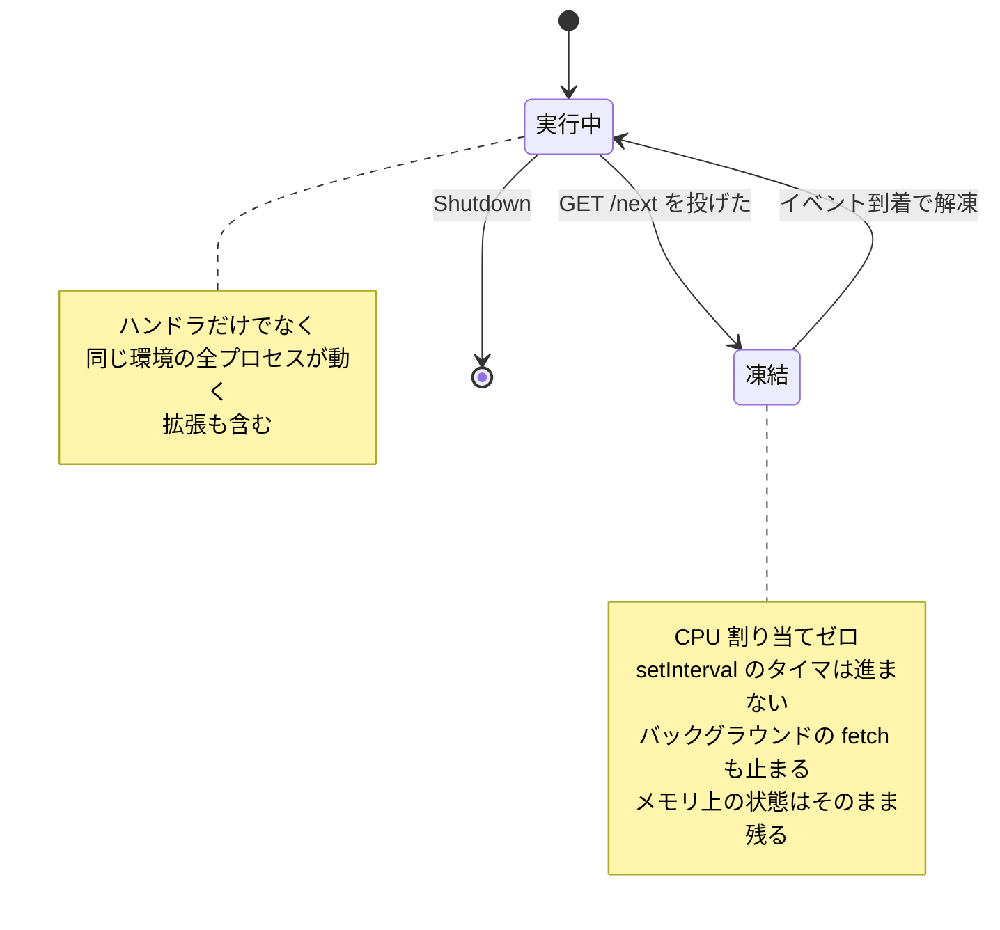

## 何を学んだか

Lambda の実行環境は、**イベントを処理していない間、CPU が割り当てられていない**。プロセスは死んでいないしメモリも保持されているが、命令が 1 つも進まない。AWS のドキュメントはこれを「freeze」と呼び、次の invocation で「thaw」されると説明している。

凍結のトリガーは明確だ。**ランタイムと登録済みの全拡張が `Next` API リクエストを送り、Lambda 側に処理すべきイベントが無くなった時点**で環境は凍る ([Using the Lambda Extensions API to create extensions](https://docs.aws.amazon.com/lambda/latest/dg/runtimes-extensions-api.html))。ランタイムから見れば、それは `GET /next` を投げて応答を待っている瞬間そのものだ。



帰結は 3 つある。

- **レスポンスを返した後に走らせようとしたバックグラウンドタスクは進まない。** 次の invocation で解凍されたときに続きが動くので、そのぶんの CPU 時間は「次のリクエストの処理時間」として計上される。関係のないリクエストのレイテンシが悪化する
- **タイマーや定期フラッシュは期待通りに動かない。** `setInterval(flush, 5000)` は「実行環境が動いていた累積 5 秒」で発火するのであって、壁時計の 5 秒ではない
- **拡張も同じ実行環境の中にいるので、同じく凍る。** Web Adapter が別プロセスだからといって、リクエストの合間に何かをやり続けられるわけではない

AWS のドキュメントは Runtime API の `/next` の説明で、この点を運用上の注意として書いている。「Between when Lambda bootstraps the runtime and when the runtime has an event to return, the runtime process might be frozen for several seconds」。だから `/next` にタイムアウトを設定してはいけない。

## ソースコードのどこか

凍結そのものはランタイム側のコードには現れない。現れるのは**凍結の裏返しであるタイムアウト**の方だ。

`RuntimeApiClientService` は Runtime API へのリクエストを実際に送る層で、レスポンスのステータスコードを見て分岐する。

```rust title="lambda-runtime/src/layers/api_client.rs"
RuntimeApiClientFutureProj::Second(fut) => match ready!(fut.poll(cx)) {
    Ok(resp) if !resp.status().is_success() => {
        let status = resp.status();

        log_or_print!(
            tracing: tracing::error!(status = %status, "Lambda Runtime API returned non-200 response"),
            fallback: eprintln!("Lambda Runtime API returned non-200 response: status={status}")
        );

        // Adding more information on top of 410 Gone, to make it more clear since we cannot access the body of the message
        if status == 410 {
            log_or_print!(
                tracing: tracing::error!("Lambda function timeout!"),
                fallback: eprintln!("Lambda function timeout!")
            );
        }

        // Return Ok to maintain existing contract - runtime continues despite API errors
        break Ok(());
    }
    Ok(_) => break Ok(()),
```

[`lambda-runtime/src/layers/api_client.rs#L96-L120`](https://github.com/aws/aws-lambda-rust-runtime/blob/6f305bb00f3cc613fd82f88d2f2200e8089e4385/lambda-runtime/src/layers/api_client.rs#L96-L120)

410 Gone を特別扱いしている。`POST /invocation/{id}/response` に対して 410 が返るのは、「その request ID はもう有効でない」つまり**関数がすでにタイムアウト扱いになった後だった**という意味だ。ランタイムから見ると、自分は普通にレスポンスを組み立てて POST しただけなのに、Lambda 側ではすでに invocation が打ち切られている。

もう 1 つ注目すべきは `break Ok(())` の方だ。コメントが明示しているとおり、**非 200 でもエラーにせず `Ok(())` を返してループを継続する**のが契約になっている。500 でも 404 でも 410 でも同じで、ログを吐いて次の `/next` へ進む。テストがこの契約をそのまま検証している。

```rust title="lambda-runtime/src/layers/api_client.rs"
#[tokio::test]
#[traced_test]
async fn test_410_timeout_error() {
    let url = start_mock_server(StatusCode::GONE).await;
    ...
    // Returns Ok to maintain contract, but logs the error
    assert!(result.is_ok());

    // Verify the error was logged
    assert!(logs_contain("Lambda Runtime API returned non-200 response"));
    assert!(logs_contain("Lambda function timeout!"));
}
```

[`lambda-runtime/src/layers/api_client.rs#L195-L218`](https://github.com/aws/aws-lambda-rust-runtime/blob/6f305bb00f3cc613fd82f88d2f2200e8089e4385/lambda-runtime/src/layers/api_client.rs#L195-L218)

コード中の TODO が理由を説明している。レスポンスボディを読んでいないので、具体的なエラーメッセージを出せない。だから 410 だけはステータスコードから意味を推測して「Lambda function timeout!」という 1 行を足している。

## なぜそうなっているか

**凍結は課金モデルの帰結だ。** Lambda は「実行環境が動いている時間」に対して課金する。イベントを処理していない環境に CPU を割り当て続けると、誰も払っていない計算資源が消費される。だから Lambda は「全員が `/next` を呼んだ = やることがない」を凍結のシグナルにしている。逆に言えば、`/next` を呼ばずに居座る拡張がいると環境は凍らず、その時間は invocation の duration に加算される。Extensions API のドキュメントが `PostRuntimeExtensionsDuration` というメトリクスを用意しているのはそのためだ。

**非 200 で `Ok(())` を返すのは、ランタイムを壊さないためだ。** 410 が返ってきたということは、この invocation はもう救えない。しかし実行環境自体はまだ生きていて、次のイベントを処理できる可能性がある。ここで `Err` を返してループを抜けると、ランタイムプロセスが終了し、Lambda は実行環境を作り直す。1 回のタイムアウトのために毎回コールドスタートを強制するのは割に合わない。だから「ログには残すが、ループは回し続ける」という判断になっている。

**410 が「タイムアウト」を意味するのは、Lambda 側のタイムアウト処理が invocation を無効化するからだ。** 関数タイムアウトが起きると、Lambda は呼び出し元にエラーを返し、その request ID を閉じる。そのあとランタイムが `/response` を投げても、対応する invocation はもう存在しない。HTTP のセマンティクスでは「かつて存在したが今は無い」は 410 Gone なので、素直な選択と言える。

## どう活かすか

**「レスポンス送信後に非同期でログを送る」作りのアプリは、Lambda 上では期待通りに動かない。** Web Adapter を通せば Express や FastAPI はそのまま起動するが、フレームワークの外側にある実行モデルは変わらない。よくある落とし穴を具体的に挙げると:

- レスポンス後に `res.on('finish', () => analytics.send(...))` で送る計測イベント
- OpenTelemetry や APM SDK のバッチエクスポータ (既定で数秒ごとにフラッシュする)
- コネクションプールのアイドルタイマ、ヘルスチェックの定期実行
- `queueMicrotask` / `setImmediate` で後回しにした重い処理

いずれも「次の invocation が来るまで実行されず、来たらそのリクエストの時間を食う」という挙動になる。回避策は**レスポンスを返す前に完了させる**か、Extensions API を使って invocation の終わりに合わせてフラッシュする専用の拡張を入れることだ。Web Adapter 自身はその手の拡張ではない ([Extensions API](../extensions-api/) 参照)。

**CloudWatch Logs に「Lambda function timeout!」が出ていたら、それは 410 の翻訳だ。** アプリ側のログには何も異常が無いのに、この行だけが出ることがある。意味は「レスポンスを作り終えたときには、すでにタイムアウトしていた」。アプリの処理そのものではなく、関数のタイムアウト設定と処理時間の関係を見に行くべきサインになる。

**フリーズ後の最初のリクエストが遅いのは正常な挙動だ。** 解凍にはコストがあり、さらに TCP コネクションや TLS セッションが向こう側で切れていることがある。Web Adapter が SnapStart のときだけコネクションプールを無効化しているのは、この「凍結を挟んだ再利用」が壊れるケースへの対処で、[hyper クライアントの寿命管理と SnapStart](../hyper-client-and-snapstart/) で扱う。
