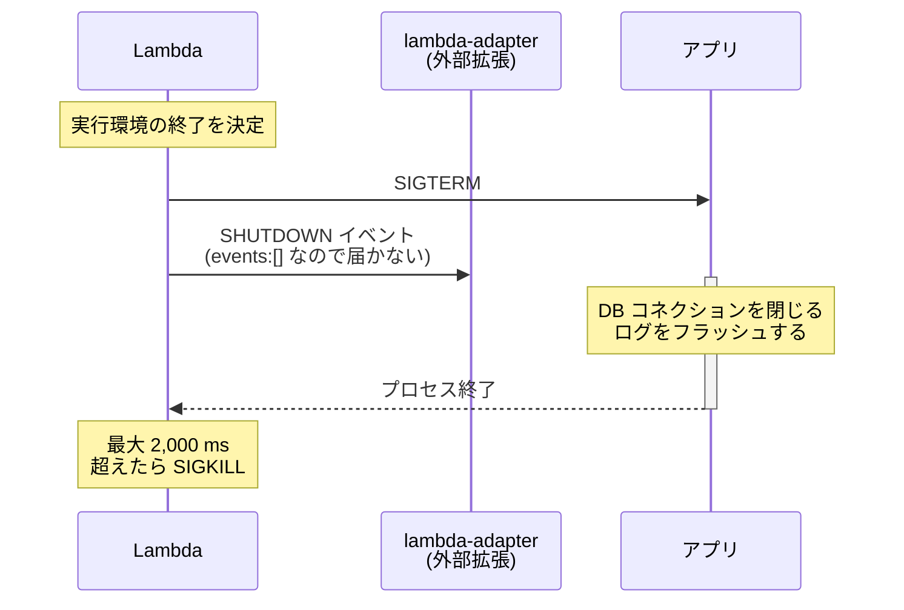

## 何を学んだか

LWA の機能一覧に「Enables graceful shutdown」と書いてある。ところが `src/lib.rs` を `SIGTERM` で検索しても、`signal` で検索しても、何も出てこない。

```bash
$ grep -rn "SIGTERM\|signal" src/
$
```

**アダプタはシグナルを 1 つも扱っていない。** それでも「グレースフルシャットダウンを有効にする」と言えるのはなぜか。

答えは Lambda 側の条件にある。**Lambda がシャットダウン時にランタイムプロセスへ SIGTERM を送るのは、外部拡張が登録されている関数だけ**だ。LWA を入れると外部拡張が 1 個登録されるので、その条件が自動的に満たされる。アダプタは何もせず、Lambda の挙動を変えているだけになっている。

## ソースコードのどこか

LWA 側で関係するのは [拡張として登録する](../extension-registration/) で見た 2 リクエストだけだ。

```rust title="src/lib.rs"
let register_req = hyper::Request::builder()
    .method(Method::POST)
    .uri(format!("http://{aws_lambda_runtime_api}/2020-01-01/extension/register"))
    .header("Lambda-Extension-Name", "lambda-adapter")
    .body(Body::from("{ \"events\": [] }"))?;
```

([src/lib.rs L697 付近](https://github.com/aws/aws-lambda-web-adapter/blob/986113fc66f368f0187a25c683f1ab39a68cc6c6/src/lib.rs#L697))

購読イベントは空 (`{"events": []}`) なので、**LWA 自身は SHUTDOWN イベントを受け取らない**。受け取らないが、「登録済みの外部拡張が 1 個以上ある」という状態は作られる。それだけで十分だった、ということになる。

Zip パッケージ側の `layer/bootstrap` も効いている。

```bash title="layer/bootstrap"
#!/bin/bash

exec -- "${LAMBDA_TASK_ROOT}/${_HANDLER}"
```

`exec` なので、シェルのプロセスがアプリのプロセスに**置き換わる**。もし `exec` を付けずに `"${LAMBDA_TASK_ROOT}/${_HANDLER}"` と書いていたら、bash が親プロセスとして残り、Lambda が送る SIGTERM を受け取るのは bash のほうになる。bash は既定でそれを子プロセスに転送しないので、アプリはシグナルを受け取れずに SIGKILL されることになる。1 単語で挙動が変わる。

## なぜそうなっているか

Lambda のシャットダウンフェーズの仕様が、拡張の有無で変わる。

| 登録済みの拡張      | シャットダウンフェーズの上限 |
| ------------------- | ---------------------------- |
| なし                | 0 ms                         |
| 内部拡張が 1 個以上 | 500 ms                       |
| 外部拡張が 1 個以上 | 2,000 ms                     |

上限を超えても応答しなければ、Lambda は SIGKILL でプロセスを終わらせる。

つまり拡張が 1 個も無い関数では、**シャットダウンの猶予が 0 ms** = 実質的に後片付けの機会がない。LWA を入れることで 2,000 ms が確保され、同時に SIGTERM が届くようになる。



SHUTDOWN イベントのペイロードには `shutdownReason` が入る。`SPINDOWN` (通常終了)、`TIMEOUT` (関数のタイムアウト)、`FAILURE` (OOM などの異常) の 3 種類だ。LWA はこれを受け取らないので、アプリからは終了理由が分からない。

**この機能が「アダプタが何かをすること」ではなく「アダプタが存在すること」で成立している**のが面白いところだ。副作用として得られたものを機能として数えている、とも言える。実際、グレースフルシャットダウンだけが目的なら、何もしないシェルスクリプトを `/opt/extensions/` に置いて登録させるだけでも同じ効果が得られる。

## どう活かすか

**アプリ側に SIGTERM ハンドラを書く。** これがないと猶予 2 秒があっても何も起きない。

```javascript
const server = app.listen(port);

process.on("SIGTERM", () => {
  console.info("SIGTERM received, shutting down gracefully");
  server.close(() => {
    console.info("Server closed");
    process.exit(0);
  });
});
```

```python
import signal, sys

def handle_sigterm(signum, frame):
    db.close()
    sys.exit(0)

signal.signal(signal.SIGTERM, handle_sigterm)
```

**やることは 2 秒で終わる範囲に絞る。** DB コネクションのクローズ、メトリクスやログのフラッシュ、外部リソースの解放。ネットワーク越しの重い処理を入れると 2 秒を超えて SIGKILL される。

**「処理中のリクエストを完了させる」ことは期待しない。** シャットダウンが始まる時点で、その実行環境に新しいリクエストは来ない。処理中のリクエストがあるとすれば [Lambda Managed Instances](../concurrent-polling/) で並行実行している場合だが、そこでも 2 秒しかない。

**Zip パッケージの起動スクリプトでは `exec` を使う。** 自分で `run.sh` を書くとき、

```bash
#!/bin/bash
node index.js       # ← bash が残る。SIGTERM がアプリに届かない
exec node index.js  # ← これが正しい
```

の違いが効く。LWA の `layer/bootstrap` は `exec` してくれるが、そこから呼ばれる `run.sh` の中でも同じ配慮が要る。

**シャットダウンとフリーズを混同しない。** レスポンスを返した後にプロセスが凍るのは [フリーズと解凍](../freeze-thaw/) の話で、シャットダウンとは別の現象だ。凍っている間に走らせたい後処理があるという問題は、SIGTERM ハンドラでは解決しない。
