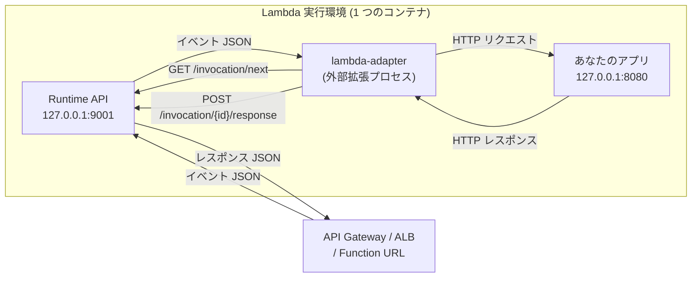

`Dockerfile` に 1 行足すだけで、既存の Web アプリが Lambda で動く。

```dockerfile
COPY --from=public.ecr.aws/awsguru/aws-lambda-adapter:0.9.1 /lambda-adapter /opt/extensions/lambda-adapter
```

アプリのコードは 1 文字も変わらない。`app.listen(8080)` のままで、API Gateway からのリクエストが届く。同じイメージを ECS Fargate に置けば、今度はアダプタは何もせず、普通の Web サーバとして動く。

この「魔法」の中身は、**1,661 行の Rust バイナリ 1 個**だ。ロジックの中心は `src/lib.rs` の 600 行しかない。しかし、その 600 行が成立している理由は、そのファイルの中には書かれていない。

- Lambda が拡張のプロセスを**どう起動し、いつ凍らせ、いつ殺すのか**
- Runtime API という HTTP プロトコルの**どのエンドポイントを、誰が、どの順で叩くのか**
- API Gateway のイベント JSON が `http::Request` に**どこで変換されるのか**
- レスポンスが base64 になるかどうかを**誰が決めているのか**

これらは Lambda 実行環境の契約と、`lambda_http` / `lambda_runtime` クレート (aws-lambda-rust-runtime) の側にある。アダプタ本体はその上に薄く乗っているだけで、だからこそ 600 行で済んでいる。

この章の目的は、**アダプタ本体のコード全部と、それが立っている土台の両方を、1 本の線として読み切ること**だ。



## この OSS について

- Apache 2.0。Rust で 1,661 行 (`src/lib.rs` 1,560 + `main.rs` 38 + `readiness.rs` 63)。AWS 公式リポジトリ。
- **Lambda Extension として動く。** 独自のランタイムを名乗るのではなく、`/opt/extensions/` に置かれる外部拡張として Lambda に起動してもらう。これが「Lambda の外では何も動かない」性質を生んでいて、同じイメージが Fargate でも EC2 でもローカルでも動く理由になっている。
- **Runtime API のクライアントを自分では書いていない。** aws-lambda-rust-runtime の `lambda_http` に丸ごと委ねている。アダプタが自分で HTTP リクエストを組み立てるのは、Extensions API への登録 (2 リクエストだけ) と、ローカルのアプリへの転送だけ。
- **`tower::Service` を 1 個実装しているだけ。** `impl Service<Request> for Adapter` の `call` が `fetch_response` を呼ぶ。それ以外の制御は全部 `lambda_http::run_concurrent` の中にある。この構造のおかげで、圧縮 (`tower-http` の `CompressionLayer`) を挟むのが 1 行で済む。
- **レディネスチェックが 10ms 間隔の固定リトライ。** そして 2 秒ごとに「まだ起動しない」とログを吐く。既定の関数タイムアウトが 3 秒なので、それに気づかせるための間隔だと `readiness.rs` にコメントされている。
- **init タイムアウトを 9.8 秒で自分から諦める仕組みがある。** Lambda の init フェーズには 10 秒の壁があり、`AWS_LWA_ASYNC_INIT=true` にすると 9.8 秒でレディネスチェックを打ち切って init を成功させ、残りの起動は最初のリクエストで待つ。
- **ヘッダに JSON を詰める。** API Gateway のリクエストコンテキストと Lambda のコンテキストを `x-amzn-request-context` / `x-amzn-lambda-context` という HTTP ヘッダに JSON 文字列として入れる。その JSON には元のリクエストパスが混ざるので、制御バイトを含むパス (セキュリティスキャナが投げてくる) で `InvalidHeaderValue` になり invocation 全体が落ちる、という事故が実際にあった。今は 1 バイトずつフィルタしている。
- **SnapStart のときだけコネクションプールを切る。** 復元後は `CLOCK_MONOTONIC` が飛ぶので hyper のプールが死んだコネクションを再利用してしまう。localhost 通信なので TCP を毎回張り直しても大したことはない、という判断。
- **非 HTTP イベントも通る。** SQS でも S3 でも Bedrock Agent でも、判別に失敗したイベントは JSON のまま `POST /events` としてアプリに届く。これは `lambda_http` の `pass_through` フィーチャが「どのイベント型にもマッチしなかったら生の文字列にする」という最後の分岐を持っているから成立している。
- **Runtime API へのリクエストをプロキシに差し替えられる。** `AWS_LWA_LAMBDA_RUNTIME_API_PROXY` を設定すると `AWS_LAMBDA_RUNTIME_API` 環境変数そのものを書き換える。`env::set_var` はスレッドが立つ前でないと安全でないので、`main` の 1 行目、tokio ランタイムを作る前に呼ばれる。

## 読む順番

**「Lambda 実行環境と Runtime API」から順に読んでほしい。** アダプタのコードは短いが、そこに書かれていない前提 (拡張のライフサイクル、`/next` のロングポーリング、ストリーミングレスポンスのワイヤ形式) を知らないと、なぜそう書かれているのかが読めない。Lambda のカスタムランタイムを自分で書いたことがあるなら、群 1 は 2・6・8・9 ページ目 (プロセス構成、bootstrap によるランタイムの乗っ取り、ストリーミングのワイヤ形式、イベント形式の差) だけ拾って次へ進んでよい。

群 2 は aws-lambda-rust-runtime の中身で、アダプタが「何をしなくて済んでいるか」がここに全部ある。**`tower` を知らない場合は、群 2 の 1 ページ目から読んでほしい。** この章の残りに出てくる「Service を Service で包む」という言い回しは全部そこで説明する。Rust の非同期そのものに深入りしたくない場合は、その 1 ページ目と 5・6 ページ目 (イベント判別と base64 判定) だけ読んで群 3 へ進んでも、アダプタ本体の話にはついてこられる。

群 3 以降がアダプタ本体で、`src/lib.rs` を上から順に潰していく構成になっている。

Lambda 実行環境と Runtime API:

- [実行環境のライフサイクル — Init・Invoke・Shutdown](./execution-environment/)
- [実行環境の中のプロセス構成 — 誰が誰を起動するのか](./process-model/)
- [Runtime API — ランタイムが自分でイベントを取りに行く](./runtime-api/)
- [/next のレスポンスヘッダが Context になる](./invocation-headers/)
- [フリーズと解凍 — リクエストの間、プロセスは止まっている](./freeze-thaw/)
- [bootstrap と AWS_LAMBDA_EXEC_WRAPPER — 管理ランタイムを乗っ取る](./custom-runtime-bootstrap/)
- [Extensions API — 拡張はどう登録され、どう生かされるか](./extensions-api/)
- [ストリーミングレスポンスのワイヤ形式](./response-streaming-protocol/)
- [4 つのイベント形式 — REST API・HTTP API・ALB・Function URL](./event-formats/)

aws-lambda-rust-runtime:

- [tower::Service — この章を読むための最小限](./tower-primer/)
- [ランタイムのメインループ](./runtime-loop/)
- [3 層の tower::Service スタック](./tower-service-stack/)
- [パニックを Diagnostic に変える](./diagnostic-and-panic/)
- [並行ポーリング — /next を N 本同時に張る](./concurrent-polling/)
- [イベント JSON をどのイベント型か判別する](./lambda-http-request/)
- [レスポンスが base64 になるかを決めているところ](./lambda-http-response/)
- [ストリーミング用の Service](./streaming-service/)

アダプタのかたち:

- [アーキテクチャを一枚で読む](./architecture/)
- [main の 4 行 — 起動順序には理由がある](./bootstrap-and-startup/)
- [拡張として登録する — events は空でいい](./extension-registration/)
- [レディネスチェック — 10ms 間隔で叩き続ける](./readiness-check/)
- [非同期初期化 — 9.8 秒で諦めて init を通す](./async-init/)

リクエストを流す:

- [fetch_response — イベントが HTTP リクエストになるまで](./fetch-response/)
- [コンテキストを HTTP ヘッダに詰める](./context-headers/)
- [ヘッダに入れてはいけないバイトを落とす](./forbidden-header-bytes/)
- [ベースパス除去とステージ名の相互作用](./base-path-and-stage/)
- [非 HTTP イベントを POST /events に流す](./pass-through/)
- [ステータスコードを Lambda のエラーに変える](./error-status-codes/)
- [Authorization ヘッダを付け替える](./authorization-source/)

レスポンスを返す:

- [buffered と response_stream — run() の 3 分岐](./buffered-vs-streaming/)
- [レスポンス圧縮と、ストリーミングと併用できない理由](./compression/)
- [hyper クライアントの寿命管理と SnapStart](./hyper-client-and-snapstart/)
- [ストリーミングを端から端まで追う](./streaming-end-to-end/)

配布と運用:

- [2 つの配布形態 — コンテナイメージと Lambda Layer](./packaging/)
- [Lambda の外では何も動かない](./outside-lambda/)
- [Runtime API プロキシ — 通信に割り込む](./runtime-api-proxy/)
- [グレースフルシャットダウン](./graceful-shutdown/)
