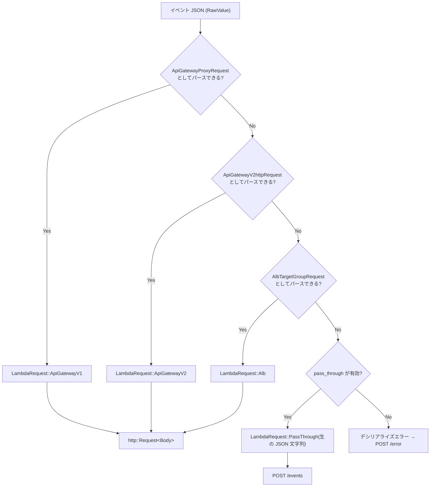

## 何を学んだか

`/next` から返ってくるのは JSON だ。その JSON が API Gateway REST API のものか、HTTP API のものか、ALB のものか、それとも SQS のものか — **JSON 自体には書いていない**。`"eventSource"` フィールドを持つイベント型もあるが、API Gateway 系は持っていない。

`lambda_http` はこれを「順番に全部パースしてみて、最初に通ったものを採用する」という総当たりで解決している。エレガントではないが、他に方法が無い。

そして最後の砦が `pass_through` で、どれにもマッチしなかったイベントを生の JSON 文字列として受け取る。これが LWA で「SQS でも S3 でも Bedrock Agent でも動く」を成立させている。

## ソースコードのどこか

判別の全体が [`lambda-http/src/deserializer.rs`](https://github.com/aws/aws-lambda-rust-runtime/blob/6f305bb00f3cc613fd82f88d2f2200e8089e4385/lambda-http/src/deserializer.rs#L18) の 30 行に収まっている。

```rust title="lambda-http/src/deserializer.rs"
impl<'de> Deserialize<'de> for LambdaRequest {
    fn deserialize<D>(deserializer: D) -> Result<Self, D::Error>
    where
        D: serde::Deserializer<'de>,
    {
        let raw_value: Box<RawValue> = Box::<RawValue>::deserialize(deserializer)?;
        let data = raw_value.get();

        #[cfg(feature = "apigw_rest")]
        if let Ok(res) = serde_json::from_str::<ApiGatewayProxyRequest>(data) {
            return Ok(LambdaRequest::ApiGatewayV1(res));
        }
        #[cfg(feature = "apigw_http")]
        if let Ok(res) = serde_json::from_str::<ApiGatewayV2httpRequest>(data) {
            return Ok(LambdaRequest::ApiGatewayV2(res));
        }
        #[cfg(feature = "alb")]
        if let Ok(res) = serde_json::from_str::<AlbTargetGroupRequest>(data) {
            return Ok(LambdaRequest::Alb(res));
        }
        #[cfg(feature = "apigw_websockets")]
        if let Ok(res) = serde_json::from_str::<ApiGatewayWebsocketProxyRequest>(data) {
            return Ok(LambdaRequest::WebSocket(res));
        }
        #[cfg(feature = "pass_through")]
        if PASS_THROUGH_ENABLED {
            return Ok(LambdaRequest::PassThrough(data.to_string()));
        }

        Err(Error::custom(ERROR_CONTEXT))
    }
}
```

まず `RawValue` として受け取ることで、生の JSON 文字列 `data` を保持する。そこから型ごとに `serde_json::from_str` をかけ直す。

LWA のフィーチャ構成では `apigw_websockets` が無効なので、実際に試されるのは 3 つ + `pass_through` になる。



`LambdaRequest` の定義 ([`request.rs#L45`](https://github.com/aws/aws-lambda-rust-runtime/blob/6f305bb00f3cc613fd82f88d2f2200e8089e4385/lambda-http/src/request.rs#L45)) には、この順番が意図的であることが明記されている。

```rust title="lambda-http/src/request.rs"
/// This is not intended to be a type consumed by crate users directly. The order
/// of the variants are notable. Serde will try to deserialize in this order.
#[non_exhaustive]
#[doc(hidden)]
#[derive(Debug)]
pub enum LambdaRequest {
    #[cfg(feature = "apigw_rest")]
    ApiGatewayV1(ApiGatewayProxyRequest),
    #[cfg(feature = "apigw_http")]
    ApiGatewayV2(ApiGatewayV2httpRequest),
    #[cfg(feature = "alb")]
    Alb(AlbTargetGroupRequest),
    #[cfg(feature = "apigw_websockets")]
    WebSocket(ApiGatewayWebsocketProxyRequest),
    #[cfg(feature = "pass_through")]
    PassThrough(String),
}
```

### 判別結果が http::Request になる

`From<LambdaRequest> for http::Request<Body>` ([`request.rs#L402`](https://github.com/aws/aws-lambda-rust-runtime/blob/6f305bb00f3cc613fd82f88d2f2200e8089e4385/lambda-http/src/request.rs#L402)) が、バリアントごとの変換関数に振り分ける。

```rust title="lambda-http/src/request.rs"
impl From<LambdaRequest> for http::Request<Body> {
    fn from(value: LambdaRequest) -> Self {
        match value {
            #[cfg(feature = "apigw_rest")]
            LambdaRequest::ApiGatewayV1(ag) => into_proxy_request(ag),
            #[cfg(feature = "apigw_http")]
            LambdaRequest::ApiGatewayV2(ag) => into_api_gateway_v2_request(ag),
            #[cfg(feature = "alb")]
            LambdaRequest::Alb(alb) => into_alb_request(alb),
            #[cfg(feature = "apigw_websockets")]
            LambdaRequest::WebSocket(ag) => into_websocket_request(ag),
            #[cfg(feature = "pass_through")]
            LambdaRequest::PassThrough(data) => into_pass_through_request(data),
        }
    }
}
```

どの変換関数も、`http::Request` の **extensions に元の情報を載せる**。HTTP API の場合 ([L111](https://github.com/aws/aws-lambda-rust-runtime/blob/6f305bb00f3cc613fd82f88d2f2200e8089e4385/lambda-http/src/request.rs#L111)):

```rust title="lambda-http/src/request.rs"
let builder = http::Request::builder()
    .uri(uri)
    .extension(RawHttpPath(raw_path))
    .extension(QueryStringParameters(query_string_parameters))
    .extension(PathParameters(QueryMap::from(ag.path_parameters)))
    .extension(StageVariables(QueryMap::from(ag.stage_variables)))
    .extension(RequestContext::ApiGatewayV2(ag.request_context));
```

`http::Extensions` は `TypeId` をキーにした型付きの入れ物で、`http::Request` に任意の値を相乗りさせられる。ここに `RequestContext` と `RawHttpPath` が入る。

LWA はこれを `RequestExt` 経由で取り出す。`request_context()` は [`ext/extensions.rs#L235`](https://github.com/aws/aws-lambda-rust-runtime/blob/6f305bb00f3cc613fd82f88d2f2200e8089e4385/lambda-http/src/ext/extensions.rs#L235)、`raw_http_path()` は [L269](https://github.com/aws/aws-lambda-rust-runtime/blob/6f305bb00f3cc613fd82f88d2f2200e8089e4385/lambda-http/src/ext/extensions.rs#L269) にある。前者は `x-amzn-request-context` ヘッダの中身になり ([コンテキストを HTTP ヘッダに詰める](../context-headers/))、後者はステージ名を含まない元のパスの復元に使われる ([ベースパス除去とステージ名の相互作用](../base-path-and-stage/))。

### pass_through の変換

[`request.rs#L341`](https://github.com/aws/aws-lambda-rust-runtime/blob/6f305bb00f3cc613fd82f88d2f2200e8089e4385/lambda-http/src/request.rs#L341):

```rust title="lambda-http/src/request.rs"
#[cfg(feature = "pass_through")]
fn into_pass_through_request(data: String) -> http::Request<Body> {
    let mut builder = http::Request::builder();

    let headers = builder.headers_mut().unwrap();
    headers.insert("Content-Type", "application/json".parse().unwrap());

    let raw_path = "/events";

    builder
        .method(http::Method::POST)
        .uri(raw_path)
        .extension(RawHttpPath(raw_path.to_string()))
        .extension(RequestContext::PassThrough)
        .body(Body::from(data))
        .expect("failed to build request")
}
```

`POST /events`、`Content-Type: application/json`、ボディは元の JSON そのまま。`RequestContext::PassThrough` はデータを持たないユニットバリアントで、「HTTP イベントではない」という印だけを残す。アプリ側から見た挙動は [非 HTTP イベントを POST /events に流す](../pass-through/) を参照。

## なぜそうなっているか

**タグが無いものはタグ無しで判別するしかない。** `serde` の `#[serde(untagged)]` も内部的には同じことをやる (各バリアントを順に試す)。ここで手書きの `Deserialize` になっているのは、`untagged` だとエラーメッセージが役に立たないことと、`pass_through` のように「どれでもない場合」を明示的に扱いたいからだ。

**順番が REST → HTTP API → ALB なのは、型の緩さの順ではない。** `ApiGatewayProxyRequest` は `httpMethod` / `resource` / `path` を持ち、`ApiGatewayV2httpRequest` は `requestContext.http.method` / `rawPath` / `version` を持つ。形が十分に違うので、多くの場合はどちらか一方しか通らない。ただし `aws_lambda_events` の型は多くのフィールドを `Option` にしているので、**理論上は「両方通る JSON」が作れてしまう**。そのときは先に書かれているほうが勝つ。これは総当たり方式の構造的な弱点で、イベント型を増やすほど誤判定の余地が広がる。

**それでも実害が出にくいのは、判別結果がレスポンス形式の選択にしか使われないから。** `LambdaRequest::request_origin()` が `RequestOrigin` を返し、それがレスポンス JSON の組み立て方を決める ([レスポンスが base64 になるかを決めているところ](../lambda-http-response/))。誤判定すれば「ALB に API Gateway v2 形式で返す」ような事故になるが、実際のイベント形式が十分に違うので起きにくい。

**`pass_through` が最後にあるのは、それが「常に成功する」から。** `data.to_string()` は失敗しようがない。だから `pass_through` が有効な限り、`Err(Error::custom(ERROR_CONTEXT))` には**絶対に到達しない**。逆に無効なら、SQS や S3 のイベントは `ERROR_CONTEXT` のメッセージ (`this function expects a JSON payload from Amazon API Gateway, Amazon Elastic Load Balancer, or AWS Lambda Function URLs, ...`) と共にデシリアライズエラーになり、ハンドラを呼ばずに `/error` が返る ([3 層の tower::Service スタック](../tower-service-stack/))。

**LWA が `pass_through` を有効にしたのは、Web アプリを Lambda で動かす以上の使い道を許すため。** アダプタから見れば、SQS のイベントも「ボディが JSON の POST リクエスト」でしかない。Express に `app.post('/events', ...)` を足せば、既存の Web アプリがそのまま SQS コンシューマになる。

**`apigw_websockets` を無効にしているのは、WebSocket の応答モデルが HTTP と噛み合わないから。** WebSocket API の Lambda 統合は `@connections` API を通じてメッセージを送り返すもので、リクエスト/レスポンスの往復に落とせない。フィーチャを切っておけば、判別の試行が 1 つ減るという副次的な効果もある。

## どう活かすか

- **LWA で受け取れないイベントは基本的に存在しない。** どれにも当たらなければ `POST /events` になる。逆に「HTTP リクエストとして届くはずが `/events` に来た」なら、イベント形式が 3 つのどれとも一致していない。カスタムのテストイベントを手書きしたときによく起きる。
- **API Gateway v1 と v2 のどちらとして解釈されたかは、`x-amzn-request-context` ヘッダの中身で分かる。** REST API なら `httpMethod` や `resource` があり、HTTP API なら `http.method` や `routeKey` がある。挙動がおかしいときはまずここを見る。
- **イベント JSON を手で作るときは、判別に必要なフィールドを削らない。** 特に HTTP API の `version` / `rawPath` / `requestContext.http` は、これが欠けると v1 として解釈されたり `pass_through` に落ちたりする。
- **`RequestExt` の `request_context()` / `raw_http_path()` が何を返すかは、extensions に何が載ったかで決まる。** `pass_through` の場合は `RequestContext::PassThrough` と `/events` が返る。LWA のコードでこれらを読んでいる箇所は、必ずこの分岐を意識して書かれている。
