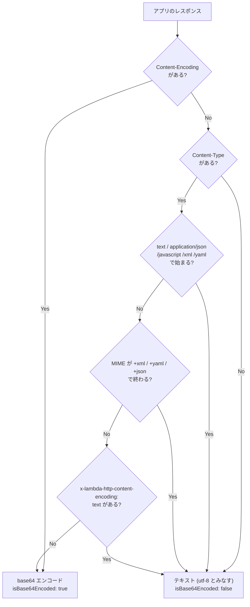

## 何を学んだか

「画像が壊れる」「JSON がなぜか base64 になる」といった相談は LWA の Issue によく来る。しかし **LWA のコードにはレスポンスボディを変換する処理が 1 行も無い**。`fetch_response` はアプリのレスポンスをそのまま返しているだけだ ([`src/lib.rs#L1039`](https://github.com/aws/aws-lambda-web-adapter/blob/986113fc66f368f0187a25c683f1ab39a68cc6c6/src/lib.rs#L1039))。

判定しているのは `lambda_http` の `ConvertBody::convert` で、見ているのは `Content-Encoding` と `Content-Type` だけだ。つまり **base64 になるかどうかは、アプリが返すヘッダで完全に決まる**。

さらにその後、`LambdaResponse::from_response` が `RequestOrigin` ごとに違う JSON を組み立てる。API Gateway v1 と v2 と ALB で、ヘッダの入れ方が全部違う。

## ソースコードのどこか

### 判定は 6 段階

[`lambda-http/src/response.rs#L321`](https://github.com/aws/aws-lambda-rust-runtime/blob/6f305bb00f3cc613fd82f88d2f2200e8089e4385/lambda-http/src/response.rs#L321):

```rust title="lambda-http/src/response.rs"
fn convert(self, headers: HeaderMap) -> BodyFuture {
    if headers.get(CONTENT_ENCODING).is_some() {
        return convert_to_binary(self);
    }

    let content_type = if let Some(value) = headers.get(CONTENT_TYPE) {
        value.to_str().unwrap_or_default()
    } else {
        // Content-Type and Content-Encoding not set, passthrough as utf8 text
        return convert_to_text(self, "utf-8");
    };

    for prefix in TEXT_ENCODING_PREFIXES {
        if content_type.starts_with(prefix) {
            return convert_to_text(self, content_type);
        }
    }

    for suffix in TEXT_ENCODING_SUFFIXES {
        let mut parts = content_type.trim().split(';');
        let mime_type = parts.next().unwrap_or_default();
        if mime_type.ends_with(suffix) {
            return convert_to_text(self, content_type);
        }
    }

    if let Some(value) = headers.get(X_LAMBDA_HTTP_CONTENT_ENCODING) {
        if value == "text" {
            return convert_to_text(self, content_type);
        }
    }

    convert_to_binary(self)
}
```

順に並べるとこうなる。

1. **`Content-Encoding` ヘッダがあれば → 無条件でバイナリ (base64)**
2. `Content-Type` が無ければ → UTF-8 テキスト
3. `Content-Type` が `TEXT_ENCODING_PREFIXES` のいずれかで**始まる**なら → テキスト
4. MIME タイプが `TEXT_ENCODING_SUFFIXES` のいずれかで**終わる**なら → テキスト
5. `x-lambda-http-content-encoding: text` があれば → テキスト
6. それ以外 → バイナリ (base64)

判定表は [L32](https://github.com/aws/aws-lambda-rust-runtime/blob/6f305bb00f3cc613fd82f88d2f2200e8089e4385/lambda-http/src/response.rs#L32):

```rust title="lambda-http/src/response.rs"
const TEXT_ENCODING_PREFIXES: [&str; 5] = [
    "text",
    "application/json",
    "application/javascript",
    "application/xml",
    "application/yaml",
];

const TEXT_ENCODING_SUFFIXES: [&str; 3] = ["+xml", "+yaml", "+json"];
```

サフィックス判定は `;` の前だけを見るので、`application/graphql-response+json; charset=utf-16` もテキストになる。一方プレフィックス判定は文字列先頭のマッチなので、`image/svg+xml` はプレフィックスには当たらないがサフィックスで拾われる。



### テキスト側は charset を見る

[`convert_to_text`](https://github.com/aws/aws-lambda-rust-runtime/blob/6f305bb00f3cc613fd82f88d2f2200e8089e4385/lambda-http/src/response.rs#L374):

```rust title="lambda-http/src/response.rs"
let mime_type = content_type.parse::<Mime>();

let encoding = match mime_type.as_ref() {
    Ok(mime) => mime.get_param(CHARSET).unwrap_or(mime::UTF_8),
    Err(_) => mime::UTF_8,
};

let label = encoding.as_ref().as_bytes();
let encoding = Encoding::for_label(label).unwrap_or(encoding_rs::UTF_8);

// assumes utf-8
Box::pin(async move {
    let bytes = body.collect().await.expect("unable to read bytes from body").to_bytes();
    let (content, _, _) = encoding.decode(&bytes);
    // ...
})
```

`Content-Type: application/json; charset=utf-16` なら `encoding_rs` の UTF-16 デコーダで Rust の `String` に変換される。charset の指定が無ければ UTF-8。

どちらの経路でも `body.collect().await` が入る。**バッファモードではボディを必ず全部メモリに読み切る。**

### RequestOrigin ごとに違う JSON

[`LambdaResponse::from_response`](https://github.com/aws/aws-lambda-rust-runtime/blob/6f305bb00f3cc613fd82f88d2f2200e8089e4385/lambda-http/src/response.rs#L60) の入口で `isBase64Encoded` が決まる。

```rust title="lambda-http/src/response.rs"
let (is_base64_encoded, body) = match bod {
    Body::Empty => (false, None),
    b @ Body::Text(_) => (false, Some(b)),
    b @ Body::Binary(_) => (true, Some(b)),
    _ => (false, None),
};
```

`ConvertBody` が `Body::Text` を作ったか `Body::Binary` を作ったかが、そのまま `isBase64Encoded` になる。

そこから先が `RequestOrigin` ごとの分岐だ。

**API Gateway v1** — `headers` を空にして `multiValueHeaders` だけを埋める。

```rust title="lambda-http/src/response.rs"
// Explicitly empty, as API gateway v1 will merge "headers" and
// "multi_value_headers" fields together resulting in duplicate response headers.
response.headers = HeaderMap::new();
response.multi_value_headers = headers;
```

**API Gateway v2** — `set-cookie` をヘッダから抜いて `cookies` 配列に移し、`multiValueHeaders` を空にする。

```rust title="lambda-http/src/response.rs"
// ApiGatewayV2 expects the set-cookies headers to be in the "cookies" attribute,
// so remove them from the headers.
let cookies = headers
    .get_all(SET_COOKIE)
    .iter()
    .map(|v| v.to_str().ok().unwrap_or_default().to_string())
    .collect();
headers.remove(SET_COOKIE);
// ...
// API gateway v2 doesn't have "multi_value_headers" field. Duplicate headers
// are combined with commas and included in the headers field.
response.headers = headers;
response.multi_value_headers = HeaderMap::new();
```

**ALB** — 両方埋める。さらに `statusDescription` を付ける。

```rust title="lambda-http/src/response.rs"
// ALB responses are used for ALB integration, which can be configured to use
// either "headers" or "multi_value_headers" field. We need to return both fields
// to ensure both configuration work correctly.
response.headers = headers.clone();
response.multi_value_headers = headers;
response.status_description = Some(format!(
    "{} {}",
    status_code,
    parts.status.canonical_reason().unwrap_or_default()
));
```

**PassThrough** — ここだけ全く違う。

```rust title="lambda-http/src/response.rs"
#[cfg(feature = "pass_through")]
RequestOrigin::PassThrough => {
    match body {
        // text body must be a valid json string
        Some(Body::Text(body)) => {LambdaResponse::PassThrough(serde_json::from_str(&body).unwrap_or_default())},
        // binary body and other cases return Value::Null
        _ => LambdaResponse::PassThrough(serde_json::Value::Null),
    }
}
```

ステータスコードもヘッダも捨てられ、**ボディを JSON としてパースした結果だけ**が Lambda の戻り値になる。`unwrap_or_default()` なので、パースに失敗すれば `Value::Null` — つまり `null` が返る。バイナリ判定されていた場合も `null` だ。

## なぜそうなっているか

**`Content-Encoding` があれば無条件でバイナリなのは、既に符号化されているから。** gzip や brotli がかかったバイトを「テキスト」として UTF-8 デコードすれば壊れる。中身が JSON かどうかは関係ない。LWA の圧縮機能 (`CompressionLayer`) が `Content-Encoding: gzip` を付けると、その時点で base64 化が確定する ([レスポンス圧縮と、ストリーミングと併用できない理由](../compression/))。

**`Content-Type` が無いときにテキスト扱いにするのは、`IntoResponse for String` などの素朴なハンドラを想定しているから。** `lambda_http::run(service_fn(|_| async { Ok("hello") }))` のようなコードは `Content-Type` を付けない。ここでバイナリにすると全部 base64 になってしまう。

**MIME のサフィックス判定があるのは、`+json` / `+xml` 系のサブタイプがテキストだから。** `image/svg+xml`、`application/vnd.api+json`、`application/graphql-response+json` はいずれも中身がテキストだが、プレフィックス表には載らない。RFC 6839 のサフィックス規約に従って拾っている。

**`x-lambda-http-content-encoding: text` は、判定表に載せられないケースのための逃げ道。** 独自の MIME タイプ (`application/vnd.mycompany.thing`) でテキストを返したいとき、これ以外に base64 化を止める手段が無い。判定順が 5 番目なのがポイントで、**`Content-Encoding` があると効かない**。圧縮したうえでテキストとして返す、はできない。

**API Gateway v1 で `headers` を空にするのは、v1 が両方をマージするから。** `headers` と `multiValueHeaders` の両方に `Content-Type` を入れると、API Gateway が結合してレスポンスに 2 回 `Content-Type` が出る。だから片方に寄せる。`multiValueHeaders` を選んだのは、`Set-Cookie` を複数返すのに単数のヘッダマップでは足りないから。

**ALB だけ両方埋めるのは、ALB のターゲットグループ設定で挙動が変わるから。** ALB には「Multi value headers」の有効/無効という設定があり、無効なら `headers`、有効なら `multiValueHeaders` を読む。ランタイム側からはどちらの設定か分からないので、両方入れて取りこぼしを無くしている。API Gateway v1 と違ってマージされないので、これで問題ない。

**PassThrough でボディを JSON にパースするのは、返り値が「HTTP レスポンス」ではなく「Lambda 関数の戻り値」だから。** SQS のイベントを処理した結果を返す先は API Gateway ではなく、SQS のイベントソースマッピングや Step Functions だ。そこに `{"statusCode": 200, "body": "..."}` を返しても意味がない。だからアプリが返した JSON をそのまま関数の戻り値にする。

**その代償として、有効な JSON を返さないと結果が `null` になる。** これは実務で刺さるポイントだ。`app.post('/events', (req, res) => res.send('ok'))` は `Content-Type: text/html` で `ok` を返すので、テキスト判定は通るが `serde_json::from_str("ok")` が失敗して `null` になる。`res.json({ ok: true })` にすれば `{"ok":true}` が返る。詳細は [非 HTTP イベントを POST /events に流す](../pass-through/) を参照。

## どう活かすか

- **画像や PDF が壊れるなら、まず `Content-Type` を疑う。** `application/octet-stream` や `image/png` なら base64 になるので正しい。逆に `text/plain` で画像を返していると UTF-8 デコードで壊れる。
- **独自 MIME でテキストを返したいときは `x-lambda-http-content-encoding: text` を付ける。** これが唯一の抑制手段で、アプリ側から 1 ヘッダ足すだけで済む。ただし `Content-Encoding` を同時に付けると効かない。
- **base64 化はレスポンスサイズを約 1.33 倍にする。** Lambda のレスポンス上限 6MB に対して、実質 4.5MB 程度が上限になる。大きなバイナリを返すなら S3 の署名付き URL にリダイレクトするか、ストリーミングモードにする ([ストリーミング用の Service](../streaming-service/))。
- **API Gateway v1 で「なぜかヘッダが 2 つ出る」現象は、このコードのおかげで起きない。** 逆に自前でレスポンス JSON を組む実装に乗り換えるときは、この落とし穴を思い出す。
- **非 HTTP イベントのハンドラは必ず有効な JSON を返す。** 空レスポンス、プレーンテキスト、HTML はすべて `null` になる。返り値を使う側 (Step Functions の次の状態など) から見ると原因が分かりにくいので、`/events` のハンドラを書いた時点で確認しておく。
