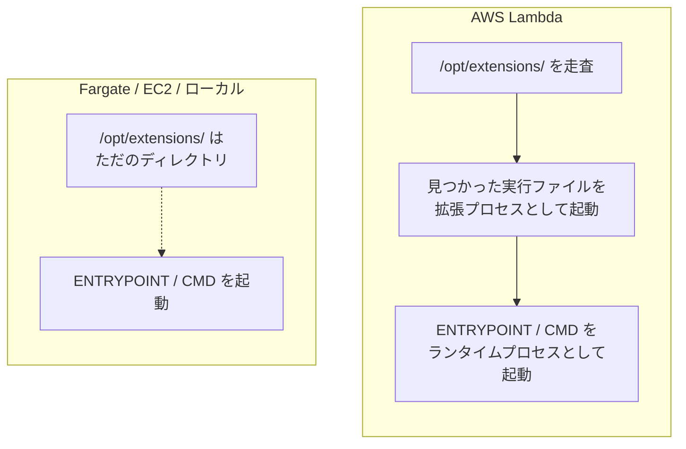

## 何を学んだか

LWA の README にはこう書いてある。

> The same docker image can run on AWS Lambda, Amazon EC2, AWS Fargate, and local computers.

これを読んだとき、私は「アダプタが環境を判定して、Lambda 上でだけ動くようになっているのだろう」と思った。`AWS_LAMBDA_RUNTIME_API` が設定されているかどうかを見るとか、そういうコードがどこかにあるはずだ、と。

**そんなコードは 1 行もない。**

`src/lib.rs` にも `src/main.rs` にも「ここは Lambda か?」を判定する分岐は存在しない。仕組みはもっと単純で、**Lambda の外ではアダプタのプロセスがそもそも起動されない**、というだけだ。

## ソースコードのどこか

正確には「ソースコードの中に無いこと」を確認するページになる。

```bash
$ grep -n "AWS_LAMBDA_RUNTIME_API" src/lib.rs
99:const ENV_LAMBDA_RUNTIME_API: &str = "AWS_LAMBDA_RUNTIME_API";
694:            None => env::var(ENV_LAMBDA_RUNTIME_API).unwrap_or_else(|_| "127.0.0.1:9001".to_string()),
921:            env::set_var(ENV_LAMBDA_RUNTIME_API, runtime_proxy);
```

3 箇所とも「Lambda 上にいる」ことを前提にした使い方だ。未設定のときは `127.0.0.1:9001` にフォールバックして、そのまま接続を試みる。「Lambda ではないから何もしない」という分岐にはならない。

環境変数を見て挙動を変えている箇所はもう 1 つあるが、これも判定ではなく最適化の切り替えだ。

```rust title="src/lib.rs"
if env::var("AWS_LAMBDA_INITIALIZATION_TYPE").as_deref() == Ok("snap-start") {
    builder.pool_max_idle_per_host(0);
} else {
    builder.pool_idle_timeout(Duration::from_secs(4));
}
```

([src/lib.rs L595 付近](https://github.com/aws/aws-lambda-web-adapter/blob/986113fc66f368f0187a25c683f1ab39a68cc6c6/src/lib.rs#L595)。詳細は [hyper クライアントの寿命管理と SnapStart](../hyper-client-and-snapstart/))

さらに言えば、アダプタを Lambda 外で無理に起動すると**普通に失敗する**。`lambda_http::run_concurrent` の先で `Config::from_env()` が呼ばれ、

```rust title="lambda-runtime/src/lib.rs"
function_name: env::var("AWS_LAMBDA_FUNCTION_NAME").expect("Missing AWS_LAMBDA_FUNCTION_NAME env var"),
```

でパニックする ([lambda-runtime/src/lib.rs L72 付近](https://github.com/aws/aws-lambda-rust-runtime/blob/6f305bb00f3cc613fd82f88d2f2200e8089e4385/lambda-runtime/src/lib.rs#L72))。つまりアダプタは「Lambda 外でおとなしくしている」のではなく、「Lambda 外では動けない」。動けないことが問題にならないのは、起動されないからだ。

## なぜそうなっているか

起動されるかどうかを決めているのは Lambda 側の規約だ。



`/opt/extensions/` 配下を走査して中の実行ファイルを起動する、というのは Lambda 実行環境だけが持っている振る舞いだ。Docker にも containerd にも ECS にも、そんな規約はない。`docker run` したときに起動されるのは `ENTRYPOINT` / `CMD` に書かれたコマンドだけで、`/opt/extensions/lambda-adapter` は 3MB ほどのファイルとしてイメージの中に残るだけになる。

Zip パッケージ側も同じ構造だ。アプリを起動しているのは `AWS_LAMBDA_EXEC_WRAPPER=/opt/bootstrap` という Lambda の関数設定であって、コードの中には何も書かれていない。Lambda 以外の場所にそのコードを持っていっても、`AWS_LAMBDA_EXEC_WRAPPER` を解釈する主体がいない。

**「環境を判定する」のではなく「環境に判定させる」設計になっている**、と言い換えられる。判定ロジックを持たないので、判定を間違えることもない。

これは自明に見えて、実はそう作らない選択肢のほうが自然だったはずだ。たとえば「アダプタをアプリと同じプロセスに埋め込むライブラリ」として作れば、環境判定は必須になる (`if (process.env.AWS_LAMBDA_RUNTIME_API) { ... }` のような分岐がアプリ側に入る)。Serverless Express のようなアダプタライブラリはまさにその形をとっていて、だからこそ言語ごとにライブラリが必要になり、アプリのコードにも手が入る。LWA が「別プロセスの外部拡張」を選んだことで、判定も言語依存もコード変更も、全部消えた。

## どう活かすか

**ローカル開発では Lambda のことを忘れてよい。** `node index.js` でも `uvicorn main:app --port 8080` でも、いつも通りに起動して、いつも通りのデバッガをアタッチできる。アダプタは動いていないので、間に何も挟まっていない。この「ローカルでは素の Web サーバ」という性質が、LWA を採用する実務上の最大の利点だと思う。

**Lambda 固有の挙動をローカルで確認したいときだけ SAM を使う。** `sam local start-api` は Runtime Interface Emulator を立ててアダプタを実際に走らせる。ただし RIE がポート 8080 を使うので、アプリのポートは別にしておく必要がある。

**同じイメージを Fargate と Lambda で共用する構成が本当に組める。** トラフィックの少ない時間帯は Lambda、定常負荷は Fargate、といった振り分けが、イメージを 1 本に保ったままできる。このとき注意するのは Lambda 側にしかない制約 (レスポンスサイズ上限、[フリーズと解凍](../freeze-thaw/) による背景処理の停止、`/tmp` 以外が読み取り専用) のほうで、これらはアダプタが吸収してくれない。

**アダプタの存在に依存したコードを書かない。** `x-amzn-request-context` ヘッダは Lambda 上でしか付かない。アプリがそのヘッダを必須として扱うと、Fargate で動かした瞬間に壊れる。読むなら常に「無いかもしれない」前提で読む。
