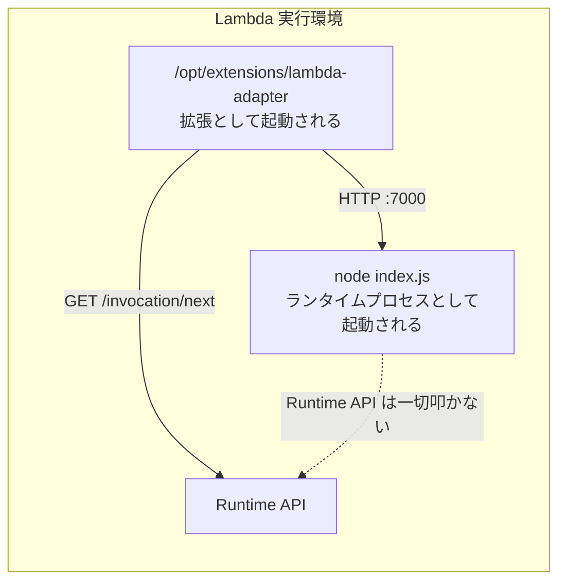

## 何を学んだか

LWA の配布物は、**アーキテクチャごとに 1 個の静的リンクバイナリ**しかない。それが 2 通りの置かれ方をする。

|                    | コンテナイメージ                 | Zip パッケージ                                                        |
| ------------------ | -------------------------------- | --------------------------------------------------------------------- |
| アダプタの置き場所 | `/opt/extensions/lambda-adapter` | Layer 経由で `/opt/extensions/lambda-adapter`                         |
| アプリの起動方法   | イメージの `ENTRYPOINT` / `CMD`  | `AWS_LAMBDA_EXEC_WRAPPER=/opt/bootstrap` + Handler に起動スクリプト名 |
| ランタイム設定     | OCI イメージ                     | `nodejs22.x` などの AWS 管理ランタイム、または `provided.al2023`      |
| 追加で必要なもの   | なし                             | Layer の ARN 1 本                                                     |

置かれ方が違うだけで、動き出したあとのアダプタの挙動は完全に同じだ。どちらの形態でも、アダプタは外部拡張として起動され、Runtime API からイベントを取り、`127.0.0.1:8080` へ HTTP で投げる。

そして両方に共通する、Lambda 側のある性質が効いている。**Lambda は「ランタイムプロセス」と「Runtime API をポーリングしているプロセス」が同一であることを要求しない。**

## ソースコードのどこか

### ビルド

[`Makefile`](https://github.com/aws/aws-lambda-web-adapter/blob/986113fc66f368f0187a25c683f1ab39a68cc6c6/Makefile) が両方の成果物を作る。

```makefile title="Makefile"
build-image-x86: fmt lint test
	LAMBDA_RUNTIME_USER_AGENT=aws-lambda-rust/aws-lambda-adapter/$(CARGO_PKG_VERSION) cargo lambda build --release --extension --target x86_64-unknown-linux-musl
	printf 'FROM scratch\nADD target/lambda/extensions/. /\n' | docker build --platform=linux/amd64 -t aws-lambda-adapter:$(CARGO_PKG_VERSION)-x86_64 -f- .

build-LambdaAdapterLayerX86:
	cp layer/* $(ARTIFACTS_DIR)/
	LAMBDA_RUNTIME_USER_AGENT=aws-lambda-rust/aws-lambda-adapter/$(CARGO_PKG_VERSION) \
		cargo lambda build --release --extension --target x86_64-unknown-linux-musl --lambda-dir $(ARTIFACTS_DIR)
```

読み取れること。

- `cargo lambda build --extension` が `target/lambda/extensions/` の下にバイナリを置く。`--extension` を付けると `extensions/` サブディレクトリになるので、これがそのまま `/opt/extensions/` に対応する
- ターゲットが `*-unknown-linux-musl`。**musl で静的リンクするので、どんなベースイメージに置いても動く**。`FROM scratch` のイメージにバイナリ 1 個だけ入っているのはそのため
- 配布イメージの中身は `/lambda-adapter` というファイル 1 個だけ。だからユーザ側の `Dockerfile` は `COPY --from=...` の 1 行で済む
- Layer 側は `cp layer/* $(ARTIFACTS_DIR)/` で [`layer/bootstrap`](https://github.com/aws/aws-lambda-web-adapter/blob/986113fc66f368f0187a25c683f1ab39a68cc6c6/layer/bootstrap) を同梱する。これが Layer 内の `/opt/bootstrap` になる
- `LAMBDA_RUNTIME_USER_AGENT` はコンパイル時の環境変数で、`lambda_runtime_api_client` の `build_request()` が付ける `User-Agent` ヘッダを差し替える (`aws-lambda-rust/aws-lambda-adapter/1.0.1`)。AWS 側で LWA 経由のトラフィックを識別するためのもの

バイナリサイズを削る設定も入っている。

```toml title="Cargo.toml"
[profile.release]
strip = true
lto = true
codegen-units = 1
panic = "abort"
opt-level = "s"
```

`opt-level = "s"` (速度ではなくサイズ最適化) と `panic = "abort"` が選ばれているのが特徴的だ。アダプタはリクエストごとに数十マイクロ秒しか CPU を使わないので、速度より**コールドスタート時のロード時間**のほうが効く。

### コンテナイメージ

```dockerfile
FROM public.ecr.aws/docker/library/node:20-slim
COPY --from=public.ecr.aws/awsguru/aws-lambda-adapter:1.0.1 /lambda-adapter /opt/extensions/lambda-adapter
ENV PORT=7000
WORKDIR "/var/task"
ADD src/ /var/task
CMD ["node", "index.js"]
```

`CMD` は普通の Node.js アプリの起動コマンドのままだ。Lambda ランタイムに関する記述が 1 行もない。

### Zip パッケージ

```yaml
Runtime: nodejs20.x
Handler: run.sh
Layers:
  - !Sub arn:aws:lambda:${AWS::Region}:753240598075:layer:LambdaAdapterLayerX86:28
Environment:
  Variables:
    AWS_LAMBDA_EXEC_WRAPPER: /opt/bootstrap
    AWS_LWA_PORT: 7000
```

Layer は [`template-x86_64.yaml`](https://github.com/aws/aws-lambda-web-adapter/blob/986113fc66f368f0187a25c683f1ab39a68cc6c6/template-x86_64.yaml) でパブリッシュされていて、`LayerVersionPermission` の `Principal: '*'` によって全アカウントから参照できるようになっている。ARN は SSM パラメータ (`/lambda-web-adapter/layer/x86_64/latest`) でも引ける。

`AWS_LAMBDA_EXEC_WRAPPER` の仕掛けは [bootstrap と AWS_LAMBDA_EXEC_WRAPPER](../custom-runtime-bootstrap/) で扱う。

## なぜそうなっているか

### ランタイムプロセスは Runtime API を叩かなくてよい

コンテナイメージの例で、Lambda から見た構図はこうなっている。



Lambda は `CMD` のプロセスを「ランタイム」として起動する。しかしそのプロセスは Runtime API のことを何も知らない。`/2018-06-01/runtime/invocation/next` を叩いているのは、隣で走っている拡張プロセスのほうだ。

普通ならこれは破綻するはずだ。ところが破綻しない。**Lambda は「誰が `/next` を叩いているか」を検証していない**からだ。実行環境の中から Runtime API に対して正しい順序でリクエストが来ていれば、それがランタイムプロセスであろうと拡張であろうと同じように扱われる。

これが LWA の設計の一番の土台だ。非 AWS ベースイメージに Runtime Interface Client を入れなくてよいのも、これで説明がつく。RIC の役割 (Runtime API とのやりとり) を、LWA が代わりにやっている。

### なぜ拡張として置くのか

「ランタイムとして置く」選択肢もありえた。`provided.al2023` の `bootstrap` を LWA にして、そこからアプリを起動する、という形だ。実際、それでも動く。

拡張を選んだことの効き目は、**Lambda の外で何も起きないこと**にある。`/opt/extensions/` を走査して中身を実行するのは Lambda の実行環境だけなので、同じイメージを Fargate や EC2 やローカルで動かすと、`/opt/extensions/lambda-adapter` はただのファイルとして無視される。[Lambda の外では何も動かない](../outside-lambda/) で詳しく見る。

副次的な効き目もある。外部拡張が登録されていると、Lambda はシャットダウン時に SIGTERM を送るようになり、シャットダウンフェーズに 2 秒の猶予が生まれる。[グレースフルシャットダウン](../graceful-shutdown/) の前提はここにある。

### musl である理由

コンテナイメージ側では、ユーザがどんなベースイメージを使うか分からない。Alpine (musl) かもしれないし Debian (glibc) かもしれないし、`FROM scratch` に近い最小構成かもしれない。動的リンクだと、そのどれで動くかがベースイメージ次第になる。静的リンクなら考えなくてよい。

Zip 側でも同じで、Layer の中身は AWS 管理ランタイムのイメージ上に展開されるが、ランタイムのバージョンによって glibc のバージョンが変わりうる。

## どう活かすか

**ポートの選択に気をつける。** 既定は `8080` だが、`sam local start-api` は Runtime Interface Emulator をポート 8080 で起動する。ローカルで SAM を使う予定があるなら、最初から `AWS_LWA_PORT` を 3000 や 7000 にしておくほうが後で困らない。上の例が `PORT=7000` にしているのはこの理由だ。

**Zip の場合、起動スクリプトの権限と改行コードが落とし穴になる。** Windows で作った Zip は Unix の実行権限 (755) を保存せず、改行が CRLF になる。後者は `/bin/sh` が `cannot execute: required file not found` という分かりにくいエラーを出す。WSL か、権限を明示的に設定するビルドスクリプトを使う。

**Layer のバージョンは固定する。** ARN の末尾の数字 (`:28`) が Layer のバージョンで、これを上げるとアダプタのバージョンが変わる。SSM パラメータ (`/lambda-web-adapter/layer/x86_64/latest`) を使うと自動追従するが、本番では固定した ARN を書くほうが事故が少ない。

**アーキテクチャを間違えない。** x86_64 用と arm64 用で Layer の ARN が違う。関数の `Architectures` と合っていないと、拡張が起動できずに Init が失敗する。コンテナイメージのほうはマルチアーキイメージなので `COPY --from` が自動で解決する。
