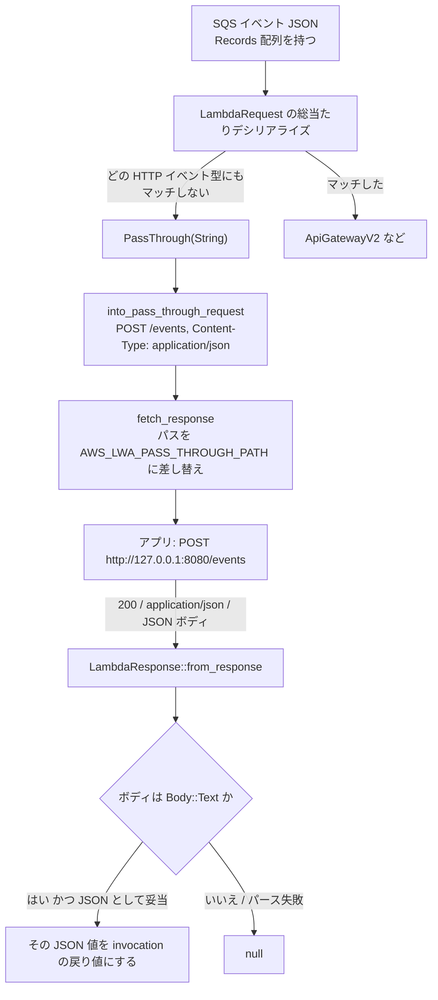

## 何を学んだか

LWA は HTTP のイベント (API Gateway / ALB / Function URL) しか扱えないわけではない。SQS でも S3 でも DynamoDB Streams でも Kinesis でも EventBridge でも Bedrock Agent でも、イベント JSON がそのままボディに入った `POST /events` としてアプリに届く。

しかしこの機能は LWA だけで実現されているのではない。**`lambda_http` 側の「どのイベント型にもマッチしなかったら生の文字列にする」という最後の分岐と、LWA 側の「そのパスを設定可能にする」3 行の合作**になっている。境界を知らないと、なぜ既定値が `/events` なのか、なぜ POST のときしか差し替えないのかが読めない。

## ソースコードのどこか

### 段 1: lambda_http が POST /events を作る

イベント JSON のデシリアライズは `LambdaRequest` に対する総当たりで、どの variant にもマッチしなかったものが `PassThrough(String)` になる ([イベント JSON をどのイベント型か判別する](../lambda-http-request/))。その変換先が `into_pass_through_request` ([lambda-http/src/request.rs#L340-L356](https://github.com/aws/aws-lambda-rust-runtime/blob/6f305bb00f3cc613fd82f88d2f2200e8089e4385/lambda-http/src/request.rs#L340-L356)) だ。

```rust title="lambda-http/src/request.rs"
#[cfg(feature = "pass_through")]
fn into_pass_through_request(data: String) -> http::Request<Body> {
    let mut builder = http::Request::builder();

    let headers = builder.headers_mut().unwrap();
    headers.insert("Content-Type", "application/json".parse().unwrap());

    let raw_path = "/events";

    builder
        .method(http::Method::POST)
        .uri(raw_path)
        .extension(RawHttpPath(raw_path.to_string()))
        .extension(RequestContext::PassThrough)
        .body(Body::from(data))
        .expect("failed to build request")
}
```

作られるのは次のリクエストだ。

- メソッド: `POST`
- パス: `/events` (**ハードコード**)
- `Content-Type: application/json`
- ボディ: 受け取ったイベント JSON の文字列そのまま
- `RequestContext::PassThrough` エクステンション

`RequestContext::PassThrough` はデータを持たないユニット variant なので、`x-amzn-request-context` ヘッダの中身は `null` になる ([コンテキストを HTTP ヘッダに詰める](../context-headers/))。SQS のメッセージ ID などが欲しければ、ヘッダではなくボディの JSON を読む。

### 段 2: LWA がパスを差し替える

```rust title="src/lib.rs"
if matches!(request_context, RequestContext::PassThrough) && parts.method == Method::POST {
    path = self.pass_through_path.as_str();
}
```

([src/lib.rs#L955-L957](https://github.com/aws/aws-lambda-web-adapter/blob/986113fc66f368f0187a25c683f1ab39a68cc6c6/src/lib.rs#L955-L957))

`pass_through_path` は `AWS_LWA_PASS_THROUGH_PATH` から読み、既定値は `/events` ([src/lib.rs#L422](https://github.com/aws/aws-lambda-web-adapter/blob/986113fc66f368f0187a25c683f1ab39a68cc6c6/src/lib.rs#L422))。

つまりこの 3 行がやっているのは、**`lambda_http` がハードコードした `/events` を、環境変数で上書きできるようにすること**だけだ。既定値のままなら結果は何も変わらない。それでもこの分岐が必要なのは、パス変換の権限が `lambda_http` 側にあるので、LWA からは上書きするしか手がないからだ。

条件が 2 つ (`PassThrough` かつ `POST`) なのも、`into_pass_through_request` が必ず POST を作ることを踏まえた保守的な書き方になっている。エクステンションだけを見て差し替えると、将来 `lambda_http` が POST 以外の pass-through リクエストを作るようになったときに、意図しないパスへ飛ぶ。

なお、ステップ 3 のベースパス除去はこの差し替えの**前**にある ([src/lib.rs#L946-L957](https://github.com/aws/aws-lambda-web-adapter/blob/986113fc66f368f0187a25c683f1ab39a68cc6c6/src/lib.rs#L946-L957))。だから `AWS_LWA_REMOVE_BASE_PATH` を設定していても pass-through のパスは削られない。後勝ちで上書きされるからだ。

### 戻りの経路

アプリのレスポンスは `LambdaResponse::from_response` で Lambda に返す形に変換される。`RequestOrigin::PassThrough` の分岐はこうだ ([lambda-http/src/response.rs#L163-L171](https://github.com/aws/aws-lambda-rust-runtime/blob/6f305bb00f3cc613fd82f88d2f2200e8089e4385/lambda-http/src/response.rs#L163-L171))。

```rust title="lambda-http/src/response.rs"
RequestOrigin::PassThrough => {
    match body {
        // text body must be a valid json string
        Some(Body::Text(body)) => {LambdaResponse::PassThrough(serde_json::from_str(&body).unwrap_or_default())},
        // binary body and other cases return Value::Null
        _ => LambdaResponse::PassThrough(serde_json::Value::Null),
    }
}
```

ここが重要な落とし穴を作っている。

- ステータスコードは**捨てられる**。アプリが 500 を返しても、呼び出し元には JSON の値が返るだけだ (エラーにしたければ [ステータスコードを Lambda のエラーに変える](../error-status-codes/) を使う)
- ヘッダも捨てられる
- ボディが `Body::Text` で、かつ**有効な JSON としてパースできたときだけ**その値が返る
- パースに失敗すると `unwrap_or_default()` で `serde_json::Value` の既定値、つまり **`null`** になる。エラーにもログにもならない
- ボディが `Body::Binary` や空だった場合も `null`

`Body::Text` になるか `Body::Binary` になるかは、レスポンスの `Content-Type` で決まる ([レスポンスが base64 になるかを決めているところ](../lambda-http-response/))。テキスト扱いされない Content-Type を返すと、中身が完璧な JSON でもバイナリ経路に入って `null` になる。

したがって **pass-through で値を返したいアプリは、`Content-Type: application/json` を付けて、有効な JSON をボディに書く**必要が実質的にある。`res.json({...})` を使っていれば自然に満たされるが、`res.send("OK")` のようにプレーンテキストを返すと `null` になる。



## なぜそうなっているか

pass-through が「最後の分岐」として実装されている以上、**HTTP イベントの判別に失敗したものは全部ここに落ちる**。これは便利さと危うさの両方を生む。

便利な面は、対応イベント一覧をどこにも持たなくていいことだ。Bedrock Agent のような新しいイベント型が出てきても、`lambda_http` にも LWA にも変更はいらない。JSON がそのまま `/events` に届く。

危うい面は、**HTTP イベントに似た JSON を送りつけると誤判定されうる**ことだ。判別は総当たりのデシリアライズで、`#[serde(deny_unknown_fields)]` のような厳密化はされていない。自作の JSON が偶然 ALB イベントのスキーマを満たしてしまうと、pass-through ではなく HTTP リクエストに変換され、そのフィールドから作られたパスにルーティングされる。テスト呼び出し用のペイロードを設計するときは、この事故が起こりうることを頭に置いておく。

`Value::Null` へのフォールバックが `unwrap_or_default()` になっているのも、pass-through の性格を表している。この経路には「エラーとして返す先」の設計が無い — HTTP のようにステータスコードで伝える手段がないので、パース失敗を表現するなら invocation 自体を失敗させるしかない。それはやりすぎだと判断されて、`null` になっている。

## どう活かすか

- **エンドポイントを分ける。** `AWS_LWA_PASS_THROUGH_PATH=/lambda/events` のように既定値から変えておくと、外部からの HTTP リクエストで `/events` を叩かれたときと区別できる。既定のままだと、API Gateway 経由の `POST /events` と SQS 由来のイベントが同じハンドラに入る。
- **必ず JSON を返す。** Step Functions の `Task` や Bedrock Agent から呼ぶ場合、戻り値の JSON がそのまま次のステートやエージェントに渡る。`res.json(...)` (Express) や `JSONResponse` (FastAPI) を使い、テキストや空ボディを返さない。`null` が返ってきたら、まず Content-Type とボディの妥当性を疑う。
- **失敗を呼び出し元に伝えたいなら `AWS_LWA_ERROR_STATUS_CODES` を併用する。** pass-through ではステータスコードが捨てられるので、アプリが 500 を返しても SQS のリトライも DLQ も動かない。エラー扱いにしたいステータスを明示すれば、invocation そのものを失敗させられる。
- **イベントの中身はボディから読む。** `x-amzn-request-context` は `null` なので、SQS のメッセージ属性や S3 のオブジェクトキーはリクエストボディの JSON をパースして取る。`x-amzn-lambda-context` のほうは通常どおり入っているので、`request_id` や `deadline` は使える。
