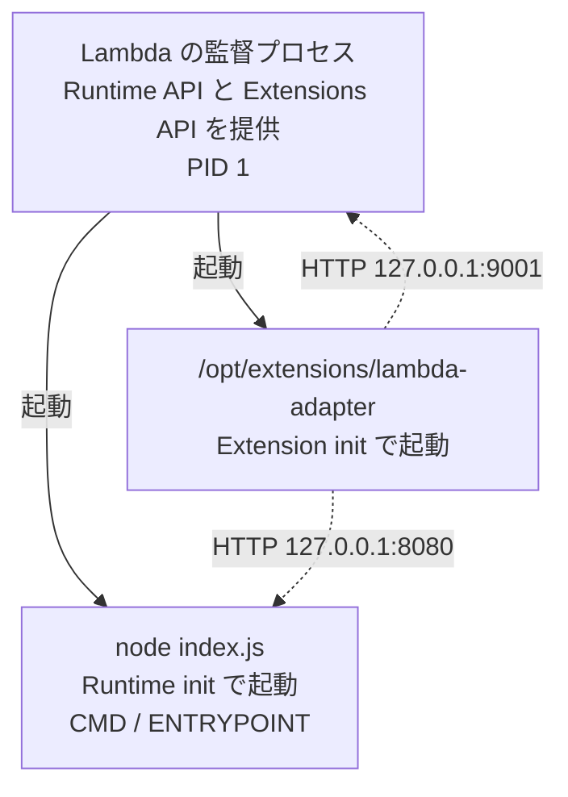
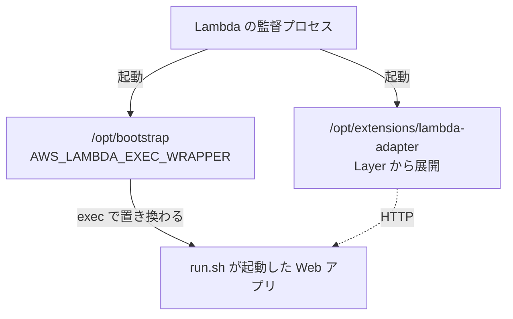

## 何を学んだか

Web Adapter の Dockerfile を見ると、こう書いてある。

```dockerfile
COPY --from=public.ecr.aws/awsguru/aws-lambda-adapter:1.0.1 /lambda-adapter /opt/extensions/lambda-adapter
CMD ["node", "index.js"]
```

`CMD` は 1 個しかない。それなのに実行環境の中では、アダプタとアプリの**両方**が動く。誰がアダプタを起動しているのか。そして、その 2 つはどういう関係にあるのか。

答えを先に書く。

- **プロセスは少なくとも 3 つある。** アダプタとアプリに加えて、その 2 つを起動して Runtime API を提供している **Lambda 側の監督プロセス**がいる
- **アダプタとアプリは親子ではなく兄弟だ。** どちらも監督プロセスの子として、別々に起動される
- **アダプタはアプリを起動しない。** Web Adapter のソースには、プロセスを起動するコードが 1 行もない
- **`CMD` のプロセスは PID 1 ではない。** PID 1 は監督プロセスのほうで、アプリはその子として生まれる

「アダプタがアプリを起動して面倒を見ている」という直感は、全部外れている。

## ソースコードのどこか

### アダプタはプロセスを起動しない

まず、起動していないことを確認する。

```bash
$ grep -n "Command\|process::Command\|fork\|exec" src/*.rs
src/lib.rs:673:    /// This method spawns a background task that will call `std::process::exit(1)`
src/lib.rs:674:    /// if extension registration fails, terminating the Lambda execution environment.
```

ヒットするのはコメントだけだ。`std::process::Command` も `fork` も `exec` も使っていない。使っているのは `tokio::task::spawn` (同一プロセス内の非同期タスク) と `std::process::exit` (自分を殺す) だけで、**子プロセスを作る手段を 1 つも持っていない**。

そのうえでアダプタは、起動していないはずのアプリに向かってレディネスチェックを打ち続ける。

```rust title="src/lib.rs"
async fn is_web_ready(&self, url: &Url, protocol: &Protocol) -> bool {
    let mut checkpoint = Checkpoint::new();
    Retry::spawn(FixedInterval::from_millis(10), || {
        if checkpoint.lapsed() {
            tracing::info!(url = %url.to_string(), "app is not ready after {}ms", checkpoint.next_ms());
            checkpoint.increment();
        }
        self.check_web_readiness(url, protocol)
    })
    .await
    .is_ok()
}
```

([src/lib.rs L780](https://github.com/aws/aws-lambda-web-adapter/blob/986113fc66f368f0187a25c683f1ab39a68cc6c6/src/lib.rs#L780))

**自分で起動したプロセスなら、起動できたかどうかは戻り値で分かる。** ポートを 10ms ごとに叩いて待つ必要はない。この「外から様子をうかがう」実装そのものが、アダプタがアプリを起動していない証拠になっている。[レディネスチェック](../readiness-check/) が固定間隔の無限リトライになっているのも、終わりの判断材料が「ポートが開くこと」しかないからだ。

### 誰が起動しているのか

Lambda のドキュメントが、Init フェーズを 3 つのサブフェーズに分けている。

> In the `Init` phase, Lambda performs three tasks:
>
> - Start all extensions (`Extension init`)
> - Bootstrap the runtime (`Runtime init`)
> - Run the function's static code (`Function init`)
>
> The `Init` phase ends when the runtime and all extensions signal that they are ready by sending a `Next` API request.

主語はすべて Lambda だ。`/opt/extensions/` 配下を列挙してそれぞれをプロセスとして起動するのも、`ENTRYPOINT` / `CMD` を起動するのも、Lambda 側の何かがやっている。そしてその「何か」は、同じ実行環境の中で `127.0.0.1:9001` に Runtime API と Extensions API を提供している主体でもある。

**AWS はこの監督プロセスの実装を公開していない**が、ローカルテスト用の代役は公開されている。Runtime Interface Emulator (RIE) がそれで、AWS のブログはこう説明している。

> This is a proxy for Lambda's Runtime and Extensions APIs. It acts as a lightweight web server that converts HTTP requests to JSON events and maintains functional parity with the Lambda Runtime API in the AWS Cloud.

`sam local start-api` が起動しているのもこれだ。本番の監督プロセスと RIE が同一のコードかどうかは公開されていないが、**「Runtime API を提供し、その中でユーザのプロセスを走らせるものがいる」**という構図は同じである。

## なぜそうなっているか

コンテナイメージ形態の構図を描くとこうなる。



実線が親子関係、点線が通信だ。**アダプタとアプリの間には実線がない。** 唯一のつながりは `127.0.0.1:8080` への TCP 接続だけで、プロセスとしては互いに何の関係もない他人になっている。

Zip パッケージ形態でも構図は変わらない。違うのは右側の起動経路だけだ。



`/opt/bootstrap` は `exec` するので**新しいプロセスを作らない**。監督プロセスから見れば、起動した 1 個の PID がそのままアプリのものになっている。この点は [bootstrap と AWS_LAMBDA_EXEC_WRAPPER](../custom-runtime-bootstrap/) で扱う。

### なぜアダプタがアプリを起動しないのか

起動する設計もありえた。「アダプタが `Command::new("node").arg("index.js").spawn()` してアプリを子プロセスとして持つ」形だ。実際、そうしているツールもある。

しかしそうすると、アダプタが**アプリの起動方法を知る必要が出てくる**。コマンドラインを設定で受け取り、環境変数を引き継ぎ、標準出力を中継し、終了コードを解釈し、異常終了したら再起動するかどうかを決める、という仕事が全部ついてくる。言語ごと・フレームワークごとの差もそこに流れ込む。

Lambda が既にその仕事をしてくれるなら、やらないほうが小さい。`ENTRYPOINT` / `CMD` はコンテナの標準的な起動方法だし、Zip 側の `AWS_LAMBDA_EXEC_WRAPPER` も Lambda が用意したフックだ。アダプタは「アプリはどこかで起動されている」とだけ仮定して、ポートを叩いて待つ。**アプリの起動をアダプタの関心事から外したことが、`src/lib.rs` を 1,560 行に収めている理由の 1 つ**になっている。

代償は「アプリが死んでも何もできない」ことだ。次の節で見る。

## どう活かすか

**アプリが落ちても、アダプタは落ちない。そして誰も再起動しない。** アプリのプロセスが異常終了しても、アダプタは Runtime API から `/next` を取り続け、そのたびに `127.0.0.1:8080` への接続に失敗して invocation をエラーにする。実行環境がリサイクルされるまでこれが続く。**アプリ側のプロセス管理は自分の責任**で、フレームワークのワーカー再起動 (Gunicorn の `--workers`、PM2 など) を使うか、あるいは「死んだら潔くプロセスごと終了する」ようにしておくほうが、実行環境が作り直されて速く回復する。

**PID 1 のつもりでコードを書かない。** 通常のコンテナでは `CMD` のプロセスが PID 1 になり、ゾンビプロセスの刈り取り責任を負う。Lambda ではそうならないので、`tini` のような init システムを入れる必要はない。逆に「PID 1 なら SIGTERM のデフォルト動作が無効」という前提も成り立たないので、**シグナルハンドラを書かなければ SIGTERM はデフォルト動作 (即時終了) で処理される**。[グレースフルシャットダウン](../graceful-shutdown/) でハンドラを書く必要があるのはそのためだ。

**ポート番号だけが 2 つのプロセスの接点になる。** アプリが `127.0.0.1` ではなく別のインタフェースだけを listen していると、アダプタから見えない。コンテナの中とはいえ両者は別プロセスなので、Unix ドメインソケットや共有メモリではなく **TCP で疎通する必要がある**。`0.0.0.0` か `127.0.0.1` を bind する。

**ログは 2 系統になる。** アダプタの `tracing` 出力とアプリの標準出力は別プロセスから出るので、CloudWatch Logs では混ざって届く。アプリが起動しないときに `app is not ready after 2000ms` というログが出ていれば、それはアダプタ側の声で、原因はアプリ側のログのほうに出ている。

**拡張は 10 個までという上限がある。** Web Adapter で 1 枠使うので、Datadog や OpenTelemetry の拡張と併用するときは枠を数えておく。
