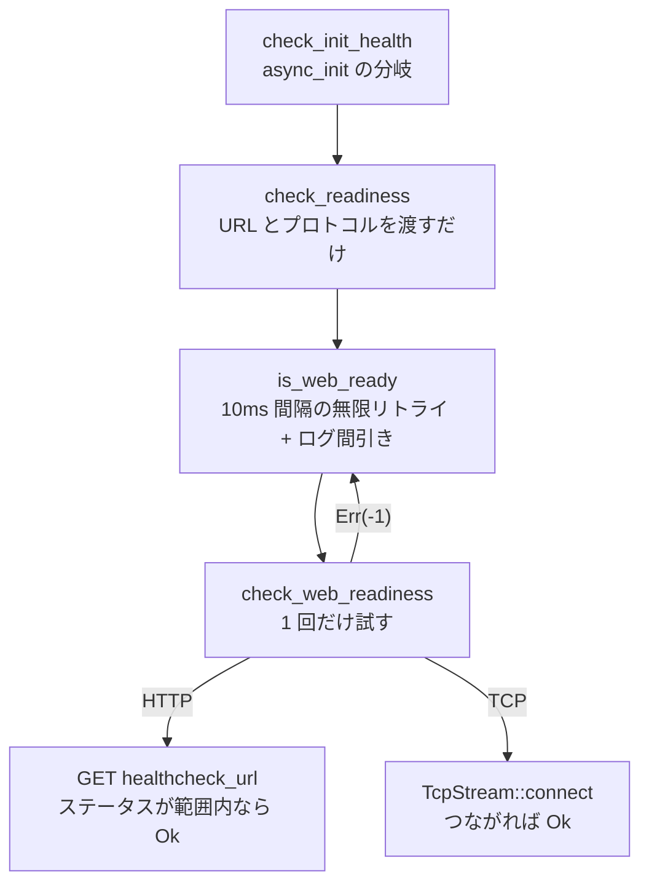

## 何を学んだか

アダプタは `run()` に入る前に、アプリが `127.0.0.1:8080` で応答するまで待つ。その待ち方に 3 つの特徴がある。

- **10ms 固定間隔で無限にリトライする。** 指数バックオフではない
- **既定では 100〜499 のステータスなら「起きている」と判定する。** 404 でも合格する
- **2 秒ごとに「まだ起きない」というログを出す。** そのためだけの構造体が `src/readiness.rs` にある

3 つとも「ローカル通信であり、待ち時間がそのままコールドスタート時間になる」という条件から導かれている。

## ソースコードのどこか

入口は `check_init_health` ([`src/lib.rs#L758`](https://github.com/aws/aws-lambda-web-adapter/blob/986113fc66f368f0187a25c683f1ab39a68cc6c6/src/lib.rs#L758)) で、そこから 3 段に分かれる。



### リトライループ

[`src/lib.rs#L780`](https://github.com/aws/aws-lambda-web-adapter/blob/986113fc66f368f0187a25c683f1ab39a68cc6c6/src/lib.rs#L780)。

```rust title="src/lib.rs"
async fn is_web_ready(&self, url: &Url, protocol: &Protocol) -> bool {
    let mut checkpoint = Checkpoint::new();
    Retry::spawn(FixedInterval::from_millis(10), || {
        if checkpoint.lapsed() {
            tracing::info!(url = %url.to_string(), "app is not ready after {}ms", checkpoint.next_ms());
            checkpoint.increment();
        }
        self.check_web_readiness(url, protocol)
    })
    .await
    .is_ok()
}
```

`tokio_retry::Retry::spawn` は「リトライ間隔を返すイテレータ」と「試行を作るクロージャ」を取る。`FixedInterval::from_millis(10)` は 10ms を**無限に**返すイテレータなので、成功するまで止まらない。`.is_ok()` が `false` になるのは、外側から `timeout` でキャンセルされた場合だけである ([非同期初期化](../async-init/))。

### 1 回分の判定

[`src/lib.rs#L797`](https://github.com/aws/aws-lambda-web-adapter/blob/986113fc66f368f0187a25c683f1ab39a68cc6c6/src/lib.rs#L797)。

```rust title="src/lib.rs"
async fn check_web_readiness(&self, url: &Url, protocol: &Protocol) -> Result<(), i8> {
    match protocol {
        Protocol::Http => {
            // url is already validated in Adapter::new(), this conversion should always succeed
            // If it fails, it indicates a programming error, not a runtime condition
            let uri: http::Uri = url
                .as_str()
                .parse()
                .expect("BUG: healthcheck_url should be valid - validated in Adapter::new()");

            match self.client.get(uri).await {
                Ok(response) if self.healthcheck_healthy_status.contains(&response.status().as_u16()) => {
                    tracing::debug!("app is ready");
                    Ok(())
                }
                _ => {
                    tracing::trace!("app is not ready");
                    Err(-1)
                }
            }
        }
        Protocol::Tcp => {
            let host = url.host_str().expect("BUG: healthcheck_url should have host - validated in Adapter::new()");
            let port = url.port().expect("BUG: healthcheck_url should have port - validated in Adapter::new()");

            match TcpStream::connect(format!("{}:{}", host, port)).await {
                Ok(_) => Ok(()),
                Err(_) => Err(-1),
            }
        }
    }
}
```

エラー型が `i8` で値が `-1` なのは、`Retry` が `Result` を要求するので何か置く必要があった、というだけである。エラーの中身は誰も見ない。

### `Checkpoint` — ログを間引くためだけの構造体

[`src/readiness.rs`](https://github.com/aws/aws-lambda-web-adapter/blob/986113fc66f368f0187a25c683f1ab39a68cc6c6/src/readiness.rs) は 63 行 (うちテスト 30 行) で、やることはこれだけである。

```rust title="src/readiness.rs"
impl Checkpoint {
    pub fn new() -> Checkpoint {
        // The default function timeout is 3 seconds. This will alert the users. See #520
        let interval_ms = 2000;

        let start = Instant::now();
        Checkpoint {
            start,
            interval_ms,
            next_ms: start.elapsed().as_millis() + interval_ms,
        }
    }

    pub fn lapsed(&self) -> bool {
        self.start.elapsed().as_millis() >= self.next_ms
    }
}
```

10ms 間隔で回るループの中で毎回ログを出すと、10 秒待つだけで 1,000 行になる。`Checkpoint` は「前回のログから 2 秒経ったか」だけを判定して、`app is not ready after 2000ms` → `4000ms` → `6000ms` と間引く。

`interval_ms = 2000` にコメントで理由が添えられている。**Lambda 関数の既定タイムアウトが 3 秒**なので、2 秒間隔なら 1 行はログに残る。5 秒間隔にすると、既定設定のまま試したユーザは 1 行も見ないままタイムアウトで落ちる。issue #520 への参照付きで、実際に「何も出ずに落ちて原因が分からない」という報告があったことが分かる。

なお `is_web_ready` のドキュメントコメントには「logs progress at increasing intervals (100ms, 500ms, 1s, 2s, 5s, 10s)」とあるが、実装は固定 2 秒刻みである。コメントのほうが古い。

### `Adapter::new` での事前検証

TCP モードの分岐は `host_str()` と `port()` を `expect` で剥がしている。`Option` を `expect` するのは普通は乱暴だが、ここでは `Adapter::new` が構築時に検証済みである ([`src/lib.rs#L625`](https://github.com/aws/aws-lambda-web-adapter/blob/986113fc66f368f0187a25c683f1ab39a68cc6c6/src/lib.rs#L625))。

```rust title="src/lib.rs"
// Validate TCP protocol requirements
if options.readiness_check_protocol == Protocol::Tcp {
    if healthcheck_url.host().is_none() {
        return Err(Error::from("TCP readiness check requires a valid host in the URL"));
    }
    if healthcheck_url.port().is_none() {
        return Err(Error::from("TCP readiness check requires a port in the URL"));
    }
}
```

`Adapter::new` は `Result` を返し、`main` の `?` で落ちる。設定ミスならイベントを 1 件も受ける前に終わる。

### ステータスコードのパース

[`src/lib.rs#L450`](https://github.com/aws/aws-lambda-web-adapter/blob/986113fc66f368f0187a25c683f1ab39a68cc6c6/src/lib.rs#L450)。`AWS_LWA_READINESS_CHECK_HEALTHY_STATUS` に `"200-399,404"` のような範囲混じりの指定が書ける。

```rust title="src/lib.rs"
fn parse_status_codes(input: &str) -> Vec<u16> {
    input
        .split(',')
        .flat_map(|part| {
            let part = part.trim();
            if part.contains('-') {
                let range: Vec<&str> = part.split('-').collect();
                if range.len() == 2 {
                    if let (Ok(start), Ok(end)) = (range[0].parse::<u16>(), range[1].parse::<u16>()) {
                        return (start..=end).collect::<Vec<_>>();
                    }
                }
                tracing::warn!("Failed to parse status code range: {}", part);
                vec![]
            } else {
                part.parse::<u16>().map_or_else(
                    |_| {
                        if !part.is_empty() {
                            tracing::warn!("Failed to parse status code: {}", part);
                        }
                        vec![]
                    },
                    |code| vec![code],
                )
            }
        })
        .collect()
}
```

パースできない要素は**警告ログを出して捨てる**。`Result` を返さない。`"200-399,foo"` は `[200..=399]` になり、`"foo"` だけを書けば空の `Vec` になる。空だと `contains` が常に `false` になり、どのステータスも合格しないままリトライし続ける。この関数は `AWS_LWA_ERROR_STATUS_CODES` でも使い回されていて ([ステータスコードを Lambda のエラーに変える](../error-status-codes/))、そちらでは空でも実害がない。

## なぜそうなっているか

### なぜ指数バックオフではないのか

指数バックオフはリモートのサービスを守るための作法である。「相手が過負荷かもしれないので、下がりながら試す」という前提がある。

ここでの相手は**同じコンテナの中の自分のアプリ**で、まだ listen すら始めていない。`connect` は TCP レベルで即座に拒否されるので、負荷になりようがない。守るべき相手がいない以上、バックオフする理由もない。

一方で失うものははっきりしている。**待ち時間がそのままコールドスタート時間に乗る**。指数バックオフだと、アプリが 1.1 秒で起きたのに次のリトライが 2 秒後で、900ms 損する。10ms 固定なら最悪 10ms しかずれない。「速く気づきたい」という要求と「相手を守る必要がない」という条件が揃っているので、固定間隔が正解になる。

### なぜ既定が 100〜499 なのか

`(100..500).collect()` は、1xx・2xx・3xx・4xx を全部含む。落ちるのは 5xx と、そもそも接続できない場合だけである。

「404 でアプリが起きていると判定するのは緩すぎる」と見えるが、既定のチェックパスは `/` である。**ヘルスチェック用のエンドポイントを用意していないアプリでもそのまま動く**ことが LWA の売りなので、ここを 200 に絞ると `/` が 404 のアプリ (API だけを生やしたアプリはよくある) が永久に起動しなくなる。

判定したいのは「アプリが正しく動いているか」ではなく「**HTTP を喋るプロセスが listen し始めたか**」である。その目的なら 404 も 401 も立派な合格で、5xx だけが「listen はしたが初期化が終わっていない」を示す。

厳しくしたい場合は `AWS_LWA_READINESS_CHECK_HEALTHY_STATUS=200-299` と `AWS_LWA_READINESS_CHECK_PATH=/health` を組み合わせる。

### ポートを分けられること

`AWS_LWA_READINESS_CHECK_PORT` は既定でアプリのポートと同じだが、別にできる。管理用ポートに `/health` を出すアプリ (Spring Boot Actuator を別ポートに置く構成など) や、本体ポートに認証が掛かっていてヘルスチェックだけ別系統にしたい場合に使う。

`healthcheck_url` と `domain` が別フィールドになっているのはこのためである ([アーキテクチャを一枚で読む](../architecture/))。

### `expect("BUG: ...")` という書き分け

`check_web_readiness` の `expect` には `"BUG: healthcheck_url should be valid - validated in Adapter::new()"` というメッセージが付いている。コメントも「programming error, not a runtime condition」と明示している。

同じ「失敗しうる操作」でも、**設定ミス由来か実装ミス由来かで扱いを変えている**。

| 種類                                        | 扱い                              | 場所                  |
| ------------------------------------------- | --------------------------------- | --------------------- |
| 設定ミス (ホストが不正など)                 | `Result` を返して `main` で落とす | `Adapter::new`        |
| 実装ミス (検証済みのはずの不変条件が破れた) | `expect("BUG: ...")` でパニック   | `check_web_readiness` |
| 実行時条件 (アプリがまだ起きていない)       | `Err(-1)` を返してリトライ        | `check_web_readiness` |

`Option` を `expect` で剥がすこと自体は、不変条件を確立した場所が明示されていれば読める。メッセージに `BUG:` と検証場所を書くことで、パニックログを見た人が「設定を直す話ではない」とすぐ分かる。

## どう活かすか

- **バックオフの要否は「相手を守る必要があるか」で決まる。** localhost 相手やプロセス内の待ち合わせでは固定間隔のほうが速く、コードも短い。指数バックオフを反射的に書かない
- **ログの間引きは呼び出し側でやると安上がりになる。** `Checkpoint` は 33 行の構造体 1 つで済んでいる。ログライブラリのサンプリング機能を持ち出すより、ループの外に状態を 1 つ置くほうが挙動が読める
- **既定値には「誰を落とさないか」の判断が入っている。** 100〜499 は緩いのではなく、「ヘルスエンドポイントのないアプリを落とさない」という選択である。既定値を設計するときは、厳密さより「既定のまま動かない人が出ないか」を先に見る
- **`expect` を使うなら、不変条件を確立した場所をメッセージに書く。** `BUG:` 接頭辞は、運用者に「これは設定では直らない」と伝える最小の手段になっている

### 実務で踏む失敗パターン

レディネスチェックが通らない (`app is not ready after ...` が延々と出る) ときに疑う順序。

- **アプリが `127.0.0.1` 以外を listen している。** コンテナ習慣で `0.0.0.0` にしているなら通るが、Docker Compose 用に別インタフェースを指定していると届かない。既定の `AWS_LWA_HOST` は `127.0.0.1` である
- **ポートがずれている。** `AWS_LWA_PORT` を設定していないのにアプリが 3000 を listen している、というのが最頻。`PORT` はフォールバックとして生きているので、アプリ側が `PORT` を読む作りなら `PORT=3000` の 1 つで両方が揃う
- **チェックパスが重い。** 既定の `/` が DB に問い合わせるトップページだと、初回アクセスが数秒かかってその分コールドスタートが伸びる。軽い `/health` を用意して `AWS_LWA_READINESS_CHECK_PATH` で指すほうがよい
- **逆に「通ってしまう」事故もある。** ヘルスパスが認証必須で 401 を返す場合、既定の 100〜499 に入るので合格する。アプリの初期化が終わる前にリバースプロキシ層だけが 401 を返している構成だと、起動途中でイベントを受けることになる。この場合は範囲を `200-299` に絞る
- **TCP モードは listen しか見ない。** ポートを開いてから初期化する作りのアプリでは、TCP モードだと早すぎる合格になる。HTTP モードが使えるならそちらを選ぶ
