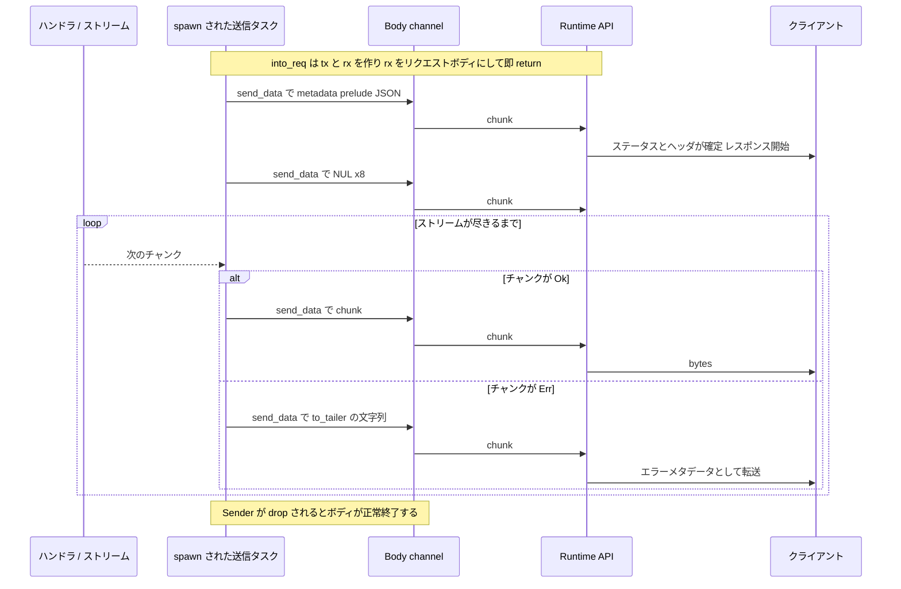

## 何を学んだか

Lambda のレスポンスストリーミングは、`POST /2018-06-01/runtime/invocation/{id}/response` のリクエストボディに独自のフレーミングを載せることで実現されている。これは章全体でもっとも「知らないと絶対に読めない」プロトコルだ。

**リクエストヘッダ**は 5 種類。

```text
POST /2018-06-01/runtime/invocation/{AwsRequestId}/response HTTP/1.1
Transfer-Encoding: chunked
Lambda-Runtime-Function-Response-Mode: streaming
Content-Type: application/vnd.awslambda.http-integration-response
Trailer: Lambda-Runtime-Function-Error-Type
Trailer: Lambda-Runtime-Function-Error-Body
```

**ボディ**は 3 つの部分が連結されたバイト列だ。

```text
{"statusCode":200,"headers":{...},"cookies":[]}\0\0\0\0\0\0\0\0<body bytes...>
^------------- metadata prelude --------------^^--- NUL x8 ---^^--- body ----^
```

1. **metadata prelude** — HTTP レスポンスのステータスコード・ヘッダ・Cookie を表す JSON
2. **区切り** — NUL バイト (`0x00`) がちょうど 8 個
3. **本体** — 以降すべてが実際のレスポンスボディ

`Transfer-Encoding: chunked` なので、この 3 つは 1 回で送る必要はない。prelude を送った時点でクライアント側にはヘッダとステータスが届き、本体は生成でき次第ちぎって送れる。これが「ファーストバイトまでの時間を短くする」というストリーミングの目的を果たしている。

そして**ヘッダを送ってしまった後にエラーが起きたら、HTTP ステータスはもう変えられない**。だからエラーは**トレーラ**で伝える。あらかじめ `Trailer` ヘッダで「後からこの 2 つを送るかもしれない」と宣言しておくのが HTTP/1.1 chunked transfer encoding の要件だ。



## ソースコードのどこか

すべて `EventCompletionRequest::into_req` の `StreamingResponse` 分岐に入っている。

```rust title="lambda-runtime/src/requests.rs"
FunctionResponse::StreamingResponse(mut response) => {
    let uri = format!("/2018-06-01/runtime/invocation/{}/response", self.request_id);
    let uri = Uri::from_str(&uri)?;

    let mut builder = build_request().method(Method::POST).uri(uri);
    let req_headers = builder.headers_mut().unwrap();

    req_headers.insert("Transfer-Encoding", "chunked".parse()?);
    req_headers.insert("Lambda-Runtime-Function-Response-Mode", "streaming".parse()?);
    // Report midstream errors using error trailers.
    // See the details in Lambda Developer Doc: https://docs.aws.amazon.com/lambda/latest/dg/runtimes-custom.html#runtimes-custom-response-streaming
    req_headers.append("Trailer", "Lambda-Runtime-Function-Error-Type".parse()?);
    req_headers.append("Trailer", "Lambda-Runtime-Function-Error-Body".parse()?);
    req_headers.insert(
        "Content-Type",
        "application/vnd.awslambda.http-integration-response".parse()?,
    );

    // default Content-Type
    let preloud_headers = &mut response.metadata_prelude.headers;
    preloud_headers
        .entry(CONTENT_TYPE)
        .or_insert("application/octet-stream".parse()?);

    let metadata_prelude = serde_json::to_string(&response.metadata_prelude)?;
```

[`lambda-runtime/src/requests.rs#L81-L105`](https://github.com/aws/aws-lambda-rust-runtime/blob/6f305bb00f3cc613fd82f88d2f2200e8089e4385/lambda-runtime/src/requests.rs#L81-L105)

`Trailer` は `insert` ではなく `append` で 2 回呼ばれている。同じヘッダ名を 2 行として送るためだ。

`Content-Type` が 2 か所に出てくることに注意したい。リクエスト自体の `Content-Type` は常に `application/vnd.awslambda.http-integration-response` (この「フレーミングされたボディ」のメディアタイプ) で、**クライアントに返す `Content-Type` は prelude の中の `headers` に入っている**。後者が未設定なら `entry().or_insert()` で `application/octet-stream` が入る。

### metadata prelude の型

```rust title="lambda-runtime/src/types.rs"
#[derive(Debug, Default, Serialize, Deserialize, Clone, PartialEq, Eq)]
#[serde(rename_all = "camelCase")]
pub struct MetadataPrelude {
    #[serde(with = "http_serde::status_code")]
    /// The HTTP status code.
    pub status_code: StatusCode,
    #[serde(with = "http_serde::header_map")]
    /// The HTTP headers.
    pub headers: HeaderMap,
    /// The HTTP cookies.
    pub cookies: Vec<String>,
}
```

[`lambda-runtime/src/types.rs#L194-L206`](https://github.com/aws/aws-lambda-rust-runtime/blob/6f305bb00f3cc613fd82f88d2f2200e8089e4385/lambda-runtime/src/types.rs#L194-L206)

`rename_all = "camelCase"` なので、JSON のキーは `statusCode` / `headers` / `cookies` になる。`cookies` が `headers` と別枠なのは、`Set-Cookie` が複数行になるヘッダで、Function URL のイベント形式が v2 形式 (Cookie を配列で扱う) を採っているためだ。

### ボディの送信

```rust title="lambda-runtime/src/requests.rs"
let (mut tx, rx) = Body::channel();

tokio::spawn(async move {
    if tx.send_data(metadata_prelude.into()).await.is_err() {
        tracing::error!("Error sending metadata prelude, response channel closed");
        return;
    }

    if tx.send_data("\u{0}".repeat(8).into()).await.is_err() {
        tracing::error!("Error sending metadata prelude delimiter, response channel closed");
        return;
    }

    while let Some(chunk) = response.stream.next().await {
        let chunk = match chunk {
            Ok(chunk) => chunk.into(),
            Err(err) => err.into().to_tailer().into(),
        };

        if tx.send_data(chunk).await.is_err() {
            tracing::error!("Error sending response body chunk, response channel closed");
            return;
        }
    }
});

let req = builder.body(rx)?;
Ok(req)
```

[`lambda-runtime/src/requests.rs#L109-L136`](https://github.com/aws/aws-lambda-rust-runtime/blob/6f305bb00f3cc613fd82f88d2f2200e8089e4385/lambda-runtime/src/requests.rs#L109-L136)

区切りは `"\u{0}".repeat(8)`。NUL 文字を 8 回繰り返した文字列だ。

構造として重要なのは、**`into_req` はボディを送り終えるのを待たない**ことだ。`Body::channel()` で送信側 (`tx`) と受信側 (`rx`) を作り、`tx` を `tokio::spawn` したタスクに渡し、`rx` をリクエストボディにして即座に返る。この後 `RuntimeApiClientService` がそのリクエストを hyper に渡し、hyper が `rx` をポーリングしながらチャンクを吸い出して送信する。

`Body::channel()` の実装は hyper から抽出されたもので、`DecodedLength::CHUNKED` を初期値に持つ。

```rust title="lambda-runtime-api-client/src/body/channel.rs"
pub fn channel() -> (Sender, ChannelBody) {
    let (data_tx, data_rx) = mpsc::channel(0);
    let (trailers_tx, trailers_rx) = oneshot::channel();

    let (want_tx, want_rx) = watch::channel(sender::WANT_READY);
    ...
}
```

[`lambda-runtime-api-client/src/body/channel.rs#L50-L69`](https://github.com/aws/aws-lambda-rust-runtime/blob/6f305bb00f3cc613fd82f88d2f2200e8089e4385/lambda-runtime-api-client/src/body/channel.rs#L50-L69)

`mpsc::channel(0)` はバッファ 0 なので、送信側は受信側 (hyper) が実際に読み出すまで待たされる。`Sender::send_data` は `ready()` を待ってから `try_send` する。

```rust title="lambda-runtime-api-client/src/body/sender.rs"
pub async fn send_data(&mut self, chunk: Bytes) -> Result<(), Error> {
    self.ready().await?;
    self.data_tx
        .try_send(Ok(chunk))
        .map_err(|_| Error::new(SenderError::ChannelClosed))
}
```

[`lambda-runtime-api-client/src/body/sender.rs#L64-L69`](https://github.com/aws/aws-lambda-rust-runtime/blob/6f305bb00f3cc613fd82f88d2f2200e8089e4385/lambda-runtime-api-client/src/body/sender.rs#L64-L69)

つまり**バックプレッシャが効いている**。アプリが速くチャンクを生成しても、Runtime API への送信が追いつかなければ `send_data` で待たされ、そこからさらに上流の `response.stream` のポーリングも止まる。

### エラーをトレーラのバイト列に変える

```rust title="lambda-runtime/src/types.rs"
impl ToStreamErrorTrailer for Error {
    fn to_tailer(&self) -> String {
        format!(
            "Lambda-Runtime-Function-Error-Type: Runtime.StreamError\r\nLambda-Runtime-Function-Error-Body: {}\r\n",
            BASE64_STANDARD.encode(self.to_string())
        )
    }
}
```

[`lambda-runtime/src/types.rs#L213-L220`](https://github.com/aws/aws-lambda-rust-runtime/blob/6f305bb00f3cc613fd82f88d2f2200e8089e4385/lambda-runtime/src/types.rs#L213-L220)

`Lambda-Runtime-Function-Error-Body` は base64 でエンコードされる。エラーメッセージに改行や非 ASCII が入っていてもヘッダ形式を壊さないためだ。

ただし実装には注意点がある。`to_tailer()` が返すのは**トレーラのテキスト表現**であって、`Sender::send_trailers` に渡す `HeaderMap` ではない。`into_req` はこの文字列をボディのチャンクとして `send_data` している。`Sender` には `send_trailers` メソッドが用意されている ([`sender.rs#L73-L79`](https://github.com/aws/aws-lambda-rust-runtime/blob/6f305bb00f3cc613fd82f88d2f2200e8089e4385/lambda-runtime-api-client/src/body/sender.rs#L73-L79)) が、この経路では使われていない。メソッド名の `to_tailer` (trailer のタイポ) も含めて、この部分は素朴な実装になっている。

## なぜそうなっているか

**NUL 8 個という区切りを選んだのは、JSON の中に絶対に現れないバイト列だからだ。** JSON テキストに生の `0x00` バイトが出ることはない。文字列の中に NUL を書きたければ `\u0000` というエスケープになるので、区切りと衝突しようがない。だから受信側は「最初に現れる NUL の 8 連続を探す」だけで prelude の終端を確定できる。長さプレフィックスを使う手もあるが、それだと prelude の全長が決まるまで 1 バイトも送り出せない。

**prelude を先頭に置いているのは、ステータスコードとヘッダを最初に確定させないと HTTP レスポンスを開始できないからだ。** Lambda はこの prelude を読んでクライアントへの HTTP レスポンスのヘッダ部分を組み立て、そこから先は受け取ったバイトをそのまま流す。だから prelude が届いた時点でクライアントには 200 OK とヘッダが見え、続きのバイトが body として届く。

**エラーをトレーラで伝えるのは、HTTP のセマンティクスに沿った唯一の選択肢だ。** ステータス行は最初に送ってしまっている。500 に変えることはできない。しかし chunked transfer encoding には「本体の後に追加のヘッダを送る」というトレーラの仕組みがある。AWS のドキュメントも「Lambda はこれを成功レスポンスとして扱い、ランタイムが提供したエラーメタデータをクライアントに転送する」と説明している。**クライアント側からは、途中で切れたレスポンスとエラーメタデータの両方が見える**ことになる。

**送信を `tokio::spawn` に逃がしているのは、`into_req` の型シグネチャを守るためだ。** `IntoRequest::into_req` は `Result<Request<Body>, Error>` を返す同期関数で、`async` ではない。ストリームを最後まで読んでからリクエストを作る、という設計にはできない。そもそもそれではストリーミングにならない。だから「まだ中身が決まっていないボディ」を表す `Body::channel()` の受信側を返し、中身は別タスクが後から流し込む。

## どう活かすか

**アプリ側は普通に SSE や chunked を書けばいい。** このフレーミングは Web Adapter とランタイムの間で完結する。Express で `res.write()` を繰り返し、FastAPI で `StreamingResponse` を返せば、アダプタがそれを `StreamResponse` に変換し、`into_req` がこの形式に詰める。アプリが NUL 8 個を意識することはない。詳しくは [ストリーミングを端から端まで追う](../streaming-end-to-end/) で扱う。

**このフレーミングを知っていると、ストリーミングが動かないときの切り分けができる。** Web Adapter 側で `AWS_LWA_INVOKE_MODE=response_stream` を設定するだけでは足りない。`src/lib.rs` のドキュメントコメントが明記しているとおり、**関数 URL 側を `InvokeMode: RESPONSE_STREAM` にする必要がある** ([`src/lib.rs#L58-L63`](https://github.com/aws/aws-lambda-web-adapter/blob/986113fc66f368f0187a25c683f1ab39a68cc6c6/src/lib.rs#L58-L63))。prelude を解釈して HTTP レスポンスに組み立て直すのは Lambda 側の仕事なので、そちらがストリーミングモードでなければこの形式は成立しない。

**圧縮とストリーミングが併用できない理由もここから見える。** 圧縮は `tower-http` の `CompressionLayer` がレスポンスボディ全体を見て `Content-Encoding` を決める処理で、prelude を送った後では `Content-Encoding` ヘッダを追加できない。Web Adapter が両方を有効にできないようにしているのはこのためで、[レスポンス圧縮と、ストリーミングと併用できない理由](../compression/) で扱う。

**ストリーム途中のエラーは「成功」として扱われる、と覚えておく。** AWS のドキュメントが書いているとおり、Lambda はトレーラ付きのレスポンスを成功レスポンスとして扱い、エラーメタデータをクライアントに転送する。つまり関数としては正常終了したことになる。ストリーミングを使う関数の監視では、この盲点を埋めるためにアプリ側のエラーログか、トレーラを読むクライアント側の計測を用意する必要がある。
