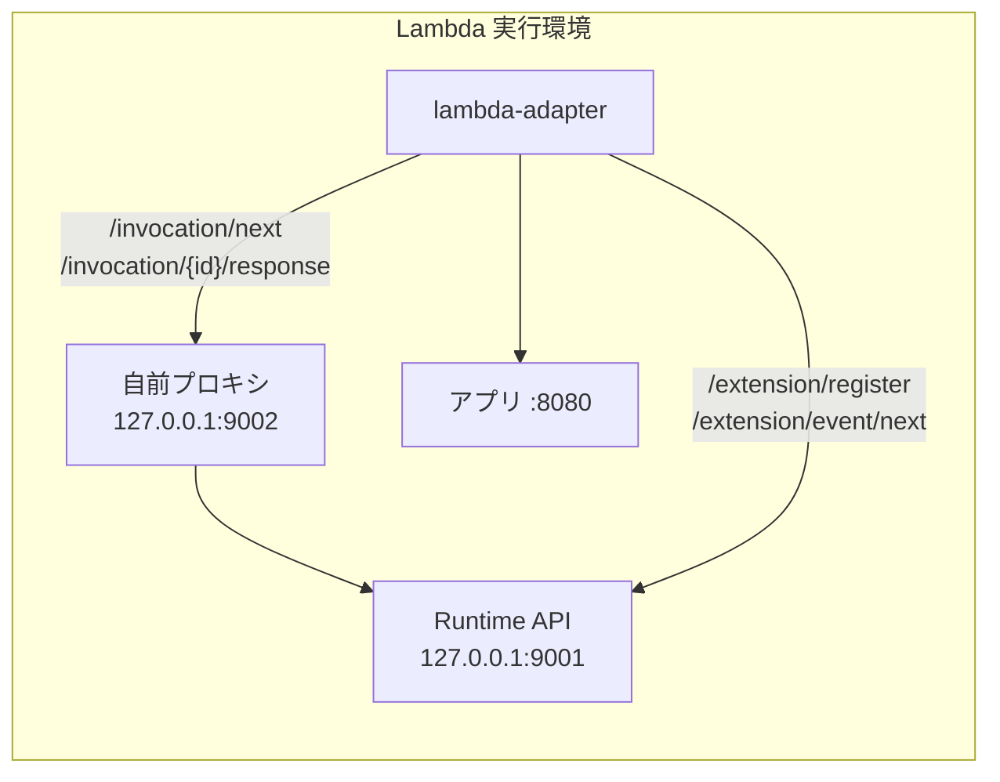

## 何を学んだか

`AWS_LWA_LAMBDA_RUNTIME_API_PROXY` を設定すると、アダプタが Runtime API に投げるリクエストが、指定した自前のプロキシ経由になる。イベントペイロードを覗いたり、機密情報をマスクしたり、トレースを取ったりできる。

実装は 10 行しかない。

```rust title="src/lib.rs"
pub fn apply_runtime_proxy_config() {
    if let Ok(runtime_proxy) = env::var(ENV_LAMBDA_RUNTIME_API_PROXY) {
        // Capture the original value before we overwrite it, so extension
        // registration can still reach the real Lambda Runtime API.
        let original = env::var(ENV_LAMBDA_RUNTIME_API).ok();
        let _ = ORIGINAL_LAMBDA_RUNTIME_API.set(original);

        env::set_var(ENV_LAMBDA_RUNTIME_API, runtime_proxy);
    }
}
```

([src/lib.rs L908](https://github.com/aws/aws-lambda-web-adapter/blob/986113fc66f368f0187a25c683f1ab39a68cc6c6/src/lib.rs#L908))

やっていることは `AWS_LAMBDA_RUNTIME_API` 環境変数の上書きだけだ。しかしこの `env::set_var` 1 行のために、`main.rs` の構造そのものが決まっている。

## ソースコードのどこか

### なぜ環境変数を書き換えるのか

`lambda_runtime_api_client::ClientBuilder::build()` を見ると理由が分かる。

```rust title="lambda-runtime-api-client/src/lib.rs"
pub fn build(self) -> Result<Client, Error> {
    let uri = match self.uri {
        Some(uri) => uri,
        None => {
            let uri = std::env::var("AWS_LAMBDA_RUNTIME_API").expect("Missing AWS_LAMBDA_RUNTIME_API env var");
            uri.try_into().expect("Unable to convert to URL")
        }
    };
    Ok(Client::with(uri, self.connector, self.pool_size))
}
```

([lambda-runtime-api-client/src/lib.rs L138 付近](https://github.com/aws/aws-lambda-rust-runtime/blob/6f305bb00f3cc613fd82f88d2f2200e8089e4385/lambda-runtime-api-client/src/lib.rs#L138))

`with_endpoint()` で URI を渡すこともできる。ところが LWA が呼ぶのは `lambda_http::run_concurrent(self)` であって、その先で `Runtime::new()` がクライアントを組み立ててしまう。

```rust title="lambda-runtime/src/runtime.rs"
let client = Arc::new(
    ApiClient::builder()
        .with_pool_size(pool_size)
        .build()
        .expect("Unable to create a runtime client"),
);
```

`with_endpoint` を挟む隙間がない。LWA のコメントもそう言っている。

```rust title="src/lib.rs"
// We need to overwrite the env variable because lambda_http::run()
// calls lambda_runtime::run() which doesn't allow changing the client URI.
```

**下流のクレートが環境変数からしか設定を読まない構造なので、上書きするなら環境変数しかない。** 依存クレートに設定注入の口が無いときの、身も蓋もない回避策の実例になっている。

### なぜ tokio ランタイムより先なのか

`main.rs` がこうなっている。

```rust title="src/main.rs"
fn main() -> Result<(), Error> {
    // Apply runtime proxy configuration BEFORE starting tokio runtime
    // This must happen before any threads are spawned to avoid unsafe env::set_var
    Adapter::apply_runtime_proxy_config();

    tokio::runtime::Builder::new_multi_thread()
        .enable_all()
        .build()
        .unwrap()
        .block_on(async_main())
}
```

`#[tokio::main]` を使えば 3 行で書けるところを、わざわざ手でランタイムを組み立てている。理由は 1 つで、**`#[tokio::main]` だと `main` の本体が既に tokio ランタイムの中で走ってしまうから**だ。

POSIX の `setenv` はスレッドセーフではない。環境変数のテーブルを書き換えている最中に別スレッドが `getenv` を呼ぶと、解放済みのポインタを読みうる。Rust の `std::env::set_var` はこの問題を長く抱えていて、Rust 2024 edition では `unsafe` 扱いになった。

だから安全に呼べるのは「スレッドが 1 本もない時点」しかない。`main` の 1 行目がそれだ。tokio のマルチスレッドランタイムを作った瞬間にワーカースレッドが立ち上がるので、その後では手遅れになる。

### 拡張登録だけはプロキシを迂回する

`AWS_LAMBDA_RUNTIME_API` を書き換えると、それを読む全員がプロキシを向く。ところが Extensions API への登録だけは本物の Runtime API に届かなければならない。そのために元の値を退避してある。

```rust title="src/lib.rs"
static ORIGINAL_LAMBDA_RUNTIME_API: OnceLock<Option<String>> = OnceLock::new();
```

```rust title="src/lib.rs"
let aws_lambda_runtime_api: String = match ORIGINAL_LAMBDA_RUNTIME_API.get() {
    Some(captured) => captured.clone().unwrap_or_else(|| "127.0.0.1:9001".to_string()),
    None => env::var(ENV_LAMBDA_RUNTIME_API).unwrap_or_else(|_| "127.0.0.1:9001".to_string()),
};
```

([src/lib.rs L689 付近](https://github.com/aws/aws-lambda-web-adapter/blob/986113fc66f368f0187a25c683f1ab39a68cc6c6/src/lib.rs#L689)。詳細は [拡張として登録する](../extension-registration/))

`Option` が二重になっているのが目を引く。`OnceLock<Option<String>>` なので、`get()` の結果は `Option<&Option<String>>` になる。コメントが理由を明記している。

```rust title="src/lib.rs"
// Outer Option distinguishes "not yet captured" (None) from "captured but env was unset"
// (Some(None)).
```

- 外側の `None` = `apply_runtime_proxy_config` がまだ走っていない、あるいはプロキシ設定が無かった → 現在の環境変数を読めばよい
- `Some(None)` = プロキシ設定はあったが、元の `AWS_LAMBDA_RUNTIME_API` は未設定だった → 現在の環境変数を読むとプロキシのアドレスが返ってきてしまうので、既定値の `127.0.0.1:9001` にフォールバックする
- `Some(Some(addr))` = 退避した本物のアドレスを使う

`Option<String>` 1 個では真ん中のケースを表現できない。

## なぜそうなっているか

構図を整理するとこうなる。



プロキシは「イベントの流れ」だけに割り込み、「拡張のライフサイクル」には割り込まない。ここを分けているのが設計の要点だ。もし拡張登録までプロキシ経由にしてしまうと、プロキシ自身が起動する前に登録リクエストが飛んだ場合に Init が失敗する。登録は Lambda の Init 完了条件そのものなので、余計なものを挟むリスクが大きい。

プロキシを起動する主体は LWA ではない。**別の拡張として自分で用意する**必要がある。`/opt/extensions/` にもう 1 個実行ファイルを置けば、Lambda がそれも起動してくれる。

公式ガイドはこの機能の用途として、トレース、ペイロードのキャプチャ、機密情報の難読化、ヘッダの改変を挙げている。

## どう活かすか

**まず、たいていの場合は不要だ。** リクエスト内容を見たいだけなら `AWS_LWA_LAMBDA_RUNTIME_API_PROXY` より先に、アプリ側のミドルウェアで `x-amzn-request-context` ヘッダを読むほうが簡単で確実だ ([コンテキストを HTTP ヘッダに詰める](../context-headers/))。この機能が要るのは、**アプリに手を入れられない**か、**アプリに渡る前にペイロードを変えたい**場合に限られる。

**プロキシの起動タイミングに気をつける。** プロキシ拡張とアダプタは同時に起動されるので、アダプタが最初の `/invocation/next` を投げる時点でプロキシが listen していないと失敗する。アダプタは [レディネスチェック](../readiness-check/) をアプリに対しては行うが、プロキシに対しては何もしない。

**`env::set_var` の教訓のほうが持ち帰る価値がある。** 「プロセス全体の状態を書き換える処理は、スレッドが立つ前に済ませる」。この制約のために `#[tokio::main]` を捨てて手動でランタイムを組み立てる、という判断は、Rust に限らず参考になる。設定を環境変数経由でしか受け取れないライブラリを使うときは、その書き換えをいつやるかを最初に決めておく。
