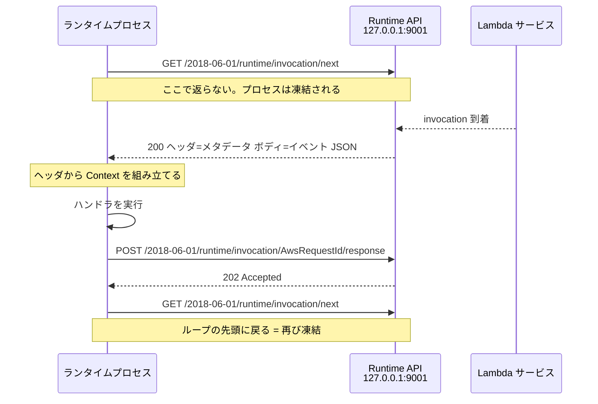

## 何を学んだか

Runtime API は、Lambda が実行環境の中に建てている**ただの HTTP サーバ**だ。ランタイムはそこに `AWS_LAMBDA_RUNTIME_API` 環境変数で示されるアドレス (`host:port` 形式、通常 `127.0.0.1:9001`) で接続し、次の 4 つのエンドポイントを叩く。バージョンプレフィックスは `2018-06-01`。

| メソッド | パス                                                     | 役割                                       |
| -------- | -------------------------------------------------------- | ------------------------------------------ |
| GET      | `/2018-06-01/runtime/invocation/next`                    | 次のイベントを取りに行く。ロングポーリング |
| POST     | `/2018-06-01/runtime/invocation/{AwsRequestId}/response` | 成功レスポンスを返す                       |
| POST     | `/2018-06-01/runtime/invocation/{AwsRequestId}/error`    | invocation 中のエラーを報告する            |
| POST     | `/2018-06-01/runtime/init/error`                         | 初期化中のエラーを報告する                 |

重要なのは `/next` の性質だ。**イベントが来るまで返らない。** AWS のドキュメントは「この GET にタイムアウトを設定するな」と明記している ([Using the Lambda runtime API for custom runtimes](https://docs.aws.amazon.com/lambda/latest/dg/runtimes-api.html))。ランタイムがブートストラップされてから最初のイベントが返るまでの間、プロセスは数秒間フリーズしている可能性があるからだ。

`{AwsRequestId}` は `/next` のレスポンスヘッダ `Lambda-Runtime-Aws-Request-Id` で渡される値をそのまま使う。つまり **1 invocation は「`/next` で 1 個取る」→「`{その ID}/response` で 1 個返す」の対**になっていて、この対が終わるまで次の `/next` は投げない (Lambda Managed Instances を除く)。



## ソースコードのどこか

### エンドポイントの組み立て

`Client` は base URI と hyper のクライアントを持つだけの薄い型で、`AWS_LAMBDA_RUNTIME_API` の値をそのまま `Uri` にパースして base にしている。

```rust title="lambda-runtime-api-client/src/lib.rs"
pub fn build(self) -> Result<Client, Error> {
    let uri = match self.uri {
        Some(uri) => uri,
        None => {
            let uri = std::env::var("AWS_LAMBDA_RUNTIME_API").expect("Missing AWS_LAMBDA_RUNTIME_API env var");
            uri.try_into().expect("Unable to convert to URL")
        }
    };
    Ok(Client::with(uri, self.connector, self.pool_size))
}
```

[`lambda-runtime-api-client/src/lib.rs#L135-L144`](https://github.com/aws/aws-lambda-rust-runtime/blob/6f305bb00f3cc613fd82f88d2f2200e8089e4385/lambda-runtime-api-client/src/lib.rs#L135-L144)

リクエスト側はパスだけを持ったまま作られ、送信直前に `set_origin` で base のスキーム・オーソリティ・ベースパスが前置される。

```rust title="lambda-runtime-api-client/src/lib.rs"
fn set_origin<B>(&self, req: Request<B>) -> Result<Request<B>, BoxError> {
    let (mut parts, body) = req.into_parts();
    let (scheme, authority, base_path) = {
        let scheme = self.base.scheme().unwrap_or(&Scheme::HTTP);
        let authority = self.base.authority().expect("Authority not found");
        let base_path = self.base.path().trim_end_matches('/');
        (scheme, authority, base_path)
    };
    let path = parts.uri.path_and_query().expect("PathAndQuery not found");
    let pq: PathAndQuery = format!("{base_path}{path}").parse().expect("PathAndQuery invalid");
    ...
}
```

[`lambda-runtime-api-client/src/lib.rs#L76-L96`](https://github.com/aws/aws-lambda-rust-runtime/blob/6f305bb00f3cc613fd82f88d2f2200e8089e4385/lambda-runtime-api-client/src/lib.rs#L76-L96)

`scheme` が無ければ HTTP にフォールバックする。`AWS_LAMBDA_RUNTIME_API` の値は `127.0.0.1:9001` のようにスキームを含まないので、実際に使われるのは常にこのフォールバックだ。ベースパスを `trim_end_matches('/')` してから前置しているので、`http://localhost:9001/foo` や `http://localhost:9001/foo/` を base にしても `/foo/2018-06-01/...` になる。この余地は [Runtime API プロキシ](../runtime-api-proxy/) で効いてくる。

### 3 種類のリクエスト

各エンドポイントは `IntoRequest` トレイトの実装として 1 つずつ書かれている。

```rust title="lambda-runtime/src/requests.rs"
impl IntoRequest for NextEventRequest {
    fn into_req(self) -> Result<Request<Body>, Error> {
        let req = build_request()
            .method(Method::GET)
            .uri(Uri::from_static("/2018-06-01/runtime/invocation/next"))
            .body(Default::default())?;
        Ok(req)
    }
}
```

[`lambda-runtime/src/requests.rs#L17-L25`](https://github.com/aws/aws-lambda-rust-runtime/blob/6f305bb00f3cc613fd82f88d2f2200e8089e4385/lambda-runtime/src/requests.rs#L17-L25)

`EventCompletionRequest::into_req` ([L69](https://github.com/aws/aws-lambda-rust-runtime/blob/6f305bb00f3cc613fd82f88d2f2200e8089e4385/lambda-runtime/src/requests.rs#L69)) は `POST /invocation/{id}/response` を作る。ここが buffered とストリーミングで分岐する場所で、後者は [ストリーミングレスポンスのワイヤ形式](../response-streaming-protocol/) で丸ごと読む。

`EventErrorRequest::into_req` ([L170-L184](https://github.com/aws/aws-lambda-rust-runtime/blob/6f305bb00f3cc613fd82f88d2f2200e8089e4385/lambda-runtime/src/requests.rs#L170-L184)) は `POST /invocation/{id}/error` に `lambda-runtime-function-error-type: unhandled` ヘッダを付けて `Diagnostic` を JSON で送る。

**`/2018-06-01/runtime/init/error` に相当する型は、このクレートには存在しない。** リポジトリ全体を検索しても `init/error` は出てこない。aws-lambda-rust-runtime は初期化エラーを「パニックしてプロセスが死ぬ」で表現していて、その場合 Lambda 側が実行環境の異常終了として扱う。実際 `Config::from_env` は環境変数が無ければ `expect` で落ちる。

### User-Agent

`build_request()` は全リクエスト共通のビルダで、`User-Agent` を必ず付ける。

```rust title="lambda-runtime-api-client/src/lib.rs"
const USER_AGENT_HEADER: &str = "User-Agent";
const DEFAULT_USER_AGENT: &str = concat!("aws-lambda-rust/", env!("CARGO_PKG_VERSION"));
const CUSTOM_USER_AGENT: Option<&str> = option_env!("LAMBDA_RUNTIME_USER_AGENT");

pub fn build_request() -> http::request::Builder {
    const USER_AGENT: &str = match CUSTOM_USER_AGENT {
        Some(value) => value,
        None => DEFAULT_USER_AGENT,
    };
    http::Request::builder().header(USER_AGENT_HEADER, USER_AGENT)
}
```

[`lambda-runtime-api-client/src/lib.rs#L17-L19`](https://github.com/aws/aws-lambda-rust-runtime/blob/6f305bb00f3cc613fd82f88d2f2200e8089e4385/lambda-runtime-api-client/src/lib.rs#L17-L19) と [`#L152-L158`](https://github.com/aws/aws-lambda-rust-runtime/blob/6f305bb00f3cc613fd82f88d2f2200e8089e4385/lambda-runtime-api-client/src/lib.rs#L152-L158)

`option_env!` はコンパイル時に環境変数を読むマクロなので、`CUSTOM_USER_AGENT` は `const` として畳み込まれる。実行時に差し替えることはできない。

Web Adapter の Makefile はこれを実際に使っている。

```makefile title="Makefile"
build-image-x86: fmt lint test
	LAMBDA_RUNTIME_USER_AGENT=aws-lambda-rust/aws-lambda-adapter/$(CARGO_PKG_VERSION) cargo lambda build --release --extension --target x86_64-unknown-linux-musl
```

[`Makefile#L15-L17`](https://github.com/aws/aws-lambda-web-adapter/blob/986113fc66f368f0187a25c683f1ab39a68cc6c6/Makefile#L15-L17)

Layer 用の 2 ターゲットにも同じ変数が付いている。つまり Runtime API 側から見ると、Web Adapter からのリクエストは `User-Agent: aws-lambda-rust/aws-lambda-adapter/0.9.x` を名乗っている。

## なぜそうなっているか

**エンドポイントを `IntoRequest` の実装に分けているのは、送信ロジックと組み立てロジックを分離するためだ。** `Client::call` は「渡された `Request` に origin を足して投げる」だけしか知らない。だから Runtime API のパスやヘッダを変えたいとき、変更点は `requests.rs` に閉じる。逆に、プロキシを挟むような改造は `Client` の base URI を差し替えるだけで済む。

**User-Agent をコンパイル時定数にしているのは、リクエストごとの文字列生成を避けるため**でもあるが、それ以上に「このバイナリが何であるか」はビルド時に決まる情報だからだ。`aws-lambda-rust/` というプレフィックスを残したまま識別子を足す規約になっているので、AWS 側は「Rust ランタイム経由」と「どのツール経由」の両方を集計できる。Web Adapter がわざわざこれを設定しているのは、自分が Runtime API の直接の利用者であることを名乗る必要があるからだ。

**`/next` がロングポーリングなのは、pull 型モデルの必然だ。** ランタイム側からポーリング間隔を決めさせると、レイテンシと無駄なリクエストのトレードオフをランタイム実装者に押し付けることになる。接続を張りっぱなしにしておけば、Lambda はイベントが来た瞬間に返せるし、返すものが無い間はプロセスを凍結できる。

## どう活かすか

**Web Adapter がこの層を一切書いていないことを確認しておく。** アダプタが自分で `hyper` の `Request` を組み立てるのは、Extensions API への 2 リクエストと、ローカルのアプリへの転送だけだ。Runtime API 側は `lambda_http::run_concurrent` に丸投げしていて、そのおかげで `src/lib.rs` は 1,560 行で済んでいる。「どこまでが自前で、どこからがクレートか」の境界線がここにある。

**自作のカスタムランタイムを書くなら、必要なのはこの 4 エンドポイントだけだ。** `curl` で `/next` を叩き、返ってきた JSON を処理して `/response` に POST する 20 行のシェルスクリプトでも、Lambda のランタイムとして成立する。Web Adapter はその「20 行」を Rust で書いて、処理の中身を「隣のポートに HTTP で転送する」にしただけとも言える。

**トラブルシュートでは `AWS_LAMBDA_RUNTIME_API` を最初に疑う。** この環境変数が無ければ `Client::builder().build()` は `expect` でパニックする。ローカルで Web Adapter のバイナリを直接動かしても何も起きないのは、この変数が無いからだ ([Lambda の外では何も動かない](../outside-lambda/))。
