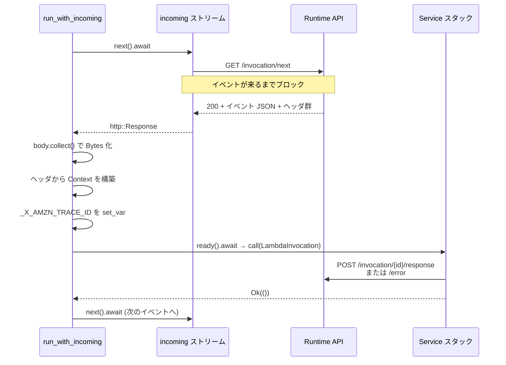

## 何を学んだか

LWA の `Adapter::run` は最後に `lambda_http::run_concurrent(self)` を呼ぶだけで終わる。イベントの取得も、レスポンスの送信も、エラー時の `/error` への POST も、アダプタのコードには 1 行も出てこない。それは全部 `lambda_runtime` の `Runtime::run` の中にある。

このページでは、まず**逐次モードのループ**を読む。1 invocation を処理する最小の単位がここにあり、並行モードはこれを N 本並べたものにすぎない ([並行ポーリング — /next を N 本同時に張る](../concurrent-polling/))。

読み終わると、次の 3 つが分かる。

- `AWS_LAMBDA_MAX_CONCURRENCY` が hyper クライアントのコネクションプールサイズも決めていること
- ハンドラを呼ぶ前に、イベントのボディは必ず全部メモリに読み切られること
- `_X_AMZN_TRACE_ID` 環境変数を設定しているのは逐次モードだけであること

## ソースコードのどこか

入口は [`lambda-runtime/src/lib.rs` の `run()`](https://github.com/aws/aws-lambda-rust-runtime/blob/6f305bb00f3cc613fd82f88d2f2200e8089e4385/lambda-runtime/src/lib.rs#L129) で、実体は 2 行しかない。

```rust title="lambda-runtime/src/lib.rs"
pub async fn run<A, F, R, B, S, D, E>(handler: F) -> Result<(), Error>
where
    F: Service<LambdaEvent<A>, Response = R>,
    // ...
{
    let runtime = Runtime::new(handler).layer(layers::TracingLayer::new());
    runtime.run().await
}
```

`Runtime::new` でハンドラを 3 枚のミドルウェアに包み ([3 層の tower::Service スタック](../tower-service-stack/))、`layer(TracingLayer::new())` でさらに 1 枚外側に巻いて、`run()` でループに入る。

### Runtime::new — 同時実行数がプールサイズになる

[`lambda-runtime/src/runtime.rs#L106`](https://github.com/aws/aws-lambda-rust-runtime/blob/6f305bb00f3cc613fd82f88d2f2200e8089e4385/lambda-runtime/src/runtime.rs#L106):

```rust title="lambda-runtime/src/runtime.rs"
pub fn new(handler: F) -> Self {
    trace!("Loading config from env");
    let config = Arc::new(Config::from_env());
    let concurrency_limit = max_concurrency_from_env().unwrap_or(1).max(1);
    // Strategy: allocate all worker tasks up-front, so size the client pool to match.
    let pool_size = concurrency_limit as usize;
    let client = Arc::new(
        ApiClient::builder()
            .with_pool_size(pool_size)
            .build()
            .expect("Unable to create a runtime client"),
    );
    Self {
        service: wrap_handler(handler, client.clone()),
        config,
        client,
        concurrency_limit,
    }
}
```

`Config::from_env()` は `AWS_LAMBDA_FUNCTION_NAME` などの環境変数を読む。ここが Lambda 実行環境の外だとパニックする ([Lambda の外では何も動かない](../outside-lambda/))。

`with_pool_size` は最終的に hyper の `pool_max_idle_per_host` になる ([`lambda-runtime-api-client/src/lib.rs#L64`](https://github.com/aws/aws-lambda-rust-runtime/blob/6f305bb00f3cc613fd82f88d2f2200e8089e4385/lambda-runtime-api-client/src/lib.rs#L64))。`AWS_LAMBDA_MAX_CONCURRENCY` が 10 なら、Runtime API 向けのアイドルコネクションを 10 本まで保持する。

### incoming() — ただ /next を投げ続けるだけ

[`runtime.rs#L427`](https://github.com/aws/aws-lambda-rust-runtime/blob/6f305bb00f3cc613fd82f88d2f2200e8089e4385/lambda-runtime/src/runtime.rs#L427):

```rust title="lambda-runtime/src/runtime.rs"
fn incoming(
    client: &ApiClient,
) -> impl Stream<Item = Result<http::Response<hyper::body::Incoming>, BoxError>> + Send + '_ {
    async_stream::stream! {
        loop {
            trace!("Waiting for next event (incoming loop)");
            let req = NextEventRequest.into_req().expect("Unable to construct request");
            let res = client.call(req).await;
            yield res;
        }
    }
}
```

`NextEventRequest` は `GET /2018-06-01/runtime/invocation/next` を組み立てるだけの型 ([`requests.rs#L17`](https://github.com/aws/aws-lambda-rust-runtime/blob/6f305bb00f3cc613fd82f88d2f2200e8089e4385/lambda-runtime/src/requests.rs#L17))。タイムアウトもリトライもここには無い。`/next` はロングポーリングで、イベントが無い限り返ってこないので、この `await` の上でプロセスは凍る ([フリーズと解凍 — リクエストの間、プロセスは止まっている](../freeze-thaw/))。

ループ本体は [`run_with_incoming`](https://github.com/aws/aws-lambda-rust-runtime/blob/6f305bb00f3cc613fd82f88d2f2200e8089e4385/lambda-runtime/src/runtime.rs#L379) にある。

```rust title="lambda-runtime/src/runtime.rs"
tokio::pin!(incoming);
while let Some(next_event_response) = incoming.next().await {
    trace!("New event arrived (run loop)");
    let event = next_event_response?;
    process_invocation(&mut service, &config, event, true).await?;
}
Ok(())
```

`?` が 2 つあることに注意する。`/next` の呼び出しが失敗しても、`process_invocation` が `Err` を返しても、**ループはそこで終わる**。ハンドラのエラーはここまで上がってこない ([パニックを Diagnostic に変える](../diagnostic-and-panic/))。

### process_invocation — 1 件分の処理

[`runtime.rs#L481`](https://github.com/aws/aws-lambda-rust-runtime/blob/6f305bb00f3cc613fd82f88d2f2200e8089e4385/lambda-runtime/src/runtime.rs#L481):

```rust title="lambda-runtime/src/runtime.rs"
let (parts, incoming) = event.into_parts();

#[cfg(debug_assertions)]
if parts.status == http::StatusCode::NO_CONTENT {
    // Ignore the event if the status code is 204.
    // This is a way to keep the runtime alive when
    // there are no events pending to be processed.
    return Ok(());
}

// Build the invocation such that it can be sent to the service right away
// when it is ready
let body = incoming.collect().await?.to_bytes();
let context = Context::new(invoke_request_id(&parts.headers)?, config.clone(), &parts.headers)?;
let invocation = LambdaInvocation { parts, body, context };

if set_amzn_trace_env {
    // Setup Amazon's default tracing data
    amzn_trace_env(&invocation.context);
}

// Wait for service to be ready
let ready = service.ready().await?;

// Once ready, call the service which will respond to the Lambda runtime API
ready.call(invocation).await?;
```

`Context::new` は `/next` のレスポンスヘッダから request id・deadline・関数 ARN・トレース ID を組み立てる ([/next のレスポンスヘッダが Context になる](../invocation-headers/))。

`amzn_trace_env` は [L519](https://github.com/aws/aws-lambda-rust-runtime/blob/6f305bb00f3cc613fd82f88d2f2200e8089e4385/lambda-runtime/src/runtime.rs#L519):

```rust title="lambda-runtime/src/runtime.rs"
fn amzn_trace_env(ctx: &Context) {
    match &ctx.xray_trace_id {
        Some(trace_id) => env::set_var("_X_AMZN_TRACE_ID", trace_id),
        None => env::remove_var("_X_AMZN_TRACE_ID"),
    }
}
```

第 4 引数 `set_amzn_trace_env` は逐次ループからは `true`、並行ワーカーからは `false` で呼ばれる。

### 1 invocation の流れ



## なぜそうなっているか

**ボディを先に読み切るのは、Service に渡す値を完全なものにするため。** コメントに `so it can be sent to the service right away when it is ready` とある通り、`service.ready().await` でバックプレッシャを待つ区間があるので、その間に `hyper::body::Incoming` を持ち回すのは都合が悪い。`Bytes` にしてしまえば `LambdaInvocation` は単なる値になる。副作用として、**バッファモードのリクエストボディは必ず全部メモリに載る**。Lambda のペイロード上限が 6MB なので許容できる、という前提だ。

**`ready().await` してから `call` するのは tower の契約。** `poll_ready` が `Ready` を返すまで `call` してはいけない、というのが `tower::Service` の規約で、`ServiceExt::ready` がそれを守っている。LWA の `Adapter` は `poll_ready` で常に `Poll::Ready(Ok(()))` を返すので実質待たないが、`CompressionLayer` のような他のミドルウェアを挟んでも壊れない構造になっている。

**プールサイズを同時実行数に合わせるのは、コネクション枯渇を避けるため。** 並行モードでは N 本のワーカーが同時に `/next` を張る。プールがそれより小さいと、レスポンス送信のたびにコネクションを張り直すか、hyper の中で待たされる。逆に大きくしても Runtime API 相手には無駄なので、ちょうど N にしている。

**`_X_AMZN_TRACE_ID` はプロセス全体の環境変数なので、逐次のときしか設定できない。** AWS SDK の X-Ray 統合はこの環境変数を読んでセグメントを親子に繋ぐ。1 invocation ずつ処理している間は、プロセス内にトレースが 1 本しかないので安全に上書きできる。並行モードでこれをやると、別の invocation のトレース ID を踏むことになる。だから並行モードでは `set_amzn_trace_env: false` で呼び、代わりに `Context::xray_trace_id` を使わせる。`lambda_http` はさらにそれを**リクエストごとの `x-amzn-trace-id` ヘッダ**に載せ替えてアプリに渡している ([並行ポーリング](../concurrent-polling/))。

**204 の無視が `#[cfg(debug_assertions)]` なのは、本番の Runtime API が 204 を返さないから。** これは `sam local` などのローカルエミュレータ向けの逃げ道で、リリースビルドではこの分岐ごと消える。消えた状態で 204 が来ると `invoke_request_id` に進むが、その実装は

```rust title="lambda-runtime/src/types.rs"
headers
    .get("lambda-runtime-aws-request-id")
    .expect("missing lambda-runtime-aws-request-id header")
    .to_str()
```

で、ヘッダが無ければ `.expect` でパニックする。しかもこのパニックは `CatchPanicService` の外側 (ハンドラを呼ぶ前) なので `Diagnostic` に変換されない。LWA の release profile は `panic = "abort"` なので、そのままプロセスが落ちる。「デバッグビルドでは動くのに本番で落ちる」という形の差が原理的に存在する箇所として覚えておく価値がある。

## どう活かすか

- **LWA のコードを読むとき、「イベントを取る処理」を探しても無い**のが正常。`src/lib.rs` にあるのは `Service<Request>` の実装 1 個だけで、ループはこのファイルにある。
- **`AWS_LAMBDA_MAX_CONCURRENCY` を上げるときは、アプリ側の同時接続数も一緒に考える。** この値はワーカー数であると同時に Runtime API 向けのプールサイズでもあり、LWA はさらに同数のリクエストをローカルアプリへ流す。アプリ側のワーカー数がそれより少なければ、そこが詰まる。
- **`Config::from_env()` がパニックする**ので、LWA バイナリを Lambda 以外で `run()` させることはできない。同じイメージが Fargate で動くのは、Fargate では拡張として起動されないから ([Lambda の外では何も動かない](../outside-lambda/))。
- **ログに `Lambda runtime invoke` の span が出る**のは `TracingLayer` の仕業 ([`layers/trace.rs#L63`](https://github.com/aws/aws-lambda-rust-runtime/blob/6f305bb00f3cc613fd82f88d2f2200e8089e4385/lambda-runtime/src/layers/trace.rs#L63))。`requestId` と `xrayTraceId` がフィールドとして入るので、構造化ログを有効にしていればそのまま絞り込みに使える。
