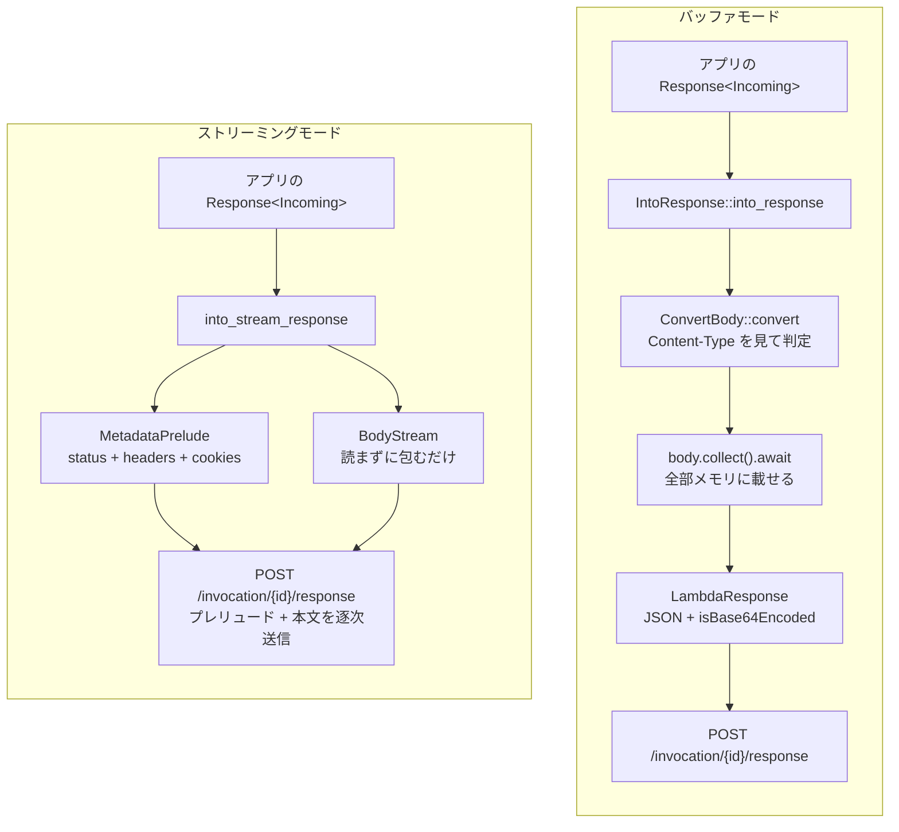

## 何を学んだか

LWA の `run()` の 3 分岐目、`lambda_http::run_with_streaming_response_concurrent(self)` の先を読む。

バッファモードとストリーミングモードは、LWA 側から見れば同じ `Service<Request>` を渡す先が違うだけだ。しかし `lambda_http` の中では、レスポンス側の扱いが根本的に違う。

- **バッファモード**: `IntoResponse` がボディを `collect()` で読み切り、base64 判定をして `LambdaResponse` という JSON を作る
- **ストリーミングモード**: ボディを読まずに `futures::Stream` に変換して、そのまま流す

この差が「ストリーミングでは圧縮できない」「ストリーミングでは base64 にならない」の両方を生んでいる。

## ソースコードのどこか

ファイルは [`lambda-http/src/streaming.rs`](https://github.com/aws/aws-lambda-rust-runtime/blob/6f305bb00f3cc613fd82f88d2f2200e8089e4385/lambda-http/src/streaming.rs) の 300 行弱で、実質的な中身は 4 つの関数しかない。

### Service を持ち上げる

LWA が呼ぶ入口 ([L221](https://github.com/aws/aws-lambda-rust-runtime/blob/6f305bb00f3cc613fd82f88d2f2200e8089e4385/lambda-http/src/streaming.rs#L221)):

```rust title="lambda-http/src/streaming.rs"
pub async fn run_with_streaming_response_concurrent<S, B, E>(handler: S) -> Result<(), Error>
where
    S: Service<Request, Response = Response<B>, Error = E> + Clone + Send + 'static,
    // ...
{
    lambda_runtime::run_concurrent(into_stream_service_cloneable(handler)).await
}
```

`into_stream_service_cloneable` ([L122](https://github.com/aws/aws-lambda-rust-runtime/blob/6f305bb00f3cc613fd82f88d2f2200e8089e4385/lambda-http/src/streaming.rs#L122)) は 4 行だ。

```rust title="lambda-http/src/streaming.rs"
ServiceBuilder::new()
    .map_request(event_to_request as EventToRequest)
    .service(handler)
    .map_response(into_stream_response)
```

`tower` の `map_request` / `map_response` で `Service<Request>` を `Service<LambdaEvent<LambdaRequest>>` に持ち上げているだけで、新しい型を定義していない。バッファモードの `Adapter` ([`lambda-http/src/lib.rs#L182`](https://github.com/aws/aws-lambda-rust-runtime/blob/6f305bb00f3cc613fd82f88d2f2200e8089e4385/lambda-http/src/lib.rs#L182)) が手書きの `Service` 実装なのと対になる構造で、役割は同じ。

`Clone` を要求しない版の `into_stream_service` も並んで存在し ([L95](https://github.com/aws/aws-lambda-rust-runtime/blob/6f305bb00f3cc613fd82f88d2f2200e8089e4385/lambda-http/src/streaming.rs#L95))、逐次版の `run_with_streaming_response` が使う。LWA は `_concurrent` 側しか呼ばない ([並行ポーリング — /next を N 本同時に張る](../concurrent-polling/))。

### リクエスト側はバッファモードと同じ

```rust title="lambda-http/src/streaming.rs"
fn event_to_request(req: LambdaEvent<LambdaRequest>) -> Request {
    let LambdaEvent { payload, context } = req;
    let mut event: Request = payload.into();
    update_xray_trace_id_header(event.headers_mut(), &context);
    event.with_lambda_context(context)
}
```

`payload.into()` は `From<LambdaRequest> for http::Request<Body>` で、`RequestContext` と `RawHttpPath` を extensions に載せる変換そのもの ([イベント JSON をどのイベント型か判別する](../lambda-http-request/))。`update_xray_trace_id_header` も同じ。**リクエスト側に差は無い。**

`Adapter::call` ([`lib.rs#L196`](https://github.com/aws/aws-lambda-rust-runtime/blob/6f305bb00f3cc613fd82f88d2f2200e8089e4385/lambda-http/src/lib.rs#L196)) と見比べると、違うのは `payload.request_origin()` を取っているかどうかだけだ。バッファモードはレスポンス JSON の形を決めるために `RequestOrigin` が要る ([レスポンスが base64 になるかを決めているところ](../lambda-http-response/))。ストリーミングモードはレスポンス形式が 1 種類しかないので不要になる。

### レスポンス側 — cookies を抜く

[`into_stream_response`](https://github.com/aws/aws-lambda-rust-runtime/blob/6f305bb00f3cc613fd82f88d2f2200e8089e4385/lambda-http/src/streaming.rs#L140):

```rust title="lambda-http/src/streaming.rs"
fn into_stream_response<B>(res: Response<B>) -> StreamResponse<BodyStream<B>>
where
    B: Body + Unpin + Send + 'static,
    B::Data: Into<Bytes> + Send,
    B::Error: Into<Error> + Send + Debug,
{
    let (parts, body) = res.into_parts();

    let mut headers = parts.headers;
    let cookies = headers
        .get_all(SET_COOKIE)
        .iter()
        .map(|c| String::from_utf8_lossy(c.as_bytes()).to_string())
        .collect::<Vec<_>>();
    headers.remove(SET_COOKIE);

    StreamResponse {
        metadata_prelude: MetadataPrelude {
            headers,
            status_code: parts.status,
            cookies,
        },
        stream: BodyStream { body },
    }
}
```

**`body` に一切触っていない。** `BodyStream { body }` で包み直すだけで、1 バイトも読まない。読まれるのは `lambda_runtime` がストリームとして流すときだ。

`set-cookie` の扱いは API Gateway v2 のバッファレスポンスと同じ発想で、ヘッダから抜いて `MetadataPrelude.cookies` に移す。`MetadataPrelude` が実際にどうワイヤに乗るかは [ストリーミングレスポンスのワイヤ形式](../response-streaming-protocol/) を参照。

### BodyStream — http_body から futures::Stream へ

[L241](https://github.com/aws/aws-lambda-rust-runtime/blob/6f305bb00f3cc613fd82f88d2f2200e8089e4385/lambda-http/src/streaming.rs#L241):

```rust title="lambda-http/src/streaming.rs"
impl<B> Stream for BodyStream<B>
where
    B: Body + Unpin + Send + 'static,
    B::Data: Into<Bytes> + Send,
    B::Error: Into<Error> + Send + Debug,
{
    type Item = Result<B::Data, B::Error>;

    #[inline]
    fn poll_next(mut self: Pin<&mut Self>, cx: &mut Context<'_>) -> Poll<Option<Self::Item>> {
        match futures_util::ready!(self.as_mut().project().body.poll_frame(cx)?) {
            Some(frame) => match frame.into_data() {
                Ok(data) => Poll::Ready(Some(Ok(data))),
                Err(_frame) => Poll::Ready(None),
            },
            None => Poll::Ready(None),
        }
    }
}
```

`http_body::Body` は「フレーム」を返すインタフェースで、フレームにはデータフレームとトレーラフレーム (末尾ヘッダ) の 2 種類がある。`frame.into_data()` はデータフレームなら `Ok(Bytes)`、そうでなければ `Err(frame)` を返す。

このコードは **`Err` を受け取ったら `Poll::Ready(None)` を返す** — つまりトレーラが来た時点でストリームを終了扱いにする。トレーラの内容は捨てられる。

### 2 つのモードの比較



## なぜそうなっているか

**ボディを読まないのがストリーミングの目的そのものだ。** バッファモードの `convert_to_text` / `convert_to_binary` はどちらも `body.collect().await` で始まる ([`response.rs#L363`](https://github.com/aws/aws-lambda-rust-runtime/blob/6f305bb00f3cc613fd82f88d2f2200e8089e4385/lambda-http/src/response.rs#L363))。これは「最初のバイトを返すまでに全部揃っている必要がある」ことを意味する。LLM の応答のように 30 秒かけて生成されるものだと、ユーザは 30 秒待たされる。ストリーミングモードはボディを `Stream` のまま持ち回すので、アプリが最初のチャンクを吐いた瞬間に流せる。

**その結果、base64 判定が入る余地が無い。** `ConvertBody::convert` が呼ばれるのは `IntoResponse` の中だけで、ストリーミング経路には `IntoResponse` が出てこない。判定するには全体を読む必要があるし、読んだらストリーミングでなくなる。だから `Content-Type` が何であれ、バイトはそのまま流れる。バイナリを返しても壊れないし、`isBase64Encoded` という概念自体が存在しない。

**圧縮できない理由の半分もここにある。** `tower_http` の `CompressionLayer` はレスポンスボディを圧縮ストリームで包むので、原理的にはストリーミングと共存できる。しかし LWA の `run()` は `(true, LambdaInvokeMode::Buffered)` の組み合わせでしか `CompressionLayer` を挿さない ([`src/lib.rs#L862`](https://github.com/aws/aws-lambda-web-adapter/blob/986113fc66f368f0187a25c683f1ab39a68cc6c6/src/lib.rs#L862))。残りの半分 — なぜ挿さないのか — は [レスポンス圧縮と、ストリーミングと併用できない理由](../compression/) で扱う。

**トレーラでストリームを終了させるのは、Lambda のストリーミングプロトコルにトレーラの居場所が無いから。** HTTP/1.1 のチャンク転送や gRPC はトレーラを使うが、Runtime API のストリーミングレスポンスは「プレリュード + 本文」の形しか持たない。トレーラを受け取っても送る先が無い。ここで `Poll::Ready(None)` にしておけば、少なくとも本文が正しく終端する。

なお `lambda_runtime` 側にはストリームのエラーをトレーラとして送る仕組み ([`types.rs#L208` の `ToStreamErrorTrailer`](https://github.com/aws/aws-lambda-rust-runtime/blob/6f305bb00f3cc613fd82f88d2f2200e8089e4385/lambda-runtime/src/types.rs#L208)) があるが、これは**アプリのトレーラを転送するものではなく、ストリームの途中でエラーが起きたときにランタイムが自分で付けるもの**だ。

**`map_request` / `map_response` で済ませているのは、状態を持つ必要が無いから。** バッファモードの `Adapter` は `TransformResponse` という 2 状態の Future を手書きしている。ハンドラの Future を待ってから `into_response()` の Future を待つ、という 2 段階が必要だからだ。ストリーミング側の `into_stream_response` は同期関数なので、`map_response` の 1 行で足りる。

**`MetadataPrelude` に `cookies` があるのは、Function URL が API Gateway v2 と同じレスポンス形式を期待するから。** ストリーミングが使えるのは Function URL (と InvokeWithResponseStream) だけで、そこでの cookie の渡し方は `cookies` 配列になっている。ヘッダに `Set-Cookie` を残したまま送っても効かない。

## どう活かすか

- **ストリーミングモードでは `x-lambda-http-content-encoding` も `Content-Encoding` も base64 判定に関係しない。** バッファモードで base64 に悩んでいたなら、ストリーミングに切り替えるだけで問題ごと消える。ただし Function URL 限定になる。
- **アプリ側がボディをバッファリングしていると意味がない。** LWA がストリームで流しても、Express が `res.json(bigObject)` で一度に書けば 1 チャンクにしかならない。`res.write()` を刻むか、フレームワークのストリーミング API を使う必要がある。
- **HTTP トレーラは届かない。** gRPC-Web のようなトレーラ依存のプロトコルは、ストリーミングモードでは成立しない。
- **`Content-Length` を付けたレスポンスをストリーミングで返すと、意図が噛み合わない。** LWA は `transfer-encoding` ヘッダを剥がすが ([`src/lib.rs#L1034`](https://github.com/aws/aws-lambda-web-adapter/blob/986113fc66f368f0187a25c683f1ab39a68cc6c6/src/lib.rs#L1034))、`Content-Length` はそのまま `MetadataPrelude.headers` に載る。
- 全体の流れ (Function URL の設定から、プレリュードのワイヤ形式、アプリからの読み出しまで) は [ストリーミングを端から端まで追う](../streaming-end-to-end/) にまとめてある。
