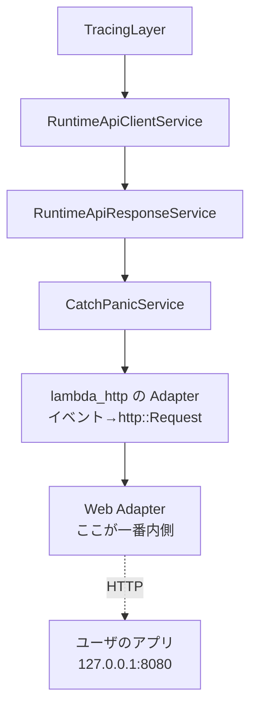

## 何を学んだか

この章のこれ以降には「`Service` を `Service` で包む」「`Layer` を巻く」といった言い回しが何度も出てくる。Web Adapter 本体のコードも、実質的には**トレイトを 1 つ実装しただけ**のものだ。

```rust title="src/lib.rs"
impl Service<Request> for Adapter<HttpConnector, Body> {
    type Response = Response<Incoming>;
    type Error = Error;
    type Future = Pin<Box<dyn Future<Output = Result<Self::Response, Self::Error>> + Send>>;

    fn poll_ready(&mut self, _cx: &mut core::task::Context<'_>) -> core::task::Poll<Result<(), Self::Error>> {
        core::task::Poll::Ready(Ok(()))
    }

    fn call(&mut self, event: Request) -> Self::Future {
        let adapter = self.clone();
        Box::pin(async move { adapter.fetch_response(event).await })
    }
}
```

([src/lib.rs L1047](https://github.com/aws/aws-lambda-web-adapter/blob/986113fc66f368f0187a25c683f1ab39a68cc6c6/src/lib.rs#L1047))

Web Adapter が Lambda に対して差し出しているものは、これで全部だ。`tower` は Rust の非同期ミドルウェアの共通語彙で、覚えることは **`Service` と `Layer` の 2 つのトレイト**しかない。

## Service — 非同期の「関数」を型にする

定義そのものは短い ([tower-service 0.3.3](https://docs.rs/tower-service/0.3.3/tower_service/trait.Service.html))。

```rust title="tower-service/src/lib.rs"
pub trait Service<Request> {
    type Response;
    type Error;
    type Future: Future<Output = Result<Self::Response, Self::Error>>;

    fn poll_ready(&mut self, cx: &mut Context<'_>) -> Poll<Result<(), Self::Error>>;

    fn call(&mut self, req: Request) -> Self::Future;
}
```

言い換えれば `async fn(Request) -> Result<Response, Error>` である。ただし 2 つ、普通の関数と違うところがある。

**1 つ目: 型パラメータではなく関連型。** `Request` はトレイトの型パラメータ (だから 1 つの型が `Service<A>` と `Service<B>` を両方実装できる) だが、`Response` / `Error` / `Future` は関連型だ。つまり **`Request` が決まれば残りは一意に決まる**。だから型が長くなる代わりに、スタックを組んだときの型の整合はコンパイラが全部見てくれる。

**2 つ目: `poll_ready` がある。** これがこのトレイトの本体と言ってもいい。

## poll_ready — 呼ぶ前に許可を取る

`call` は同期のメソッドで、`Future` を作って即座に返す。実際の処理はその `Future` を poll したときに進む。ではなぜ `call` の前に `poll_ready` が要るのか。

**バックプレッシャのためだ。** トレイトのドキュメントがこう書いている。

> Calling a `Service` which is at capacity (i.e., it is temporarily unable to process a request) should result in an error. The caller is responsible for ensuring that the service is ready to receive the request before calling it.

つまり契約はこうなる。

1. 呼び出し側は `poll_ready` を呼ぶ
2. `Poll::Pending` なら、まだリクエストを渡してはいけない。準備できたら起こしてもらう
3. `Poll::Ready(Ok(()))` が返ってきたら、**1 回だけ** `call` してよい
4. `Poll::Ready(Err(_))` なら、その Service はもう使えない。捨てる

「準備できているか?」を尋ねる口が `call` と分かれていることで、**リクエストを渡す前に流量を絞れる**。コネクションプールが枯渇している、レートリミットに達している、同時実行数の上限にいる、といった状態を、リクエストを受け取ってから 503 で返すのではなく、受け取る前に押し返せる。

ランタイム側もこの契約を守っている。

```rust title="lambda-runtime/src/runtime.rs"
// Wait for service to be ready
let ready = service.ready().await?;

// Once ready, call the service which will respond to the Lambda runtime API
ready.call(invocation).await?;
```

([lambda-runtime/src/runtime.rs L509 付近](https://github.com/aws/aws-lambda-rust-runtime/blob/6f305bb00f3cc613fd82f88d2f2200e8089e4385/lambda-runtime/src/runtime.rs#L509))

`ready()` は `ServiceExt` が生やす便利メソッドで、中身は `poll_ready` が `Ready(Ok(()))` を返すまで待つだけだ。

Web Adapter の `poll_ready` は常に `Poll::Ready(Ok(()))` を返す。**押し返すべき資源を持っていないから**だ。アダプタが持っているのは hyper のクライアントで、その中の同時接続数の制御は hyper 自身がやる。流量を絞る主体が自分ではない場合、`poll_ready` は素通りさせるのが正しい。

### clone の罠

ドキュメントにこういう注意書きがある。

> Services are permitted to panic if `call` is invoked without obtaining `Poll::Ready(Ok(()))` from `poll_ready`. You should therefore be careful when cloning services for example to move them into boxed futures. Even though the original service is ready, the clone might not be.

**「元の Service が ready でも、その clone が ready とは限らない」**。`poll_ready` が資源を予約する実装だった場合、予約したのは元のインスタンスであってコピーではないからだ。

Web Adapter は `call` の中で `self.clone()` している。上の警告に照らすと危なそうに見えるが、この場合は問題にならない。`poll_ready` が何も予約していない (常に `Ready(Ok(()))`) ので、予約が失われようがないからだ。**`poll_ready` を素通りに書いたことと、`call` で clone してよいことは、セットになっている。**

なお `Adapter` が `Clone` である必要は別のところからも来る。[並行ポーリング](../concurrent-polling/) がワーカー数だけ `service.clone()` するので、`S: Clone` が `run_concurrent` の境界に入っている。

## Layer — Service を包んで Service を返す

もう 1 つのトレイトはさらに短い ([tower-layer 0.3.3](https://docs.rs/tower-layer/0.3.3/tower_layer/trait.Layer.html))。

```rust title="tower-layer/src/lib.rs"
pub trait Layer<S> {
    type Service;
    fn layer(&self, inner: S) -> Self::Service;
}
```

`Service` を受け取って `Service` を返す。それだけだ。**ミドルウェアとは「Service を包んだ Service」**であり、`Layer` はその包み方に名前を付けたものにすぎない。

包むときに型を書き換えられるのが要点になる。リクエストの型を変えても、レスポンスの型を変えても、エラーの型を変えてもよい。ランタイムの 3 層スタックはまさにそれをやっていて、`LambdaInvocation` が層を通るたびに別の型になっていく ([3 層の tower::Service スタック](../tower-service-stack/))。

`ServiceBuilder` は `Layer` を順に巻くための糖衣だ。Web Adapter が圧縮を有効にするコードは 1 行で済んでいる。

```rust title="src/lib.rs"
let svc = ServiceBuilder::new().layer(CompressionLayer::new()).service(self);
lambda_http::run_concurrent(svc).await
```

`self` (アダプタ) を `CompressionLayer` で包んだものが、また `Service<Request>` になっている。だから `run_concurrent` はアダプタを直接渡されたのか包まれたものを渡されたのかを知らなくてよい。これが「1 行で挟める」ことの正体で、[レスポンス圧縮](../compression/) が短く済んでいる理由でもある。

## この章での読み方

以降のページに出てくる言い回しを、対応表にしておく。

| 言い回し             | 実際に起きていること                                                               |
| -------------------- | ---------------------------------------------------------------------------------- |
| 「A を B で包む」    | `B::new(A)` あるいは `layer.layer(A)` で、`A` をフィールドに持つ `B` を作る        |
| 「層を通る」         | 外側の `call` が内側の `call` を呼び、返ってきた `Future` を自分の `Future` で包む |
| 「型が書き換わる」   | 各層の `Service<Req>` の `Req` と `Response` が層ごとに違う                        |
| 「ハンドラ」         | 一番内側の `Service`。`service_fn(f)` で普通の async 関数から作れる                |
| 「ランタイムを回す」 | 一番外側の `Service` に対して `ready().await` → `call(...).await` を無限に繰り返す |

そして Web Adapter の位置づけはこうなる。**アダプタは一番内側のハンドラである。** `lambda_http::run_concurrent(self)` に自分を渡した時点で制御は `lambda_http` に移り、以降アダプタが動くのは、外側の層から `call` されたときだけになる ([buffered と response_stream](../buffered-vs-streaming/))。



`tower` の知識としてはこれで足りる。`Buffer` や `RateLimit` や `Retry` といった `tower` の他の部品は、この章の範囲では出てこない。
