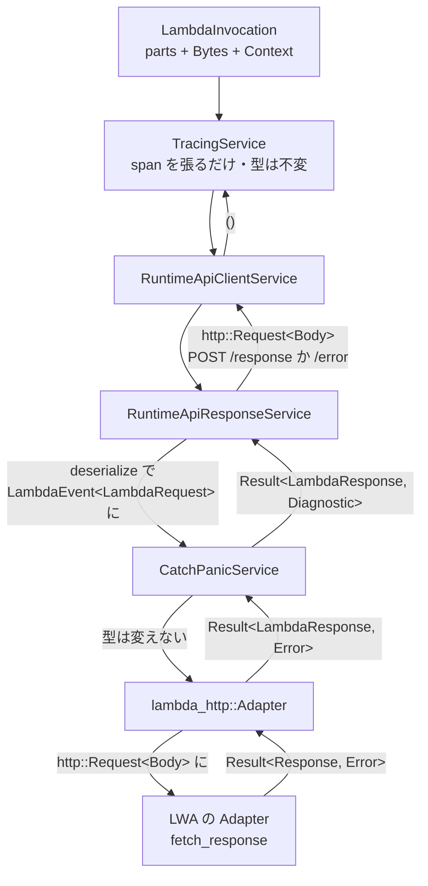

## 何を学んだか

> `tower::Service` と `Layer` そのものに馴染みがない場合は、先に [tower::Service — この章を読むための最小限](../tower-primer/) を読んでほしい。このページはその語彙を前提にする。

LWA が実装している `tower::Service` は 1 個だけだ。

```rust title="src/lib.rs"
impl Service<Request> for Adapter<HttpConnector, Body> {
    type Response = Response<Incoming>;
    type Error = Error;
    type Future = Pin<Box<dyn Future<Output = Result<Self::Response, Self::Error>> + Send>>;

    fn poll_ready(&mut self, _cx: &mut core::task::Context<'_>) -> core::task::Poll<Result<(), Self::Error>> {
        core::task::Poll::Ready(Ok(()))
    }

    fn call(&mut self, event: Request) -> Self::Future {
        let adapter = self.clone();
        Box::pin(async move { adapter.fetch_response(event).await })
    }
}
```

[`src/lib.rs#L1047`](https://github.com/aws/aws-lambda-web-adapter/blob/986113fc66f368f0187a25c683f1ab39a68cc6c6/src/lib.rs#L1047)。`http::Request` を受け取って `http::Response` を返す、それだけ。Runtime API の URL も、`/response` と `/error` の使い分けも、JSON のシリアライズも出てこない。

それらは `lambda_runtime` が用意する **4 枚のミドルウェア**が担当している。このページではその 4 枚を、内側から順に読む。

## ソースコードのどこか

包む処理は [`wrap_handler`](https://github.com/aws/aws-lambda-rust-runtime/blob/6f305bb00f3cc613fd82f88d2f2200e8089e4385/lambda-runtime/src/runtime.rs#L397) にある。長いジェネリクスの後ろで、やっていることは 3 行だ。

```rust title="lambda-runtime/src/runtime.rs"
let safe_service = CatchPanicService::new(handler);
let response_service = RuntimeApiResponseService::new(safe_service);
RuntimeApiClientService::new(response_service, client)
```

そして `lambda_runtime::run()` が外側にもう 1 枚巻く。

```rust title="lambda-runtime/src/lib.rs"
let runtime = Runtime::new(handler).layer(layers::TracingLayer::new());
```

結果としてこうなる。

```
TracingService              ← span を張るだけ
  └ RuntimeApiClientService ← Runtime API に HTTP を送る
      └ RuntimeApiResponseService ← イベントの復号とレスポンスの組み立て
          └ CatchPanicService      ← エラー型を Diagnostic に統一
              └ lambda_http::Adapter ← LambdaRequest ⇄ http::Request の変換
                  └ LWA の Adapter   ← ここだけがアダプタのコード
```

`lambda_http::Adapter` は `lambda_http` 側の変換層で ([`lambda-http/src/lib.rs#L182`](https://github.com/aws/aws-lambda-rust-runtime/blob/6f305bb00f3cc613fd82f88d2f2200e8089e4385/lambda-http/src/lib.rs#L182))、`lambda_runtime` から見ると単なる「ユーザのハンドラ」でしかない。

### 型がどう書き換わるか



外向きの型は `LambdaInvocation` → `()` で、その内側で `LambdaEvent<T>` → `Result<R, Diagnostic>` → `http::Request<Body>` と 3 回書き換わる。

### CatchPanicService — エラー型を Diagnostic に統一する

[`layers/panic.rs#L30`](https://github.com/aws/aws-lambda-rust-runtime/blob/6f305bb00f3cc613fd82f88d2f2200e8089e4385/lambda-runtime/src/layers/panic.rs#L30) の型宣言がこの層の全てを語っている。

```rust title="lambda-runtime/src/layers/panic.rs"
impl<'a, S, Payload> Service<LambdaEvent<Payload>> for CatchPanicService<'a, S>
where
    S: Service<LambdaEvent<Payload>>,
    S::Future: 'a,
    S::Error: Into<Diagnostic> + Debug,
{
    type Error = Diagnostic;
    type Response = S::Response;
```

リクエスト型もレスポンス型も変えない。`S::Error: Into<Diagnostic>` を `Error = Diagnostic` に潰すだけだ。ついでにパニックも捕まえる ([パニックを Diagnostic に変える](../diagnostic-and-panic/))。

この層があるおかげで、LWA は `Error = lambda_http::Error` (= `Box<dyn Error>`) のまま書けている。`Diagnostic` への変換は [`diagnostic.rs#L67`](https://github.com/aws/aws-lambda-rust-runtime/blob/6f305bb00f3cc613fd82f88d2f2200e8089e4385/lambda-runtime/src/diagnostic.rs#L67) の `From<Error>` が担当する。

### RuntimeApiResponseService — 入口と出口の両方を書き換える

この層だけが**入力と出力の両方**を変換する。[`layers/api_response.rs#L105`](https://github.com/aws/aws-lambda-rust-runtime/blob/6f305bb00f3cc613fd82f88d2f2200e8089e4385/lambda-runtime/src/layers/api_response.rs#L105) の `call`:

```rust title="lambda-runtime/src/layers/api_response.rs"
let request_id = req.context.request_id.clone();
let lambda_event = match deserializer::deserialize::<EventPayload>(&req.body, req.context) {
    Ok(lambda_event) => lambda_event,
    Err(err) => match build_event_error_request(&request_id, err) {
        Ok(request) => return RuntimeApiResponseFuture::Ready(Box::new(Some(Ok(request)))),
        Err(err) => {
            error!(error = ?err, "failed to build error response for Lambda Runtime API");
            return RuntimeApiResponseFuture::Ready(Box::new(Some(Err(err))));
        }
    },
};

let fut = self.inner.call(lambda_event);
```

出口は同じファイルの Future 側 [L186](https://github.com/aws/aws-lambda-rust-runtime/blob/6f305bb00f3cc613fd82f88d2f2200e8089e4385/lambda-runtime/src/layers/api_response.rs#L186):

```rust title="lambda-runtime/src/layers/api_response.rs"
RuntimeApiResponseFutureProj::Future(fut, request_id, _) => match ready!(fut.poll(cx)) {
    Ok(ok) => EventCompletionRequest::new(request_id, ok).into_req(),
    Err(err) => EventErrorRequest::new(request_id, err).into_req(),
},
```

**ハンドラの `Err` が `/error` への POST に化けるのはこの 2 行だ。** `Ok` なら `POST /2018-06-01/runtime/invocation/{id}/response`、`Err` なら `POST /2018-06-01/runtime/invocation/{id}/error`。どちらも `http::Request<Body>` という同じ型になって次の層に渡る。

### デシリアライズ失敗はハンドラを呼ばずに /error になる

上の `call` で `deserialize` が失敗した場合、`self.inner.call` には**到達しない**。`build_event_error_request` が直接 `/error` へのリクエストを組み立て、`RuntimeApiResponseFuture::Ready` として即座に返る。

```rust title="lambda-runtime/src/layers/api_response.rs"
fn build_event_error_request<T>(request_id: &str, err: T) -> Result<http::Request<Body>, BoxError>
where
    T: Into<Diagnostic> + Debug,
{
    error!(error = ?err, "Request payload deserialization into LambdaEvent<T> failed. The handler will not be called. Log at TRACE level to see the payload.");
    EventErrorRequest::new(request_id, err).into_req()
}
```

デシリアライザは [`lambda-runtime/src/deserializer.rs`](https://github.com/aws/aws-lambda-rust-runtime/blob/6f305bb00f3cc613fd82f88d2f2200e8089e4385/lambda-runtime/src/deserializer.rs#L35) で、`serde_json` を直接使わず `serde_path_to_error` を噛ませている。

```rust title="lambda-runtime/src/deserializer.rs"
let jd = &mut serde_json::Deserializer::from_slice(body);
serde_path_to_error::deserialize(jd)
    .map(|payload| LambdaEvent::new(payload, context))
    .map_err(|inner| DeserializeError { inner })
```

`Display` 実装が JSON パスを本文に埋め込む。

```rust title="lambda-runtime/src/deserializer.rs"
let path = self.inner.path().to_string();
if path == "." {
    writeln!(f, "{ERROR_CONTEXT}: {}", self.inner)
} else {
    writeln!(f, "{ERROR_CONTEXT}: [{path}] {}", self.inner)
}
```

つまり CloudWatch には `failed to deserialize the incoming data into the function's payload type: [requestContext.http.method] invalid type...` のように、**JSON のどのフィールドで失敗したか**が出る。

### RuntimeApiClientService — 送るだけ

[`layers/api_client.rs#L40`](https://github.com/aws/aws-lambda-rust-runtime/blob/6f305bb00f3cc613fd82f88d2f2200e8089e4385/lambda-runtime/src/layers/api_client.rs#L40):

```rust title="lambda-runtime/src/layers/api_client.rs"
fn call(&mut self, req: LambdaInvocation) -> Self::Future {
    let request_fut = self.inner.call(req);
    let client = self.client.clone();
    RuntimeApiClientFuture::First(request_fut, client)
}
```

Future は 2 段階のステートマシンで、内側が組み立てた `http::Request<Body>` を受け取ったら `client.call` に流し、そのレスポンスを見て `()` を返す。`Response = ()` なのは「この invocation はもう完結した」という意味だ。

非 200 の扱いが独特で、[L97](https://github.com/aws/aws-lambda-rust-runtime/blob/6f305bb00f3cc613fd82f88d2f2200e8089e4385/lambda-runtime/src/layers/api_client.rs#L97) から:

```rust title="lambda-runtime/src/layers/api_client.rs"
// Adding more information on top of 410 Gone, to make it more clear since we cannot access the body of the message
if status == 410 {
    log_or_print!(
        tracing: tracing::error!("Lambda function timeout!"),
        fallback: eprintln!("Lambda function timeout!")
    );
}

// Return Ok to maintain existing contract - runtime continues despite API errors
break Ok(());
```

`/response` を送ったら 410 Gone だった = 送る前に関数がタイムアウトしていた、というケース。ログには出すが `Ok(())` を返してループを続ける。一方、**通信そのものが失敗したら `Err`** で、これはループの終了に直結する。

### TracingService — span を張るだけ

[`layers/trace.rs#L45`](https://github.com/aws/aws-lambda-rust-runtime/blob/6f305bb00f3cc613fd82f88d2f2200e8089e4385/lambda-runtime/src/layers/trace.rs#L45) は `request_span(&req.context)` で `requestId` / `xrayTraceId` / `tenantId` を持つ span を作り、内側の Future をその span で `instrument` する。型は一切変えない。

## なぜそうなっているか

**Runtime API のプロトコルを、型の変換の連鎖として表現している。** 「イベントを取る → 復号する → 処理する → 結果を送る」という手続きを 1 つの関数に書くと、エラー処理の分岐がその関数の中に散らばる。ここでは各段階を別々の `Service` にして、段ごとに「入力の型」と「出力の型」を決めた。その結果、`RuntimeApiResponseService` は「Runtime API に送るべき HTTP リクエストを作る責務」だけを持ち、それを実際に送るのは知らない、という分け方ができている。

**`/response` と `/error` の分岐が 1 箇所に閉じている。** ハンドラの `Result` を見て URI を選ぶのは `RuntimeApiResponseFuture::poll` の 2 行だけで、そこから下流 (`RuntimeApiClientService`) はどちらも同じ `http::Request<Body>` として扱う。「成功と失敗で送り先が変わる」という Runtime API の仕様が、たった 1 つの `match` に収まっている。

**デシリアライズ失敗でハンドラを呼ばないのは、呼びようがないから。** `LambdaEvent<T>` が作れない以上、`T` を要求するハンドラには渡せない。ここで `/error` を返さずに `Err` を返すとループが終わってしまい、実行環境が 1 件の不正イベントで死ぬ。だから「この invocation だけ失敗させる」形にしている。ただし `lambda_http` を使う LWA では `pass_through` フィーチャが有効なので、そもそもデシリアライズがほぼ失敗しない ([イベント JSON をどのイベント型か判別する](../lambda-http-request/))。

**`serde_path_to_error` を使うのは、素の `serde_json` のエラーが行番号・列番号しか出さないから。** イベント JSON は数百行あることも珍しくなく、「line 213 column 8」だけ渡されても何が起きたか分からない。`[requestContext.authorizer.jwt.claims]` のようなパスが出れば原因に直行できる。

**LWA が `Service<Request>` を 1 個実装するだけで済むのは、この 4 枚が全部載っているから。** 逆に言うと、LWA が挟める場所も `Service` の外側だけになる。圧縮を有効にするときの

```rust title="src/lib.rs"
let svc = ServiceBuilder::new().layer(CompressionLayer::new()).service(self);
lambda_http::run_concurrent(svc).await
```

がまさにそれで、`tower_http` のレイヤをそのまま差し込める ([レスポンス圧縮と、ストリーミングと併用できない理由](../compression/))。

## どう活かすか

- **CloudWatch に `failed to deserialize the incoming data into the function's payload type` が出たら、角括弧の中の JSON パスを見る。** そこが `aws_lambda_events` の型定義と実際のイベントがずれている場所になる。
- **`/error` に化けるのはハンドラが `Err` を返したときだけ**であることを押さえておく。LWA でアプリが 500 を返しても、それは正常な `Ok(Response)` として `/response` に送られる。Lambda のエラーメトリクスに出したいなら `AWS_LWA_ERROR_STATUS_CODES` が要る ([ステータスコードを Lambda のエラーに変える](../error-status-codes/))。
- **`Lambda function timeout!` というログは、`/response` を送った時点で既に手遅れだったことを意味する。** 関数タイムアウトを延ばすか、アプリの処理を速くするかの判断材料になる。
- **自前でミドルウェアを足したくなったら、`ServiceBuilder` で `Service<Request>` の外側に巻く。** `Runtime::layer` は `Service<LambdaInvocation>` を要求するので、`http::Request` を扱いたい層はこちら側に置く。
