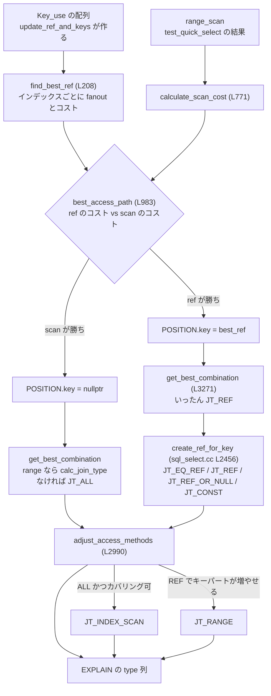

> **前提**: [range 分析](./range-optimizer/) / [統計とコストモデル](./statistics-and-cost-model/)

## 何を学んだか

テーブル 1 枚をどう読むかの決定は [`Optimize_table_order::best_access_path` (`sql/sql_planner.cc#L983`)](https://github.com/mysql/mysql-server/blob/mysql-8.4.11/sql/sql_planner.cc#L983) に集まっている。この関数は join 順序探索から**partial plan の 1 手ごとに**呼ばれるので、`t1 → t2` と `t2 → t1` では同じ `t2` に対して別の答えが出る。「先行テーブルが何行返すか」でコストが変わるからだ。

決定の骨格は 3 段だ。

1. [`find_best_ref` (L208)](https://github.com/mysql/mysql-server/blob/mysql-8.4.11/sql/sql_planner.cc#L208) が、`Key_use` の候補から**最良の ref アクセス**を 1 つ選ぶ
2. [`calculate_scan_cost` (L771)](https://github.com/mysql/mysql-server/blob/mysql-8.4.11/sql/sql_planner.cc#L771) が、**range またはフルスキャン**のコストを出す
3. 両者を比べて `POSITION` に書く

`EXPLAIN` の `type` 列は、この結果と後段の 2 つの調整から決まる。分岐は 3 箇所に散らばっていて、1 箇所を読んでも全体像にならない。



## なぜそうなっているか

**ref とスキャンを別々に見積もって最後に比べるのは、両者の「単位」が違うからだ。** ref のコストは「先行テーブルの 1 行あたり」で、スキャンのコストは「join buffer 1 回あたり」だ。先行行数を掛けるタイミングが違うので、共通のループでは書けない。`(1a)` `(1b)` のガードは、この掛け算をやる前に明らかな勝敗を決めてしまう枝刈りである。

**`type: index` がヒューリスティックなのは、カバリングインデックスの効果をコストモデルが表現しきれないからだ。** コメントアウトされたコードとバグ番号 (BUG#35850、bug #26447) がソースに残っていて、「ディスクバウンドなら速いがキャッシュに載っていると遅くなる」ことが分かったので変更を戻した、と書いてある。コストモデルで正しく表せなかったので、ヒューリスティックのまま残っている。

**ICP が後付けの API なのは、`handler` の境界がもともと「1 行ずつ返す」しか想定していなかったからだ。** SQL 層が条件を持ち、エンジンが行を返す、という分業では、条件を満たさない行も全部 SQL 層まで上がってくる。InnoDB のセカンダリインデックス走査では、それが「主キーで本体を引く」という余分な B+tree 探索になる。`idx_cond_push` は「条件の一部をエンジンに預ける」という穴を境界に開けたもので、`cond_push` (エンジン条件プッシュダウン) と並んで **`handler` API に後から生えた枝**だ ([handler のページ](./handler-walkthrough/))。

**MRR の条件が厳しいのは、ソートのオーバーヘッドが実際に大きいからだ。** 主キーをバッファに溜めてソートしてから読む、という手順は、対象がバッファプールに載っていれば純粋な損である。`mrr_cost_based` の「100MB」「50 行」という数字は、その損益分岐を極めて雑に近似したもので、コスト定数ではなくハードコードされている。

## ソースコードのどこか

### `type` 列の文字列

[`sql/opt_explain.cc#L118`](https://github.com/mysql/mysql-server/blob/mysql-8.4.11/sql/opt_explain.cc#L118) の配列がそのまま出力される。

```cpp title="sql/opt_explain.cc"
const char *join_type_str[] = {
    "UNKNOWN", "system", "const",    "eq_ref",      "ref",        "ALL",
    "range",   "index",  "fulltext", "ref_or_null", "index_merge"};
```

対応する enum は [`sql/sql_opt_exec_shared.h#L186`](https://github.com/mysql/mysql-server/blob/mysql-8.4.11/sql/sql_opt_exec_shared.h#L186) で、コメントが定義そのものだ。

```cpp title="sql/sql_opt_exec_shared.h"
enum join_type {
  /* Initial state. Access type has not yet been decided for the table */
  JT_UNKNOWN,
  /* Table has exactly one row */
  JT_SYSTEM,
  /*
    Table has at most one matching row. Values read
    from this row can be treated as constants. Example:
    "WHERE table.pk = 3"
   */
  JT_CONST,
  /*
    '=' operator is used on unique index. At most one
    row is read for each combination of rows from
    preceding tables
  */
  JT_EQ_REF,
  /*
    '=' operator is used on non-unique index
  */
  JT_REF,
```

**`const` と `eq_ref` の違いは「定数で決まるか、先行テーブルの列で決まるか」だけ**で、どちらも「高々 1 行」である。

### `eq_ref` / `ref` / `ref_or_null` の分岐

`get_best_combination` はいったん全部 `JT_REF` にしておき、実際の分岐は [`create_ref_for_key` (`sql/sql_select.cc#L2456`)](https://github.com/mysql/mysql-server/blob/mysql-8.4.11/sql/sql_select.cc#L2456) の末尾で行われる。

```cpp title="sql/sql_select.cc (L2550-2573)"
  if (j->type() == JT_CONST)
    j->table()->const_table = true;
  else if (((actual_key_flags(keyinfo) & HA_NOSAME) == 0) ||
           ((actual_key_flags(keyinfo) & HA_NULL_PART_KEY) &&
            !null_rejecting_key) ||
           keyparts != actual_key_parts(keyinfo)) {
    /* Must read with repeat */
    j->set_type(null_ref_key ? JT_REF_OR_NULL : JT_REF);
    j->ref().null_ref_key = null_ref_key;
  } else if (keyuse_uses_no_tables &&
             !(table->file->ha_table_flags() & HA_BLOCK_CONST_TABLE)) {
    ...
    j->set_type(JT_CONST);
    j->position()->rows_fetched = 1.0;
  } else {
    j->set_type(JT_EQ_REF);
    j->position()->rows_fetched = 1.0;
  }
```

3 つの条件のどれか 1 つでも成り立てば `ref` になる、と読める。**`eq_ref` になるのは 3 つ全部を否定したときだけ**だ。

| `ref` になる条件                                           | 具体例                                    |
| ---------------------------------------------------------- | ----------------------------------------- |
| インデックスが UNIQUE でない (`HA_NOSAME` が無い)          | 普通のセカンダリインデックス              |
| NULL を含みうるキーパートがあり、述語が NULL を弾かない    | `UNIQUE KEY (nullable_col)`               |
| 使ったキーパート数がインデックスの全キーパート数に満たない | `UNIQUE KEY (a, b)` に対して `a = 1` だけ |

3 つ目の `actual_key_parts(keyinfo)` は [`sql/sql_select.cc#L5466`](https://github.com/mysql/mysql-server/blob/mysql-8.4.11/sql/sql_select.cc#L5466) で、`use_index_extensions` スイッチによって値が変わる。

```cpp title="sql/sql_select.cc"
uint actual_key_parts(const KEY *key_info) {
  return current_thd->optimizer_switch_flag(
             OPTIMIZER_SWITCH_USE_INDEX_EXTENSIONS)
             ? key_info->actual_key_parts
             : key_info->user_defined_key_parts;
}
```

InnoDB のセカンダリインデックスは葉に主キーを持つので、`KEY (a)` は実質 `KEY (a, pk)` として使える。これが index extension で、既定 ON だ ([セカンダリインデックスのページ](./secondary-index/))。**`use_index_extensions=off` にすると `type` 列が変わることがある**のはこの行のためだ。

### `range` / `index_merge`

range 系は [`calc_join_type` (`sql/sql_select.cc#L5480`)](https://github.com/mysql/mysql-server/blob/mysql-8.4.11/sql/sql_select.cc#L5480) が AccessPath の型から引き直す。

```cpp title="sql/sql_select.cc"
join_type calc_join_type(AccessPath *path) {
  switch (path->type) {
    case AccessPath::INDEX_RANGE_SCAN:
    case AccessPath::INDEX_SKIP_SCAN:
    case AccessPath::GROUP_INDEX_SKIP_SCAN:
      return JT_RANGE;
    case AccessPath::INDEX_MERGE:
    case AccessPath::ROWID_INTERSECTION:
    case AccessPath::ROWID_UNION:
      return JT_INDEX_MERGE;
```

**skip scan も loose index scan も `type: range` として表示される。** 区別は `Extra` の `Using index for skip scan` / `Using index for group-by` にしか出ない。

### `index` (フルインデックススキャン)

これは cost-based ではない。[`JOIN::adjust_access_methods` (`sql/sql_optimizer.cc#L2990`)](https://github.com/mysql/mysql-server/blob/mysql-8.4.11/sql/sql_optimizer.cc#L2990) がヒューリスティックで `ALL` を `index` に格上げする。

```cpp title="sql/sql_optimizer.cc (L2996-3025)"
    if (tab->type() == JT_ALL) {
      /*
       It's possible to speedup query by switching from full table scan to
       the scan of covering index, due to less data being read.
       Prerequisites for this are:
       1) Keyread (i.e index only scan) is allowed (table isn't updated/deleted
         from)
       2) Covering indexes are available
       3) This isn't a derived table/materialized view
      */
      if (!tab->table()->no_keyread &&                    //  1
          !tab->table()->covering_keys.is_clear_all() &&  //  2
          !tl->uses_materialization())                    //  3
      {
        ...
        if (tab->position()->sj_strategy != SJ_OPT_LOOSE_SCAN)
          tab->set_index(
              find_shortest_key(tab->table(), &tab->table()->covering_keys));
        tab->set_type(JT_INDEX_SCAN);  // Read with index_first / index_next
```

選ばれるインデックスは「カバリングできるものの中で最短のもの」で、コストは比べない。関数の doc comment も `apply heuristics and optimize access methods` と正直に書いている。同じ関数が `ref` → `range` の格上げもやる (`can_switch_from_ref_to_range`)。**`type: index` を見たら「フルスキャンよりマシと判断された」以上の意味はない。**

### ref とスキャンをどう比べるか

`best_access_path` の中核は、スキャンを検討する前の 4 条件のガードだ ([L1089](https://github.com/mysql/mysql-server/blob/mysql-8.4.11/sql/sql_planner.cc#L1089))。

```cpp title="sql/sql_planner.cc"
  if (rows_fetched < tab->found_records &&  // (1a)
      best_read_cost <= tab->read_time)     // (1b)
  {
    // "scan" means (full) index scan or (full) table scan.
```

`(1a)` は「ref のほうが行数が少ない」、`(1b)` は「ref を 1 回やるコストがスキャン 1 回より安い」。両方成り立てばスキャンは検討すらされず、`chosen: false` / `cause: "cost"` として trace に残る。

`calculate_scan_cost` は「join buffer が何回いっぱいになるか」を掛け算に入れる。

```cpp title="sql/sql_planner.cc (L887)"
      const double buffer_count =
          1.0 + ((double)cache_record_length(join, idx) * prefix_rowcount /
                 (double)thd->variables.join_buff_size);

      scan_and_filter_cost =
          buffer_count *
          (single_scan_read_cost + cost_model->row_evaluate_cost(
                                       tab->records() - *rows_after_filtering));
```

**`join_buffer_size` を大きくするとスキャンのコストが下がり、プランが変わりうる。** 内側テーブルのフルスキャンが選ばれやすくなる方向に効く。

`condition_fanout_filter` が off のときの `found_condition` 分岐も面白い。

```cpp title="sql/sql_planner.cc (L806-814)"
      If there is a filtering condition on the table (i.e. ref
      analyzer found at least one "table.keyXpartY= exprZ", where
      exprZ refers only to tables preceding this table in the join
      order we're now considering), and optimizer condition filtering
      is turned off, then assume that 25% of the rows will be filtered
      out by this condition.
    */

    *rows_after_filtering = tab->found_records * 0.75;
```

**25% という定数がハードコードされている。** しかもコメントは「この推定は正確さのためではなく、`exprZ` に出てくるテーブルを前に置かせるためのヒューリスティックだ」と書いている。

### ICP — `Using index condition`

条件をインデックスの葉で評価してもらう仕組み。押し込みの判断は [`QEP_TAB::push_index_cond` (`sql/sql_select.cc#L2957`)](https://github.com/mysql/mysql-server/blob/mysql-8.4.11/sql/sql_select.cc#L2957) にあり、コメントが 8 条件を列挙している。実際の条件式はこうだ。

```cpp title="sql/sql_select.cc (L3022-3030)"
  if (condition() &&
      tbl->file->index_flags(keyno, 0, true) & HA_DO_INDEX_COND_PUSHDOWN &&
      hint_key_state(join_->thd, table_ref, keyno, ICP_HINT_ENUM,
                     OPTIMIZER_SWITCH_INDEX_CONDITION_PUSHDOWN) &&
      join_->thd->lex->sql_command != SQLCOM_UPDATE_MULTI &&
      join_->thd->lex->sql_command != SQLCOM_DELETE_MULTI &&
      !has_guarded_conds() && type() != JT_CONST && type() != JT_SYSTEM &&
      !(keyno == tbl->s->primary_key &&
        tbl->file->primary_key_is_clustered())) {
```

最後の行が実務で効く。**主キー (クラスタードインデックス) には ICP を押し込まない。** コメントの理由はこうだ。

```cpp title="sql/sql_select.cc"
    6. The index is not a clustered index. The performance improvement
      of pushing an index condition on a clustered key is much lower
      than on a non-clustered key.
```

押し込みは `handler::idx_cond_push` を呼び、InnoDB 側は [`ha_innobase::idx_cond_push` (`ha_innodb.cc#L24026`)](https://github.com/mysql/mysql-server/blob/mysql-8.4.11/storage/innobase/handler/ha_innodb.cc#L24026) でポインタを覚えるだけだ。

```cpp title="storage/innobase/handler/ha_innodb.cc"
class Item *ha_innobase::idx_cond_push(uint keyno, class Item *idx_cond) {
  DBUG_TRACE;
  assert(keyno != MAX_KEY);
  assert(idx_cond != nullptr);

  pushed_idx_cond = idx_cond;
  pushed_idx_cond_keyno = keyno;
  in_range_check_pushed_down = true;
  /* We will evaluate the condition entirely */
  return nullptr;
}
```

`nullptr` を返すのが「全部こちらで評価する」の合図で、SQL 層はその条件を自分の側から取り除く。評価は [`row_search_idx_cond_check` (`row0sel.cc#L3769`)](https://github.com/mysql/mysql-server/blob/mysql-8.4.11/storage/innobase/row/row0sel.cc#L3769) が走査ループの中から呼び、必要な列だけを MySQL 形式に変換してから [`innobase_index_cond` (`ha_innodb.cc#L23750`)](https://github.com/mysql/mysql-server/blob/mysql-8.4.11/storage/innobase/handler/ha_innodb.cc#L23750) に渡す。

```cpp title="storage/innobase/row/row0sel.cc"
  for (i = 0; i < prebuilt->idx_cond_n_cols; i++) {
    const mysql_row_templ_t *templ = &prebuilt->mysql_template[i];
    ...
    if (!row_sel_store_mysql_field(
            mysql_rec, prebuilt, rec, prebuilt->index, prebuilt->index, offsets,
            templ->icp_rec_field_no, templ, ULINT_UNDEFINED, nullptr,
            prebuilt->blob_heap)) {
```

**ICP の効き目は「クラスタードインデックスへの往復を減らすこと」だ。** セカンダリインデックスの葉で条件を落とせれば、主キーで本体を引きに行かずに済む。だからクラスタードインデックス自身には効果が小さい。

`ICP_MATCH` になった行は、その場で残りの列も MySQL 形式に変換される — ただし「セカンダリインデックスで、まだクラスタードを読んでいない」場合は後回しにする。

### MRR — `Using MRR`

Multi-Range Read は「セカンダリインデックスで拾った主キーをソートしてから本体を読む」最適化だ。InnoDB は自前実装を持たず、共通の DS-MRR ([`sql/handler.cc`](https://github.com/mysql/mysql-server/blob/mysql-8.4.11/sql/handler.cc)) に委譲する。

```cpp title="storage/innobase/handler/ha_innodb.cc (L23713)"
int ha_innobase::multi_range_read_init(RANGE_SEQ_IF *seq, void *seq_init_param,
                                       uint n_ranges, uint mode,
                                       HANDLER_BUFFER *buf) {
  m_ds_mrr.init(table);

  return (m_ds_mrr.dsmrr_init(seq, seq_init_param, n_ranges, mode, buf));
}
```

採否は [`DsMrr_impl::choose_mrr_impl` (`sql/handler.cc#L7036`)](https://github.com/mysql/mysql-server/blob/mysql-8.4.11/sql/handler.cc#L7036) で決まる。**除外条件が長い。**

```cpp title="sql/handler.cc"
  if (!(mrr_on || force_dsmrr_by_hints) ||
      *flags & (HA_MRR_INDEX_ONLY | HA_MRR_SORTED) ||  // Unsupported by DS-MRR
      (keyno == table->s->primary_key && h->primary_key_is_clustered()) ||
      key_uses_partial_cols(table, keyno) ||
      table->s->tmp_table != NO_TMP_TABLE) {
    /* Use the default implementation, don't modify args: See comments  */
    return true;
  }
```

さらに `mrr_cost_based` (既定 ON) が入ると閾値が乗る。

```cpp title="sql/handler.cc (L7068-7085)"
  if (thd->optimizer_switch_flag(OPTIMIZER_SWITCH_MRR_COST_BASED) &&
      !force_dsmrr_by_hints) {
    /*
      If the storage engine has a database buffer we use this as the
      minimum size the table should have before considering DS-MRR.
    */
    longlong min_file_size = table->file->get_memory_buffer_size();
    if (min_file_size == -1) {
      // No estimate for database buffer
      min_file_size = 100 * 1024 * 1024;  // 100 MB
    }

    if (table->file->stats.data_file_length <
            static_cast<ulonglong>(min_file_size) ||
        rows <= 50)
      return true;  // Use the default implementation
  }
```

InnoDB では `get_memory_buffer_size()` がバッファプールサイズを返すので、**テーブルのデータサイズがバッファプールより大きく、かつ 50 行超を読むときにしか DS-MRR は検討されない**。

## どう活かすか

### `type` 列の早見表

| `type`        | 決まる場所                                       | 意味                                                         |
| ------------- | ------------------------------------------------ | ------------------------------------------------------------ |
| `system`      | `create_ref_for_key` の前段 (`mark_const_table`) | テーブルが 1 行しかない                                      |
| `const`       | `create_ref_for_key` (L2568)                     | 定数だけで高々 1 行に決まる。最適化中に読まれている          |
| `eq_ref`      | `create_ref_for_key` (L2571)                     | UNIQUE 全キーパート一致。先行行ごとに高々 1 行               |
| `ref`         | `create_ref_for_key` (L2557)                     | 非 UNIQUE、または一部キーパートのみ、または NULL 可          |
| `ref_or_null` | 同上                                             | `col = ? OR col IS NULL`                                     |
| `range`       | `calc_join_type`                                 | range / skip scan / loose index scan                         |
| `index_merge` | `calc_join_type`                                 | index merge / ROR                                            |
| `index`       | `adjust_access_methods` (L3025)                  | カバリングインデックスのフルスキャン。**ヒューリスティック** |
| `ALL`         | `get_best_combination` (L3268)                   | 上のどれも選ばれなかった                                     |

**`ref` が出ているのに遅いとき**は `rows` を見る。`ref` は「等価だが何行返るか分からない」なので、カーディナリティが低い列では大量の行が返る。`eq_ref` に上げたければ、インデックスを UNIQUE にするか、全キーパートを条件に入れるか、`NOT NULL` にする。

**`eq_ref` になるはずが `ref` になる**典型は、UNIQUE インデックスの列が NULL 許容のケースだ。`UNIQUE KEY (email)` で `email` が NULL 可なら、`HA_NULL_PART_KEY` が立って `ref` になる。

### `Using index condition` が出ない 3 パターン

1. **主キーで引いている。** クラスタードインデックスには押し込まない (`push_index_cond` の最後の条件)。`WHERE id = 1 AND status = 'x'` で `Using where` としか出ないのはこれ
2. **`icp` を切っている。** `optimizer_switch` の `index_condition_pushdown`、または `/*+ NO_ICP(t) */`
3. **押し込める条件が無い。** 条件がインデックスに含まれない列だけを参照している。`make_cond_for_index` が空を返すと、そもそも `idx_cond_push` は呼ばれない

`Using index` (カバリング) と `Using index condition` (ICP) は別物である。前者は「本体を読まない」、後者は「本体を読むが読む前に絞る」。同時には出ない。

### `Using MRR` を見たら / 見ないとき

既定設定では **MRR はほとんど出ない**。出るのは次が全部成り立つときだ。

- セカンダリインデックスの range スキャン (主キーではない)
- カバリングインデックスではない (`HA_MRR_INDEX_ONLY` が立っていない)
- 順序が要求されていない (`HA_MRR_SORTED` が立っていない → `ORDER BY` でそのインデックスを使っていない)
- テーブルのデータサイズがバッファプールより大きい
- 読む行数が 50 超

`mrr_cost_based=off` にすると `mrr=on` の限り常に DS-MRR を選ぶようになる。BKA join を使いたい場合も、`batched_key_access` は**既定 off** なうえに MRR に依存するので、両方を明示的に有効にする必要がある ([ヒントと optimizer_switch](./optimizer-hints-and-switches/)、[join の実行](./join-iterators/))。

### 「インデックスがあるのに使われない」の切り分け (アクセスパス編)

[統計](./statistics-and-cost-model/) と [range 分析](./range-optimizer/) を潰した後に残る原因はこのあたりだ。

| 状況                                  | 原因                                         | 確認                                           |
| ------------------------------------- | -------------------------------------------- | ---------------------------------------------- |
| 先頭キーパートに条件が無い            | ref も range も候補にならない                | `find_best_ref` は `found_part & 1` を要求する |
| join 順序が違う                       | 先行テーブルが違えば `Key_use` が使えない    | `STRAIGHT_JOIN` で順序を固定して EXPLAIN       |
| `index` が選ばれてしまう              | `adjust_access_methods` のヒューリスティック | `IGNORE INDEX` でそのインデックスを外して比較  |
| 内側テーブルがフルスキャン            | `join_buffer_size` が大きくスキャンが安い    | `join_buffer_size` を下げて EXPLAIN が変わるか |
| `filtered` が 100.00 で `rows` が多い | condition filtering が効いていない           | ヒストグラム、`condition_fanout_filter`        |

optimizer trace の `considered_access_paths` 配列には、**インデックスごとに `access_type` / `rows` / `cost` / `chosen` / `cause` が並ぶ**。「なぜこのインデックスが負けたか」はここでしか読めない。
