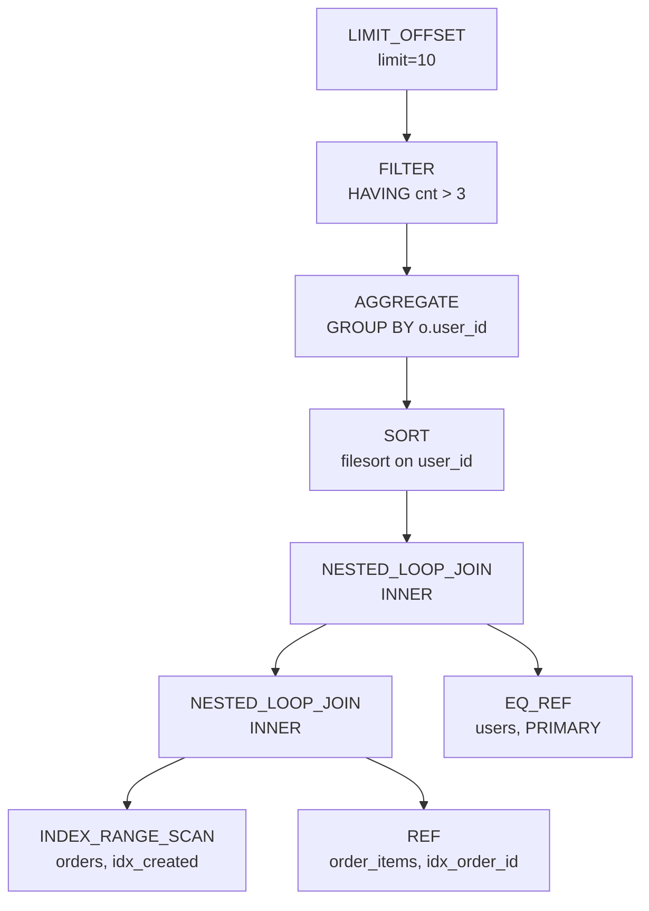

## 何を学んだか

**オプティマイザの出力は `AccessPath` の木という 1 つのデータ構造である。** これがこの章の要になる事実だ。

- 旧オプティマイザ (`JOIN::optimize` → `JOIN::create_access_paths`) も、hypergraph オプティマイザ (`FindBestQueryPlan`) も、出力は同じ `AccessPath *` だ
- エグゼキュータは `AccessPath` からしか iterator を組まない ([`CreateIteratorFromAccessPath`](./executor-walkthrough/))
- `EXPLAIN FORMAT=TREE` と `EXPLAIN ANALYZE` は、この木をそのまま印字している ([EXPLAIN のページ](./explain-analyze-and-tree/))
- セカンダリエンジン (HeatWave) への押し込みも、この木を書き換える形で行われる (`push_to_engines`)

8.0 の途中まで、最適化の結果は `JOIN_TAB` の配列と大量のフラグに散らばっていて、実行は `JOIN::exec` という巨大な手続きが「今どのテーブルを見ているか」をインデックスで持ち回る形だった。それを 1 つの型に固めたのが `AccessPath` で、**「最適化の出力」と「実行の入力」を同じものにした**というのがこの設計の全部である。

型の宣言は [`sql/join_optimizer/access_path.h#L213`](https://github.com/mysql/mysql-server/blob/mysql-8.4.11/sql/join_optimizer/access_path.h#L213)。doc comment が設計意図を明示している。

```cpp title="sql/join_optimizer/access_path.h (L192-211)"
  Access paths are a query planning structure that correspond 1:1 to iterators,
  in that an access path contains pretty much exactly the information
  needed to instantiate given iterator, plus some information that is only
  needed during planning, such as costs.
  ...
  AccessPath objects build on a variant, ie., they can hold an access path of
  any type (table scan, filter, hash join, sort, etc.), although only one at the
  same time. Currently, they contain 32 bytes of base information that is common
  to any access path (type identifier, costs, etc.), and then up to 40 bytes
  that is type-specific (e.g. for a table scan, the TABLE object). It would be
  nice if we could squeeze it down to 64 and fit a cache line exactly, but it
  does not seem to be easy without fairly large contortions.

  We could have solved this by inheritance, but the fixed-size design makes it
  possible to replace an access path when a better one is found, without
  introducing a new allocation, which will be important when using them as a
  planning structure.
```

3 つの設計判断が読み取れる。**iterator と 1:1**、**固定サイズの variant (継承ではない)**、**その場で差し替えられる**。最後のものが hypergraph オプティマイザの都合で、探索中に「より良いパスが見つかったら上書きする」ためにヒープ確保を伴わない構造が要る。

## ソースコードのどこか

### 46 種類のノード

[`AccessPath::Type` (L229-287)](https://github.com/mysql/mysql-server/blob/mysql-8.4.11/sql/join_optimizer/access_path.h#L229) は 5 つのグループに分かれている。数えると **46 種類**ある。

```cpp title="sql/join_optimizer/access_path.h (L229)"
  enum Type : uint8_t {
    // Basic access paths (those with no children, at least nominally).
    // NOTE: When adding more paths to this section, also update GetBasicTable()
    // to handle them.
    TABLE_SCAN,
    SAMPLE_SCAN,
    INDEX_SCAN,
    INDEX_DISTANCE_SCAN,
    REF,
    REF_OR_NULL,
    EQ_REF,
    PUSHED_JOIN_REF,
    FULL_TEXT_SEARCH,
    CONST_TABLE,
    MRR,
    FOLLOW_TAIL,
    INDEX_RANGE_SCAN,
    INDEX_MERGE,
    ROWID_INTERSECTION,
    ROWID_UNION,
    INDEX_SKIP_SCAN,
    GROUP_INDEX_SKIP_SCAN,
    DYNAMIC_INDEX_RANGE_SCAN,
```

| グループ                    | 種類数 | 中身                                                                                                                                                                                                                                                        |
| --------------------------- | ------ | ----------------------------------------------------------------------------------------------------------------------------------------------------------------------------------------------------------------------------------------------------------- |
| 基本 (テーブルに対応)       | 19     | `TABLE_SCAN` 〜 `DYNAMIC_INDEX_RANGE_SCAN`                                                                                                                                                                                                                  |
| 基本 (テーブルに対応しない) | 6      | `TABLE_VALUE_CONSTRUCTOR`、`FAKE_SINGLE_ROW`、`ZERO_ROWS`、`ZERO_ROWS_AGGREGATED`、`MATERIALIZED_TABLE_FUNCTION`、`UNQUALIFIED_COUNT`                                                                                                                       |
| join                        | 4      | `NESTED_LOOP_JOIN`、`NESTED_LOOP_SEMIJOIN_WITH_DUPLICATE_REMOVAL`、`BKA_JOIN`、`HASH_JOIN`                                                                                                                                                                  |
| 合成                        | 15     | `FILTER`、`SORT`、`AGGREGATE`、`TEMPTABLE_AGGREGATE`、`LIMIT_OFFSET`、`STREAM`、`MATERIALIZE`、`MATERIALIZE_INFORMATION_SCHEMA_TABLE`、`APPEND`、`WINDOW`、`WEEDOUT`、`REMOVE_DUPLICATES`、`REMOVE_DUPLICATES_ON_INDEX`、`ALTERNATIVE`、`CACHE_INVALIDATOR` |
| 更新系                      | 2      | `DELETE_ROWS`、`UPDATE_ROWS`                                                                                                                                                                                                                                |

前の 3 ページで見た概念がそのままノードになっている。

- `REF` / `REF_OR_NULL` / `EQ_REF` — [アクセスパスの選択](./access-path-selection/) の `type` 列
- `INDEX_RANGE_SCAN` / `INDEX_MERGE` / `ROWID_INTERSECTION` / `ROWID_UNION` / `INDEX_SKIP_SCAN` / `GROUP_INDEX_SKIP_SCAN` — [range 分析](./range-optimizer/) の 6 候補
- `WEEDOUT` / `NESTED_LOOP_SEMIJOIN_WITH_DUPLICATE_REMOVAL` — [サブクエリ](./subquery-transformations/) の semijoin 戦略
- `SORT` — [ORDER BY](./sort-avoidance-and-ordering/) で回避できなかったときの filesort

**`ZERO_ROWS` があるのが設計として重要だ。** `Impossible WHERE` のときも「0 行を返すプラン」を作る ([JOIN::optimize のページ](./optimizer-walkthrough/))。エグゼキュータ側に「プランが無い」という特殊ケースを作らない。

### 共通部分と型固有部分

`AccessPath` の共通フィールドは 32 バイトに収められている。プランナが型を問わずに読むものだけがここに入る。

```cpp title="sql/join_optimizer/access_path.h (L387-397)"
  double cost() const { return m_cost; }

  double init_cost() const { return m_init_cost; }

  double init_once_cost() const { return m_init_once_cost; }

  double cost_before_filter() const { return m_cost_before_filter; }

  void set_cost(double val) {
    assert(val >= 0.0 || val == kUnknownCost);
    m_cost = val;
  }
```

コストが 4 種類あるのは、**「1 行目を返すまでのコスト」と「全部返すコスト」を分けている**からだ。`LIMIT` があるとこの区別が効く。`init_once_cost` は「複数回スキャンされても初回だけ払うコスト」で、マテリアライズがこれに当たる。

型固有部分は無名 union になっている ([L933](https://github.com/mysql/mysql-server/blob/mysql-8.4.11/sql/join_optimizer/access_path.h#L933))。

```cpp title="sql/join_optimizer/access_path.h (L927-948)"
  // We'd prefer if this could be an std::variant, but we don't have C++17 yet.
  // It is private to force all access to be through the type-checking
  // accessors.
  //
  // For information about the meaning of each value, see the corresponding
  // row iterator constructors.
  union {
    struct {
      TABLE *table;
    } table_scan;
    struct {
      TABLE *table;
      double sampling_percentage;
      enum tablesample_type sampling_type;
    } sample_scan;
    struct {
      TABLE *table;
      int idx;
      bool use_order;
      bool reverse;
    } index_scan;
```

union は private で、アクセスは型チェック付きの accessor 経由に限定される ([L521](https://github.com/mysql/mysql-server/blob/mysql-8.4.11/sql/join_optimizer/access_path.h#L521))。

```cpp title="sql/join_optimizer/access_path.h"
  // Accessors for the union below.
  auto &table_scan() {
    assert(type == TABLE_SCAN);
    return u.table_scan;
  }
```

**`type` と union のメンバの対応は assert でしか守られていない。** debug ビルドでのみ検出される。46 種すべてに 2 つ (const / 非 const) ずつ accessor があるので、この宣言だけで数百行になる。

コメントが `For information about the meaning of each value, see the corresponding row iterator constructors` と言っているのが、1:1 対応の証拠だ。**フィールドの意味を知りたければ iterator のコンストラクタを読め**、という指示になっている。

### 木を組み立てる — 旧オプティマイザ側

[`JOIN::create_access_paths` (`sql/sql_executor.cc#L3043`)](https://github.com/mysql/mysql-server/blob/mysql-8.4.11/sql/sql_executor.cc#L3043) は驚くほど短い。

```cpp title="sql/sql_executor.cc"
void JOIN::create_access_paths() {
  assert(m_root_access_path == nullptr);

  AccessPath *path = create_root_access_path_for_join();
  path = attach_access_paths_for_having_and_limit(path);
  path = attach_access_path_for_update_or_delete(path);

  m_root_access_path = path;
}
```

**外側に向かって包んでいく**構造がそのまま出ている。join の木を作り、その上に HAVING の FILTER と LIMIT_OFFSET を被せ、UPDATE / DELETE ならさらに被せる。

[`create_root_access_path_for_join` (L3072)](https://github.com/mysql/mysql-server/blob/mysql-8.4.11/sql/sql_executor.cc#L3072) が本体で、4 通りに分岐する。

```cpp title="sql/sql_executor.cc"
AccessPath *JOIN::create_root_access_path_for_join() {
  if (select_count) {
    return NewUnqualifiedCountAccessPath(thd);
  }

  // OK, so we're good. Go through the tables and make the join access paths.
  AccessPath *path = nullptr;
  if (query_block->is_table_value_constructor) {
    ...
  } else if (const_tables == primary_tables) {
    // Only const tables, so add a fake single row to join in all
    // the const tables (only inner-joined tables are promoted to
    // const tables in the optimizer).
    path = NewFakeSingleRowAccessPath(thd, /*count_examined_rows=*/true);
    ...
  } else {
    ...
    path = ConnectJoins(
```

`const_tables == primary_tables` の枝が面白い。**全部が const table なら、木の葉は `FAKE_SINGLE_ROW` ただ 1 つになる。** const table は最適化中に読まれて値が定数化されているので、実行時に読むものが何もない。EXPLAIN で `type: const` の行しか出ないクエリは、実行時にはこの 1 ノードの木を回している。

`ConnectJoins` が `QEP_TAB` の配列を左深 (left-deep) の join 木に変換する。旧オプティマイザは bushy plan を作らないので、join の木は必ず左に伸びる。



左深なので、`NESTED_LOOP_JOIN` の左の子がさらに `NESTED_LOOP_JOIN`、右の子は必ず単一テーブルのパスになる。

### 木を組み立てる — hypergraph 側

hypergraph オプティマイザは `QEP_TAB` を経由しない。`CostingReceiver` が探索中に直接 `AccessPath` を作り、`FindBestQueryPlan` がその根を返す ([hypergraph のページ](./hypergraph-optimizer/))。

```cpp title="sql/sql_optimizer.cc (L664)"
    m_root_access_path = FindBestQueryPlan(thd, query_block);
    if (finalize_access_paths && m_root_access_path != nullptr) {
      if (FinalizePlanForQueryBlock(thd, query_block)) {
        return true;
      }
    }
```

**代入先が同じ `m_root_access_path` である**ことが、この設計の全部だ。ここから先のコードは、どちらのオプティマイザが作った木かを知らない。

hypergraph は bushy plan を作れるので、`HASH_JOIN` の両側が join になることがある。木の形は違うが、**型は同じ**である。

### 実行への引き渡し

`Query_expression::optimize` が `create_iterators=true` で呼ばれると、その場で iterator に変換される。

```
JOIN::optimize
  → m_root_access_path (AccessPath の木)
Query_expression::create_iterators
  → CreateIteratorFromAccessPath (sql/join_optimizer/access_path.cc#L488)
    → m_root_iterator (RowIterator の木)
Query_expression::ExecuteIteratorQuery
  → m_root_iterator->Read() のループ
```

変換は 46 種の `switch` 1 本で、`AccessPath::Type` ごとに対応する `RowIterator` を `new` する。ノードに `iterator` フィールドがあり、生成された iterator へのポインタを覚えている。

```cpp title="sql/join_optimizer/access_path.h (L381-385)"
  /// If an iterator has been instantiated for this access path, points to the
  /// iterator. Used for constructing iterators that need to talk to each other
  /// (e.g. for recursive CTEs, or BKA join), and also for locating timing
  /// information in EXPLAIN ANALYZE queries.
  RowIterator *iterator = nullptr;
```

**`EXPLAIN ANALYZE` の実測値は、このポインタを辿って AccessPath 側から回収される。** 木を印字しながら、各ノードに対応する `TimingIterator` の計測値を引く、という作り方ができるのは 1:1 対応のおかげだ。詳細は [エグゼキュータのページ](./executor-walkthrough/) と [EXPLAIN ANALYZE のページ](./explain-analyze-and-tree/)。

### プランナ専用のフィールド

iterator には要らないが探索には要る情報も、同じ構造体に同居している。

```cpp title="sql/join_optimizer/access_path.h (L317-321)"
  /// Whether this access path counts as one that scans a base table,
  /// and thus should be counted towards examined_rows. It can sometimes
  /// seem a bit arbitrary which iterators count towards examined_rows
  /// and which ones do not, so the only canonical reference is the tests.
  bool count_examined_rows : 1;
```

`Rows_examined` の値が「どのイテレータが数えるか」で決まり、その基準が**テストしか正典が無い**と書いてある。`slow_query_log` の `Rows_examined` を精密に読もうとすると、この曖昧さに当たる。

`safe_for_rowid` (`SAFE` / `SAFE_IF_SCANNED_ONCE` / `UNSAFE`) は、ソート用に行 ID を取れるかを表す。マテリアライズし直される派生表は `SAFE_IF_SCANNED_ONCE` で、これは [filesort](./filesort/) が rowid ソートを選べるかに効く。

`immediate_update_delete_table` は UPDATE / DELETE で「読みながらその場で更新できるテーブル」の索引で、コメントが 40 行ほど「なぜハッシュ join ではできないのか」を説明している。

## なぜそうなっているか

**継承ではなく固定サイズの variant にしたのは、探索中に上書きしたいからだ。** hypergraph オプティマイザは同じ部分問題に対して何十ものアクセスパスを作り、Pareto フロンティア上のものだけ残す。継承ベースだと「良いものが見つかったから差し替える」たびにヒープ確保と解放が要る。固定サイズなら `*path = better_path;` で済む。doc comment がこの理由を明記している。

**iterator と 1:1 にしたのは、変換を機械的にするためだ。** もし AccessPath が「論理的な操作」を表していたら、iterator への変換に判断が入り、EXPLAIN の出力と実際の実行がずれうる。1:1 なら変換は `switch` の羅列になり、**EXPLAIN FORMAT=TREE が印字した木が実行される木そのもの**になる。`EXPLAIN` が信用できるのはこの性質による。

**2 つのオプティマイザが同じ型を出すことにしたのは、エグゼキュータを 1 つに保つためだ。** hypergraph オプティマイザは join 順序探索を全面的に書き換えたが、実行側は 1 行も変えていない。`JOIN::optimize` の中の 1 箇所の分岐と、`m_root_access_path` への代入だけで共存できている。新しいオプティマイザを production に入れる前に、実行側で先に検証できる、という順序の恩恵もある。

**union のアクセスを accessor に限定したのは、`type` との整合を型で守れないからだ。** C++17 の `std::variant` があれば型で守れたが、当時使えなかった。次善策として「assert 付きの accessor 経由に限る」を選び、コメントで `It is private to force all access to be through the type-checking accessors` と宣言している。

## どう活かすか

### `EXPLAIN FORMAT=TREE` を第一の道具にする

`EXPLAIN` の表形式は `JOIN_TAB` 時代の名残で、木構造を行の並びに潰している。`FORMAT=TREE` は `AccessPath` の木をそのまま印字するので、**入れ子の関係が見える**。

```
-> Limit: 10 row(s)
    -> Filter: (count(0) > 3)
        -> Group aggregate: count(0)
            -> Sort: o.user_id
                -> Nested loop inner join
                    -> Nested loop inner join
                        -> Index range scan on o using idx_created
                        -> Index lookup on oi using idx_order_id
                    -> Single-row index lookup on u using PRIMARY
```

各行が 1 つの `AccessPath` ノードに対応する。表形式では読み取れない次のことが分かる。

- **どこで一時表ができるか** (`Table scan on <temporary>`、`Materialize`)
- **どこでソートが入るか** (`Sort:`) と、それが集約の前か後か
- **join の入れ子の向き** (どちらが外側のループか)
- **フィルタがどの段で適用されるか** (`Filter:` の位置)

8.4 では `EXPLAIN FORMAT=TREE` が `INTO` 句と組み合わせられるようになり、`EXPLAIN ANALYZE` は実測値を同じ木に重ねて出す。

### ノード名から章のどのページに戻るかを引く

`FORMAT=TREE` に出る名前は、`AccessPath::Type` とだいたい対応する。

| TREE の表示                                  | `AccessPath::Type`                          | 読むページ                                                           |
| -------------------------------------------- | ------------------------------------------- | -------------------------------------------------------------------- |
| `Table scan on t`                            | `TABLE_SCAN`                                | [アクセスパスの選択](./access-path-selection/)                       |
| `Index lookup on t using i`                  | `REF`                                       | 同上                                                                 |
| `Single-row index lookup`                    | `EQ_REF`                                    | 同上                                                                 |
| `Index range scan on t using i`              | `INDEX_RANGE_SCAN`                          | [range 分析](./range-optimizer/)                                     |
| `Index skip scan` / `Group index skip scan`  | `INDEX_SKIP_SCAN` / `GROUP_INDEX_SKIP_SCAN` | 同上                                                                 |
| `Sort:`                                      | `SORT`                                      | [ORDER BY](./sort-avoidance-and-ordering/) / [filesort](./filesort/) |
| `Inner hash join`                            | `HASH_JOIN`                                 | [join の実行](./join-iterators/)                                     |
| `Nested loop inner join`                     | `NESTED_LOOP_JOIN`                          | 同上                                                                 |
| `Remove duplicates from input sorted on ...` | `REMOVE_DUPLICATES`                         | [集約・ウィンドウ](./aggregation-window-and-set-ops/)                |
| `Materialize`                                | `MATERIALIZE`                               | [内部一時表](./materialization-and-temptable/)                       |
| `Stream results`                             | `STREAM`                                    | [行の返送](./sending-rows-and-limit/)                                |
| `Limit: N row(s)`                            | `LIMIT_OFFSET`                              | 同上                                                                 |
| `Zero rows (...)`                            | `ZERO_ROWS`                                 | [JOIN::optimize](./optimizer-walkthrough/)                           |

`Zero rows (Impossible WHERE)` が出ていたら、それは最適化フェーズで結論が出ていて、テーブルには一切触っていないということだ。

### コストの 2 種類を読み分ける

`EXPLAIN FORMAT=TREE` は各ノードに `(cost=X rows=Y)` を出し、`init_cost` があるノードでは `(cost=A..B rows=Y)` の形になる。前が「最初の 1 行まで」、後が「全部」だ。

- **`SORT` や `MATERIALIZE` は前の値が大きい。** 全部読み終えるまで 1 行も出せないので、`LIMIT` があっても早期終了できない
- **`NESTED_LOOP_JOIN` は前の値が小さい。** 1 行目はすぐ出る

`LIMIT` 付きのクエリが遅いとき、木の中に `SORT` や `MATERIALIZE` が挟まっていないかを見る。挟まっていれば `LIMIT` の早期終了は効いていない ([行の返送のページ](./sending-rows-and-limit/))。

### `Rows_examined` を精密に読まない

`count_examined_rows` のコメントが認めているとおり、どのノードが `examined_rows` を数えるかは「やや恣意的」で、正典はテストしかない。`slow_query_log` の `Rows_examined` は**桁の目安**として使い、正確な行数が要るなら `EXPLAIN ANALYZE` の `actual rows` を見る。
