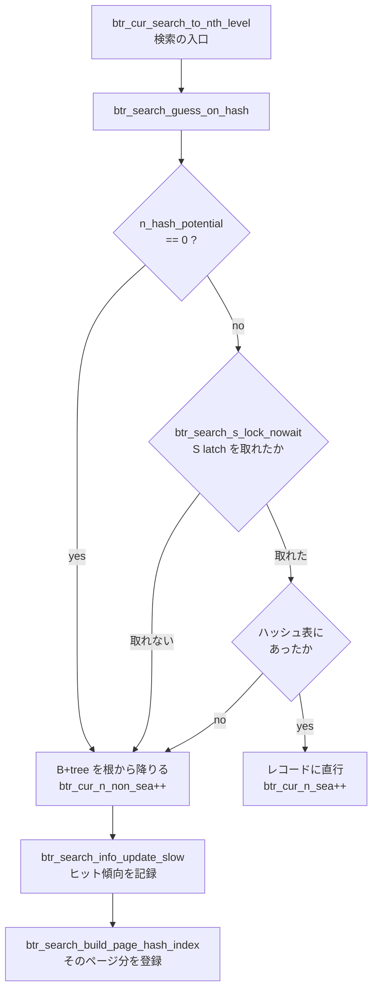

> **前提**: [B+tree の操作](./btree-operations/) / [バッファプール](./buffer-pool-walkthrough/)

## 何を学んだか

`WHERE id = ?` で 1 行引くたびに、InnoDB は B+tree の根から葉まで降りる。深さ 3 なら 3 枚のページを `buf_page_get_gen` し、各ページで二分探索する。**同じ形の検索が何万回も繰り返されるなら、この降下は毎回同じ道をたどるだけの無駄になる。**

adaptive hash index (AHI) は、そこにハッシュ表を挿す。キーは「インデックスの先頭 n 列 (+ m バイト) のハッシュ値」、値は**レコードそのものへのポインタ**だ。当たれば B+tree に触らずに葉のレコードに直行する。

「adaptive」なのは、**どのインデックスのどの前置でハッシュを作るかを InnoDB が実行時に決める**からだ。ユーザは何も指定しないし、指定もできない。作るかどうかの判断はページごとに行われ、ヒット率が落ちれば捨てられる。

そして 2 つの落とし穴がある。

**1 つめ。8.4 では既定で無効になっている。**

```cpp title="storage/innobase/handler/ha_innodb.cc (L22472)"
static MYSQL_SYSVAR_BOOL(
    adaptive_hash_index, srv_btr_search_enabled, PLUGIN_VAR_OPCMDARG,
    "Enable InnoDB adaptive hash index (enabled by default). "
    " Disable with --skip-innodb-adaptive-hash-index.",
    nullptr, innodb_adaptive_hash_index_update, false);
```

`MYSQL_SYSVAR_BOOL` の最後の引数が既定値なので、**既定は `false`** だ。**ヘルプ文だけが `enabled by default` のまま取り残されている。** 実際の既定は sysvar のテストの期待値にも出ている。

```text title="mysql-test/suite/sys_vars/r/innodb_adaptive_hash_index_basic.result"
SET @start_global_value = @@global.innodb_adaptive_hash_index;
SELECT @start_global_value;
@start_global_value
0
```

[change buffer](./change-buffer/) と同じく、**8.4 は「効くケースが狭く、複雑さが高い最適化」の既定を軒並み反転させている**。

**2 つめ。8 分割されているが、分割の単位はインデックスであってページではない。**

```cpp title="storage/innobase/btr/btr0sea.cc (L73)"
/** Number of adaptive hash index partition. */
ulong btr_ahi_parts = 8;
ut::fast_modulo_t btr_ahi_parts_fast_modulo(8);
```

分割キーは [`btr0sea.ic#L143`](https://github.com/mysql/mysql-server/blob/mysql-8.4.11/storage/innobase/include/btr0sea.ic#L143) で計算される。

```cpp title="storage/innobase/include/btr0sea.ic"
static inline size_t btr_search_hash_index_id(const dict_index_t *index) {
  return ut::hash_uint64_pair(index->space, index->id);
}

static inline btr_search_sys_t::search_part_t &btr_get_search_part(
    const dict_index_t *index) {
  ut_ad(index != nullptr);

  const auto index_slot =
      btr_search_hash_index_id(index) % btr_ahi_parts_fast_modulo;

  return btr_search_sys->parts[index_slot];
}
```

**`(space_id, index_id)` のハッシュ**なので、1 本のインデックスに属する全ページが 1 つのパーティション、つまり 1 本の rw-latch に集中する。**`innodb_adaptive_hash_index_parts` を 8 から 64 に上げても、ホットなインデックスが 1 本しかない系では競合はまったく分散しない。** これが「AHI の latch 競合」が起きるときの構造的な理由だ。



## なぜそうなっているか

**AHI は「B+tree の探索コストが支配的で、latch 競合が軽い」時代の最適化だ。** 1 コアで数百の接続を捌いていた頃、深さ 3 の降下を 1 回のハッシュ引きにできれば、CPU 時間はまとまって減った。競合するスレッドが数本しかいなければ、共有ハッシュ表の latch はほとんどタダだった。

**コア数が増えると前提が逆転する。** 64 コアで 500 接続が同じテーブルの同じインデックスを引くと、`btr_search_guess_on_hash` が取る S latch と、`btr_search_build_page_hash_index` / `btr_search_drop_page_hash_index` が取る X latch が同じ 1 本に集まる。**B+tree の探索は葉ページの latch まで分散しているのに、AHI はインデックス単位でしか分散していない。** 探索を速くするために、より粗い共有資源を新たに作ってしまっている。

8.0 で `btr_ahi_parts` (既定 8) が導入されたのは、この競合を割るためだった。しかし割り方が `(space_id, index_id)` のハッシュなので、**「1 本のホットなインデックス」という最も典型的な形には効かない**。効くのは「複数の別々のテーブルが同時に熱い」ケースだけだ。

**`nowait` で諦める設計は、この構造への現実的な回答である。** 待たないので latch が pathological な待ち行列にはならない。だが「諦めた分は B+tree を降りる」ので、AHI が有効なのに実質使われていない、という状態が普通に起きる。

**そして 8.4 は既定を OFF にした。** change buffer と同じ判断だ。効くワークロードは今も存在する (読み専用に近い、同じ前置の等値検索が支配的、更新が少ない) が、既定にするには当たり外れが大きすぎる。無効ならコードは 1 行も実行されず、`btr_search_drop_page_hash_index` は `block->ahi.index == nullptr` で即 return する。

## ソースコードのどこか

### 引く側 — 待たない

[`btr_search_guess_on_hash` (`btr0sea.cc#L812`)](https://github.com/mysql/mysql-server/blob/mysql-8.4.11/storage/innobase/btr/btr0sea.cc#L812) が引く側の全部だ。冒頭で 3 回ふるいにかける。

```cpp title="storage/innobase/btr/btr0sea.cc"
  if (!btr_search_enabled) {
    return false;
  }
  ...
  if (info->n_hash_potential == 0) {
    return false;
  }

  const auto prefix_info = info->prefix_info.load();

  cursor->ahi.prefix_info = prefix_info;

  if (dtuple_get_n_fields(tuple) < btr_search_get_n_fields(cursor)) {
    return false;
  }
```

そして latch を取るところが、この機構の性格を決めている ([L861](https://github.com/mysql/mysql-server/blob/mysql-8.4.11/storage/innobase/btr/btr0sea.cc#L861))。

```cpp title="storage/innobase/btr/btr0sea.cc"
  if (!has_search_latch) {
    if (!btr_search_s_lock_nowait(index, UT_LOCATION_HERE)) {
      return false;
    }
  }
```

**`nowait` で取れなければ即座に諦めて B+tree に戻る。** AHI は「速いかもしれない近道」であって、待ってまで使う価値のあるものではない、という設計だ。

これが重要な帰結を生む。**latch が混んでいるとき、AHI は静かに機能を止める。** ヒット率は落ちるが、待ち時間は増えない。それでも遅くなるのは、**書き込み側 (登録・削除) が X latch を取って待つから**で、読み側だけを見ていると原因が見えない。

引いた後も無条件に信じない。`ha_search_and_get_data` が返したポインタに対して、ブロックの状態とレコードの内容を検証し、外れていたら `BTR_CUR_HASH_FAIL` として B+tree に落ちる。ハッシュ衝突とページ境界の取り違えがありうることを、コメントが明記している。

```cpp title="storage/innobase/btr/btr0sea.cc (L585)"
/** Updates a hash node reference when it has been unsuccessfully used in a
search which could have succeeded with the used hash parameters. This can
happen because when building a hash index for a page, we do not check
what happens at page boundaries, and therefore there can be misleading
hash nodes. Also, collisions in the hash value can lead to misleading
references. This function lazily fixes these imperfections in the hash
index.
```

### 作る側 — 2 つの閾値

登録するかどうかは [`btr_search_update_block_hash_info` (`btr0sea.cc#L528`)](https://github.com/mysql/mysql-server/blob/mysql-8.4.11/storage/innobase/btr/btr0sea.cc#L528) が決める。閾値は 2 つで、どちらも定数だ ([L90](https://github.com/mysql/mysql-server/blob/mysql-8.4.11/storage/innobase/btr/btr0sea.cc#L90))。

```cpp title="storage/innobase/btr/btr0sea.cc"
/** If the number of records on the page divided by this parameter
would have been successfully accessed using a hash index, the index
is then built on the page, assuming the global limit has been reached */
constexpr uint32_t BTR_SEARCH_PAGE_BUILD_LIMIT = 16;

/** The global limit for consecutive potentially successful hash searches,
before hash index building is started */
constexpr uint32_t BTR_SEARCH_BUILD_LIMIT = 100;
```

判定はこうなる。

```cpp title="storage/innobase/btr/btr0sea.cc"
  if (info->n_hash_potential >= BTR_SEARCH_BUILD_LIMIT &&
      block->n_hash_helps >
          page_get_n_recs(block->frame) / BTR_SEARCH_PAGE_BUILD_LIMIT) {
```

言葉にすると、**「そのインデックスで同じ前置の検索が 100 回連続で成功しそうだった」かつ「そのページが (レコード数 / 16) 回以上役に立った」**とき、そのページ 1 枚分のレコードをハッシュ表に登録する。設定変数は無い。ハードコードされた 100 と 16 が全部だ。

「同じ前置」というのが `prefix_info` で、**先頭 n 列と、その次の列の m バイト**という粒度を持つ。同じインデックスでも `WHERE a = ?` ばかり来ていれば 1 列分、`WHERE a = ? AND b = ?` ばかりなら 2 列分のハッシュになる。**アクセスパターンが混ざっていると、`prefix_info` が一致せず `n_hash_potential` が伸びない。**

登録は `btr_search_build_page_hash_index` ([L1412](https://github.com/mysql/mysql-server/blob/mysql-8.4.11/storage/innobase/btr/btr0sea.cc#L1412)) で、そのページの全レコードを 1 度に入れる。X latch を取る。

### 捨てる側 — B+tree のほぼ全操作から呼ばれる

[`btr_search_drop_page_hash_index` (`btr0sea.cc#L1013`)](https://github.com/mysql/mysql-server/blob/mysql-8.4.11/storage/innobase/btr/btr0sea.cc#L1013) の頭に付いている 40 行のコメントが、この機構の維持コストを一望させる。

```cpp title="storage/innobase/btr/btr0sea.cc"
    /* Is it safe to dereference the index here?
    If this method is called from a method that uses reference to the index, or
    a cursor on that index, it should not be freed until they finish. Such
    methods are:
    - btr_free_root,
    - btr_page_reorganize_low,
    - btr_page_empty,
    - btr_lift_page_up,
    - btr_compress,
    - btr_discard_only_page_on_level,
    - btr_discard_page,
    - btr_search_update_hash_on_move, which in turn is called from:
      - btr_root_raise_and_insert
      - btr_page_split_and_insert
```

**ページの分割・併合・再編成・破棄、そしてバッファプールからの追い出し。B+tree を構造的に触る操作はほぼ全部、AHI のエントリを外しに行く。** しかもそれぞれについて「その時点でインデックスが free されていないと言える根拠」を個別に説明する必要がある。40 行のコメントは、この不変条件を人間が保守しなければならないことの記録だ。

**AHI が効かない状況で払うコストは、これらの `drop` である。** 読みが偏っていなくて登録されないなら `drop` も走らないが、登録された直後に更新でページが分割されるようなワークロードでは、登録と破棄を往復するだけになる。

### 切るとき — 全パーティションを X latch する

`innodb_adaptive_hash_index = OFF` を実行時に打つと、[`btr_search_disable` (`btr0sea.cc#L314`)](https://github.com/mysql/mysql-server/blob/mysql-8.4.11/storage/innobase/btr/btr0sea.cc#L314) が走る。

```cpp title="storage/innobase/btr/btr0sea.cc"
  btr_search_x_lock_all(UT_LOCATION_HERE);

  ut_a(btr_search_enabled);

  btr_search_enabled = false;
  btr_search_x_unlock_all();

  /* Clear AHI info for all non-private blocks from Buffer Pool. */
  buf_pool_clear_hash_index();

  dict_sys_mutex_enter();
  ...
  for (auto table : dict_sys->table_LRU) {
    btr_search_await_no_reference(table);
  }
```

**全パーティションの X latch → バッファプール全走査 → データディクショナリの全テーブルについて参照が 0 になるまで待つ**、という重い処理だ。フラグを落とすところは一瞬だが、後片付けが長い。

`btr_search_enabled` のコメントが、フラグの意味を厳密に説明している ([L58](https://github.com/mysql/mysql-server/blob/mysql-8.4.11/storage/innobase/btr/btr0sea.cc#L58))。

```cpp title="storage/innobase/btr/btr0sea.cc"
/** Flag storing if the search system is in enabled state. While it is false,
the AHI data structures can't have new entries added, they can only be
removed. It is changed to false while having all AHI latches X-latched, so any
section that adds entries to AHI data structures must have at least one S-latch.
All changes to this flag are protected by the btr_search_enable_mutex. */
std::atomic_bool btr_search_enabled = true;
```

**「false の間は追加できないが削除はできる」**という非対称な状態が定義されている。これは無効化中も既存エントリの掃除が進むようにするためだ。

## どう活かすか

### `SHOW ENGINE INNODB STATUS` のこのセクションを読む

[`srv0srv.cc#L1441`](https://github.com/mysql/mysql-server/blob/mysql-8.4.11/storage/innobase/srv/srv0srv.cc#L1441) が印字する。change buffer と同じセクションに同居している。

```
-------------------------------------
INSERT BUFFER AND ADAPTIVE HASH INDEX
-------------------------------------
Ibuf: size 1, free list len 0, seg size 2, 0 merges
merged operations:
 insert 0, delete mark 0, delete 0
discarded operations:
 insert 0, delete mark 0, delete 0
Hash table size 34673, node heap has 0 buffer(s)
（同じ行が btr_ahi_parts の数だけ繰り返される）
0.00 hash searches/s, 1130.55 non-hash searches/s
```

読み方は次のとおり。

| 見えるもの                                     | 意味                                                                                   |
| ---------------------------------------------- | -------------------------------------------------------------------------------------- |
| `Hash table size ...` の行数                   | `innodb_adaptive_hash_index_parts` の値。既定 8 なら 8 行出る                          |
| `node heap has N buffer(s)`                    | そのパーティションが使っているバッファプールのページ数。**AHI はバッファプールを食う** |
| `hash searches/s` が 0                         | AHI が無効か、1 件も当たっていない                                                     |
| `hash searches/s` が `non-hash` より十分大きい | 効いている                                                                             |
| `hash searches/s` が `non-hash` と同程度以下   | **登録・破棄のコストだけ払っている可能性が高い**                                       |

分子は [`srv0srv.cc#L1455`](https://github.com/mysql/mysql-server/blob/mysql-8.4.11/storage/innobase/srv/srv0srv.cc#L1455) で `btr_cur_n_sea` / `btr_cur_n_non_sea` の差分を経過秒で割ったものだ。**前回の `SHOW ENGINE INNODB STATUS` からの平均**であって、瞬間値ではない。2 回連続で叩いて 2 回目を読むのが正しい使い方になる。

なお `node heap has N buffer(s)` の N は debug ビルドでのみ詳細が増える。`ha_print_info` ([`ha0ha.cc#L326`](https://github.com/mysql/mysql-server/blob/mysql-8.4.11/storage/innobase/ha/ha0ha.cc#L326)) の使用セル数の出力は、パフォーマンス上の理由で production ビルドから外されている。

```cpp title="storage/innobase/ha/ha0ha.cc"
#ifdef UNIV_DEBUG
/* Some of the code here is disabled for performance reasons in production
builds, see http://bugs.mysql.com/36941 */
#define PRINT_USED_CELLS
#endif /* UNIV_DEBUG */
```

### 症状 — 「AHI の latch 競合でスループットが頭打ちになる」

8.4 の既定では起きない。8.0 からの移行で `innodb_adaptive_hash_index = ON` を明示的に引き継いだ場合か、自分で ON にした場合だけの現象だ。

徴候は次の 3 つが揃うこと。

1. `SHOW ENGINE INNODB STATUS` の SEMAPHORES セクションに `btr0sea` を含む待ちが並ぶ
2. `performance_schema.events_waits_summary_global_by_event_name` で `wait/synch/sxlock/innodb/btr_search_latch` の待ち時間が上位に来る
3. **コア数を増やしても QPS が伸びない**

このとき打つのは 1 つだけだ。

```sql
SET GLOBAL innodb_adaptive_hash_index = OFF;
```

**動的に切れるが、切る処理自体が重い** (全パーティションの X latch + バッファプール全走査 + 参照待ち)。ピーク中に打つと数秒〜数十秒の停滞が出うるので、可能なら負荷の低い時間に切る。

`innodb_adaptive_hash_index_parts` を上げるのは、**別々のテーブル/インデックスが同時に熱い**場合にだけ有効だ。1 本のインデックスに集中しているなら効果はない。しかもこの変数は `PLUGIN_VAR_READONLY` で再起動が要る。

### 症状 — 「ALTER や DROP が AHI の掃除で待たされる」

`btr_search_drop_page_hash_index` の呼ばれ方から分かるように、**インデックスを消すには、そのインデックスに紐づく AHI のエントリが全部外れるのを待つ**必要がある。`btr_search_await_no_reference` がそのための待ちだ。巨大なテーブルで AHI が大量に張られている状態の `DROP INDEX` や `TRUNCATE` は、この掃除の分だけ余計に時間がかかる ([DDL の群](./ddl-walkthrough/))。

AHI を無効にしてから DDL を打つ、という手順が回避策になることがあるが、無効化自体が同じ掃除をするので**総所要時間は変わらない**。変わるのは「どのタイミングで払うか」だけである。

### ON にする価値があるのはどこか

判断の材料はこう並べられる。

- **読みが等値検索に偏っていて、同じ前置しか使わない** — `prefix_info` が安定する
- **ワーキングセットがバッファプールに収まっている** — 収まっていなければ I/O が支配的で、B+tree の CPU 時間は誤差になる
- **書き込みが少ない** — 分割・併合のたびに `drop` が走る
- **並列度がそこまで高くない、または熱いインデックスが複数に散っている** — latch 競合が問題にならない

有効にしたら、必ず `hash searches/s` と `non-hash searches/s` の比を確認する。**比が改善しないなら、`node heap` が食っているバッファプールの分だけ純損**である。
