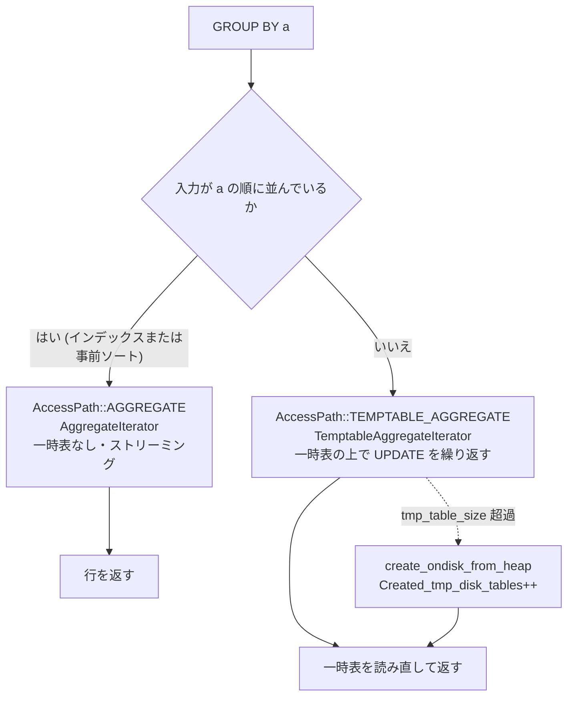

> **前提**: [iterator executor](./executor-walkthrough/) / [内部一時表](./materialization-and-temptable/)

## 何を学んだか

`AccessPath::Type` の合成系には、集約とウィンドウと集合演算に対応するものが並んでいる。

```cpp title="sql/join_optimizer/access_path.h"
    AGGREGATE,
    TEMPTABLE_AGGREGATE,
    LIMIT_OFFSET,
    STREAM,
    MATERIALIZE,
    MATERIALIZE_INFORMATION_SCHEMA_TABLE,
    APPEND,
    WINDOW,
    WEEDOUT,
    REMOVE_DUPLICATES,
    REMOVE_DUPLICATES_ON_INDEX,
```

このページの要点は 3 つだ。

1. **`GROUP BY` の実行系統は 2 つある。** `AGGREGATE` (ストリーミング、入力が並んでいることが前提) と `TEMPTABLE_AGGREGATE` (一時表の上でハッシュ集約)。前者が選べるかどうかは、`ORDER BY` をインデックスで満たせるかと同じ問題に帰着する
2. **ウィンドウ関数は「1 ウィンドウ = 1 マテリアライズ」で実行される。** フレームを見る必要がある関数では、さらにフレームバッファという 3 本目の一時表が要る
3. **集合演算は `MaterializeIterator` の中で完結する。** `UNION ALL` だけは `AppendIterator` でストリーミングできるが、`DISTINCT` が 1 つでも混ざると一時表が要る

## なぜそうなっているか

**集約に 2 方式あるのは、「並べてから畳む」と「畳みながら並べる」のコストが場合によって逆転するからだ。** 並んでいれば `AggregateIterator` は一時表もハッシュ表も要らず、メモリ消費が定数になる。並んでいなければ、ソートしてからストリーミングするか、一時表でハッシュ集約するかを比べることになる。グループ数が少なければハッシュ集約が圧勝し、グループ数が行数に近ければソートのほうが安い。

**`AggregateIterator` が「次のグループの 1 行目」を退避する設計は、pull 型と `record[0]` の組み合わせから必然的に出てくる。** グループの終わりは「違う値が来た」ことでしか分からず、その時点で違う値の行は既に `record[0]` を上書きしている。push 型なら「グループが終わった」というイベントを下から上げられるが、pull 型ではできない。コメントが TODO として抽象化を望んでいるのはこのためだ。

**ウィンドウ関数を一時表のマテリアライズに寄せたのは、ウィンドウごとに評価順が違うからだ。** `foo() OVER w1` と `bar() OVER w2` は、それぞれ別のソート順を必要としうる。1 パスで両方を評価するのは無理なので、ウィンドウごとに「並べ替えて評価して書き出す」を繰り返す。だから **ウィンドウを増やすと一時表とソートが線形に増える**。

**`UNION ALL` だけストリーミングできるのは、重複排除が要らないからだ。** `AppendIterator` は子を順に読んで転送するだけなので、メモリも一時表も使わない。`UNION DISTINCT` が 1 つでも混ざると、少なくともその部分は一時表に落とさざるを得ない。`create_access_paths` が「DISTINCT の部分を先にマテリアライズし、残りの ALL を後ろに append する」という混成戦略を取るのはその折衷だ。

**INTERSECT / EXCEPT にインメモリハッシュを足したのは 8.0.31 以降の比較的新しい実装で、それ以前は一時表のキーしかなかった。** `hash_set_operations` という後付けのスイッチがあるのは、新しい経路に問題が出たときに戻せるようにするためだ。

## ソースコードのどこか

### `AggregateIterator` — 1 行先読みして境界を知る

[`composite_iterators.h#L207`](https://github.com/mysql/mysql-server/blob/mysql-8.4.11/sql/iterators/composite_iterators.h#L207)。クラスコメントが前提条件を最初に書いている。

```cpp title="sql/iterators/composite_iterators.h"
  are already properly grouped coming in, ie., all rows that are supposed to be
  part of the same group are adjacent in the input stream. (This could be
  because they were sorted earlier, because we are scanning an index that
  already gives us the rows in a group-compatible order, or because there is no
  grouping.)
```

そして、その前提から出てくる厄介さも書いてある。

```cpp title="sql/iterators/composite_iterators.h"
  AggregateIterator needs to be able to save and restore rows; it doesn't know
  when a group ends until it's seen the first row that is part of the _next_
  group. When that happens, it needs to tuck away that next row, and then
  restore the previous row so that the output row gets the correct grouped
  values. A simple example, doing SELECT a, SUM(b) FROM t1 GROUP BY a:

    t1.a  t1.b                                       SUM(b)
     1     1     <-- first row, save it                1
     1     2                                           3
     1     3                                           6
     2     1     <-- group changed, save row
    [1     1]    <-- restore first row, output         6
                     reset aggregate              -->  0
    [2     1]    <-- restore new row, process it       1
     2    10                                          11
                 <-- EOF, output                      11
```

**「行は `TABLE::record[0]` にしかない」という `RowIterator` の契約 ([エグゼキュータのページ](./executor-walkthrough/)) が、そのままこの複雑さの原因だ。** 次のグループの 1 行目を読んでしまうと現在のグループの行が上書きされるので、`pack_rows.h` の `StoreFromTableBuffers` で別バッファに退避し、`LoadIntoTableBuffers` で戻す。コメント自身が「行を持ち回る抽象があればよかったが、それは大規模なリファクタリングになる」と書いている。

`Init()` の中にその後始末が残っている ([`composite_iterators.cc#L205`](https://github.com/mysql/mysql-server/blob/mysql-8.4.11/sql/iterators/composite_iterators.cc#L205))。

```cpp title="sql/iterators/composite_iterators.cc"
  // If the iterator has been executed before, restore the state of
  // the table buffers. This is needed for correctness if there is an
  // EQRefIterator below this iterator, as the restoring of the
  // previous group in Read() may have disturbed the cache in
  // EQRefIterator.
  if (!m_first_row_next_group.is_empty()) {
    LoadIntoTableBuffers(
        m_tables, pointer_cast<const uchar *>(m_first_row_next_group.ptr()));
    m_first_row_next_group.length(0);
  }
```

**依存サブクエリの中でこの iterator が再実行されるとき、退避した行を戻さないと `EQRefIterator` のキャッシュがずれる。** iterator 同士が `record[0]` を通して暗黙に結合している例だ。

`Read()` ([L253](https://github.com/mysql/mysql-server/blob/mysql-8.4.11/sql/iterators/composite_iterators.cc#L253)) の `READING_FIRST_ROW` ケースには、`GROUP BY` がないときの特別扱いもある。

```cpp title="sql/iterators/composite_iterators.cc"
        } else {
          // If there's no GROUP BY, we need to output a row even if there are
          // no input rows.
```

`SELECT COUNT(*) FROM t WHERE 1=0` が 1 行 (`0`) を返すのはここだ。

### `TemptableAggregateIterator` — 並んでいないとき

入力が並んでいないなら、一時表をハッシュ表として使う。

```cpp title="sql/iterators/composite_iterators.cc"
/**
  Aggregates unsorted data into a temporary table, using update operations
  to keep running aggregates. After that, works as a MaterializeIterator
  in that it allows the temporary table to be scanned.
```

[L3711](https://github.com/mysql/mysql-server/blob/mysql-8.4.11/sql/iterators/composite_iterators.cc#L3711)。`MaterializeIterator` と同じく `.cc` の中だけの template で、公開されているのは [`temptable_aggregate_iterator::CreateIterator`](https://github.com/mysql/mysql-server/blob/mysql-8.4.11/sql/iterators/composite_iterators.h#L523) だけだ ([内部一時表のページ](./materialization-and-temptable/))。



**`AggregateIterator` を選べるかどうかは、`GROUP BY` の列でインデックス順に読めるか、あるいは先にソートするかで決まる。** 前者なら `Using temporary` も `Using filesort` も出ない。後者なら `Using filesort` が付き、`TemptableAggregateIterator` なら `Using temporary` が付く ([ORDER BY / GROUP BY のページ](./sort-avoidance-and-ordering/))。

### `DISTINCT` の 2 つの実装

`SELECT DISTINCT` は集約の一種として扱われる。並んでいれば連続する重複を落とすだけで済む。

```cpp title="sql/iterators/composite_iterators.h"
  An iterator that removes consecutive rows that are the same according to
  a set of items (typically the join key), so-called “loose scan”
  (not to be confused with “loose index scan”, which is made by the
  range optimizer). This is similar in spirit to WeedoutIterator above
  (removing duplicates allows us to treat the semijoin as a normal join),
  but is much cheaper if the data is already ordered/grouped correctly,
  as the removal can happen before the join, and it does not need a
  temporary table.
```

[`RemoveDuplicatesIterator` (L695)](https://github.com/mysql/mysql-server/blob/mysql-8.4.11/sql/iterators/composite_iterators.h#L695)。実装は `Cached_item::cmp()` を並べて比べるだけの 25 行だ ([`composite_iterators.cc#L4191`](https://github.com/mysql/mysql-server/blob/mysql-8.4.11/sql/iterators/composite_iterators.cc#L4191))。

```cpp title="sql/iterators/composite_iterators.cc"
    bool any_changed = false;
    for (Cached_item *cache : m_caches) {
      any_changed |= cache->cmp();
    }

    if (m_first_row || any_changed) {
      m_first_row = false;
      return 0;
    }
```

並んでいない場合は `MaterializeIterator` が一時表のユニークキーで弾く。EXPLAIN の `Using temporary` が付くのはこちら。

### ウィンドウ関数 — バッファ不要とバッファ必要

[`window_iterators.h#L94`](https://github.com/mysql/mysql-server/blob/mysql-8.4.11/sql/iterators/window_iterators.h#L94) の `WindowIterator` は「フレームを見なくていい」関数用だ。`ROW_NUMBER()`、`RANK()`、フレームが行の到着順に確定する集約などが該当する。

```cpp title="sql/iterators/window_iterators.h"
  Window function execution is centered around temporary table materialization;
  every window corresponds to exactly one materialization (although the
  “materialization” can often be shortcut to streaming). For every window,
  we must materialize/evaluate exactly the aggregates that belong to that
  window, and no others (earlier ones are just copied from the temporary table
  fields, later ones are ignored).
```

**ウィンドウが N 個あれば、マテリアライズも N 段になる。** それぞれの段で、前の段の結果をコピーしつつ自分のウィンドウ関数だけを評価する。`foo() OVER w1 + bar() OVER w2` のような式が段をまたぐので、`Temp_table_param` の `copy_fields` / `copy_func` と ref slice の切り替えが絡み合う。

フレームを見る必要がある関数は [`BufferingWindowIterator` (L204)](https://github.com/mysql/mysql-server/blob/mysql-8.4.11/sql/iterators/window_iterators.h#L204) が担当する。ヘッダが一時表の本数を数えている。

```cpp title="sql/iterators/window_iterators.h"
  Usually [1], for window execution we have two or three tmp tables per
  windowing step involved (although not all are always materialized;
  they may be just streaming through StreamingIterator):

  - The input table, corresponding to the parent iterator. Holds (possibly
    sorted) records ready for windowing, sorted on expressions concatenated from
    any PARTITION BY and ORDER BY clauses.

  - The output table, as given by temp_table_param: where we write the evaluated
    records from this step.

  - If we have buffering, the frame buffer, held by
    Window::m_frame_buffer[_param].
```

**フレームバッファも内部一時表だ。** 溢れれば同じ `create_ondisk_from_heap` を通る ([`window_iterators.cc#L160`](https://github.com/mysql/mysql-server/blob/mysql-8.4.11/sql/iterators/window_iterators.cc#L160))。

```cpp title="sql/iterators/window_iterators.cc"
    if (create_ondisk_from_heap(thd, t, error, /*insert_last_record=*/true,
```

つまり **`tmp_table_size` はウィンドウ関数のフレームバッファにも効く**。パーティションが大きいと、そのぶんフレームバッファが太る。

### 集合演算 — ストリームできるかどうか

`Query_expression::create_access_paths` ([`sql_union.cc#L1436`](https://github.com/mysql/mysql-server/blob/mysql-8.4.11/sql/sql_union.cc#L1436)) が最初に判定するのがこれだ。

```cpp title="sql/sql_union.cc"
  // Decide whether we can stream rows, ie., never actually put them into the
  // temporary table. If we can, we materialize the UNION DISTINCT blocks first,
  // and then stream the remaining UNION ALL blocks (if any) by means of
  // AppendIterator.
  //
  // If we cannot stream (ie., everything has to go into the temporary table),
  // our strategy for mixed UNION ALL/DISTINCT becomes a bit different;
  // see MaterializeIterator for details.
  bool streaming_allowed = true;
  if (global_parameters()->order_list.size() != 0 ||
      (!is_simple() && set_operation()->m_is_materialized)) {
    // If we're sorting, we currently put it in a real table no matter what.
    // This is a legacy decision, because we used to not know whether filesort
    // would want to refer to rows in the table after the sort (sort by row ID).
    // We could probably be more intelligent here now.
    streaming_allowed = false;
```

**全体に `ORDER BY` が付いていたら、それだけでストリーミングは諦める。** コメントは「これは legacy な判断で、今ならもっと賢くできるはず」と認めている。

ストリーミングできるなら [`AppendIterator` (`composite_iterators.h#L862`)](https://github.com/mysql/mysql-server/blob/mysql-8.4.11/sql/iterators/composite_iterators.h#L862) が子を順に読むだけになる ([`composite_iterators.cc#L4376`](https://github.com/mysql/mysql-server/blob/mysql-8.4.11/sql/iterators/composite_iterators.cc#L4376))。

```cpp title="sql/sql_union.cc"
  if (union_all_sub_paths->size() == 1) {
    m_root_access_path = (*union_all_sub_paths)[0].path;
  } else {
    // Just append all the UNION ALL sub-blocks.
    assert(streaming_allowed);
    m_root_access_path = NewAppendAccessPath(thd, union_all_sub_paths);
  }
```

`UNION DISTINCT` / `INTERSECT` / `EXCEPT` は `MaterializeIterator` の中で処理される。重複排除の手段が 2 通りあると `MaterializeIterator` のクラスコメントが説明している。

```cpp title="sql/iterators/composite_iterators.cc"
    - for UNION DISTINCT MaterializeIterator de-duplicates rows via a key
      on the materialized table in two ways: a) a unique key if possible or
      a non-unique key on a hash of the row, if not. For details, see
      \c create_tmp_table.
    - INTERSECT and EXCEPE use two ways: a) using
      in-memory hashing (with posible spill to disk), in which case the
  materialized table is keyless, or if this approach overflows, b) using a
  non-unique key on the materialized table, the keys being the hash of the rows.
```

INTERSECT / EXCEPT のインメモリハッシュを切るのが `optimizer_switch` の `hash_set_operations` ([`sys_vars.cc#L3294`](https://github.com/mysql/mysql-server/blob/mysql-8.4.11/sql/sys_vars.cc#L3294)) で、既定 on だ ([ヒントと optimizer_switch のページ](./optimizer-hints-and-switches/))。

集合演算の `AccessPath` を組むのは [`make_set_op_access_path` (`sql_union.cc#L1258`)](https://github.com/mysql/mysql-server/blob/mysql-8.4.11/sql/sql_union.cc#L1258)。`Query_term` の木 (`QT_UNION` / `QT_INTERSECT` / `QT_EXCEPT`) を辿って `MaterializePath` を積む。

## どう活かすか

**`GROUP BY` で `Using temporary` が出たら、まず「並びを作れないか」を考える。** `GROUP BY a` に対して `a` を先頭に持つインデックスがあれば `AggregateIterator` になり、`Using temporary` も `Using filesort` も消える。複合インデックスの左端から連続していないと効かない ([ORDER BY / GROUP BY のページ](./sort-avoidance-and-ordering/))。

**`Using temporary; Using filesort` は 2 段構えのサインだ。** 一時表に集約結果を書き、その一時表をソートしている。`GROUP BY a ORDER BY b` のように集約キーと出力順が違うときに出る。`ORDER BY a` に揃えられるなら片方が消える。なお 8.4 の `GROUP BY` は結果を並べない (`GROUP BY ... ASC/DESC` の構文も 8.0 で削除された) ので、並びが要るなら `ORDER BY` を必ず書く。

**ウィンドウ関数のパーティションが大きいときは `tmp_table_size` を見る。** フレームバッファは内部一時表なので、`Created_tmp_disk_tables` が増える。`RANGE` や `ROWS` のフレーム指定を狭めてもバッファ自体は縮まない (パーティション全体を保持する) ので、効くのは `PARTITION BY` を細かくすることか `tmp_table_size` を上げることだ ([内部一時表のページ](./materialization-and-temptable/))。

**`UNION` を書くとき、重複が起きえないなら必ず `UNION ALL` にする。** `UNION` (= `UNION DISTINCT`) は一時表とユニークキーを要求する。行数が多いほど `Created_tmp_disk_tables` に効く。逆に `UNION ALL` でも全体に `ORDER BY` を付けるとストリーミングが無効になり、結局一時表に落ちる。**`(SELECT ... ORDER BY ... LIMIT) UNION ALL (SELECT ... ORDER BY ... LIMIT)` のように各ブロックで絞るほうが、全体の `ORDER BY` より安い**ことがある。

**`SELECT DISTINCT` が遅いときは、それが `RemoveDuplicatesIterator` なのか一時表なのかを EXPLAIN で見分ける。** `Using temporary` があれば後者。`DISTINCT` の列がインデックスの左端から取れる形なら前者に落ちる。

**`COUNT(*)` が 0 行でも 1 行返るのは仕様であって、`GROUP BY` を付けると 0 行になる。** `AggregateIterator::Read` の `READING_FIRST_ROW` 分岐がその境目だ。アプリ側で「必ず 1 行返る」を前提にしたコードは、`GROUP BY` を足した瞬間に壊れる。
