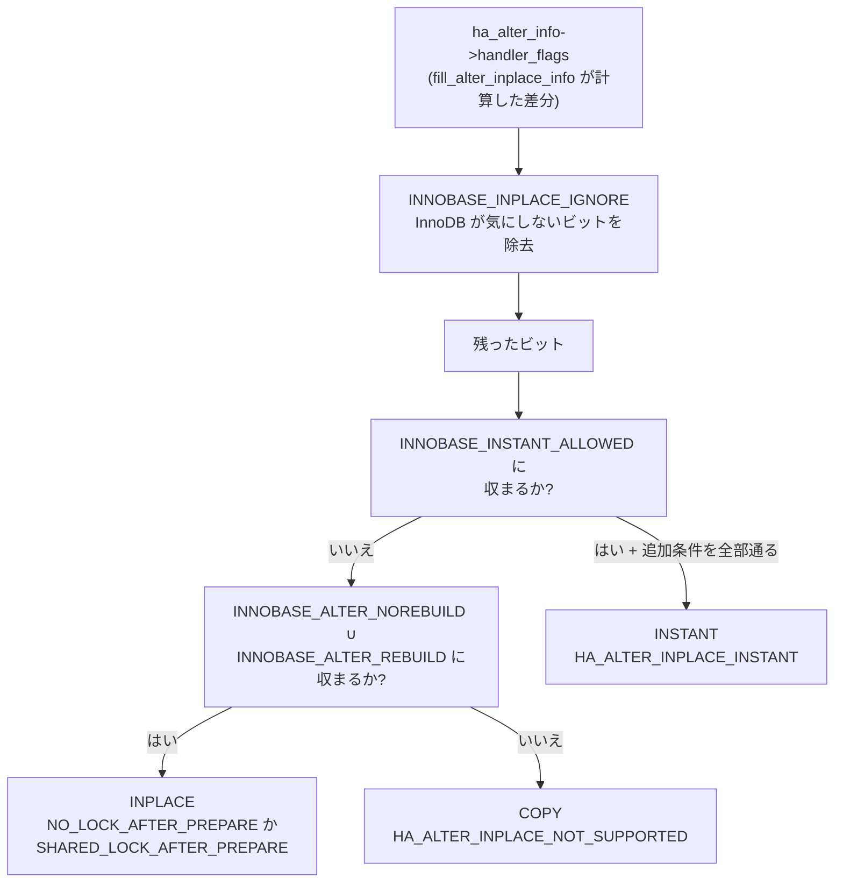

> **前提**: [ALTER TABLE](./ddl-walkthrough/)

## 何を学んだか

「どの `ALTER TABLE` が INSTANT になるか」は、覚えるものではなく**5 つの定数から読み取るもの**だ。`storage/innobase/handler/handler0alter.cc` の冒頭に、`HA_ALTER_FLAGS` のビットを目的別にまとめた集合が並んでいる。



この分岐で押さえるべきことが 3 つある。

**1 つめ。`INNOBASE_INPLACE_IGNORE` に含まれるビットしか立っていない ALTER は、InnoDB にとって何もしないのと同じだ。** デフォルト値の変更、列の可視性、CHECK 制約の追加、テーブルのリネームがここに入る。

**2 つめ。INSTANT が許されるのは 7 ビットだけで、そこには「型の変更」も「インデックスの追加」も入っていない。** `ALTER_STORED_COLUMN_TYPE` が立った時点で INSTANT は消える。

**3 つめ。8.4.11 に `alter_algorithm` というシステム変数は存在しない。** ツリー全体を検索しても `sql/sql_yacc.yy` の文法規則名としてしか出てこない。8.0.11 で追加され 8.0.16 で削除された変数で、8.0.28 にも既にない。残っているのは `old_alter_table` のほうだ。

## なぜそうなっているか

**判定をエンジンに置いたのは、同じ SQL でもエンジンによって可否が変わるからだ。** `handler::check_if_supported_inplace_alter` は既定実装で `HA_ALTER_INPLACE_NOT_SUPPORTED` を返す (つまり COPY)。InnoDB だけが 11321 行かけて細かく答える。SQL 層は `enum_alter_inplace_result` の 8 値だけを知っていればよく、InnoDB の行バージョンも row log も知らない。

**フラグ集合を 5 つに分けたのは、「何ができないか」より「何ができるか」を書くほうが安全だからだ。** `alter_inplace_flags & ~INNOBASE_INSTANT_ALLOWED` という書き方は、**新しい `HA_ALTER_FLAGS` が将来足されたとき自動的に「INSTANT 不可」に倒れる**。ホワイトリスト方式なので、追加を忘れて壊れる方向にはいかない。同じ形が `INNOBASE_INPLACE_IGNORE` と `INNOBASE_ALTER_NOREBUILD` でも使われている。

**「空のテーブルには INSTANT を使わない」という判断は、行バージョンが有限資源だからだ。** バージョンは 64 までしか使えず、一度使うと `ALTER TABLE ... FORCE` で表を書き直すまで戻らない。行が 0 件なら INPLACE で書き直しても一瞬なので、資源を消費するほうを避ける。**「速いほうを選ぶ」ではなく「後で困らないほうを選ぶ」という判断が入っている**のが面白い。

**`alter_algorithm` 変数が削除されたのは、変数で既定を変える設計が破綻したからだと読める。** `ALGORITHM=` は「これができなければエラーにしろ」という意味を持つ。それをグローバル変数で既定値にすると、あらゆる ALTER が予期せずエラーになる。残された `old_alter_table` は「COPY を強制する」という一方向の逃げ道で、エラーにはならない。

## ソースコードのどこか

### 5 つのフラグ集合

すべて [`storage/innobase/handler/handler0alter.cc` L122-179](https://github.com/mysql/mysql-server/blob/mysql-8.4.11/storage/innobase/handler/handler0alter.cc#L122) にある。

```cpp title="storage/innobase/handler/handler0alter.cc"
/** Operations for creating secondary indexes (no rebuild needed) */
static const Alter_inplace_info::HA_ALTER_FLAGS INNOBASE_ONLINE_CREATE =
    Alter_inplace_info::ADD_INDEX | Alter_inplace_info::ADD_UNIQUE_INDEX |
    Alter_inplace_info::ADD_SPATIAL_INDEX;

/** Operations for rebuilding a table in place */
static const Alter_inplace_info::HA_ALTER_FLAGS INNOBASE_ALTER_REBUILD =
    Alter_inplace_info::ADD_PK_INDEX | Alter_inplace_info::DROP_PK_INDEX |
    Alter_inplace_info::CHANGE_CREATE_OPTION
    /* CHANGE_CREATE_OPTION needs to check innobase_need_rebuild() */
    | Alter_inplace_info::ALTER_COLUMN_NULLABLE |
    Alter_inplace_info::ALTER_COLUMN_NOT_NULLABLE |
    Alter_inplace_info::ALTER_STORED_COLUMN_ORDER |
    Alter_inplace_info::DROP_STORED_COLUMN |
    Alter_inplace_info::ADD_STORED_BASE_COLUMN
    /* ADD_STORED_BASE_COLUMN needs to check innobase_need_rebuild() */
    | Alter_inplace_info::RECREATE_TABLE;
```

```cpp title="storage/innobase/handler/handler0alter.cc"
/** Operations for altering a table that InnoDB does not care about */
static const Alter_inplace_info::HA_ALTER_FLAGS INNOBASE_INPLACE_IGNORE =
    Alter_inplace_info::ALTER_COLUMN_DEFAULT |
    Alter_inplace_info::ALTER_COLUMN_COLUMN_FORMAT |
    Alter_inplace_info::ALTER_COLUMN_STORAGE_TYPE |
    Alter_inplace_info::ALTER_RENAME | Alter_inplace_info::CHANGE_INDEX_OPTION |
    Alter_inplace_info::ADD_CHECK_CONSTRAINT |
    Alter_inplace_info::DROP_CHECK_CONSTRAINT |
    Alter_inplace_info::SUSPEND_CHECK_CONSTRAINT |
    Alter_inplace_info::ALTER_COLUMN_VISIBILITY;

/** Operation allowed with ALGORITHM=INSTANT */
static const Alter_inplace_info::HA_ALTER_FLAGS INNOBASE_INSTANT_ALLOWED =
    Alter_inplace_info::ALTER_COLUMN_NAME |
    Alter_inplace_info::ADD_VIRTUAL_COLUMN |
    Alter_inplace_info::DROP_VIRTUAL_COLUMN |
    Alter_inplace_info::ALTER_VIRTUAL_COLUMN_ORDER |
    Alter_inplace_info::ADD_STORED_BASE_COLUMN |
    Alter_inplace_info::ALTER_STORED_COLUMN_ORDER |
    Alter_inplace_info::DROP_STORED_COLUMN;
```

`INNOBASE_ALTER_NOREBUILD` は「InnoDB が関心を持つが、表を書き直さずにできる操作」で、`INNOBASE_ONLINE_CREATE` に外部キー操作・`DROP_INDEX`・`RENAME_INDEX`・`ALTER_COLUMN_NAME` などを足したものになる。

**`ADD_STORED_BASE_COLUMN` と `ALTER_STORED_COLUMN_ORDER` / `DROP_STORED_COLUMN` は `INNOBASE_INSTANT_ALLOWED` と `INNOBASE_ALTER_REBUILD` の両方に入っている**のが目を引く。列の追加・削除は「条件が揃えば INSTANT、揃わなければ表の再構築」という二面性を持つ。どちらになるかを決めるのが次の関数だ。

### `innobase_support_instant` — INSTANT の可否

[L827](https://github.com/mysql/mysql-server/blob/mysql-8.4.11/storage/innobase/handler/handler0alter.cc#L827)。判定は 2 段階で、まず集合の包含だけを見る。

```cpp title="storage/innobase/handler/handler0alter.cc"
  if (!(ha_alter_info->handler_flags & ~INNOBASE_INPLACE_IGNORE)) {
    return (Instant_Type::INSTANT_NO_CHANGE);
  }

  Alter_inplace_info::HA_ALTER_FLAGS alter_inplace_flags =
      ha_alter_info->handler_flags & ~INNOBASE_INPLACE_IGNORE;

  if (alter_inplace_flags & ~INNOBASE_INSTANT_ALLOWED) {
    return (Instant_Type::INSTANT_IMPOSSIBLE);
  }
```

**`INNOBASE_INSTANT_ALLOWED` に含まれないビットが 1 つでも立っていたら、そこで終わり。** 例えば `ADD COLUMN` と `ADD INDEX` を 1 文で書くと、`ADD_INDEX` が集合外なので INSTANT は消える。

通ったら、立っているビットの組み合わせから 5 つの「操作」に分類する。

| 立っているビット                                          | `INSTANT_OPERATION`            | 返る `Instant_Type`           |
| --------------------------------------------------------- | ------------------------------ | ----------------------------- |
| `ALTER_COLUMN_NAME` だけ                                  | `COLUMN_RENAME_ONLY`           | `INSTANT_COLUMN_RENAME`       |
| `ADD_VIRTUAL_COLUMN` / `DROP_VIRTUAL_COLUMN` だけ         | `VIRTUAL_ADD_DROP_ONLY`        | `INSTANT_VIRTUAL_ONLY`        |
| 上 2 つの組み合わせ                                       | `VIRTUAL_ADD_DROP_WITH_RENAME` | **なし** (INPLACE でも未対応) |
| `ADD_STORED_BASE_COLUMN` あり、`DROP_VIRTUAL_COLUMN` なし | `INSTANT_ADD`                  | `INSTANT_ADD_DROP_COLUMN`     |
| `DROP_STORED_COLUMN` あり                                 | `INSTANT_DROP`                 | `INSTANT_ADD_DROP_COLUMN`     |

`INSTANT_ADD` / `INSTANT_DROP` はさらに `table->support_instant_add_drop()` を通らないといけない。

```cpp title="storage/innobase/include/dict0dict.ic"
inline bool dict_table_t::support_instant_add_drop() const {
  return (
      !DICT_TF_GET_ZIP_SSIZE(flags) && space != dict_sys_t::s_dict_space_id &&
      !DICT_TF2_FLAG_IS_SET(this, DICT_TF2_FTS_HAS_DOC_ID) && !is_temporary() &&
      !DICT_TF2_FLAG_IS_SET(this, DICT_TF2_FTS) && !is_system_table);
}
```

**`ROW_FORMAT=COMPRESSED` のテーブル、全文検索インデックスを持つテーブル、一時テーブル、システムテーブルは INSTANT ADD/DROP ができない。**

### `check_if_supported_inplace_alter` — 順番が意味を持つ

[L964](https://github.com/mysql/mysql-server/blob/mysql-8.4.11/storage/innobase/handler/handler0alter.cc#L964)。判定は上から順に並んでいて、**先に来た条件が勝つ**。

1. `srv_force_recovery` / `high_level_read_only` → `HA_ALTER_ERROR`
2. 列数が `REC_MAX_N_USER_FIELDS` 超 → `NOT_SUPPORTED` (COPY に落として `create()` でエラーにさせる)
3. 暗号化属性の変更 → `NOT_SUPPORTED`
4. `INNOBASE_INPLACE_IGNORE | INNOBASE_ALTER_NOREBUILD | INNOBASE_ALTER_REBUILD` に収まらないビットがある → `NOT_SUPPORTED`
5. `ADD_FOREIGN_KEY` かつ `foreign_key_checks=ON` → `NOT_SUPPORTED`
6. `innobase_support_instant` の結果を見て INSTANT 判定
7. `ALTER_COLUMN_NOT_NULLABLE` かつ非 strict モード → `NOT_SUPPORTED`
8. `ADD PRIMARY KEY` を伴わない `DROP PRIMARY KEY` → `NOT_SUPPORTED`
9. 仮想列の追加・削除と他の変更の混在 → `NOT_SUPPORTED`
10. ここまで来たら INPLACE 確定。以降は `online` フラグ (`LOCK=NONE` にできるか) だけを判定する

4 の条件が「型の変更が COPY になる」の直接の理由だ。`ALTER_STORED_COLUMN_TYPE` はどの集合にも入っていない。

```cpp title="storage/innobase/handler/handler0alter.cc"
  if (ha_alter_info->handler_flags &
      ~(INNOBASE_INPLACE_IGNORE | INNOBASE_ALTER_NOREBUILD |
        INNOBASE_ALTER_REBUILD)) {
    if (ha_alter_info->handler_flags &
        Alter_inplace_info::ALTER_STORED_COLUMN_TYPE) {
      ...
        ha_alter_info->unsupported_reason = innobase_get_err_msg(
            ER_ALTER_OPERATION_NOT_SUPPORTED_REASON_COLUMN_TYPE);
    }
    return HA_ALTER_INPLACE_NOT_SUPPORTED;
  }
```

例外が 1 つあって、`ALTER_COLUMN_EQUAL_PACK_LENGTH` (物理表現が同じ型変更) は `INNOBASE_ALTER_NOREBUILD` に入っているので INPLACE で通る。

### INSTANT が「可能でも選ばれない」4 つのケース

`Instant_Type::INSTANT_ADD_DROP_COLUMN` が返っても、`check_if_supported_inplace_alter` の中でさらに 4 回ふるいにかけられる ([L1049-1094](https://github.com/mysql/mysql-server/blob/mysql-8.4.11/storage/innobase/handler/handler0alter.cc#L1049))。

```cpp title="storage/innobase/handler/handler0alter.cc"
      case Instant_Type::INSTANT_ADD_DROP_COLUMN:
        if (ha_alter_info->alter_info->requested_algorithm ==
            Alter_info::ALTER_TABLE_ALGORITHM_INPLACE) {
          /* Still fall back to INPLACE since the behaviour is different */
          break;
        } else if ((ha_alter_info->alter_info->requested_algorithm ==
                    Alter_info::ALTER_TABLE_ALGORITHM_DEFAULT) &&
                   !dict_table_is_discarded(m_prebuilt->table) &&
                   btr_is_index_empty(m_prebuilt->table->first_index())) {
          /* No records: prefer INPLACE to prevent bumping row version */
          break;
        } else if (!((m_prebuilt->table->n_def +
                      get_num_cols_added(ha_alter_info)) <=
                     REC_MAX_N_USER_FIELDS + DATA_N_SYS_COLS)) {
          ...
        } else if (!is_valid_row_version(
                       m_prebuilt->table->current_row_version + 1)) {
```

順に、

- **`ALGORITHM=INPLACE` を明示したら INSTANT にならない。** 「INSTANT でもよいから速く」ではなく「INPLACE で」と言われたら INPLACE をやる
- **空のテーブルは INSTANT にしない。** 行バージョンを無駄に消費しないため
- **列数の上限を超えるなら INSTANT にしない**
- **行バージョンが 64 に達していたら INSTANT にしない** ([INSTANT の実体](./instant-ddl-row-versions/))

**`ALGORITHM=INSTANT` を明示した場合だけ、これらは `break` ではなく `my_error` になる。** 明示しなければ黙って INPLACE に落ちる。パーティションテーブルはこの `switch` の外にいて (`if (!dict_table_is_partition(...))`)、`ha_innopart` 側の [L10115](https://github.com/mysql/mysql-server/blob/mysql-8.4.11/storage/innobase/handler/handler0alter.cc#L10115) が別途判定する。

### `online` を落とす条件

INPLACE 確定後、`LOCK=NONE` にできるかどうかは `online` というローカル変数だけで決まる。false にするのは 4 箇所だ。

| 条件                                                            | `unsupported_reason`                    |
| --------------------------------------------------------------- | --------------------------------------- |
| 追加するインデックスに `AUTO_INCREMENT` 列が含まれる            | `..._REASON_AUTOINC`                    |
| 追加するインデックスに仮想生成列が含まれる                      | `..._ONLINE_ON_VIRTUAL_COLUMN`          |
| `ADD_SPATIAL_INDEX`                                             | `..._REASON_GIS`                        |
| 表を再構築 (または PK 追加) するのに全文/空間インデックスが残る | `ER_INNODB_FT_LIMIT` / `..._REASON_FTS` |
| 追加するインデックスが `FULLTEXT`                               | `..._REASON_FTS`                        |

最後の 1 行がこうなる。

```cpp title="storage/innobase/handler/handler0alter.cc"
  return online ? HA_ALTER_INPLACE_NO_LOCK_AFTER_PREPARE
                : HA_ALTER_INPLACE_SHARED_LOCK_AFTER_PREPARE;
```

**`online == false` でも COPY にはならない。** INPLACE のまま、構築中の MDL が SU ではなく SNW になる (書き込みだけ止まる)。「online DDL ではない = テーブルコピー」という理解は間違いだ。

## どう活かすか

### 操作 → アルゴリズムの早見表

上のコードから導いたもの。ROW_FORMAT が DYNAMIC / COMPACT、全文検索インデックスなし、`foreign_key_checks=ON` を前提にする。

| 操作                                                     | アルゴリズム      | 構築中の MDL | 根拠                                                                                                                                                                   |
| -------------------------------------------------------- | ----------------- | ------------ | ---------------------------------------------------------------------------------------------------------------------------------------------------------------------- |
| `ADD COLUMN` (末尾でも途中でも)                          | INSTANT           | SU           | `ADD_STORED_BASE_COLUMN` ∈ `INSTANT_ALLOWED`                                                                                                                           |
| `DROP COLUMN`                                            | INSTANT           | SU           | `DROP_STORED_COLUMN` ∈ `INSTANT_ALLOWED`                                                                                                                               |
| `RENAME COLUMN`                                          | INSTANT           | SU           | `ALTER_COLUMN_NAME` のみ                                                                                                                                               |
| `ADD/DROP` 仮想生成列                                    | INSTANT           | SU           | `ADD/DROP_VIRTUAL_COLUMN`                                                                                                                                              |
| `ALTER COLUMN ... SET/DROP DEFAULT`                      | INSTANT           | SU           | `ALTER_COLUMN_DEFAULT` ∈ `INPLACE_IGNORE` → `INSTANT_NO_CHANGE`                                                                                                        |
| `ALTER COLUMN ... SET INVISIBLE`                         | INSTANT           | SU           | `ALTER_COLUMN_VISIBILITY` ∈ `INPLACE_IGNORE`                                                                                                                           |
| `ALTER INDEX ... INVISIBLE`                              | **INPLACE**       | SU           | `fill_alter_inplace_info` が `RENAME_INDEX` を立てる ([L12632](https://github.com/mysql/mysql-server/blob/mysql-8.4.11/sql/sql_table.cc#L12632))。INSTANT にはならない |
| `ADD INDEX` / `ADD UNIQUE INDEX`                         | INPLACE online    | SU           | `INNOBASE_ONLINE_CREATE`                                                                                                                                               |
| `DROP INDEX`                                             | INPLACE           | SU           | `DROP_INDEX` ∈ `ALTER_NOREBUILD`                                                                                                                                       |
| `RENAME INDEX`                                           | INPLACE           | SU           | `RENAME_INDEX` ∈ `ALTER_NOREBUILD`                                                                                                                                     |
| `ADD FULLTEXT INDEX`                                     | INPLACE 非 online | **SNW**      | `online = false`                                                                                                                                                       |
| `ADD SPATIAL INDEX`                                      | INPLACE 非 online | **SNW**      | `online = false`                                                                                                                                                       |
| `AUTO_INCREMENT` 列を含む索引の追加                      | INPLACE 非 online | **SNW**      | `online = false`                                                                                                                                                       |
| `VARCHAR(N)` → `VARCHAR(N+M)` (長さバイト数が変わらない) | INPLACE           | SU           | `ALTER_COLUMN_EQUAL_PACK_LENGTH`                                                                                                                                       |
| その他の型変更 (`INT` → `BIGINT` など)                   | **COPY**          | SNW          | どの集合にも入らない                                                                                                                                                   |
| `NULL` → `NOT NULL`                                      | INPLACE (rebuild) | SU           | `ALTER_COLUMN_NOT_NULLABLE` ∈ `ALTER_REBUILD`。ただし非 strict モードでは COPY                                                                                         |
| `NOT NULL` → `NULL`                                      | INPLACE (rebuild) | SU           | `ALTER_COLUMN_NULLABLE` ∈ `ALTER_REBUILD`                                                                                                                              |
| `ADD PRIMARY KEY`                                        | INPLACE (rebuild) | SU           | `ADD_PK_INDEX`                                                                                                                                                         |
| `DROP PRIMARY KEY` 単独                                  | **COPY**          | SNW          | 8 の判定で `NOT_SUPPORTED`                                                                                                                                             |
| `DROP PRIMARY KEY, ADD PRIMARY KEY`                      | INPLACE (rebuild) | SU           | 両方立っていれば通る                                                                                                                                                   |
| `ADD FOREIGN KEY` (`foreign_key_checks=ON`)              | **COPY**          | SNW          | 5 の判定                                                                                                                                                               |
| `ADD FOREIGN KEY` (`foreign_key_checks=OFF`)             | INPLACE           | SU           | `ADD_FOREIGN_KEY` ∈ `ALTER_NOREBUILD`                                                                                                                                  |
| `ENGINE=InnoDB` / `FORCE` (表の再構築)                   | INPLACE (rebuild) | SU           | `RECREATE_TABLE`                                                                                                                                                       |
| `ROW_FORMAT` / `KEY_BLOCK_SIZE` の変更                   | INPLACE (rebuild) | SU           | `CHANGE_CREATE_OPTION` + `innobase_need_rebuild`                                                                                                                       |
| `RENAME TO` 単独                                         | メタデータのみ    | **X**        | `is_simple_rename_or_index_change` の専用経路                                                                                                                          |
| `CONVERT TO CHARACTER SET`                               | **COPY**          | SNW          | 文字列型の列が型変更として扱われ `ALTER_STORED_COLUMN_TYPE` が立つ                                                                                                     |

**「INPLACE (rebuild)」は表を丸ごと書き直す**ので、所要時間と一時的なディスク使用量は COPY とほとんど変わらない。違うのは**構築中に DML を受けられるか**だけで、そこは row log が引き受ける ([INPLACE と row log](./online-index-build-row-log/))。

### 本番で ALTER を打つ前の確認手順

**まず `ALGORITHM=INSTANT` から試す。**

```sql
ALTER TABLE users ADD COLUMN nickname VARCHAR(64), ALGORITHM=INSTANT;
```

通れば数ミリ秒で終わる。通らなければ `ER_ALTER_OPERATION_NOT_SUPPORTED_REASON` が出て、理由が `unsupported_reason` として付く。**この段階では何も実行されていないので、安全に試せる。**

次に `ALGORITHM=INPLACE, LOCK=NONE` を試す。ここで落ちるなら `LOCK=SHARED` (書き込みだけ止まる) か、pt-online-schema-change / gh-ost のような外部ツールの検討に入る。

**`ALGORITHM=` を書かずに本番に流すのがいちばん危ない。** COPY に落ちても何も警告が出ず、テーブルサイズ次第で数時間の SNW (書き込み全停止) になる。

### 症状から引く

**`ERROR 1846 (0A000): ALGORITHM=INSTANT is not supported. Reason: ... Try ALGORITHM=COPY/INPLACE.`** — `check_if_supported_inplace_alter` が INSTANT を返さなかった。`SHOW WARNINGS` に `unsupported_reason` の本文が出るので、そこに書いてある理由 (列型の変更、FTS、圧縮行フォーマットなど) を潰す。

**`ERROR 4092 (HY000): Maximum row versions reached for table ...`** (`ER_INNODB_MAX_ROW_VERSION`) — 行バージョンが 64 に達した。`ALTER TABLE ... FORCE` で表を再構築するとリセットされる ([INSTANT の実体](./instant-ddl-row-versions/))。似たメッセージで `ERROR 4158` (`ER_INNODB_INSTANT_ADD_NOT_SUPPORTED_MAX_FIELDS`) は列数の上限、`ERROR 4157` (`ER_INNODB_INSTANT_ADD_DROP_NOT_SUPPORTED_MAX_SIZE`) は行サイズの上限で、原因も対処も別だ。

**`ALTER TABLE` が突然遅くなった。以前は速かった。** — 統計上の候補は 3 つ。(1) 型変更が混ざって COPY に落ちた、(2) 同じ文に `ADD COLUMN` と `ADD INDEX` を両方書いて INSTANT が消えた、(3) `foreign_key_checks` の設定が変わって外部キー追加が COPY になった。**`ADD COLUMN` と `ADD INDEX` は別の文に分けるだけで、前者が INSTANT に戻る。**

**`LOCK=NONE` を指定したのに書き込みが止まる。** — `online = false` になっている。全文検索インデックス、空間インデックス、`AUTO_INCREMENT` 列を含む索引の追加のいずれか。この場合 `LOCK=NONE` は明示するとエラーになるので、エラーが出ずに止まっているなら `LOCK=` を書いていない。

**`old_alter_table` が ON になっていないか確認する。** 古い設定ファイルから引き継いでいると、`ALGORITHM=` を書かない全 ALTER が COPY になる。

```sql
SELECT @@global.old_alter_table, @@session.old_alter_table;
```
