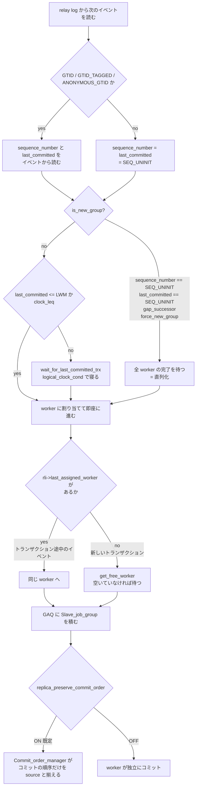

> **前提**: [dump thread と receiver](./dump-thread-and-receiver/) / [binlog イベント](./binlog-events/)

## 何を学んだか

レプリカで relay log を実行するのは 1 本のスレッドではない。**8.4 の既定は `replica_parallel_workers = 4`** ([`sys_vars.cc#L6197`](https://github.com/mysql/mysql-server/blob/mysql-8.4.11/sql/sys_vars.cc#L6197)) なので、何も設定しなくても並列アプライヤが動いている。構成はこうだ。

- **コーディネータ** 1 本 (`handle_slave_sql`) — relay log を読み、トランザクション単位で worker に配る
- **worker** N 本 (`handle_slave_worker`) — 配られたイベントを実行してコミットする

並列にしてよいかの判定を**レプリカ側では一切計算していない**のが要点だ。source が `Gtid_log_event` に書いた 2 つの整数、`last_committed` と `sequence_number` を読むだけで決まる。

- `sequence_number` — そのトランザクションの通し番号
- `last_committed` — 「これより前のものは全部コミット済みでないと自分を始められない」という下限

つまり **`last_committed < 自分の sequence_number` という区間に入っているトランザクション同士は、互いに並列実行してよい**。source 側でこの `last_committed` をできるだけ小さくする (= 並列度を上げる) のが writeset の仕事だ。

そして、**`binlog_transaction_dependency_tracking` は 8.4 で削除された**。`sql/` 配下に 1 箇所も残っていない。commit order による依存を計算したうえで writeset が常にそれを縮める、という固定の 2 段構成になった ([`rpl_trx_tracking.cc#L325`](https://github.com/mysql/mysql-server/blob/mysql-8.4.11/sql/rpl_trx_tracking.cc#L325))。

```cpp title="sql/rpl_trx_tracking.cc"
void Transaction_dependency_tracker::get_dependency(
    THD *thd, bool parallelization_barrier, int64 &sequence_number,
    int64 &commit_parent) {
  sequence_number = commit_parent = 0;
  m_commit_order.get_dependency(thd, parallelization_barrier, sequence_number,
                                commit_parent);
  m_writeset.get_dependency(thd, sequence_number, commit_parent);
}
```

一方 **`replica_parallel_type` は残っていて `DATABASE` も選べる** ([`sys_vars.cc#L4026`](https://github.com/mysql/mysql-server/blob/mysql-8.4.11/sql/sys_vars.cc#L4026))。既定が `LOGICAL_CLOCK` になり、変数自体が `DEPRECATED_VAR("")` になっただけだ。

## なぜそうなっているか

**並列化の判定を source 側で済ませたのは、レプリカ側では依存関係を計算できないからだ。** レプリカが自力で判定するには、relay log を先読みして全トランザクションの writeset を作り、衝突を調べる必要がある。source は自分がコミットした瞬間の状態を持っているので、**同じ計算をゼロコストに近い形でできる**。整数 2 つを `Gtid_log_event` に足すだけで済むのは、この非対称性を利用した結果だ。

**commit order だけでなく writeset を重ねたのは、グループコミットのサイズがレプリカの並列度の上限になってしまうからだ。** commit order だけなら「source で同じグループに入れた分」しか並列にできない。source の負荷が低くてグループが小さいと、レプリカの並列度も 1 に近づく。writeset は「同じ行を触っていない」という別の観点で並列度を掘り出すので、**source のグループサイズから独立して並列化できる**。

**writeset を `min` で合成しているのが要点だ。** commit order の値と writeset の値のうち小さいほうを取る。writeset は「もっと前まで遡っても安全」と主張するだけで、commit order より大きい値 (= より遅い依存) を返すことはない。**安全側は常に commit order のほうにある。**

**`replica_preserve_commit_order` が既定 ON なのは、レプリカ上の読み取りが source と矛盾しないようにするためだ。** 並列に実行して並列にコミットすると、レプリカで一瞬「後のトランザクションだけが見えて前のが見えない」状態が生まれる。source では起きえない状態なので、レプリカを読み取り用に使っているとアプリが壊れる。**コミットだけ揃えれば、実行 (ロックを取って行を書き換えるところ) は並列のままにできる。**

**それでも「source と完全に同じ」にはならない。** `replica_preserve_commit_order` が揃えるのはコミットの順序であって、コミットの時刻ではない。8 本の worker が並列に走っているレプリカでは、source では 1 秒離れていた 2 つのトランザクションが同時にコミットされうる。

**1 トランザクションを 1 worker に閉じ込めているのは、トランザクションの原子性がそこにあるからだ。** 途中で worker を替えると、同じトランザクションの一部が別の InnoDB トランザクションになってしまう。結果として **「1 本の巨大トランザクションは 1 本の worker でしか処理できない」**という上限が生まれる。

## ソースコードのどこか

### source 側 — `last_committed` はいつ決まるか

commit order 側の値は**トランザクションが prepare した瞬間**に決まる ([`binlog_prepare` (`binlog.cc#L2609`)](https://github.com/mysql/mysql-server/blob/mysql-8.4.11/sql/binlog.cc#L2609))。

```cpp title="sql/binlog.cc"
static int binlog_prepare(handlerton *, THD *thd, bool all) {
  DBUG_TRACE;
  if (!all) {
    thd->get_transaction()->store_commit_parent(
        mysql_bin_log.m_dependency_tracker.get_max_committed_timestamp());
  }
  return 0;
}
```

`sequence_number` のほうは flush ステージで振られる ([`binlog_cache_data::flush` (L2444)](https://github.com/mysql/mysql-server/blob/mysql-8.4.11/sql/binlog.cc#L2444))。

```cpp title="sql/binlog.cc"
    trn_ctx->sequence_number = mysql_bin_log.m_dependency_tracker.step();
```

**「prepare した時点で既にコミット済みだったものの最大番号」が commit parent になる**ので、同じグループコミットで一緒に flush されたトランザクション同士は同じ `last_committed` を持つ。**source 側で同時にコミットできた = レプリカ側でも同時に適用してよい**、という論理だ。グループコミットが大きいほどレプリカの並列度も上がる。

### source 側 — writeset が `last_committed` を縮める

`Writeset_trx_dependency_tracker::get_dependency` ([`rpl_trx_tracking.cc#L227`](https://github.com/mysql/mysql-server/blob/mysql-8.4.11/sql/rpl_trx_tracking.cc#L227)) は、触った行の PK / UNIQUE キーのハッシュ列 (writeset) を履歴と突き合わせ、**衝突した中で最大の `sequence_number`** を commit parent の候補にする。

```cpp title="sql/rpl_trx_tracking.cc"
       The WRITESET commit_parent then becomes the minimum of largest parent
       found using the hashes of the row touched by the transaction and the
       commit parent calculated with COMMIT_ORDER.
      */
      commit_parent = std::min(last_parent, commit_parent);
```

**「同じ行を触っていないなら、source で順番にコミットされていても並列に適用してよい」**という判断がここで入る。writeset を使える条件は同じ関数の冒頭に並んでいる。

```cpp title="sql/rpl_trx_tracking.cc"
  bool can_use_writesets =
      // empty writeset implies DDL or similar, except if there are missing keys
      (writeset->size() != 0 || write_set_ctx->get_has_missing_keys() ||
       ...
      !is_create_table_as_query_block(thd) &&
      // binlog format must be ROW
      thd->variables.binlog_format == BINLOG_FORMAT_ROW &&
      // must not use foreign keys
      !write_set_ctx->get_has_related_foreign_keys() &&
      // it did not broke past the capacity already
      !write_set_ctx->was_write_set_limit_reached();
```

**ROW フォーマットであること、外部キーで他表に波及しないこと、履歴の容量を超えていないこと**の 3 つが要る。1 つでも欠けると commit order の値がそのまま残り、並列度が落ちる。

writeset の中身は行ごとの「インデックス名 + DB 名 + テーブル名 + 値」を XXH64 したハッシュだ ([`rpl_write_set_handler.cc#L676`](https://github.com/mysql/mysql-server/blob/mysql-8.4.11/sql/rpl_write_set_handler.cc#L676))。

```cpp title="sql/rpl_write_set_handler.cc"
  uint64 hash = MY_XXH64(pke.c_str(), pke.size(), 0);
  if (thd->get_transaction()->get_transaction_write_set_ctx()->add_write_set(
          hash))
    return true;
```

PK と UNIQUE キーの両方が入る ([`add_pke` (L761)](https://github.com/mysql/mysql-server/blob/mysql-8.4.11/sql/rpl_write_set_handler.cc#L761))。**PK も UNIQUE もないテーブルは writeset を作れない**ので、`get_has_missing_keys()` が立って commit order にフォールバックする。

履歴のサイズは `binlog_transaction_dependency_history_size` (既定 25000、[`sys_vars.cc#L4045`](https://github.com/mysql/mysql-server/blob/mysql-8.4.11/sql/sys_vars.cc#L4045))。溢れると履歴を丸ごとクリアし、以後しばらく並列度が落ちる。

なお 8.0 にあった `transaction_write_set_extraction` は 8.4 の `sys_vars.cc` から消えている。**writeset の抽出は無条件で行われ、アルゴリズムは XXH64 固定**になった。

### レプリカ側 — コーディネータの判定



実装は [`Mts_submode_logical_clock::schedule_next_event` (`rpl_mta_submode.cc#L578`)](https://github.com/mysql/mysql-server/blob/mysql-8.4.11/sql/rpl_mta_submode.cc#L578)。

```cpp title="sql/rpl_mta_submode.cc"
    case mysql::binlog::event::GTID_LOG_EVENT:
    case mysql::binlog::event::ANONYMOUS_GTID_LOG_EVENT:
    case mysql::binlog::event::GTID_TAGGED_LOG_EVENT:
      // TODO: control continuity
      ptr_group->sequence_number = sequence_number =
          static_cast<Gtid_log_event *>(ev)->sequence_number;
      ptr_group->last_committed = last_committed =
          static_cast<Gtid_log_event *>(ev)->last_committed;
      break;
```

**「新しいグループを作る」= 全 worker の完了を待って直列化する**条件が `is_new_group` に列挙されている。

```cpp title="sql/rpl_mta_submode.cc"
  is_new_group =
      (/* First event after a submode switch; */
       first_event ||
       /* Require a fresh group to be started; */
       force_new_group ||
       /* Rewritten event without commit point timestamp (todo: find use case)
        */
       sequence_number == SEQ_UNINIT ||
       ...
       last_committed == SEQ_UNINIT ||
       ...
       gap_successor ||
       ...
       last_sequence_number == SEQ_UNINIT);
```

**`sequence_number` や `last_committed` を持たないイベント (GTID なしの古い binlog) や、`sequence_number` が飛んだ relay log (`gap_successor`) が来ると、そのたびに全 worker が同期する。**

ここで **`sequence_number` の穴はレプリケーションフィルタでは生じない**ことに注意したい。`replicate-do-db` などのフィルタを参照しているのは `rli->rpl_filter` を見るコード、つまりすべて適用段だ。receiver は relay log に全イベントを書くので、フィルタを設定しても relay log の側は連続したままになる。穴が生まれるのは、`SOURCE_AUTO_POSITION=1` で source の dump thread がレプリカの持つ GTID を読み飛ばしたときなどだ ([`Binlog_sender::skip_event` (`rpl_binlog_sender.cc#L749`)](https://github.com/mysql/mysql-server/blob/mysql-8.4.11/sql/rpl_binlog_sender.cc#L749))。

待つ側は [`wait_for_last_committed_trx` (L519)](https://github.com/mysql/mysql-server/blob/mysql-8.4.11/sql/rpl_mta_submode.cc#L519)。

```cpp title="sql/rpl_mta_submode.cc"
    thd->ENTER_COND(&rli->logical_clock_cond, &rli->mts_gaq_LOCK,
                    &stage_worker_waiting_for_commit_parent, &old_stage);
    do {
      mysql_cond_wait(&rli->logical_clock_cond, &rli->mts_gaq_LOCK);
    } while ((!rli->info_thd->killed && !is_error) &&
             !clock_leq(last_committed, estimate_lwm_timestamp()));
```

**待っているのはコーディネータ**であって worker ではない。だから 1 本のトランザクションが依存待ちに入ると、その後ろのトランザクションは worker に渡されすらしない。

### GAQ — 完了順序を管理する円環バッファ

`Slave_committed_queue` ([`rpl_rli_pdb.h#L351`](https://github.com/mysql/mysql-server/blob/mysql-8.4.11/sql/rpl_rli_pdb.h#L351)) は `Slave_job_group` の円環キューだ。コーディネータが末尾に積み、worker が完了フラグ (`done`) を立てる。**先頭が完了しないと先頭は動かない**ので、`entry` の位置が LWM (low water mark) になる。

worker の選び方は [`get_least_occupied_worker` (L853)](https://github.com/mysql/mysql-server/blob/mysql-8.4.11/sql/rpl_mta_submode.cc#L853) のコメントがそのまま書いている。

```cpp title="sql/rpl_mta_submode.cc"
    The scheduling works as follows, in this sequence
      -If this is an internal event of a transaction  use the last assigned
        worker
      -If the i-th transaction is being scheduled in this group where "i" <=
       number of available workers then schedule the events to the consecutive
       workers
      -If the i-th transaction is being scheduled in this group where "i" >
       number of available workers then schedule this to the first worker that
       becomes free.
```

**1 トランザクションは必ず 1 worker で完結する。** トランザクションを跨いだ分割はない。

### `replica_preserve_commit_order` — 順序を戻す

既定は `ON` ([`sys_vars.cc#L4054`](https://github.com/mysql/mysql-server/blob/mysql-8.4.11/sql/sys_vars.cc#L4054))。並列に**実行**はするが、**コミット**は source と同じ順序に揃える。実装は `Commit_order_manager` ([`rpl_replica_commit_order_manager.h#L197`](https://github.com/mysql/mysql-server/blob/mysql-8.4.11/sql/rpl_replica_commit_order_manager.h#L197))。

レプリカで binlog が有効なら、worker は `ordered_commit` の冒頭で自分の番を待つ ([`binlog.cc#L8959`](https://github.com/mysql/mysql-server/blob/mysql-8.4.11/sql/binlog.cc#L8959))。

```cpp title="sql/binlog.cc"
  if (Commit_order_manager::wait_for_its_turn_before_flush_stage(thd) ||
      ending_trans(thd, all) ||
      Commit_order_manager::get_rollback_status(thd)) {
    if (Commit_order_manager::wait(thd)) {
      return thd->commit_error;
    }
  }
```

コメントが「Stage #0 は独自の StageID を持たない」と明記している。レプリカで binlog が無効なら、代わりに `COMMIT_ORDER_FLUSH_STAGE` のキューに並ぶ ([`flush_engine_and_signal_threads` (`rpl_replica_commit_order_manager.cc#L335`)](https://github.com/mysql/mysql-server/blob/mysql-8.4.11/sql/rpl_replica_commit_order_manager.cc#L335))。

`wait_for_its_turn_before_flush_stage` ([L655](https://github.com/mysql/mysql-server/blob/mysql-8.4.11/sql/rpl_replica_commit_order_manager.cc#L655)) は DDL 系の `sql_command` にだけ true を返す。**DDL は flush ステージに入る前から順序を守らせる**という追加の縛りだ。

待ちは MDL の wait-for graph に登録される (`Commit_order_lock_graph`)。**「worker A が worker B の行ロックを待ち、B が A のコミット順を待つ」というデッドロックを、既存のデッドロック検出器で検出できる**ようにするためだ。検出されると後ろの worker がロールバックし、`replica_transaction_retries` (既定 10、[`sys_vars.cc#L6186`](https://github.com/mysql/mysql-server/blob/mysql-8.4.11/sql/sys_vars.cc#L6186)) の回数だけ再試行する。

### MTA のチェックポイント

worker の進捗を `mysql.slave_relay_log_info` に反映するのは、コーディネータが周期的に呼ぶ [`mta_checkpoint_routine` (`rpl_replica.cc#L6463`)](https://github.com/mysql/mysql-server/blob/mysql-8.4.11/sql/rpl_replica.cc#L6463)。周期は `replica_checkpoint_period` (既定 300ms) と `replica_checkpoint_group` (既定 512 トランザクション) のどちらか早いほうだ ([`sys_vars.cc#L6128`](https://github.com/mysql/mysql-server/blob/mysql-8.4.11/sql/sys_vars.cc#L6128))。

```cpp title="sql/rpl_replica.cc"
  ts = rli->gaq->empty()
           ? 0
           : reinterpret_cast<Slave_job_group *>(rli->gaq->head_queue())->ts;
  rli->reset_notified_checkpoint(cnt, ts, true);
```

**`Seconds_Behind_Source` の材料になる `last_master_timestamp` が更新されるのもここだけ**だ ([レプリカ遅延の正体](./replication-lag/))。

## どう活かすか

**レプリカ遅延に対して `replica_parallel_workers` を上げても、source 側の `last_committed` が縮んでいなければ効かない。** 効いているかを確かめるには `performance_schema.replication_applier_status_by_worker` を見て、実際に複数行が同時に `APPLYING_TRANSACTION` を持っているかを確認する。1 行しか動いていないなら、並列化を止めているのは worker 数ではない。

**PK のないテーブルは並列適用を 2 重に殺す。** writeset が作れないので `last_committed` が縮まらず ([`add_pke`](https://github.com/mysql/mysql-server/blob/mysql-8.4.11/sql/rpl_write_set_handler.cc#L761) が PK / UNIQUE を要求する)、さらに行イベントの適用時にレプリカ側で行を探すのに全表スキャンかハッシュスキャンが要る。**レプリカ遅延の調査でまず見るべきは `sys.schema_tables_with_full_table_scans` ではなく「PK のないテーブル」**だ。

**外部キーがあるテーブルも writeset を無効化する。** `get_has_related_foreign_keys()` が立つと `can_use_writesets` が false になる。カスケード更新が他表に波及する範囲を writeset が捉えられないためで、これは設定で回避できない。

**`binlog_format` を `STATEMENT` や `MIXED` にすると writeset が効かない。** 判定に `binlog_format == BINLOG_FORMAT_ROW` が入っている。8.4 の既定は `ROW` なので、明示的に変えている環境だけが該当する。

**巨大トランザクション 1 本は worker 1 本を占有し、その間 `Seconds_Behind_Source` は伸び続ける。** GAQ の先頭が完了しないと LWM が進まないので、後続が全部依存待ちでなくても**チェックポイントが進まず遅延の数字が動かない**。1 千万行の `DELETE` を分割すべき理由がここにもある。

**`Waiting for dependent transaction to commit` (コーディネータ) と `Waiting for preceding transaction to commit` (worker) は別物だ。** 前者は `wait_for_last_committed_trx` で、source 側の `last_committed` が縮んでいないことを意味する (writeset が効いていない)。後者は `Commit_order_manager` で、`replica_preserve_commit_order` によるコミット順の待ちだ。**前者が多いなら source 側を、後者が多いならレプリカ側の遅い worker を疑う。**

**`replica_parallel_type=DATABASE` は 8.4 でもまだ選べるが非推奨だ。** 変数定義に `DEPRECATED_VAR("")` が付いている。`LOGICAL_CLOCK` が使えない事情 (GTID なしの古い source からのレプリケーション) がない限り、切り替える理由はない。

**`replica_pending_jobs_size_max` (既定 128MB) は worker ごとのキューの上限だ。** ソフトリミットなので単一イベントがこれを超えても通るが、キューが埋まるとコーディネータが止まる。巨大な行イベントが流れる環境で `Waiting for Replica Worker queue` が出るならここを見る。
