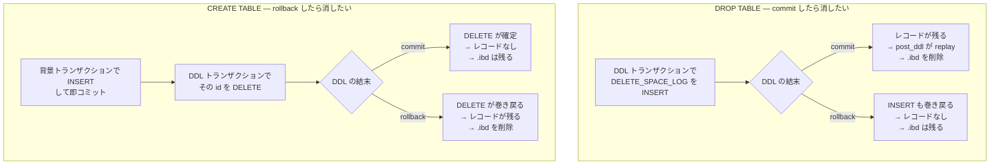

> **前提**: [ALTER TABLE](./ddl-walkthrough/) / [データディクショナリ](./data-dictionary/)

## 何を学んだか

5.7 以前の `DROP TABLE t1, t2, t3` は、途中でクラッシュすると `t1` だけ消えて `t2` が残り、しかも `.frm` は消えたのに `.ibd` が残る、といった状態になり得た。8.0 でこれが直った。**アトミック DDL** と呼ばれる。

仕組みは 2 段構えだ。

**1 段目。** テーブル定義が `.frm` ファイルではなく `mysql.ibd` の中の InnoDB テーブルになった ([データディクショナリのページ](./data-dictionary/))。だから DD の更新は普通の InnoDB トランザクションで、redo と undo がそのまま効く。`CREATE TABLE` の途中でクラッシュすれば、DD の行が入っていないので「テーブルは存在しなかった」ことになる。

**2 段目。** それでも**ファイルシステムの操作はトランザクションにできない。** `.ibd` の作成、削除、リネームは、undo で巻き戻せない。ここを埋めるのが `mysql.innodb_ddl_log` だ。

このテーブルの使い方が巧妙で、**ログレコードを「DDL の成否と同じ運命をたどる」ように挿入する**。

- **commit したら実行してほしい動作** (DROP TABLE のファイル削除) → **DDL 自身のトランザクションで INSERT する**。DDL がロールバックすれば INSERT も消え、動作は実行されない
- **rollback したら実行してほしい動作** (CREATE TABLE のファイル削除) → **別の背景トランザクションで INSERT して即コミットし、DDL 自身のトランザクションで DELETE する**。DDL がコミットすれば DELETE も確定してレコードは消え、ロールバックすれば DELETE が巻き戻ってレコードが残る

どちらの場合も、**DDL 文の最後に「自分のスレッド ID のレコードを全部読んで実行し、削除する」**だけでよい。残っていれば実行、残っていなければ何もしない。クラッシュした場合は起動時に同じことを全レコードに対してやる。

**undo で戻せないものを、undo で戻せるテーブルに「やることリスト」として書いておく**という発想だ。



どちらも **replay 側は「レコードがあれば実行する」だけ**で、DDL が成功したのか失敗したのかを知る必要がない。

## なぜそうなっているか

**「補償動作をテーブルに書いておく」というのは、2 相コミットを 1 つのトランザクショナルな資源に押し付ける古典的な手だ。** ファイルシステムと InnoDB のトランザクションという 2 つの資源を原子的に更新するには、片方をもう片方の中に表現するしかない。ここでは「ファイルシステムに対してやるべきこと」を InnoDB のテーブルに書いている。

**「commit で実行」と「rollback で実行」を、レコードの存在の有無だけで表現できているのが設計として綺麗だ。** 状態フラグを持たせて `if (committed)` と分岐するのではなく、**レコードがそこにあれば実行、なければ何もしない**に統一されている。だから `replay` 側には DDL の成否を知る手段が一切なく、それが必要ない。

**`thread_id` で引く設計にしたのは、DDL 文が終わったときに即座に後始末をするためだ。** クラッシュ時にしか使わないなら `id` の全走査で足りるが、正常系でもロールバック時のファイル削除が要る。「自分の分だけ」を引ければ、他のセッションの進行中の DDL と干渉しない。行ロックが要らない理由もこれで、`DDL_Log_Table` のクラスコメントが明言している。

```cpp title="storage/innobase/include/log0ddl.h"
/** Wrapper of mysql.innodb_ddl_log table. Accessing to this table doesn't
require row lock because thread could only access/modify its own ddl records. */
```

**辞書キャッシュの操作 (`REMOVE_CACHE_LOG` / `RENAME_TABLE_LOG`) がログの種類に含まれるのは、メモリ上の状態も「戻せないもの」だからだ。** `dict_table_t` は共有キャッシュにあり、他のセッションが参照カウントを持っている可能性がある。DD の行をロールバックしても、キャッシュに残った古いオブジェクトは勝手には消えない。それも補償動作として書く。

**1 件ずつ適用して 1 件ずつ削除するのは、複数の補償動作の間にクラッシュしうるからだ。** コメントの例が的確で、「新ファイルを消す」「旧ファイルを元の名前に戻す」を両方やったあとレコードを消す前に落ちると、再起動時に「新ファイルを消す」がもう一度走って、元に戻した本物のファイルを消してしまう。**1 件の適用は冪等でも、集合の適用は冪等ではない。**

**起動時の replay を「redo と undo のあと」に置いたのは、循環を避けるためだ。** ddl_log は InnoDB のテーブルなので、読むには InnoDB が動いていなければならない。読んだ内容が「DDL がコミットしたかロールバックしたか」を反映していなければならないので、undo によるロールバックが終わっている必要もある。

## ソースコードのどこか

### `mysql.innodb_ddl_log` のスキーマ

DD 起動時に InnoDB 自身が定義する ([`ha_innodb.cc#L13267`](https://github.com/mysql/mysql-server/blob/mysql-8.4.11/storage/innobase/handler/ha_innodb.cc#L13267))。

```cpp title="storage/innobase/handler/ha_innodb.cc"
  dd::Object_table *innodb_ddl_log = dd::Object_table::create_object_table();
  innodb_ddl_log->set_hidden(true);
  def = innodb_ddl_log->target_table_definition();
  def->set_table_name("innodb_ddl_log");
  def->add_field(0, "id", "id BIGINT UNSIGNED NOT NULL AUTO_INCREMENT");
  def->add_field(1, "thread_id", "thread_id BIGINT UNSIGNED NOT NULL");
  def->add_field(2, "type", "type INT UNSIGNED NOT NULL");
  def->add_field(3, "space_id", "space_id INT UNSIGNED");
  def->add_field(4, "page_no", "page_no INT UNSIGNED");
  def->add_field(5, "index_id", "index_id BIGINT UNSIGNED");
  def->add_field(6, "table_id", "table_id BIGINT UNSIGNED");
  def->add_field(7, "old_file_path",
                 "old_file_path VARCHAR(512) COLLATE UTF8MB3_BIN");
  def->add_field(8, "new_file_path",
                 "new_file_path VARCHAR(512) COLLATE UTF8MB3_BIN");
  def->add_index(0, "index_pk", "PRIMARY KEY(id)");
  def->add_index(1, "index_k_thread_id", "KEY(thread_id)");
```

**`thread_id` にインデックスがあるのが要点だ。** DDL 文の終わりに「自分のスレッドのレコード」を引くために使う。`set_hidden(true)` なので `SHOW TABLES` には出ない。

このテーブルは `dict0dd.h` の「ハードコードされた DD テーブル」のリストにも入っている ([L303](https://github.com/mysql/mysql-server/blob/mysql-8.4.11/storage/innobase/include/dict0dd.h#L303))。

```cpp title="storage/innobase/include/dict0dd.h"
    INNODB_DD_TABLE("innodb_ddl_log", 2),
```

### 8 種類のログ

```cpp title="storage/innobase/include/log0ddl.h"
enum class Log_Type : uint32_t {
  /** Smallest log type */
  SMALLEST_LOG = 1,

  /** Drop an index tree */
  FREE_TREE_LOG = 1,

  /** Delete a file */
  DELETE_SPACE_LOG,

  /** Rename a file */
  RENAME_SPACE_LOG,

  /** Drop the entry in innodb_table_metadata */
  DROP_LOG,

  /** Rename table in dict cache. */
  RENAME_TABLE_LOG,

  /** Remove a table from dict cache */
  REMOVE_CACHE_LOG,

  /** Alter Encrypt a tablespace */
  ALTER_ENCRYPT_TABLESPACE_LOG,

  /** Alter Unencrypt a tablespace */
  ALTER_UNENCRYPT_TABLESPACE_LOG,

  /** Biggest log type */
  BIGGEST_LOG = ALTER_UNENCRYPT_TABLESPACE_LOG
};
```

[`storage/innobase/include/log0ddl.h#L45`](https://github.com/mysql/mysql-server/blob/mysql-8.4.11/storage/innobase/include/log0ddl.h#L45)。**「undo で戻せない操作」の一覧がそのまま enum になっている。** ファイルの削除・リネーム、B+tree のページ解放 (redo は打つが undo は打たない)、辞書キャッシュの操作の 3 系統だ。

3 番目の系統 (`RENAME_TABLE_LOG` / `REMOVE_CACHE_LOG`) が入っているのは、**メモリ上の `dict_table_t` キャッシュがトランザクショナルではないから**だ。DD の行がロールバックしても、キャッシュに残った古い名前は自動では戻らない。

### 「commit で実行」と「rollback で実行」の作り分け

同じ関数に両方が入っている。`write_delete_space_log` の `is_drop` 引数がスイッチだ。

```cpp title="storage/innobase/log/log0ddl.cc"
  if (is_drop) {
    err = insert_delete_space_log(trx, id, thread_id, space_id, file_path,
                                  dict_locked);
    if (err != DB_SUCCESS) {
      return err;
    }
    ...
  } else {
    err = insert_delete_space_log(nullptr, id, thread_id, space_id, file_path,
                                  dict_locked);
    if (err != DB_SUCCESS) {
      return err;
    }
    ...
    err = delete_by_id(trx, id, dict_locked);
```

[`log0ddl.cc#L967`](https://github.com/mysql/mysql-server/blob/mysql-8.4.11/storage/innobase/log/log0ddl.cc#L967)。第 1 引数が `trx` (DDL 自身のトランザクション) か `nullptr` かで挙動が変わる。

```cpp title="storage/innobase/log/log0ddl.cc"
dberr_t Log_DDL::insert_delete_space_log(trx_t *trx, uint64_t id,
                                         ulint thread_id, space_id_t space_id,
                                         const char *file_path,
                                         bool dict_locked) {
  dberr_t error;
  bool has_dd_trx = (trx != nullptr);

  if (!has_dd_trx) {
    trx = trx_allocate_for_background();
    trx_start_internal(trx, UT_LOCATION_HERE);
    trx->ddl_operation = true;
  } else {
    trx_start_if_not_started(trx, true, UT_LOCATION_HERE);
  }
  ...
  if (!has_dd_trx) {
    trx_commit_for_mysql(trx);
    trx_free_for_background(trx);
  }
```

`nullptr` なら**背景トランザクションを作って即コミットする**。だから DDL がロールバックしてもこの INSERT は残る。

`write_free_tree_log` (インデックスの B+tree 解放) も同じ形で、コメントが用途を明示している。

```cpp title="storage/innobase/log/log0ddl.cc"
  if (is_drop_table) {
    /* Drop index case, if committed, will be redo only */
    err = insert_free_tree_log(trx, index, id, thread_id);
    ...
  } else {
    /* This is the case of building index during create table
    scenario. The index will be dropped if ddl is rolled back */
    err = insert_free_tree_log(nullptr, index, id, thread_id);
    ...
    /* Delete this operation if the create trx is committed */
    err = delete_by_id(trx, id, false);
```

同じ関数が**「DROP INDEX なら commit 後に木を解放」と「CREATE INDEX なら rollback 時に木を解放」の両方を表現している。**

### 文が終わったら replay する

DDL 文の最後に `handlerton::post_ddl` が呼ばれる。InnoDB の実装は自分のスレッド ID を使って引く。

```cpp title="storage/innobase/log/log0ddl.cc"
dberr_t Log_DDL::post_ddl(THD *thd) {
  if (skip(nullptr, thd)) {
    return (DB_SUCCESS);
  }

  if (srv_read_only_mode || srv_force_recovery >= SRV_FORCE_NO_UNDO_LOG_SCAN) {
    return (DB_SUCCESS);
  }
  ...
  ulint thread_id = thd_get_thread_id(thd);
  ...
  thread_local_ddl_log_replay = true;

  dberr_t err = replay_by_thread_id(thread_id);

  thread_local_ddl_log_replay = false;
```

[`log0ddl.cc#L1941`](https://github.com/mysql/mysql-server/blob/mysql-8.4.11/storage/innobase/log/log0ddl.cc#L1941)。`thread_local_ddl_log_replay` は再入防止で、replay 中に呼ばれる `write_*_log` を無効化する。

```cpp title="storage/innobase/log/log0ddl.cc"
inline bool Log_DDL::skip(const dict_table_t *table, THD *thd) {
  return (recv_recovery_on || thread_local_ddl_log_replay ||
          (table != nullptr && table->is_temporary()) ||
          thd_is_bootstrap_thread(thd));
}
```

**一時テーブルにはログを残さない。** クラッシュ後には存在しないので後始末が要らない。

SQL 層側では `post_ddl` を呼ぶ場所が経路ごとに散っている。`DROP TABLE` は `std::set<handlerton *> post_ddl_htons` に集めてまとめて呼び ([`sql_table.cc#L3816`](https://github.com/mysql/mysql-server/blob/mysql-8.4.11/sql/sql_table.cc#L3816))、`ALTER TABLE` は `mysql_alter_table` の末尾、`RENAME TABLES` は `mysql_rename_tables` の末尾で呼ぶ。**成功パスと失敗パスの両方に呼び出しがある**のが重要で、エラーで `trans_rollback` した直後にも必ず通る。

### 各レコードを適用したら即削除する

```cpp title="storage/innobase/log/log0ddl.cc"
    /* Delete the DDL log immediately after applying. Applying the whole set
    of logs is not idempotent e.g. typically the rollback actions of a DDL
    rebuilding a table are as follows.
    1. Delete the newly created tablespace file t1.ibd
    2. Rename the saved old tablespace file tmp_name.ibd to t1.ibd

    If there is a crash after performing both [1] and [2] before removing the
    log entries, we would try to repeat the actions again post recovery and
    end up deleting the file for the base table. We should remove each log
    entry immediately after applying it. */
```

[`replay_by_thread_id` L1517](https://github.com/mysql/mysql-server/blob/mysql-8.4.11/storage/innobase/log/log0ddl.cc#L1517)。**「レコード 1 件の適用は冪等だが、複数レコードの適用は冪等ではない」**という区別が効いている。だから 1 件適用するたびに 1 件削除する。次の行のコメントがそれを保証する。

```cpp title="storage/innobase/log/log0ddl.cc"
    /* A crash at this point would replay the last ddl log again. It is fine
    as a single ddl log execution for a table/tablespace is idempotent. */
```

### クラッシュ後の replay

起動時は `innobase_post_recover` から全件を replay する。

```cpp title="storage/innobase/handler/ha_innodb.cc"
/** DDL crash recovery: process the records recovered from "log_ddl" table */
static void innobase_post_recover() {
  if (srv_force_recovery < SRV_FORCE_NO_TRX_UNDO) {
    ...
    dberr_t err = log_ddl->recover();

    /* Abort post recovery startup if this is not successful. */
    if (err != DB_SUCCESS) {
      ib::fatal(UT_LOCATION_HERE, ER_IB_MSG_POST_RECOVER_DDL_LOG_RECOVER);
    }
  }
```

[`ha_innodb.cc#L4131`](https://github.com/mysql/mysql-server/blob/mysql-8.4.11/storage/innobase/handler/ha_innodb.cc#L4131)。失敗したら `ib::fatal` で起動を中止する。**中途半端な状態で立ち上がるくらいなら落ちる**という判断だ。

順序も定義されている。`Log_DDL::recover` のヘッダコメントがこう書いている。

```cpp title="storage/innobase/include/log0ddl.h"
  /** Recover in server startup.
  Scan innodb_ddl_log table, and replay all log entries.
  Note: redo log should be applied, and DD transactions
  should be recovered before calling this function.
  @return       DB_SUCCESS or error */
  dberr_t recover();
```

**redo の適用 → undo によるトランザクションのロールバック → ddl_log の replay** の順だ。ddl_log 自体が InnoDB のテーブルなので、まず redo と undo で「DDL トランザクションがコミットしたのか、ロールバックしたのか」を確定させないと、テーブルの中身が読めない。

### `replay` の dispatch

```cpp title="storage/innobase/log/log0ddl.cc"
  switch (record.get_type()) {
    case Log_Type::FREE_TREE_LOG:
      replay_free_tree_log(record.get_space_id(), record.get_page_no(),
                           record.get_index_id());
      break;

    case Log_Type::DELETE_SPACE_LOG:
      replay_delete_space_log(record.get_space_id(),
                              record.get_old_file_path());
      break;

    case Log_Type::RENAME_SPACE_LOG:
      replay_rename_space_log(record.get_space_id(), record.get_old_file_path(),
                              record.get_new_file_path());
      break;
```

[`log0ddl.cc#L1612`](https://github.com/mysql/mysql-server/blob/mysql-8.4.11/storage/innobase/log/log0ddl.cc#L1612)。`replay_delete_space_log` の中身は最終的に `row_drop_tablespace(space_id, file_path)` を呼ぶだけだ。**`.ibd` を消すのはここ 1 箇所に集約されている。**

### `id` は自分でインクリメントする

```cpp title="storage/innobase/log/log0ddl.cc"
inline uint64_t Log_DDL::next_id() {
  uint64_t autoinc;

  dict_table_autoinc_lock(dict_sys->ddl_log);
  autoinc = dict_table_autoinc_read(dict_sys->ddl_log);
  ++autoinc;
  dict_table_autoinc_update_if_greater(dict_sys->ddl_log, autoinc);
  dict_table_autoinc_unlock(dict_sys->ddl_log);

  return (autoinc);
}
```

`AUTO_INCREMENT` の値を先に取ってから INSERT する。**削除する ID を事前に知っておく必要がある**からで、`insert` してから `LAST_INSERT_ID` を読む形では、背景トランザクションと DDL トランザクションが別なので取れない。

### エンジンが対応を申告する

```cpp title="sql/handler.h"
/**
  Engine supports atomic DDL. That is rollback of transaction for DDL
  statement will also rollback all changes in SE, commit of transaction
  of DDL statement will make it durable.
*/

#define HTON_SUPPORTS_ATOMIC_DDL (1 << 12)
```

[`sql/handler.h#L3058`](https://github.com/mysql/mysql-server/blob/mysql-8.4.11/sql/handler.h#L3058)。SQL 層はこのフラグで分岐する。非対応エンジンでは `CREATE TABLE` のたびに中間コミットが入り、複数表の `DROP TABLE` は表ごとに確定する。

`handler.h` の ALTER TABLE の説明にも対比が書いてある ([L6329 付近](https://github.com/mysql/mysql-server/blob/mysql-8.4.11/sql/handler.h#L6329))。

```cpp title="sql/handler.h"
    b) For engines which support atomic DDL:

       *) Update the SQL-layer data-dictionary by replacing description of old
          version of the table with its new version.
       *) Process the RENAME clause by calling handler::ha_rename_table() and
          updating the data-dictionary accordingly.
       *) Commit the statement/transaction.
       *) Finalize atomic DDL operation by calling handlerton::post_ddl() hook
          for the storage engine.
```

**DD の更新、rename、コミット、post_ddl の順**が固定されている。

## どう活かすか

**「DDL の途中でサーバが落ちたが、orphan の `.ibd` が残っていないか」を心配する必要はもうない。** 8.0 以降の InnoDB では、起動時の `Log_DDL::recover()` が処理する。**逆に、これが失敗すると起動しない** (`ib::fatal`)。エラーログに `ER_IB_MSG_POST_RECOVER_DDL_LOG_RECOVER` が出て停止したら、ディスクの空きかパーミッションを疑う。

**ddl_log の動きを見たいときは `innodb_print_ddl_logs` を ON にする。**

```sql
SET GLOBAL innodb_print_ddl_logs = ON;
```

`srv_print_ddl_logs` に対応するデバッグ用の変数で、レコードの挿入と replay がエラーログに出る (`DDL log insert : ...` / `DDL log replay : ...`)。**本番では出力量が多いので常時 ON にはしない。**

**`DROP TABLE t1, t2, t3` は今は原子的だ。** 途中でエラーになれば `t1` も消えない。ただし [トランザクションの調停](./transaction-coordination/) で見たとおり、**`BEGIN; DROP TABLE t1; DROP TABLE t2; COMMIT;` は原子的ではない。** 文ごとに暗黙コミットが入るので、これは 2 つの独立した原子操作になる。「1 文の中でアトミック」であって「トランザクションでまとめられる」わけではない。

**`RENAME TABLE a TO tmp, b TO a, tmp TO b` (テーブルの入れ替え) も原子的だ。** `mysql_rename_tables` はすべての表に対して先に排他 MDL をまとめて取り ([`sql_rename.cc#L290`](https://github.com/mysql/mysql-server/blob/mysql-8.4.11/sql/sql_rename.cc#L290) の `lock_table_names`)、全部の rename を 1 つの DD トランザクションで実行してから最後にコミットする ([L389](https://github.com/mysql/mysql-server/blob/mysql-8.4.11/sql/sql_rename.cc#L389))。**中間状態が他のセッションから見えることはない。** blue-green 的な表の切り替えを 1 文で安全にやれる根拠がこれになる。

ただし `int_commit_done` という変数があることからわかるとおり、**非アトミックなエンジンが混ざると経路が変わる。** その場合は逆順に rename を戻す補償ロジックが走り、コメントも「途中で失敗したら妙な状態になりうる」と認めている。**InnoDB だけで構成された環境が前提だ。**

**`ALTER TABLE ... ALGORITHM=COPY` の途中でクラッシュしても、中間テーブルの `.ibd` は残らない。** テーブルスペースを作る `dict_build_tablespace_for_table` が `write_delete_space_log(trx, table, space_id, filepath, false, ...)` を呼んでいる ([`dict0crea.cc#L244`](https://github.com/mysql/mysql-server/blob/mysql-8.4.11/storage/innobase/dict/dict0crea.cc#L244))。第 5 引数の `false` が `is_drop` で、**「ロールバックしたらこのファイルを消す」側の仕込み**だ。5.7 で `#sql-` から始まる残骸を手で消していた運用はもう要らない。

**`mysql.innodb_ddl_log` を直接見ることはできない。** `set_hidden(true)` なので `SHOW TABLES` にも `information_schema.TABLES` にも出ず、`SELECT` もできない。中身を見る手段は `innodb_print_ddl_logs` のログ出力だけだ。

**`--innodb-force-recovery` を 1 以上にすると ddl_log の replay がスキップされる。** 起動時の `Log_DDL::recover()` は先頭で `if (srv_read_only_mode || srv_force_recovery > 0) return DB_SUCCESS;` と書かれていて、**0 以外なら何もしない**。文の終わりの `post_ddl` のほうは `srv_force_recovery >= SRV_FORCE_NO_UNDO_LOG_SCAN` (= 5) で return する。**強制リカバリで立ち上げた状態は、DDL の後始末が行われないまま動いている状態だ。** データを吸い出すためだけに使い、DDL は流さないのが正しい。
